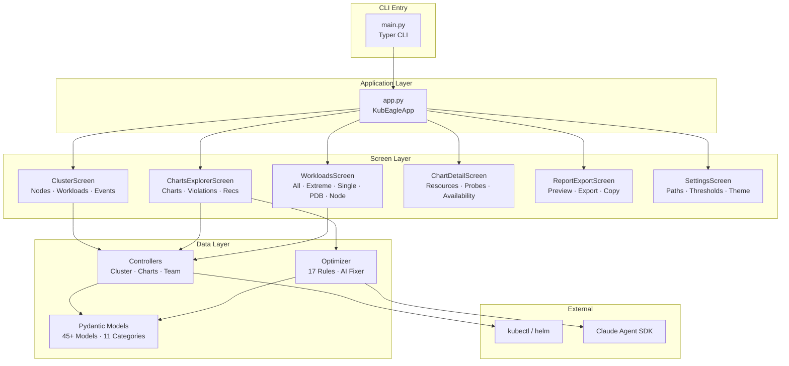
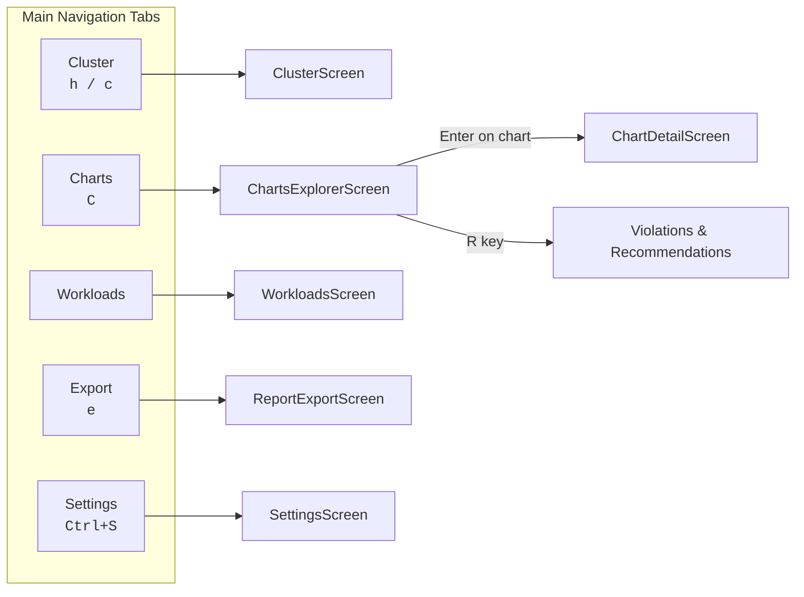
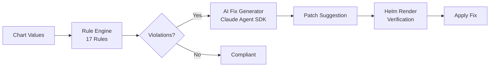

# KubEagle


Interactive terminal (TUI) dashboard for EKS cluster health monitoring and Helm chart optimization.
Built with [Textual](https://github.com/Textualize/textual) and [Pydantic](https://github.com/pydantic/pydantic).

## Architecture



## Screen Navigation



## Features

### Cluster Health
- Live node status, resource usage, and capacity overview
- Kubernetes events timeline with filtering
- PodDisruptionBudget inventory and analysis
- Workload inventory with real-time resource utilization

### Charts Explorer
- Search, filter, and sort Helm charts by team, QoS class, or resource allocation
- Violations and recommendations tabs per chart
- CODEOWNERS-based team grouping
- Local and cluster mode toggle for chart values

### Workloads
- Runtime workload inventory across the cluster
- Detect extreme CPU/memory ratios, single-replica deployments, missing PDBs
- Per-node resource analysis

### Chart Optimizer
- **17 best-practice rules** across 4 categories:
  - **Resources** (8 rules) — missing requests/limits, high limit-to-request ratios, low thresholds
  - **Probes** (3 rules) — missing liveness, readiness, and startup probes
  - **Availability** (5 rules) — no PDB, no anti-affinity, blocking PDB config, missing topology spread, single replica
  - **Security** (1 rule) — running as root
- AI-assisted fix generation with full values.yaml patch suggestions (requires `claude-agent-sdk`)
- Fix verification via Helm template rendering
- Configurable rule thresholds via settings screen



### Report Export
- Generate and export reports in multiple formats
- Preview before exporting
- Copy to clipboard support

### Settings
- Persistent configuration (theme, thresholds, preferences)
- Configurable optimizer thresholds at runtime
- Theme selection (dark, light, InsiderOne dark)

### General
- Keyboard-driven navigation with full keybinding support
- Lazy loading with background workers for non-blocking data fetching
- Reactive state management with Textual's reactive system
- 54 TCSS stylesheets (1 app + 7 screen + 46 widget)
- Minimum terminal size: **120 x 36**

## Project Structure

```
kubeagle/
├── app.py, main.py          # Application entry and Typer CLI
├── keyboard/                 # Keybinding definitions (app, navigation, tables)
├── screens/                  # 6 main screens + base + mixins
│   ├── base_screen.py        # Abstract base with shared patterns
│   ├── cluster/              # Cluster health (nodes, workloads, events)
│   ├── charts_explorer/      # Charts browser (charts, violations, recommendations)
│   ├── workloads/            # Runtime workload inventory
│   ├── detail/               # Chart detail + optimizer shim
│   ├── settings/             # App configuration
│   ├── reports/              # Report export
│   └── mixins/               # WorkerMixin, TabbedViewMixin, ScreenDataLoader, MainNavigationTabsMixin
├── widgets/                  # 40+ custom widgets across 11 categories
├── controllers/              # Data layer (Cluster, Charts, Team controllers)
├── models/                   # 45+ Pydantic models across 11 categories
├── optimizer/                # 13 modules (rules, AI fixer, verifier, helm renderer)
├── constants/                # Enums, defaults, limits, UI constants
├── utils/                    # Resource parser, concurrent, cache, reports
├── css/                      # 54 TCSS stylesheets
└── tests/tui/                # Smoke and unit tests
```

## Libraries

| Library | Version | Purpose |
|---------|---------|---------|
| [Textual](https://github.com/Textualize/textual) | >=0.50.0 | TUI framework — screens, widgets, CSS styling, reactive data binding |
| [Rich](https://github.com/Textualize/rich) | >=13.0.0 | Rich text rendering, tables, and markup inside the terminal |
| [textual-plotext](https://github.com/Textualize/textual-plotext) | >=1.0.1 | Terminal-based charts and graphs within Textual |
| [Typer](https://github.com/tiangolo/typer) | >=0.9.0 | CLI argument parsing and command interface |
| [Pydantic](https://github.com/pydantic/pydantic) | >=2.0.0 | Data models, validation, and serialization |
| [PyYAML](https://github.com/yaml/pyyaml) | >=6.0 | YAML parsing for Helm chart values and Kubernetes manifests |
| [Loguru](https://github.com/Delgan/loguru) | >=0.7.0 | Structured logging |
| [orjson](https://github.com/ijl/orjson) | >=3.9.0 | Fast JSON serialization |
| [ujson](https://github.com/ultrajson/ultrajson) | >=5.8.0 | Fast JSON parsing |
| [claude-agent-sdk](https://github.com/anthropics/claude-agent-sdk) | >=0.1.37 | AI-powered fix generation in the optimizer |

## Installation

### Homebrew (Recommended)

```bash
brew tap mpolatcan/kubeagle https://github.com/mpolatcan/kubeagle.git
brew install kubeagle
```

### From Source

```bash
git clone https://github.com/mpolatcan/kubeagle.git
cd kubeagle
pip install -e .
```

## Usage

```bash
# Cluster analysis only (no charts)
kubeagle

# With Helm charts path (optional — enables chart analysis and optimizer)
kubeagle --charts-path /path/to/helm-charts

# With team mapping
kubeagle --charts-path /path/to/helm-charts --codeowners-path ./CODEOWNERS

# With specific Kubernetes context
kubeagle --charts-path /path/to/helm-charts --context production-cluster

# Skip EKS (charts analysis only)
kubeagle --charts-path /path/to/helm-charts --skip-eks

# Fetch Helm values from cluster instead of local files
kubeagle --from-cluster

# With active charts list
kubeagle --charts-path /path/to/helm-charts --active-charts active-charts.txt

# Set default report export path
kubeagle --output-path ./reports
```

### CLI Options

| Option | Description |
|--------|-------------|
| `--charts-path` | Path to local Helm charts repository (optional — enables chart analysis) |
| `--skip-eks` | Skip EKS cluster analysis (charts-only mode) |
| `--context` | Kubernetes context to use |
| `--codeowners-path` | Path to CODEOWNERS file for team grouping |
| `--active-charts` | Path to a text file listing active chart names |
| `--from-cluster` | Fetch Helm values from the cluster instead of local files |
| `--output-path` | Default directory for report exports |
| `--version` | Show version information |

### Keyboard Shortcuts

| Key | Action |
|-----|--------|
| `h` | Home / Summary |
| `c` | Cluster screen |
| `C` | Charts Explorer |
| `e` | Export screen |
| `R` | Violations & Recommendations |
| `Ctrl+S` | Settings |
| `r` | Refresh current screen |
| `?` | Help |
| `Escape` | Back |
| `q` | Quit |

## Requirements

- Python 3.10+
- kubectl (for cluster analysis)
- helm (for chart rendering and verification)

## Documentation

See [docs/](docs/README.md) for architecture, widget reference, design patterns, and best practices.

## License

MIT
