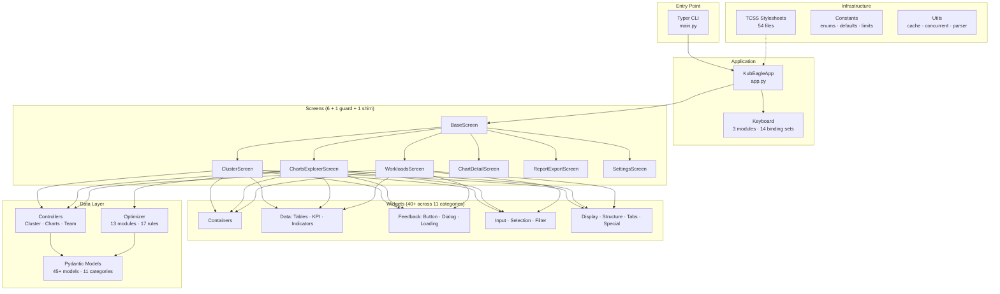
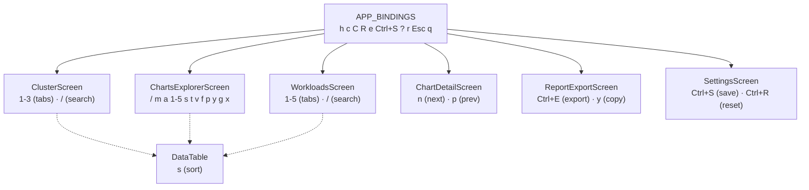

# KubEagle TUI Documentation

Comprehensive documentation for the KubEagle Terminal User Interface (TUI) application built with the Textual framework.

## Overview

The KubEagle TUI is a terminal-based dashboard for monitoring and analyzing Helm charts deployed on Amazon EKS clusters. It provides real-time visibility into:

- Cluster health and node status
- Helm chart configurations and best practices compliance
- Resource allocation and limit/request ratios
- Pod Disruption Budget (PDB) analysis
- Workload inventory and single-replica detection
- Optimization violations and AI-assisted fix recommendations
- Report generation and export



## Quick Start

```bash
# Run the TUI application
python -m kubeagle --charts-path /path/to/helm/charts

# Run with cluster mode (fetch live Helm values from EKS)
python -m kubeagle --charts-path /path/to/helm/charts --from-cluster

# Skip EKS connection (offline mode, charts analysis only)
python -m kubeagle --charts-path /path/to/helm/charts --skip-eks

# Specify AWS EKS context
python -m kubeagle --charts-path /path/to/helm/charts --context my-eks-context

# Specify active charts file and output path
python -m kubeagle --charts-path /path/to/helm/charts \
    --active-charts /path/to/active-charts.yaml \
    --output-path /path/to/reports

# Show version information
python -m kubeagle --version
```

## Documentation Index

### Architecture

| Document | Description |
|----------|-------------|
| [Architecture Overview](architecture/overview.md) | High-level system architecture and component relationships |
| [Data Flow](architecture/data-flow.md) | How data flows through the application |
| [Design Patterns](architecture/design-patterns.md) | Key patterns used: MVP, Mixins, Reactive State |

### Screens

| Document | Description |
|----------|-------------|
| [Screens Overview](screens/overview.md) | Screen system architecture and lifecycle |
| [Base Patterns](screens/base-patterns.md) | BaseScreen class and screen mixins |
| [Screen Reference](screens/screen-reference.md) | Complete reference for all screens |

### Widgets

| Document | Description |
|----------|-------------|
| [Widgets Overview](widgets/overview.md) | Widget system architecture |
| [Widget Categories](widgets/categories.md) | Organized widget categories and their purposes |
| [Widget Reference](widgets/widget-reference.md) | Complete reference for all widgets |

### Controllers

| Document | Description |
|----------|-------------|
| [Controller Reference](controllers/controller-reference.md) | Data layer controllers and async patterns |

### Models

| Document | Description |
|----------|-------------|
| [Model Reference](models/model-reference.md) | Pydantic data models and types |

### Keyboard

| Document | Description |
|----------|-------------|
| [Keybindings](keyboard/keybindings.md) | Keyboard binding system and shortcuts |

### Styling

| Document | Description |
|----------|-------------|
| [CSS Guide](styling/css-guide.md) | Textual CSS styling conventions |

### Testing

| Document | Description |
|----------|-------------|
| [Testing Guide](testing/testing-guide.md) | Testing patterns, fixtures, and best practices |

### Conventions

| Document | Description |
|----------|-------------|
| [Code Conventions](conventions/code-conventions.md) | Coding standards and naming conventions |

### Best Practices

| Document | Description |
|----------|-------------|
| [Screen Composition](best-practices/screen-composition.md) | Best practices for composing screens |
| [Widget Usage](best-practices/widget-usage.md) | Best practices for using widgets |

## Key Technologies

| Technology | Version | Purpose |
|------------|---------|---------|
| Python | 3.10+ | Runtime |
| Textual | >=0.50.0 | TUI framework |
| Pydantic | 2.x | Data validation and models |
| Typer | >=0.9.0 | CLI interface |
| Rich | >=13.0.0 | Terminal rendering |
| textual-plotext | >=1.0.1 | Terminal charts and graphs |
| PyYAML | >=6.0 | YAML parsing |
| Loguru | >=0.7.0 | Structured logging |
| orjson | >=3.9.0 | Fast JSON serialization |
| ujson | >=5.8.0 | Fast JSON parsing |
| claude-agent-sdk | >=0.1.37 | AI-powered fix generation |
| pytest | >=7.0.0 | Testing framework |
| ruff | >=0.8.0 | Linter |
| ty | >=0.0.14 | Type checker |

## Navigation Quick Reference

### Global Keybindings (APP_BINDINGS)

These keybindings work from any screen in the application:

| Key | Action | Description |
|-----|--------|-------------|
| `h` | `nav_home` | Navigate to ClusterScreen (Summary / tab 1) |
| `c` | `nav_cluster` | Navigate to ClusterScreen (tab 1) |
| `C` | `nav_charts` | Navigate to ChartsExplorerScreen (Charts tab) |
| `R` | `nav_recommendations` | Navigate to Violations + Recommendations view |
| `e` | `nav_export` | Navigate to ReportExportScreen |
| `Ctrl+S` | `nav_settings` | Navigate to SettingsScreen |
| `?` | `show_help` | Show help notification |
| `r` | `refresh` | Refresh current screen data |
| `Escape` | `back` | Go back to previous screen |
| `q` | `app.quit` | Quit application |

### Screen-Specific Bindings



### ClusterScreen Bindings

| Key | Action | Description |
|-----|--------|-------------|
| `1` | `switch_tab_1` | Nodes tab |
| `2` | `switch_tab_2` | Workloads tab |
| `3` | `switch_tab_3` | Events tab |
| `/` | `focus_search` | Focus search bar |

### ChartsExplorerScreen Bindings

| Key | Action | Description |
|-----|--------|-------------|
| `/` | `focus_search` | Focus search bar |
| `Enter` | `select_chart` | Preview selected chart |
| `m` | `toggle_mode` | Toggle local/cluster mode |
| `a` | `toggle_active_filter` | Toggle active-only filter |
| `1`-`5` | `view_*` | Switch view: All / Extreme / Single Replica / Missing PDB / Violations |
| `s` | `toggle_sort_direction` | Toggle sort direction |
| `t` | `cycle_team` | Cycle team filter |
| `v` | `view_team_violations` | View team violations |
| `f` | `fix_violation` | Fix selected chart violation |
| `p` | `preview_fix` | Preview fix |
| `y` | `copy_yaml` | Copy YAML to clipboard |
| `g` | `go_to_chart` | Go to chart in filesystem |
| `x` | `export_team_report` | Export team report |

### OptimizerScreen Bindings (ChartsExplorer shim)

| Key | Action | Description |
|-----|--------|-------------|
| `1` | `view_violations` | Violations view |
| `2` | `view_recommendations` | Recommendations view |
| `a` | `apply_all` | Apply all fixes |
| `f` | `fix_violation` | Fix selected violation |
| `p` | `preview_fix` | Preview fix |
| `y` | `copy_yaml` | Copy YAML |
| `s` / `S` | `focus_sort` | Focus sort control |
| `v` | `cycle_severity` | Cycle severity filter |
| `g` | `go_to_chart` | Go to chart |

### WorkloadsScreen Bindings

| Key | Action | Description |
|-----|--------|-------------|
| `1`-`5` | `switch_tab_*` | All / Extreme / Single Replica / Missing PDB / Node Analysis |
| `/` | `focus_search` | Focus search bar |

### ChartDetailScreen Bindings

| Key | Action | Description |
|-----|--------|-------------|
| `n` | `next_chart` | Next chart |
| `p` | `prev_chart` | Previous chart |

### ReportExportScreen Bindings

| Key | Action | Description |
|-----|--------|-------------|
| `Ctrl+E` | `export_report` | Export report |
| `y` | `copy_clipboard` | Copy to clipboard (Yank) |

### SettingsScreen Bindings

| Key | Action | Description |
|-----|--------|-------------|
| `Ctrl+S` | `save_settings` | Save settings |
| `Ctrl+R` | `reset_defaults` | Reset to defaults |

### DataTable Bindings

| Key | Action | Description |
|-----|--------|-------------|
| `s` | `toggle_sort` | Toggle column sort |

## Component Inventory

| Component | Count | Details |
|-----------|-------|---------|
| Screens | 6 main + 1 guard + 1 shim | 6 navigable screens, TerminalSizeUnsupportedScreen guard, OptimizerScreen shim |
| Screen Presenters | 5 | ClusterPresenter, ChartsExplorerPresenter, WorkloadsPresenter, SettingsPresenter, ChartDetailPresenter |
| Screen Mixins | 4 | WorkerMixin, TabbedViewMixin, ScreenDataLoader, MainNavigationTabsMixin |
| Widgets | 40+ files across 11 categories | containers, data/tables, data/indicators, data/kpi, display, feedback, filter, input, selection, special, structure, tabs |
| Controllers | 2 + base | ClusterController, ChartsController + BaseController/AsyncControllerMixin |
| Team Module | 3 components | TeamFetcher, TeamParser, TeamMapper (no controller class) |
| Fetchers | 8 | ClusterFetcher, NodeFetcher, PodFetcher, EventFetcher, TopMetricsFetcher, ChartFetcher, ReleaseFetcher, TeamFetcher |
| Parsers | 5 | NodeParser, PodParser, EventParser, ChartParser, TeamParser |
| Optimizer modules | 13 | analyzer, fixer, rules, fix_verifier, full_ai_fixer, llm_cli_runner, llm_patch_protocol, helm_renderer, template_patch_suggester, rendered_rule_input, full_fix_applier, wiring_diagnoser, resource_impact_calculator |
| Pydantic Models | 45+ across 11 categories | core, analysis, cache, charts, events, optimization, pdb, reports, state, teams, types |
| CSS files | 54 | 1 app + 7 screen + 46 widget styles |
| Keyboard modules | 3 | app.py (5 binding sets), navigation.py (screen bindings), tables.py (table bindings) |
| Utility modules | 6 | concurrent, cache_manager, report_generator, resource_parser, cluster_summary, __init__ |

## Screens (6 main + 1 guard + 1 shim)

| Screen | Path | Key | Description |
|--------|------|-----|-------------|
| BaseScreen | `screens/base_screen.py` | -- | Abstract base class with shared loading, search, and navigation patterns |
| ClusterScreen | `screens/cluster/cluster_screen.py` | `h` / `c` | EKS cluster overview with nodes, workloads, and events tabs |
| ChartsExplorerScreen | `screens/charts_explorer/charts_explorer_screen.py` | `C` | Unified charts browser with charts, violations, and recommendations tabs |
| WorkloadsScreen | `screens/workloads/workloads_screen.py` | Primary Nav Tab | Runtime workload inventory with resource requests/limits and ratio analysis |
| OptimizerScreen | `screens/detail/optimizer_screen.py` | `R` | Compatibility shim that opens ChartsExplorerScreen in violations/recommendations view |
| ChartDetailScreen | `screens/detail/chart_detail_screen.py` | `Enter` (from list) | Detailed single-chart analysis with resources, probes, and availability sections |
| SettingsScreen | `screens/settings/settings_screen.py` | `Ctrl+S` | Application settings: paths, thresholds, AI fix configuration, and theme |
| ReportExportScreen | `screens/reports/report_export_screen.py` | `e` | Report generation with preview, export to file, and clipboard copy |
| TerminalSizeUnsupportedScreen | `app.py` (inline) | -- | Blocking guard screen shown when terminal size < 120x36 |

## Primary Navigation Tabs

The application uses a shared top-level tab bar (via `MainNavigationTabsMixin`) that appears on all primary screens:

| Tab | Screen | Tab ID |
|-----|--------|--------|
| Cluster | ClusterScreen | `main-tab-cluster` |
| Charts | ChartsExplorerScreen | `main-tab-charts` |
| Workloads | WorkloadsScreen | `main-tab-workloads` |
| Export | ReportExportScreen | `main-tab-export` |
| Settings | SettingsScreen | `main-tab-settings` |

## Terminal Size Requirements

The application enforces a minimum terminal size of **120x36** characters. If the terminal is smaller, a blocking overlay screen (`TerminalSizeUnsupportedScreen`) is displayed until the terminal is resized.

## Cross-References

- For CLI behavior reference, see `eks_helm_reporter/` (READ-ONLY)
- For data format specifications, see `EKS_UNIFIED_HELM_REPORT.md`
- For project management, see `docs/projects/`
- For keyboard module source, see `kubeagle/keyboard/` (app.py, navigation.py, tables.py)
