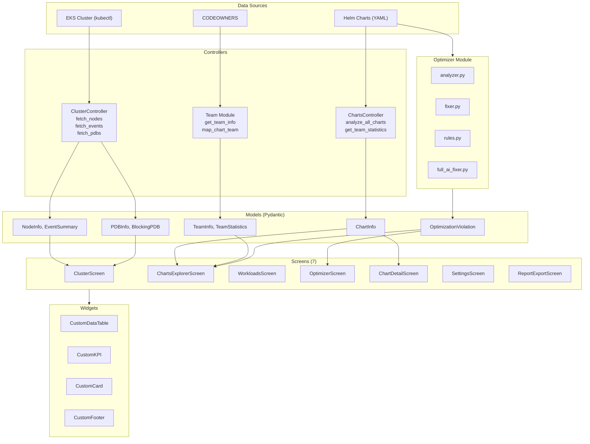
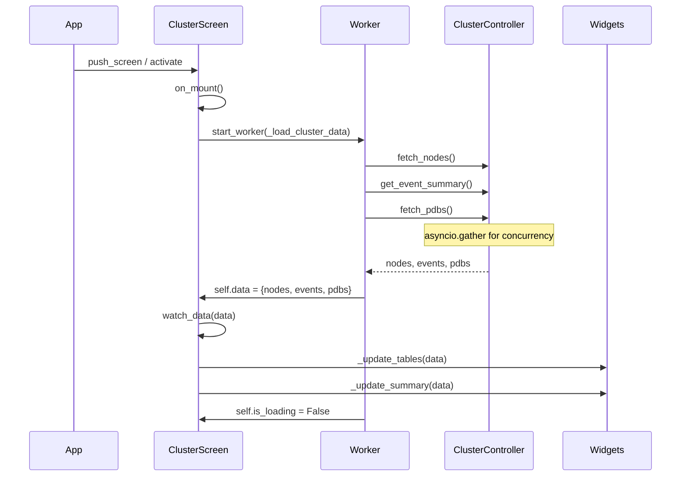
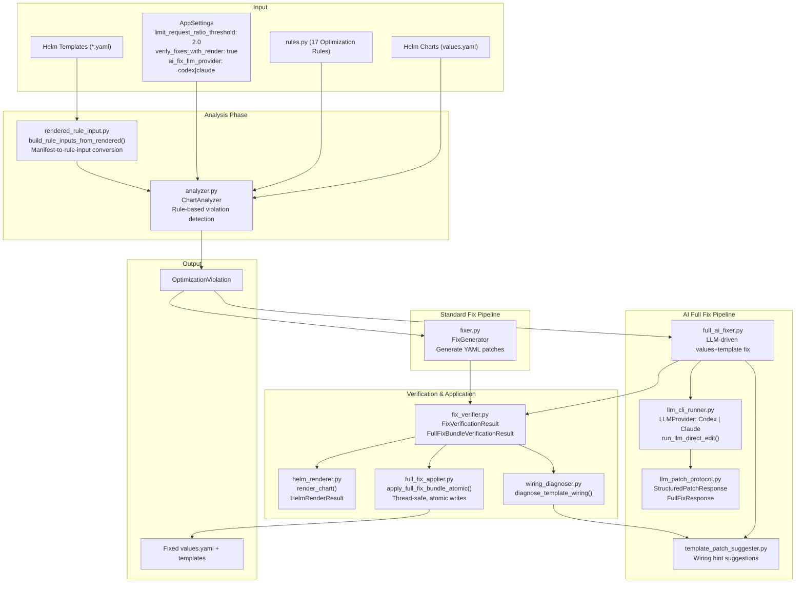
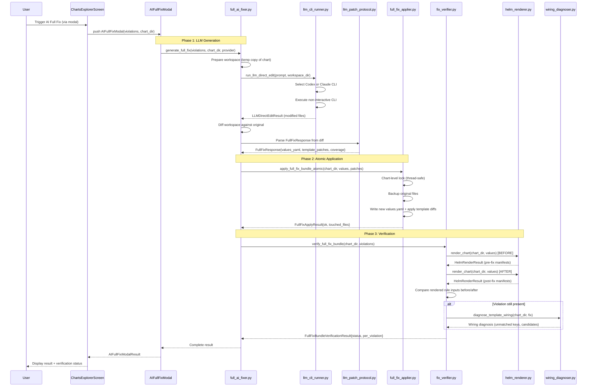
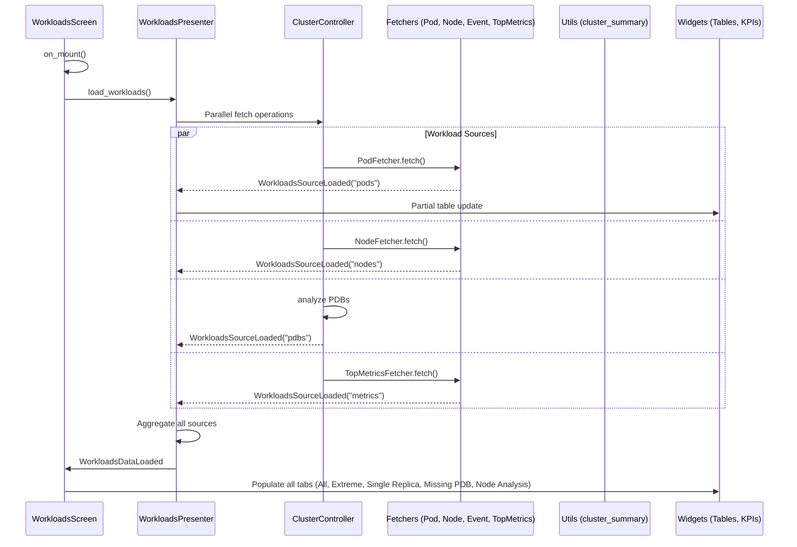
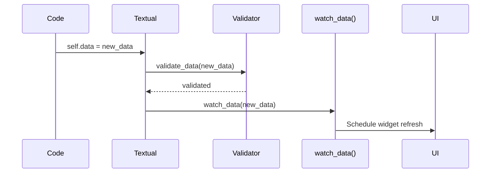
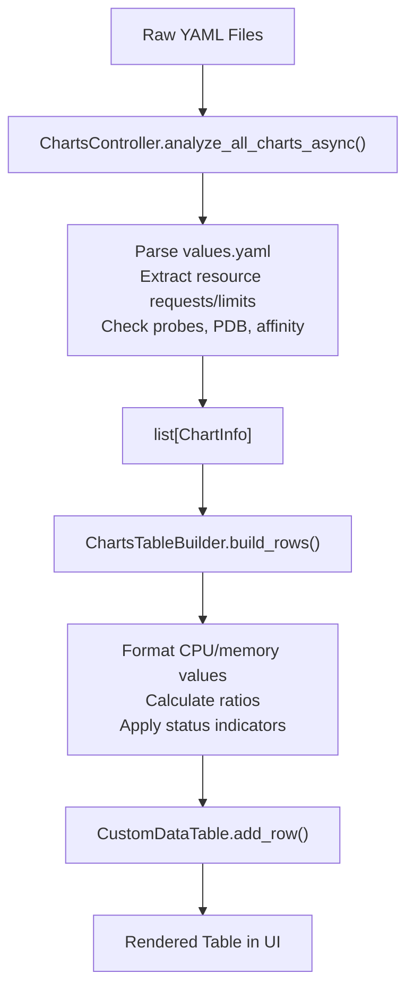
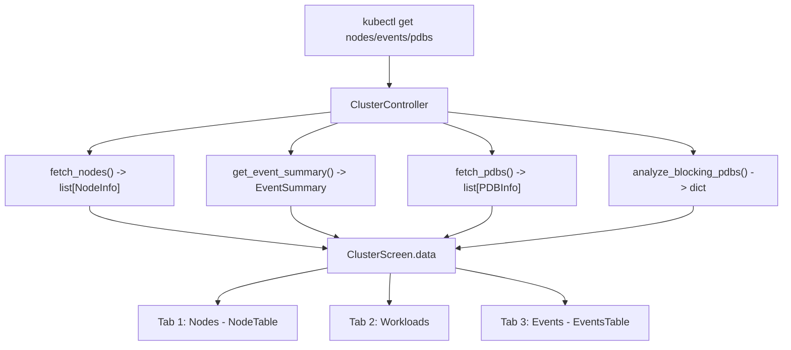
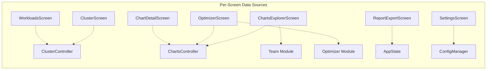
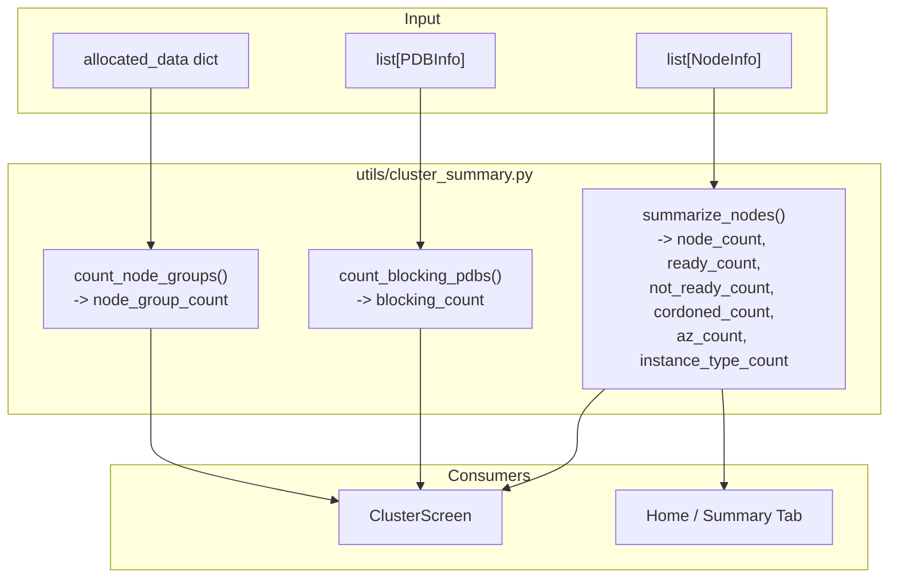

# Data Flow

This document describes how data flows through the KubEagle TUI application, from external sources to screen rendering.

## Overview



## Data Loading Lifecycle

### 1. Application Startup

```python
# main.py - CLI entry point
def main(charts_path: Path, skip_eks: bool, ...):
    app = EKSHelmReporterApp(
        charts_path=charts_path,
        skip_eks=skip_eks,
        ...
    )
    app.run()
```

### 2. App Initialization

```python
# app.py
class EKSHelmReporterApp(App[None]):
    def __init__(self, charts_path: Path | None, skip_eks: bool, ...):
        super().__init__()
        self.charts_path = charts_path
        self.skip_eks = skip_eks
        self.state = AppState()
        register_kubeagle_themes(self)  # Register custom themes
        self._load_settings()           # Load + normalize paths + apply theme + apply optimizer thresholds

    def on_mount(self) -> None:
        """Called when app is mounted."""
        from kubeagle.screens import ClusterScreen
        self._activate_installed_screen(self._SCREEN_CLUSTER_NAME, ClusterScreen)
        self.call_after_refresh(self._enforce_terminal_size_policy)
```

### 3. Screen Data Loading (Worker Pattern)



```python
# screens/cluster/cluster_screen.py
class ClusterScreen(BaseScreen, WorkerMixin, TabbedViewMixin):
    """Cluster health monitoring screen."""

    is_loading = reactive(False)
    data = reactive[dict]({})
    error = reactive[str | None](None)

    def on_mount(self) -> None:
        """Start data loading when screen mounts."""
        self.start_worker(self._load_cluster_data)

    @work(exclusive=True)
    async def _load_cluster_data(self) -> None:
        """Load cluster data in background worker."""
        self.is_loading = True
        self.error = None

        try:
            controller = ClusterController(context=self.app.context)

            # Fetch data from multiple sources concurrently
            nodes, events, pdbs = await asyncio.gather(
                controller.fetch_nodes(),
                controller.get_event_summary(),
                controller.fetch_pdbs(),
            )

            self.data = {
                "nodes": nodes,
                "events": events,
                "pdbs": pdbs,
            }

        except Exception as e:
            self.error = str(e)
            self.app.notify(f"Error loading data: {e}", severity="error")

        finally:
            self.is_loading = False

    def watch_data(self, data: dict) -> None:
        """React to data changes - update UI."""
        if data:
            self._update_tables(data)
            self._update_summary(data)
```

## Controller Data Fetching

### ChartsController Flow

```python
# controllers/charts/controller.py
class ChartsController(BaseController):
    """Controller for Helm chart analysis."""

    async def analyze_all_charts_async(self) -> list[ChartInfo]:
        """Analyze all charts asynchronously."""
        charts = []

        # Use ThreadPoolExecutor for file I/O
        with ThreadPoolExecutor() as executor:
            futures = []
            for chart_dir in self.charts_path.iterdir():
                if chart_dir.is_dir():
                    futures.append(
                        executor.submit(self._analyze_chart, chart_dir)
                    )

            for future in as_completed(futures):
                if result := future.result():
                    charts.append(result)

        return charts

    def _analyze_chart(self, chart_dir: Path) -> ChartInfo | None:
        """Analyze a single chart directory."""
        values_file = chart_dir / "values.yaml"
        if not values_file.exists():
            return None

        with open(values_file) as f:
            values = yaml.safe_load(f)

        return ChartInfo(
            name=chart_dir.name,
            team=self._get_team(chart_dir),
            values_file="values.yaml",
            cpu_request=self._parse_cpu(values),
            cpu_limit=self._parse_cpu_limit(values),
            # ... more fields
        )
```

### ClusterController Flow

```python
# controllers/cluster/controller.py
class ClusterController(BaseController):
    """Controller for EKS cluster data."""

    async def fetch_nodes(self) -> list[NodeInfo]:
        """Fetch node information from cluster."""
        async with self.bounded_operation():
            result = await asyncio.create_subprocess_exec(
                "kubectl", "get", "nodes", "-o", "json",
                stdout=asyncio.subprocess.PIPE,
                stderr=asyncio.subprocess.PIPE,
            )
            stdout, stderr = await result.communicate()

            if result.returncode != 0:
                raise ClusterError(f"kubectl failed: {stderr.decode()}")

            data = json.loads(stdout.decode())
            return [self._parse_node(item) for item in data["items"]]

    def _parse_node(self, item: dict) -> NodeInfo:
        """Parse kubectl node output to NodeInfo."""
        return NodeInfo(
            name=item["metadata"]["name"],
            status=self._get_status(item),
            node_group=self._get_node_group(item),
            instance_type=self._get_instance_type(item),
            # ... more fields
        )
```

## Optimizer Data Flow

The optimizer module operates independently from controllers, analyzing chart values and generating fixes. It supports two fix pipelines: standard (rule-based) and AI (LLM-assisted).



## AI Full Fix Pipeline Data Flow

The AI Full Fix pipeline is the most complex data flow in the optimizer. It generates values + template patches using LLM providers, applies them atomically, and verifies the result with Helm rendering.



## Workloads Screen Data Flow

The WorkloadsScreen uses `WorkloadsPresenter` for data loading, with progressive partial updates via `WorkloadsSourceLoaded` messages.



## Reactive Data Updates

### Reactive Attribute Pattern

```python
class ClusterScreen(BaseScreen):
    """Screen with reactive data updates."""

    # Reactive attributes trigger watch methods when changed
    is_loading = reactive(False)
    data = reactive[dict]({})
    error = reactive[str | None](None)

    def watch_is_loading(self, loading: bool) -> None:
        """Update UI loading state."""
        loading_widget = self.query_one("#loading-indicator")
        loading_widget.display = loading

    def watch_data(self, data: dict) -> None:
        """Update tables and summaries when data changes."""
        if not data:
            return

        # Update nodes table
        nodes_table = self.query_one("#nodes-table", CustomDataTable)
        nodes_table.clear()
        for node in data.get("nodes", []):
            nodes_table.add_row(
                node.name,
                node.status.value,
                node.instance_type,
                f"{node.cpu_req_pct:.1f}%",
            )

    def watch_error(self, error: str | None) -> None:
        """Display error message."""
        if error:
            self.app.notify(error, severity="error")
```

### Watch Method Execution Order



## Data Caching

### AppState Cache

```python
# models/state/app_state.py
class AppState:
    """Reactive application state container."""

    def __init__(self) -> None:
        # Connection state
        self.cluster_connected: bool = False
        self.charts_path: str = ""

        # Loading state
        self.loading_state: AppStateEnum = AppStateEnum.IDLE
        self.loading_message: str = ""
        self.error_message: str = ""

        # Cluster data
        self.nodes: list[NodeInfo] = []
        self.events: dict[str, int] = {}  # type -> count
        self.pdbs: list[PDBInfo] = []
        self.single_replica_workloads: list[str] = []

        # Charts data
        self.charts: list[ChartInfo] = []
        self.active_filter: str = "all"
        self.search_query: str = ""

        # Optimizer data
        self.violations: list[ViolationResult] = []
        self.violation_count: int = 0

        # UI state
        self.current_screen: str = "cluster"
        self.selected_node: str | None = None
        self.selected_chart: str | None = None

        # Export data
        self.export_data: str = ""
        self.export_path: str = ""
```

Note: `AppState` is a plain class (not a Pydantic `BaseModel`). Caching is coordinated through the `CacheManager` singleton in `utils/cache_manager.py`, not through `AppState` directly.

### Using Cached Data

Cache coordination is handled through `CacheManager` (in `utils/cache_manager.py`) and `AppState`:

```python
from kubeagle.utils.cache_manager import cache_manager

class ChartsExplorerScreen(BaseScreen):
    """Charts explorer screen with cache support."""

    async def _load_data(self) -> None:
        """Load data, using AppState cache if available."""
        state = self.app.state

        # Check if data is already available in state
        if state.charts:
            self.data = {"charts": state.charts}
            return

        # Fetch fresh data
        controller = ChartsController(charts_path=self.app.settings.charts_path)
        charts = await controller.analyze_all_charts_async()

        # Update state cache
        state.charts = charts
        self.data = {"charts": charts}
```

The `ScreenDataLoader` mixin provides built-in cache coordination via `CacheManager`:
```python
# In ScreenDataLoader._load_worker():
if force_refresh and self._cache_key:
    await cache_manager.invalidate(self._cache_key)
```

## Data Transformation Pipeline

### Chart Analysis Flow



### Cluster Health Flow



### Full Screen Data Flow Summary



## Cluster Summary Utility Flow

The `utils/cluster_summary.py` module provides shared summary computation used by both the Home (Cluster) screen and other screens that display cluster health:



## Error Handling Flow

```python
@work(exclusive=True)
async def _load_data(self) -> None:
    """Data loading with error handling."""
    try:
        self.is_loading = True
        self.error = None

        result = await self.controller.fetch_data()

        # Validate result
        if not result:
            raise DataError("No data returned")

        self.data = result

    except ConnectionError as e:
        self.error = f"Connection failed: {e}"
        self.app.notify(
            "Failed to connect to cluster. Check your kubeconfig.",
            severity="error",
            timeout=10,
        )

    except TimeoutError:
        self.error = "Request timed out"
        self.app.notify(
            "Cluster request timed out. Retry or check cluster health.",
            severity="warning",
        )

    except Exception as e:
        self.error = str(e)
        logger.exception(f"Unexpected error: {e}")

    finally:
        self.is_loading = False
```

## Cross-References

- [Architecture Overview](overview.md) - Component relationships
- [Design Patterns](design-patterns.md) - Worker and reactive patterns
- [Controller Reference](../controllers/controller-reference.md) - Controller details
- [Model Reference](../models/model-reference.md) - Data model details
