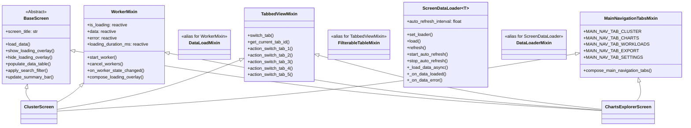

# Design Patterns

This document describes the key design patterns used throughout the KubEagle TUI application.

## 1. MVC-like Architecture

The application follows a Model-View-Controller-like architecture adapted for terminal UIs:

```mermaid
graph TB
    subgraph VIEW["VIEW (Screens + Widgets)"]
        direction LR
        ClusterScreen
        ChartsExplorerScreen
        OptimizerScreen
        CustomDataTable
        CustomCard
    end

    subgraph CONTROLLER["CONTROLLER (Controllers + Optimizer)"]
        direction LR
        ChartsController
        ClusterController
        Team Module
        OptimizerModule[Optimizer Module]
    end

    subgraph MODEL["MODEL (Pydantic Models)"]
        direction LR
        ChartInfo
        NodeInfo
        PDBInfo
        AppState
        OptimizationViolation
    end

    VIEW -->|"Reactive updates"| CONTROLLER
    CONTROLLER -->|"Validated data"| MODEL
```

**Separation of concerns:**
- **View**: Screens and widgets handle presentation and user interaction
- **Controller**: Controllers and the optimizer module handle data fetching, business logic, and analysis
- **Model**: Pydantic models handle data validation, type safety, and serialization

## 2. Mixin Pattern

Mixins provide reusable functionality that can be composed into screens and widgets.



### WorkerMixin

Provides standardized async data loading lifecycle. Message classes (`DataLoaded`, `DataLoadFailed`) are defined at module level and re-exported.

```python
# screens/mixins/worker_mixin.py

# Module-level messages
class DataLoaded(Message):
    """Posted when data loading completes successfully."""
    def __init__(self, data: Any, duration_ms: float = 0.0) -> None:
        super().__init__()
        self.data = data
        self.duration_ms = duration_ms

class DataLoadFailed(Message):
    """Posted when data loading fails."""
    def __init__(self, error: str) -> None:
        super().__init__()
        self.error = error

class WorkerMixin:
    """Mixin for standardized Worker lifecycle management."""

    # Standard reactive attributes
    is_loading = reactive(False)
    data = reactive[list[dict]]([])
    error = reactive[str | None](None)
    loading_duration_ms = reactive(0.0, init=False)

    def start_worker(
        self,
        worker_func: Callable[..., Awaitable[Any]],
        *,
        exclusive: bool = True,
        thread: bool = False,
        name: str | None = None,
        exit_on_error: bool = False,
    ) -> Worker[Any]:
        """Start a background worker for data loading.
        Cancels existing workers if exclusive=True (uses self.workers.cancel_all()).
        """
        if exclusive:
            self.workers.cancel_all()
        self._load_start_time = time.monotonic()
        return self.run_worker(worker_func, exclusive=exclusive, thread=thread, name=name, exit_on_error=exit_on_error)

    def on_worker_state_changed(self, event: Worker.StateChanged) -> None:
        """Default handler: tracks duration, sets is_loading=False on completion/error/cancel."""
        ...
```

**Usage:**

```python
class ClusterScreen(BaseScreen, WorkerMixin):
    """Screen using WorkerMixin for data loading."""

    def on_mount(self) -> None:
        self.start_worker(self._load_data)

    @work(exclusive=True)
    async def _load_data(self) -> None:
        try:
            data = await self.controller.fetch_all()
            self.data = data
        except Exception as e:
            self.error = str(e)
        finally:
            self.is_loading = False
```

### TabbedViewMixin

Provides tab switching functionality for multi-tab screens. Uses `CustomTabbedContent` (the project's custom wrapper around Textual's `TabbedContent`). Tabs are addressed by ID (e.g., `"tab-1"`, `"tab-2"`).

```python
# screens/mixins/tabbed_view_mixin.py
class TabbedViewMixin:
    """Mixin for screens with CustomTabbedContent."""

    _current_tab: str = "all"

    def switch_tab(self, tab_id: str) -> None:
        """Switch to specified tab by ID."""
        tabbed_content = self.query_one("#tabbed-content", CustomTabbedContent)
        tabbed_content.active = tab_id
        self._current_tab = tab_id

    def action_switch_tab_1(self) -> None:
        """Switch to tab-1 (bound to key 1)."""
        self.switch_tab("tab-1")

    def action_switch_tab_2(self) -> None:
        """Switch to tab-2 (bound to key 2)."""
        self.switch_tab("tab-2")

    # ... up to action_switch_tab_5

    def get_current_tab_id(self) -> str | None:
        """Get the current active tab ID from CustomTabbedContent."""
        tabbed_content = self.query_one("#tabbed-content", CustomTabbedContent)
        return tabbed_content.active or None
```

Note: `FilterableTableMixin` is an alias for `TabbedViewMixin` (backward compatibility).

**Usage:**

```python
class ClusterScreen(BaseScreen, WorkerMixin, TabbedViewMixin):
    """Screen with both data loading and tab support."""

    BINDINGS = CLUSTER_SCREEN_BINDINGS  # Includes 1-3 for tabs
```

### ScreenDataLoader Mixin

Provides a complete data loading lifecycle with auto-refresh, cache coordination, and message-based notifications. It is a generic class (`ScreenDataLoader[T]`) where `T` is the data type returned by loading.

```python
# screens/mixins/screen_data_loader.py

# Module-level messages
class DataLoadStarted(Message): ...
class DataLoadCompleted(Message):
    data: Any; duration_ms: float; from_cache: bool
class DataLoadError(Message):
    error: str; duration_ms: float

class ScreenDataLoader(Generic[T]):
    """Base for screens with standardized data loading patterns."""

    auto_refresh_interval: float | None = None

    def set_loader(self, loader: Callable, cache_key: str | None = None) -> None:
        """Set the data loader function and optional cache key."""

    def load(self, force_refresh: bool = False) -> None:
        """Start data loading (bypasses cache if force_refresh=True)."""

    def refresh(self) -> None:
        """Force-refresh data."""

    def start_auto_refresh(self, interval: float | None = None) -> None:
        """Start auto-refresh timer."""

    def stop_auto_refresh(self) -> None:
        """Stop auto-refresh timer."""

    # Override in subclasses:
    async def _load_data_async(self) -> T: ...
    def _on_data_loaded(self, data: T) -> None: ...
    def _on_data_error(self, error: str, duration_ms: float) -> None: ...
```

Note: `DataLoaderMixin` is an alias for `ScreenDataLoader` (backward compatibility).

## 3. Reactive State Pattern

Textual's reactive system enables automatic UI updates when state changes.

### Reactive Attributes

```python
from textual.reactive import reactive

class StatefulWidget(BaseWidget):
    """Widget with reactive state management."""

    # Declare reactive attributes with types
    is_loading = reactive(False)
    data = reactive[list[dict]]([])
    error = reactive[str | None](None)

    # Watch methods are called automatically when values change
    def watch_is_loading(self, loading: bool) -> None:
        """Called when is_loading changes."""
        self._update_loading_ui(loading)

    def watch_data(self, data: list[dict]) -> None:
        """Called when data changes."""
        self._render_data(data)

    def watch_error(self, error: str | None) -> None:
        """Called when error changes."""
        if error:
            self._show_error(error)
```

### Reactive Update Flow


### Computed Properties

```python
class ChartsExplorerScreen(BaseScreen):
    """Screen with computed reactive properties."""

    charts = reactive[list[ChartInfo]]([])
    search_query = reactive("")

    @property
    def filtered_charts(self) -> list[ChartInfo]:
        """Computed property based on reactive state."""
        if not self.search_query:
            return self.charts
        query = self.search_query.lower()
        return [c for c in self.charts if query in c.name.lower()]
```

## 4. Worker Pattern

Workers run async operations in the background without blocking the UI.

### Basic Worker Usage

```python
from textual import work
from textual.worker import Worker, get_current_worker

class ClusterScreen(BaseScreen):
    """Screen using workers for async operations."""

    @work(exclusive=True)
    async def load_data(self) -> None:
        """Load data in background worker."""
        # Check for cancellation periodically
        worker = get_current_worker()

        for chunk in data_chunks:
            if worker.is_cancelled:
                return  # Exit gracefully

            await self.process_chunk(chunk)
```

### Exclusive Workers

```python
# exclusive=True ensures only one instance runs at a time
@work(exclusive=True)
async def refresh_data(self) -> None:
    """Only one refresh can run at a time."""
    # Previous refresh is automatically cancelled
    await self._fetch_fresh_data()
```

### Worker Lifecycle


## 5. Controller Pattern with Async Support

Controllers encapsulate data fetching logic with async/await support.

### Base Controller

```python
# controllers/base/base_controller.py
class AsyncControllerMixin:
    """Mixin providing worker-friendly async patterns."""

    def __init__(self) -> None:
        self._default_semaphore = asyncio.Semaphore(8)

    async def run_with_worker(
        self,
        awaitable: Awaitable[T],
        timeout: float | None = None,
    ) -> WorkerResult:
        """Run awaitable with timeout and error handling."""
        start_time = time.time()
        try:
            if timeout:
                data = await asyncio.wait_for(awaitable, timeout=timeout)
            else:
                data = await awaitable
            return WorkerResult(
                success=True,
                data=data,
                duration_ms=(time.time() - start_time) * 1000,
            )
        except Exception as e:
            return WorkerResult(
                success=False,
                error=str(e),
                duration_ms=(time.time() - start_time) * 1000,
            )

    @asynccontextmanager
    async def bounded_operation(self, semaphore: asyncio.Semaphore | None = None):
        """Limit concurrent operations."""
        sem = semaphore or self._default_semaphore
        async with sem:
            yield


class BaseController(AsyncControllerMixin, ABC):
    """Abstract base controller."""

    @abstractmethod
    async def check_connection(self) -> bool:
        """Check if data source is available."""
        ...

    @abstractmethod
    async def fetch_all(self) -> dict[str, Any]:
        """Fetch all data."""
        ...
```

### Concrete Controller

```python
# controllers/charts/controller.py
class ChartsController(BaseController):
    """Controller for Helm chart analysis."""

    def __init__(self, charts_path: Path, codeowners_path: Path | None = None):
        super().__init__()
        self.charts_path = charts_path
        self.codeowners_path = codeowners_path

    async def check_connection(self) -> bool:
        """Check if charts path exists."""
        return self.charts_path.exists()

    async def fetch_all(self) -> dict[str, Any]:
        """Fetch and analyze all charts."""
        charts = await self.analyze_all_charts_async()
        stats = self.get_team_statistics()
        ratios = self.analyze_limit_request_ratios()

        return {
            "charts": charts,
            "team_statistics": stats,
            "extreme_ratios": ratios,
        }
```

## 6. Lazy Import Pattern

Lazy imports inside methods prevent circular dependencies between screens. Both `app.py` and `keyboard/navigation.py` use this pattern extensively.

```python
# DO: Import inside method (app.py pattern)
def action_nav_charts(self) -> None:
    from kubeagle.screens import ChartsExplorerScreen
    self._activate_installed_screen(self._SCREEN_CHARTS_NAME, ChartsExplorerScreen, prefer_switch=True)

# DO: Import inside method (ScreenNavigator pattern)
class ScreenNavigator:
    def _navigate_charts(self) -> None:
        app_nav = getattr(self.app, "action_nav_charts", None)
        if callable(app_nav):
            app_nav()
            return
        from kubeagle.screens.charts_explorer import ChartsExplorerScreen
        self.app.push_screen(ChartsExplorerScreen())

# DON'T: Top-level imports cause circular dependencies
from kubeagle.screens.charts_explorer import ChartsExplorerScreen  # WRONG
from kubeagle.screens.cluster import ClusterScreen  # WRONG
```

**Why this matters:** Screens reference other screens for navigation, controllers reference models, and the app references all screens. Without lazy imports, Python's module loading would hit circular import chains. The `ScreenNavigator` also delegates to `app.action_nav_*` methods when available, falling back to direct `push_screen` only when the app doesn't provide the navigation method.

## 7. Message Pattern

Messages enable decoupled communication between widgets and screens.


### Defining Messages

```python
from textual.message import Message

class CustomDataTable(Widget):
    """DataTable with custom messages."""

    class RowSelected(Message):
        """Posted when a row is selected."""
        def __init__(self, row_key: str, row_data: dict) -> None:
            super().__init__()
            self.row_key = row_key
            self.row_data = row_data

    class SortChanged(Message):
        """Posted when sort column changes."""
        def __init__(self, column: str, direction: str) -> None:
            super().__init__()
            self.column = column
            self.direction = direction
```

### Handling Messages

```python
class ChartsExplorerScreen(BaseScreen):
    """Screen that handles CustomDataTable messages."""

    def on_custom_data_table_row_selected(
        self,
        message: CustomDataTable.RowSelected
    ) -> None:
        """Handle row selection."""
        self._navigate_chart_detail(message.row_data)

    def on_custom_data_table_sort_changed(
        self,
        message: CustomDataTable.SortChanged
    ) -> None:
        """Handle sort change."""
        self._apply_sort(message.column, message.direction)
```

## 8. Binding Pattern

Keyboard bindings are organized by scope for maintainability.


### Binding Definition

Bindings use `Annotated` tuple type hints for documentation:

```python
# keyboard/navigation.py
CLUSTER_SCREEN_BINDINGS: list[
    Annotated[tuple[str, str, str], "key, action, description"]
] = [
    ("escape", "pop_screen", "Back"),
    ("r", "refresh", "Refresh"),
    ("slash", "focus_search", "Search"),
    ("1", "switch_tab_1", "Nodes"),
    ("2", "switch_tab_2", "Workloads"),
    ("3", "switch_tab_3", "Events"),
    ("?", "show_help", "Help"),
    ("h", "nav_home", "Summary"),
]
```

App-level bindings use `Binding` objects (from `textual.binding`):

```python
# keyboard/app.py
APP_BINDINGS: list[Binding] = [
    Binding("escape", "back", "Back", priority=True),
    Binding("h", "nav_home", "Summary"),
    Binding("c", "nav_cluster", "Cluster"),
    Binding("C", "nav_charts", "Charts"),
    Binding("e", "nav_export", "Export"),
    Binding("ctrl+s", "nav_settings", "Settings"),
    Binding("R", "nav_recommendations", "Viol+Recs"),
    Binding("?", "show_help", "Help"),
    Binding("r", "refresh", "Refresh"),
    Binding("q", "app.quit", "Quit", priority=True),
]
```

### Using Bindings

```python
class ClusterScreen(BaseScreen, WorkerMixin, TabbedViewMixin):
    """Screen with keyboard bindings."""

    BINDINGS = CLUSTER_SCREEN_BINDINGS

    def action_refresh(self) -> None:
        """Handle 'r' key press."""
        self.start_worker(self._load_data)

    def action_focus_search(self) -> None:
        """Handle '/' key press."""
        search_input = self.query_one("#search-input", Input)
        search_input.focus()
```

## 9. Screen Install/Activate Pattern

The app uses an install/activate pattern for efficient screen management. Screens are installed lazily with named identifiers and reused across navigations.

```python
# Named screen constants
_SCREEN_CLUSTER_NAME = "nav-cluster"
_SCREEN_CHARTS_NAME = "nav-charts"
_SCREEN_WORKLOADS_NAME = "nav-workloads"
_SCREEN_EXPORT_NAME = "nav-export"
_SCREEN_SETTINGS_NAME = "nav-settings"

def _ensure_installed_screen(self, screen_name: str, screen_factory: Callable) -> Screen:
    """Install screen lazily if not already installed."""
    try:
        return self.get_screen(screen_name)
    except KeyError:
        screen = screen_factory()
        self.install_screen(screen, screen_name)
        return screen

def _activate_installed_screen(self, screen_name: str, screen_factory: Callable, *, prefer_switch: bool = False) -> Screen:
    """Activate an installed screen by popping to it or pushing it."""
    target_screen = self._ensure_installed_screen(screen_name, screen_factory)
    if self.screen is target_screen:
        return target_screen
    if target_screen in self.screen_stack:
        while self.screen is not target_screen and len(self.screen_stack) > 1:
            self.pop_screen()
        return target_screen
    if prefer_switch and len(self.screen_stack) == 1:
        try:
            self.switch_screen(screen_name)
        except IndexError:
            self.push_screen(screen_name)
        return target_screen
    self.push_screen(screen_name)
    return target_screen
```

Key behaviors:
- **Lazy installation**: Screens are created only when first navigated to
- **Stack reuse**: If the target screen is already in the stack, pops back to it instead of creating a new instance
- **`prefer_switch`**: When `True` and the stack has only the root screen, uses `switch_screen` instead of `push_screen` (avoids growing the stack)
- **`_prepare_current_screen_for_navigation()`**: Calls `prepare_for_screen_switch()` on the current screen to release heavy resources before switching

## 10. CSS Class Composition Pattern

Widgets use CSS class composition for flexible styling.

```python
class BaseWidget(Widget):
    """Base widget with CSS utilities."""

    def compose_classes(self, *class_names: str) -> str:
        """Compose multiple CSS classes."""
        return " ".join(c for c in class_names if c)

    def add_css_class(self, class_name: str) -> None:
        """Add CSS class dynamically."""
        if class_name not in self.classes.split():
            self.classes = f"{self.classes} {class_name}".strip()

    def remove_css_class(self, class_name: str) -> None:
        """Remove CSS class dynamically."""
        self.classes = " ".join(
            c for c in self.classes.split() if c != class_name
        )
```

**Usage:**

```python
class StatusIndicator(BaseWidget):
    """Status indicator with dynamic styling."""

    def update_status(self, status: str) -> None:
        """Update status and CSS classes."""
        # Remove old status classes
        for cls in ["status-ok", "status-warning", "status-error"]:
            self.remove_css_class(cls)

        # Add new status class
        self.add_css_class(f"status-{status}")
```

## 11. Configuration Flow Pattern

The app follows a layered configuration flow where CLI arguments override persisted settings.


## 12. Terminal Size Guard Pattern

The app enforces a minimum terminal size using a guard screen pattern:


## 13. Modal Pattern

Screens use modal components (`ModalScreen` subclasses) for focused interactions such as filters, fix previews, and AI fix generation. Modals return typed results to their parent screens.


### Modal Result Pattern

Modals use Textual's `ModalScreen[ResultType]` generic to define their return type. The parent screen receives the result via a callback:

```python
# Pushing a modal with typed result
def _show_filters(self) -> None:
    self.app.push_screen(
        _ChartsFiltersModal(current_state),
        callback=self._on_filters_result,
    )

# Handling the result (None = dismissed, value = applied)
def _on_filters_result(self, result: _ChartsFilterState | None) -> None:
    if result is None:
        return  # User dismissed the modal
    self._apply_filter_state(result)
```

## 14. Presenter Pattern

Presenters sit between screens and controllers, handling data transformation, filtering, formatting, and sorting logic. Each main screen has a dedicated presenter that owns the data pipeline.


**Presenter responsibilities:**
- **Data loading coordination**: Manage async loading, partial updates, progress reporting
- **Filtering logic**: Apply view filters, team filters, search queries, active-only filtering
- **Sorting**: Multi-column sort with configurable direction
- **Row formatting**: Convert model objects to display-ready table rows
- **Message posting**: Emit typed messages (e.g., `ClusterSourceLoaded`, `WorkloadsDataLoaded`) to notify the screen of data state changes

**Presenter lifecycle:**
```python
# screens/workloads/presenter.py
class WorkloadsPresenter:
    def __init__(self, screen: Any) -> None:
        self._screen = screen
        self._data: dict[str, Any] = {...}

    async def load_workloads(self, ...) -> None:
        # Fetch data from controller
        # Post WorkloadsSourceLoaded for each partial result
        # Post WorkloadsDataLoaded when complete
        ...

    def format_row(self, workload: WorkloadInfo) -> list[str]:
        # Convert model to display-ready row
        ...
```

## 15. Screen-Specific Message Pattern

Screens define custom `Message` subclasses for type-safe communication. These messages carry screen-specific payloads and enable decoupled coordination between presenters, workers, and screen UI logic.


**Message hierarchy:**

| Level | Messages | Purpose |
|-------|----------|---------|
| Mixin (generic) | `DataLoaded`, `DataLoadFailed`, `DataLoadStarted`, `DataLoadCompleted`, `DataLoadError` | Generic lifecycle signals for any screen using WorkerMixin or ScreenDataLoader |
| Screen (specific) | `ChartsExplorerDataLoaded`, `ClusterSourceLoaded`, `WorkloadsSourceLoaded`, etc. | Carry screen-specific payloads (charts list, violation counts, partial results) |
| Presenter (coordination) | `WorkloadsDataLoaded`, `ClusterDataLoaded`, `OptimizerDataLoaded` | Signal completion of presenter-managed multi-source loading |

**Message usage pattern:**

```python
# Define a screen-specific message
class ChartsExplorerDataLoaded(Message):
    def __init__(self, charts: list[ChartInfo], total: int, duration_ms: float) -> None:
        super().__init__()
        self.charts = charts
        self.total = total
        self.duration_ms = duration_ms

# Post from worker/presenter
self.post_message(ChartsExplorerDataLoaded(charts=charts, total=len(charts), duration_ms=elapsed))

# Handle in screen
def on_charts_explorer_data_loaded(self, msg: ChartsExplorerDataLoaded) -> None:
    self._update_table(msg.charts)
    self._update_summary(msg.total, msg.duration_ms)
```

## Cross-References

- [Architecture Overview](overview.md) - Component relationships
- [Data Flow](data-flow.md) - How data moves through patterns
- [Screens Base Patterns](../screens/base-patterns.md) - Screen mixin usage
- [Widgets Overview](../widgets/overview.md) - Widget pattern usage
