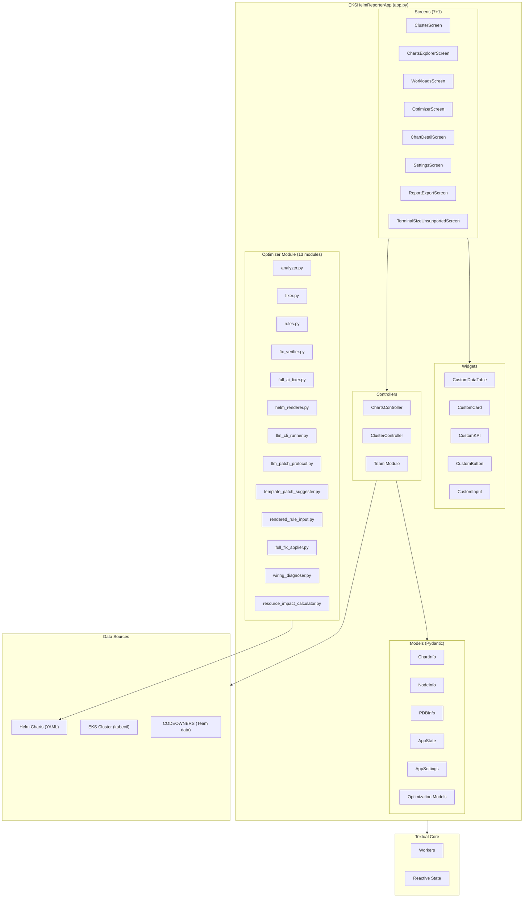
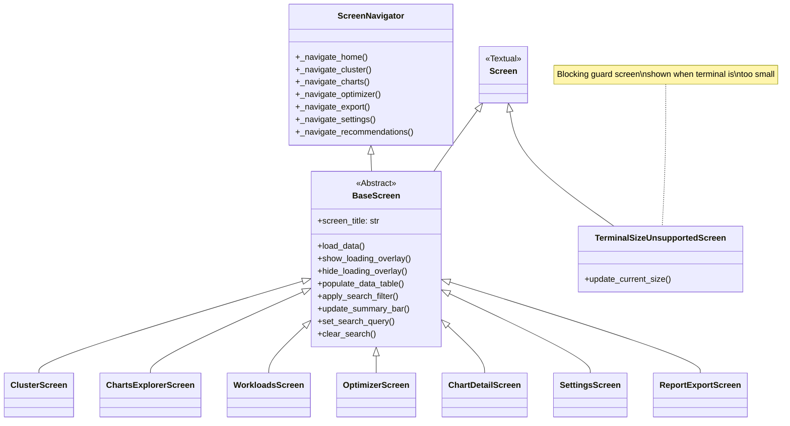
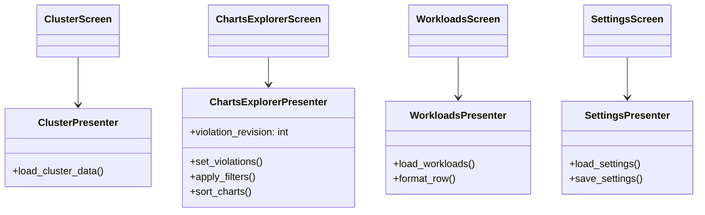
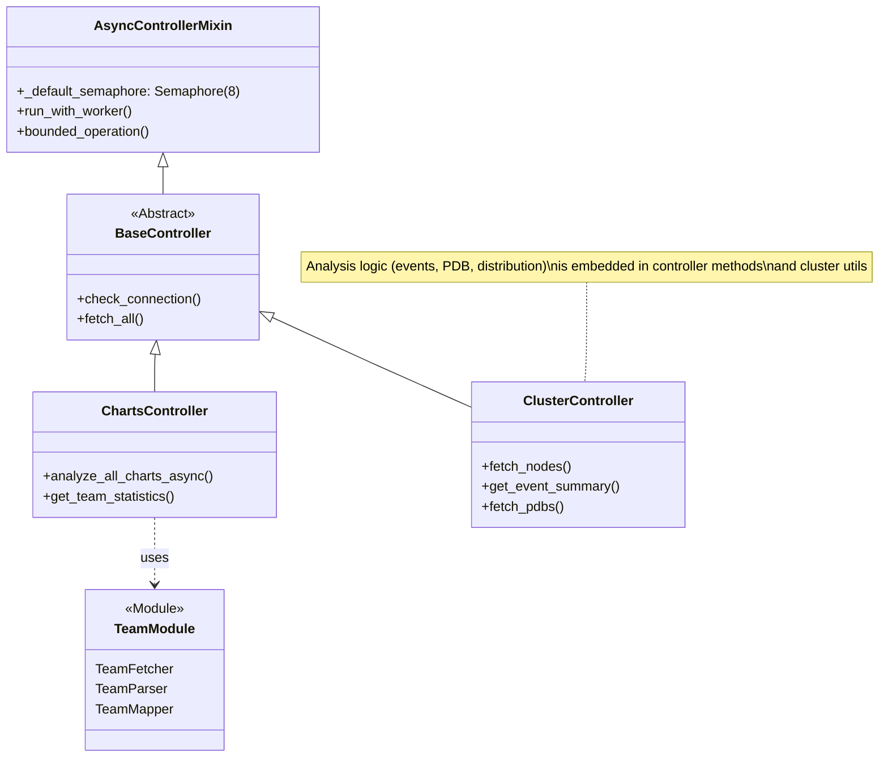
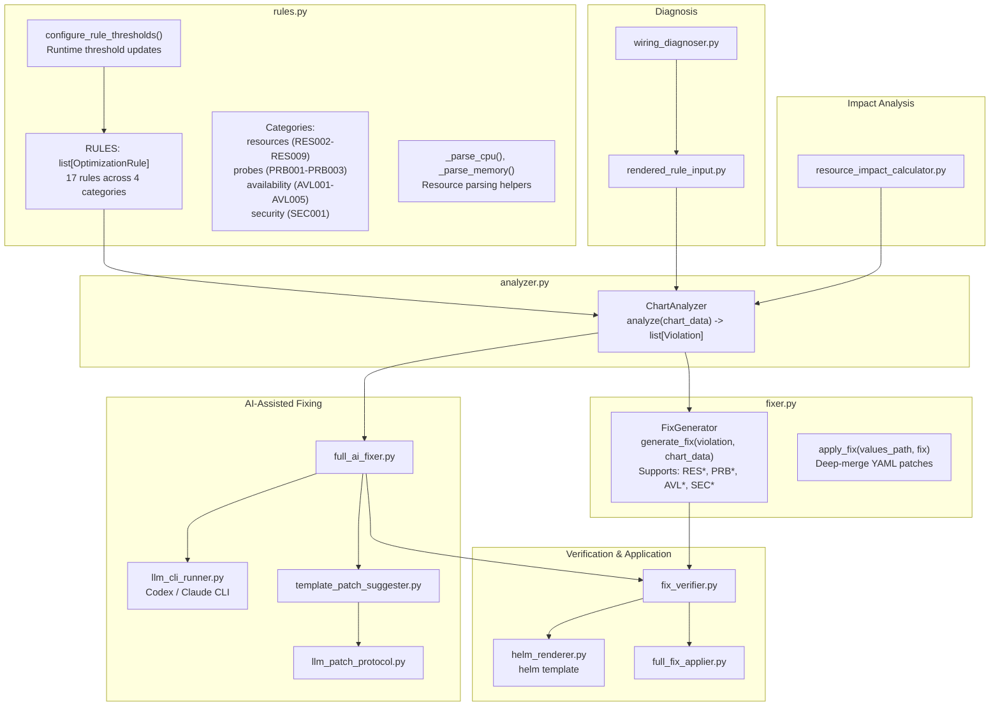
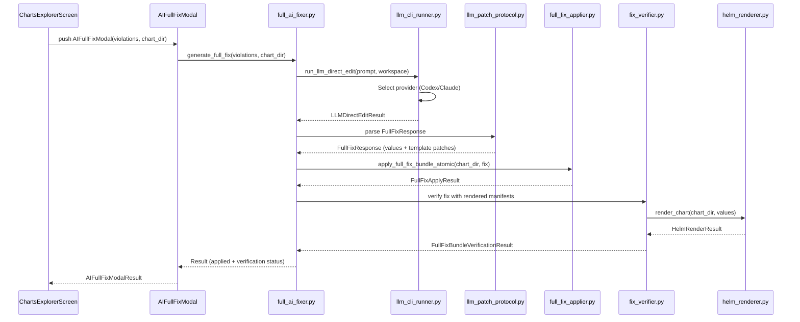
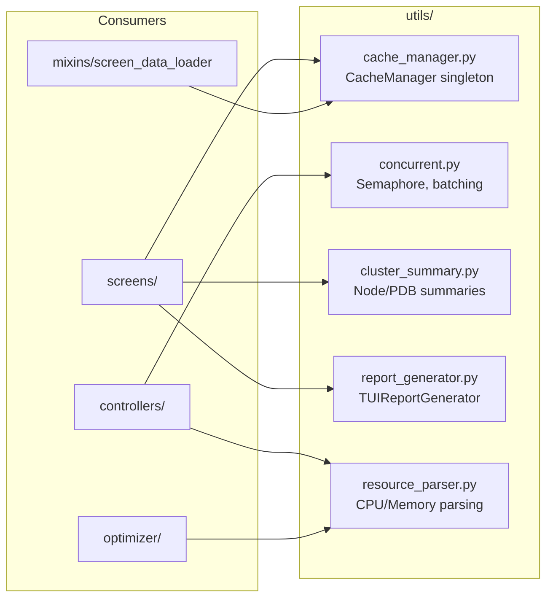
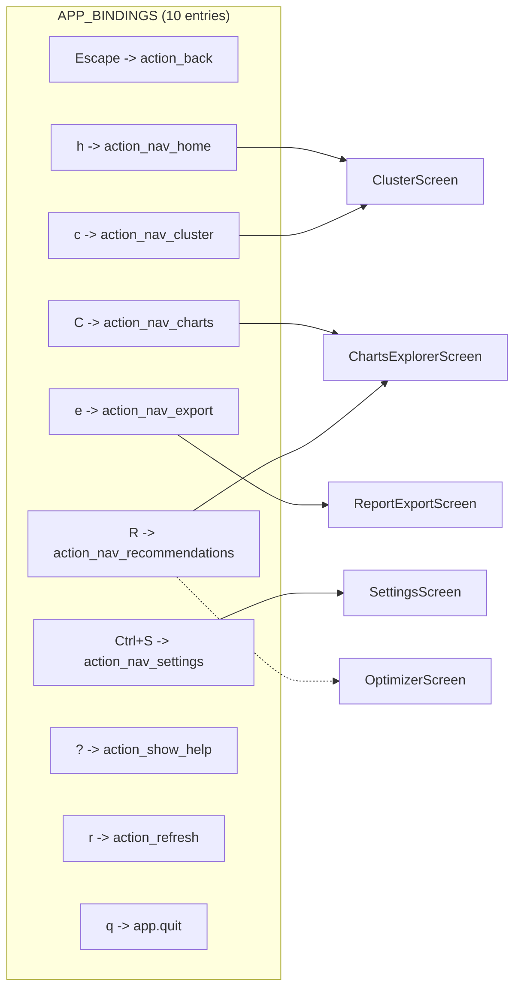
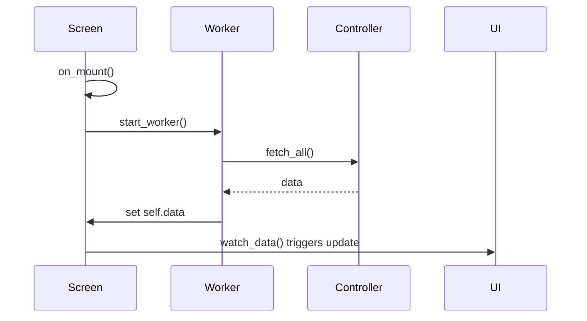
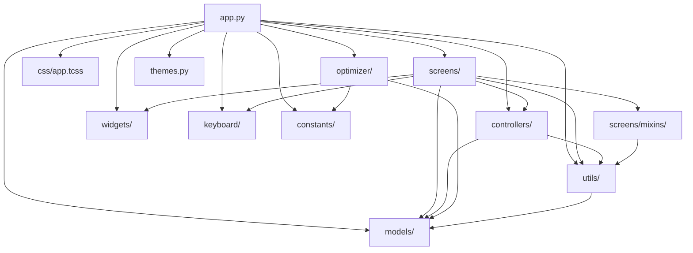

# Architecture Overview

This document describes the high-level architecture of the KubEagle TUI application.

## System Architecture



## Core Components

### 1. Application Layer (`app.py`)

The `EKSHelmReporterApp` class is the main entry point, inheriting from Textual's `App` class.

```python
class EKSHelmReporterApp(App[None]):
    """Main TUI application for KubEagle."""

    TITLE = APP_TITLE
    CSS_PATH = "css/app.tcss"
    BINDINGS: list[Binding] = APP_BINDINGS  # 10 navigation/action bindings
    MIN_SUPPORTED_TERMINAL_WIDTH = 120
    MIN_SUPPORTED_TERMINAL_HEIGHT = 36

    # Named screen constants for install/activate pattern
    _SCREEN_CLUSTER_NAME = "nav-cluster"
    _SCREEN_CHARTS_NAME = "nav-charts"
    _SCREEN_WORKLOADS_NAME = "nav-workloads"
    _SCREEN_EXPORT_NAME = "nav-export"
    _SCREEN_SETTINGS_NAME = "nav-settings"

    # Type-hinted reactive state
    settings: AppSettings
    state: AppState
```

**Responsibilities:**
- Initialize the application and load settings
- Manage screen navigation stack (install/activate pattern with named screens)
- Handle global keybindings (10 APP_BINDINGS)
- Coordinate data loading through controllers
- Register and apply custom KubEagle themes (dark-only)
- Enforce minimum terminal size policy (`TerminalSizeUnsupportedScreen`)
- Normalize file paths and apply optimizer rule thresholds from settings
- Save settings on unmount via `ConfigManager`

### 2. Screen Layer (`screens/`)

Screens represent full-page views that users interact with. All screens inherit from `BaseScreen`, which itself extends Textual's `Screen` and `ScreenNavigator`.

**Screen Hierarchy (7 screens + 1 guard screen):**



**Screen Mixins (`screens/mixins/`):**
- `WorkerMixin` / `DataLoadMixin` (alias): Standardized async data loading with `DataLoaded` / `DataLoadFailed` messages, loading overlay management, duration tracking, and `on_worker_state_changed` handler. Also exports `LoadingOverlay` composable widget.
- `TabbedViewMixin`: Tab switching for multi-tab screens (keys `1`-`5`) via `CustomTabbedContent`
- `FilterableTableMixin`: Alias for `TabbedViewMixin` (backward compatibility)
- `ScreenDataLoader` / `DataLoaderMixin` (alias): Generic data loading lifecycle with `DataLoadStarted` / `DataLoadCompleted` / `DataLoadError` messages, auto-refresh timer support, and cache coordination
- `MainNavigationTabsMixin`: Primary top-level navigation tab bar (Cluster, Charts, Workloads, Export, Settings tabs)

**Presenter Pattern:**
Each screen module includes a `presenter.py` for data orchestration. Presenters handle filtering, formatting, grouping logic, and data loading coordination:

| Presenter | File | Key Exports |
|-----------|------|-------------|
| ClusterPresenter | `screens/cluster/presenter.py` | `ClusterPresenter`, `ClusterSourceLoaded`, `ClusterDataLoaded` |
| ChartsExplorerPresenter | `screens/charts_explorer/presenter.py` | `ChartsExplorerPresenter` (filtering, sorting, violation counts) |
| WorkloadsPresenter | `screens/workloads/presenter.py` | `WorkloadsPresenter`, `WorkloadsSourceLoaded`, `WorkloadsDataLoaded` |
| SettingsPresenter | `screens/settings/presenter.py` | `SettingsPresenter` |
| Detail Presenter | `screens/detail/presenter.py` | `OptimizerDataLoaded`, `OptimizerDataLoadFailed` |



### 3. Widget Layer (`widgets/`) - 47 Files, 11 Categories

Widgets are reusable UI components organized by category:

| Category | Purpose | Examples |
|----------|---------|----------|
| `containers/` (3) | Layout and grouping | CustomCard, CustomCollapsible, CustomContainers |
| `data/tables/` (10) | Data display tables | CustomDataTable, CustomChartsTable, CustomNodeTable, CustomEventsTable, CustomViolationsTable, CustomTable, CustomTableBuilder, TableBuilder, TableComponent, interfaces |
| `data/indicators/` (1) | Status indicators | CustomStatus |
| `data/kpi/` (1) | KPI display | CustomKPI |
| `display/` (6) | Text rendering | CustomStatic, CustomMarkdown, CustomMarkdownViewer, CustomProgressBar, CustomRichLog, CustomDigits |
| `feedback/` (3) | User feedback | CustomButton, CustomDialog, CustomLoadingIndicator |
| `filter/` (4) | Search/filter | CustomSearchBar, CustomFilterBar, CustomFilterChip, CustomFilterGroup |
| `input/` (3) | User input | CustomInput, CustomCheckbox, CustomTextArea |
| `selection/` (6) | Choice widgets | CustomRadioSet, CustomRadioButton, CustomSwitch, CustomSelect, CustomOptionList, CustomSelectionList |
| `special/` (4) | Special purpose | CustomTree, CustomContentSwitcher, CustomLink, CustomDirectoryTree |
| `structure/` (3) | Page structure | CustomHeader, CustomFooter, CustomRule |
| `tabs/` (3) | Tab navigation | CustomTabs, CustomTabbedContent, CustomTabPane |

**Widget Base Classes:**
```python
class BaseWidget(Widget):
    """Base with ID patterns and CSS utilities."""

class CompositeWidget(BaseWidget):
    """For widgets containing child widgets."""

class StatefulWidget(BaseWidget):
    """Standard reactive state: is_loading, data, error."""
```

### 4. Controller Layer (`controllers/`)

Controllers handle data fetching and business logic, designed to work with Textual Workers for non-blocking operations.



**Controller Sub-structure:**
Each controller module has `fetchers/`, `parsers/`, `mappers/` sub-directories for separation of concerns.

| Module | Fetchers | Parsers | Mappers |
|--------|----------|---------|---------|
| ClusterController | ClusterFetcher, NodeFetcher, PodFetcher, EventFetcher, TopMetricsFetcher | NodeParser, PodParser, EventParser | -- |
| ChartsController | ChartFetcher, ReleaseFetcher | ChartParser | -- |
| Team Module | TeamFetcher | TeamParser | TeamMapper |

**Key Features:**
- Semaphore-based concurrency control (default: 8)
- Worker cancellation support
- Progress reporting
- Error handling with `WorkerResult`

### 5. Optimizer Module (`optimizer/`) - 13 Modules

The optimizer is a **separate module** (not part of controllers) that handles chart analysis, violation detection, and AI-assisted fix generation.

| File | Purpose | Key Exports |
|------|---------|-------------|
| `analyzer.py` | Rule-based chart analysis | `ChartAnalyzer` |
| `fixer.py` | Fix generation for violations | `FixGenerator`, `apply_fix` |
| `rules.py` | Optimization rule definitions and threshold configuration | `RULES`, `configure_rule_thresholds`, `get_rule_by_id` |
| `fix_verifier.py` | Verify fixes with Helm template rendering | `FixVerificationResult`, `FullFixBundleVerificationResult` |
| `full_ai_fixer.py` | AI-assisted full fix pipeline (values + template patches) | LLM-driven chart-level fix generation |
| `full_fix_applier.py` | Apply generated fixes to chart files atomically | `FullFixApplyResult`, `apply_full_fix_bundle_atomic` |
| `helm_renderer.py` | Helm template rendering for verification | `HelmRenderResult`, `render_chart` |
| `llm_cli_runner.py` | Non-interactive LLM CLI integration (Codex/Claude) | `LLMProvider`, `LLMCLIResult`, `LLMDirectEditResult`, `run_llm_direct_edit` |
| `llm_patch_protocol.py` | Structured prompt/response contract for LLM patches | `StructuredPatchResponse`, `FullFixResponse`, `FullFixTemplatePatch`, `FullFixViolationCoverage` |
| `rendered_rule_input.py` | Convert rendered manifests to optimizer rule input payloads | `build_rule_inputs_from_rendered` |
| `template_patch_suggester.py` | Suggestion-only template patch hints for wiring mismatches | `format_wiring_suggestions_markdown` |
| `resource_impact_calculator.py` | Calculate resource impact of optimization fixes | Resource impact estimation |

**Optimizer Internal Architecture:**



**AI Full Fix Pipeline Detail:**



**Optimization Rules Summary (17 rules):**

| Category | Rule IDs | Description |
|----------|----------|-------------|
| Resources | RES002-RES009 | CPU/memory limits, requests, ratios, thresholds |
| Probes | PRB001-PRB003 | Liveness, readiness, startup probe checks |
| Availability | AVL001-AVL005 | PDB, anti-affinity, topology spread, replicas |
| Security | SEC001 | Running as root detection |

### 6. Model Layer (`models/`)

Pydantic models ensure type safety and validation for all data structures.

**Model Categories:**
- `state/`: AppState, AppSettings, ConfigManager
- `charts/`: ChartInfo, ActiveCharts
- `core/`: NodeInfo, WorkloadInfo, WorkloadInventoryInfo
- `events/`: EventInfo, EventSummary
- `pdb/`: PDBInfo, BlockingPDB
- `teams/`: TeamInfo, TeamStatistics, Distribution
- `analysis/`: Violation, Recommendation
- `optimization/`: OptimizationRule, OptimizationViolation, OptimizerController
- `reports/`: ReportData
- `cache/`: DataCache
- `types/`: Columns, Loading types (LoadingProgress, LoadResult)

### 7. Constants Layer (`constants/`)

Centralized constants organized by domain:

| File | Purpose | Examples |
|------|---------|----------|
| `enums.py` | Enum definitions | QoSClass, NodeStatus, Severity, ThemeMode |
| `values.py` | Scalar constants | APP_TITLE, COLOR_*, SPACING |
| `timeouts.py` | Timeout values | CLUSTER_REQUEST_TIMEOUT |
| `limits.py` | Limit values | MAX_COLUMNS_DISPLAY |
| `defaults.py` | Default settings | CHARTS_PATH_DEFAULT |
| `tables.py` | Table configs | ColumnWidth, table columns |
| `ui.py` | UI constants | Layout, dimension values |
| `optimizer.py` | Optimizer constants | Rule thresholds |
| `patterns.py` | Regex patterns | Parsing patterns |
| `screens/*.py` | Screen constants | Tab IDs, loading messages (charts_explorer, cluster, common, detail, settings) |

### 8. Keyboard Layer (`keyboard/`)

Centralized keyboard bindings organized by scope:

| Module | Scope | Contents |
|--------|-------|----------|
| `app.py` | Global | APP_BINDINGS (10 entries), GLOBAL_BINDINGS, NAV_BINDINGS, HELP_BINDINGS, REFRESH_BINDINGS |
| `navigation.py` | Screen-specific | 8 binding lists: BASE_SCREEN_BINDINGS (8), CLUSTER_SCREEN_BINDINGS (8), WORKLOADS_SCREEN_BINDINGS (10), CHARTS_EXPLORER_SCREEN_BINDINGS (23), OPTIMIZER_SCREEN_BINDINGS (23), SETTINGS_SCREEN_BINDINGS (9), REPORT_EXPORT_SCREEN_BINDINGS (8), CHART_DETAIL_SCREEN_BINDINGS (10). Also exports `ScreenNavigator` class and `navigate_to_*` helper functions. |
| `tables.py` | DataTable | DATA_TABLE_BINDINGS |

### 9. CSS Layer (`css/`)

Textual CSS (TCSS) for styling:

```
css/                                 # 54 total CSS files
├── app.tcss                         # Main stylesheet with variables
├── screens/                         # 7 screen-specific styles
│   ├── chart_detail_screen.tcss
│   ├── charts_explorer.tcss
│   ├── cluster_screen.tcss
│   ├── optimizer_screen.tcss
│   ├── report_export_screen.tcss
│   ├── settings_screen.tcss
│   └── workloads_screen.tcss
└── widgets/                         # 46 widget-specific styles
    ├── custom_*.tcss                # Widget component styles
    ├── loading.tcss                 # Loading overlay styles
    └── worker_mixin.tcss            # Worker mixin styles
```

### 10. Utils Layer (`utils/`) - 6 Modules

Utility functions for common operations:

| File | Purpose | Key Exports |
|------|---------|-------------|
| `cache_manager.py` | Centralized cache coordination for data loading | `CacheManager`, `CacheEntry`, `CacheStats`, `cache_manager` singleton |
| `concurrent.py` | Concurrency helpers (semaphore, batching, rate limiting) | `semaphore_operation`, `bounded_gather`, `batch_operations`, `BatchResult`, `RateLimiter` |
| `cluster_summary.py` | Shared cluster summary helpers for Home and Cluster screens | `count_node_groups`, `summarize_nodes`, `count_blocking_pdbs` |
| `report_generator.py` | Report generation matching CLI format | `TUIReportGenerator` |
| `resource_parser.py` | Kubernetes resource string parsing (CPU/memory) | `parse_cpu`, `parse_memory` |
| `__init__.py` | Package re-exports | Convenience imports for utility functions |



## Navigation System

The `ScreenNavigator` class (in `keyboard/navigation.py`) provides navigation methods used as both a mixin in `BaseScreen` and via standalone `navigate_to_*` helper functions.



**Navigation actions available in `app.py`:**

| Action | Target | Notes |
|--------|--------|-------|
| `action_back()` | Previous screen | Pops screen stack (blocked during terminal size guard) |
| `action_nav_home()` | ClusterScreen | Switches to tab 1 if already there; uses `prefer_switch=True` |
| `action_nav_cluster()` | ClusterScreen | Switches to tab 1 if already there; uses `prefer_switch=True` |
| `action_nav_workloads()` | WorkloadsScreen | Uses `prefer_switch=True` |
| `action_nav_charts()` | ChartsExplorerScreen | Shows charts tab if already there; uses `prefer_switch=True` |
| `action_nav_optimizer()` | ChartsExplorerScreen violations tab / OptimizerScreen | Context-dependent: shows violations tab if ChartsExplorer is in stack, else pushes OptimizerScreen |
| `action_nav_export()` | ReportExportScreen | Uses `prefer_switch=True` |
| `action_nav_settings()` | SettingsScreen | Uses `prefer_switch=True` |
| `action_nav_recommendations()` | ChartsExplorerScreen recs tab / OptimizerScreen | Context-dependent: shows recs tab if ChartsExplorer is in stack, else pushes OptimizerScreen with `initial_view="recommendations"` |
| `action_nav_charts_by_values_file()` | ChartsExplorerScreen | Sorted by values file |
| `action_nav_charts_without_pdb()` | ChartsExplorerScreen | Filtered to Missing PDB |
| `action_show_help()` | Help notification | Shows keybinding summary |
| `action_refresh()` | Current screen | Delegates to screen's `action_refresh` (async-aware) |
| `action_quit()` | Exit | Calls `self.exit()` |

**Pattern: Lazy Imports**

All screen imports are done inside methods to avoid circular dependencies:

```python
# Correct: Lazy import inside method
def _navigate_charts(self) -> None:
    from kubeagle.screens.charts_explorer import ChartsExplorerScreen
    self.app.push_screen(ChartsExplorerScreen())

# Incorrect: Top-level import causes circular dependency
from kubeagle.screens.charts_explorer import ChartsExplorerScreen  # DON'T
```

## Async Architecture

### Textual Workers

Workers run async operations without blocking the UI:

```python
@work(exclusive=True)
async def load_data(self) -> None:
    """Load data in background worker."""
    self.is_loading = True
    try:
        data = await self.controller.fetch_all()
        self.data = data
    except Exception as e:
        self.error = str(e)
    finally:
        self.is_loading = False
```

### Worker Lifecycle



## Configuration

### CLI Options (`main.py`)

Uses `typer` with `Annotated` option types:

```python
app = typer.Typer(name="kubeagle", help="Interactive TUI for Kubernetes cluster exploration and Helm chart analysis")

@app.command()
def main(
    charts_path: Annotated[Path | None, Option(help="Path to Helm charts repository")] = None,
    skip_eks: Annotated[bool, Option(help="Skip EKS cluster analysis")] = False,
    context: Annotated[str | None, Option(help="AWS EKS context")] = None,
    active_charts: Annotated[Path | None, Option(help="Path to active charts file")] = None,
    from_cluster: Annotated[bool, Option(help="Fetch Helm values directly from cluster instead of local files")] = False,
    output_path: Annotated[Path | None, Option(help="Default path for report exports")] = None,
    version: Annotated[bool, Option(help="Show version information")] = False,
) -> None:
```

### Settings (`models/state/app_settings.py`)

```python
class AppSettings(BaseModel):
    """Application settings model with validation."""

    model_config = ConfigDict(populate_by_name=True)

    # Paths
    charts_path: str = ""
    active_charts_path: str = ""
    codeowners_path: str = ""
    export_path: str = "./reports"

    # UI preferences
    theme: str = ThemePreference.DARK
    refresh_interval: int = 30    # seconds
    auto_refresh: bool = False

    # Cluster mode for Helm analysis
    use_cluster_values: bool = False
    use_cluster_mode: bool = False

    # Event and resource thresholds
    event_age_hours: float = 1.0
    high_cpu_threshold: int = 80
    high_memory_threshold: int = 80
    high_pod_threshold: int = 80
    limit_request_ratio_threshold: float = 2.0
    high_pod_percentage_threshold: int = 80

    # Optimizer verification settings
    optimizer_analysis_source: str = "auto"        # auto|rendered|values
    verify_fixes_with_render: bool = True
    helm_template_timeout_seconds: int = 30
    ai_fix_llm_provider: str = "codex"             # codex|claude
    ai_fix_codex_model: str = "auto"               # auto|gpt-5.3-codex|gpt-5.3-codex-spark|...
    ai_fix_claude_model: str = "auto"              # auto|default|sonnet|opus|haiku
    ai_fix_full_fix_system_prompt: str = ""
    ai_fix_bulk_parallelism: int = 2
```

### Config Location

XDG-compliant configuration: `~/.config/eks-helm-exporter/settings.json`

The `ConfigManager` class (in `models/state/config_manager.py`) uses `APP_NAME = "eks-helm-exporter"` for the config directory. It respects `$XDG_CONFIG_HOME` when set.

## Module Dependencies



## File Ownership (Development)

| Component | Owner Agent |
|-----------|-------------|
| `screens/`, `widgets/`, `controllers/`, `models/`, `optimizer/`, `utils/` | tui-developer |
| `tests/` | tui-test-engineer |
| `css/`, `keyboard/` | tui-developer |

## Cross-References

- [Data Flow](data-flow.md) - How data moves through the system
- [Design Patterns](design-patterns.md) - Detailed pattern explanations
- [Screens Overview](../screens/overview.md) - Screen system details
- [Widgets Overview](../widgets/overview.md) - Widget system details
- [Controller Reference](../controllers/controller-reference.md) - Controller details
