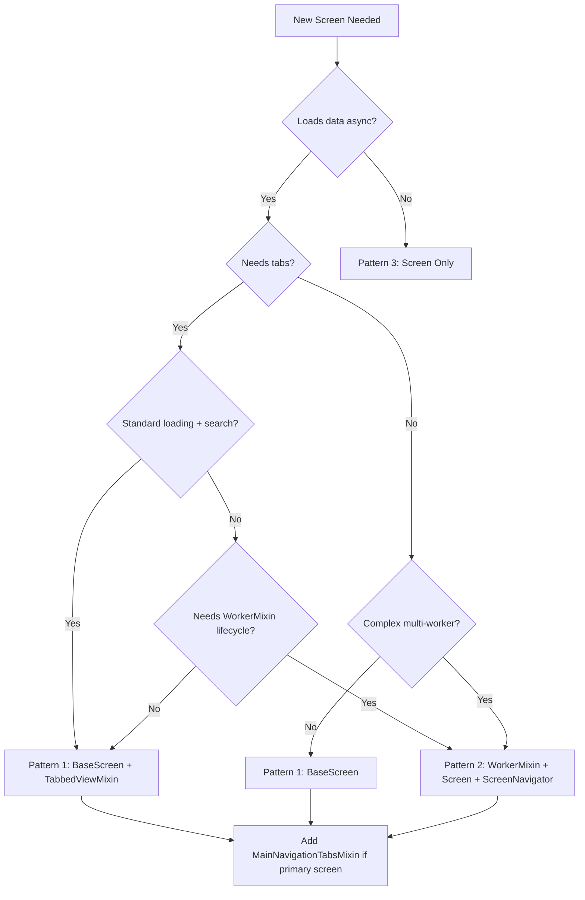
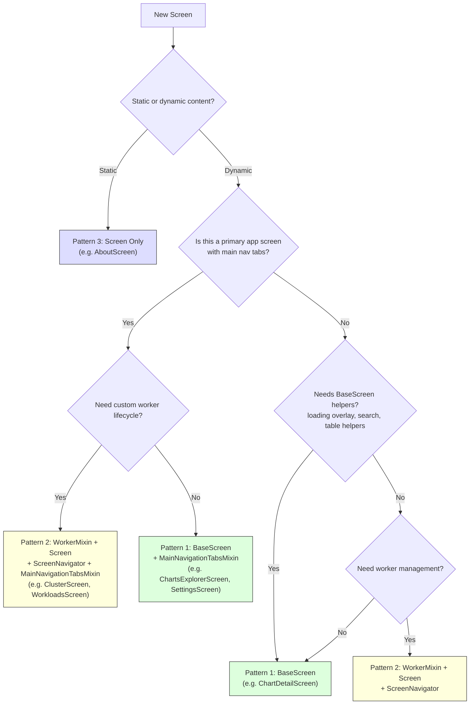
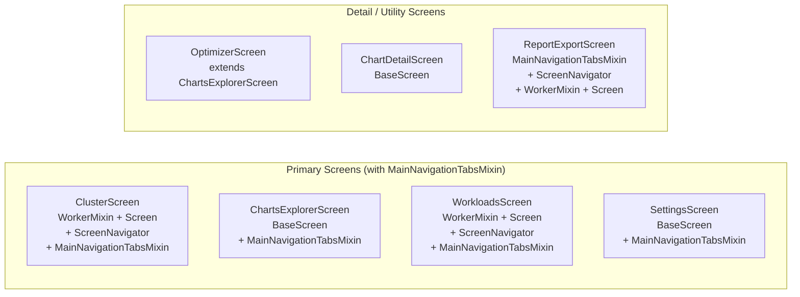
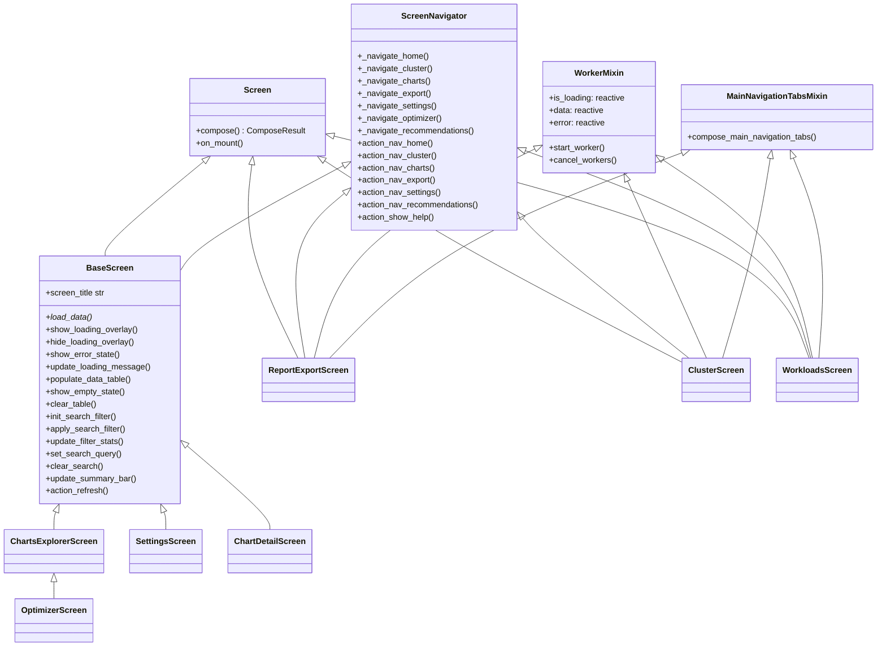
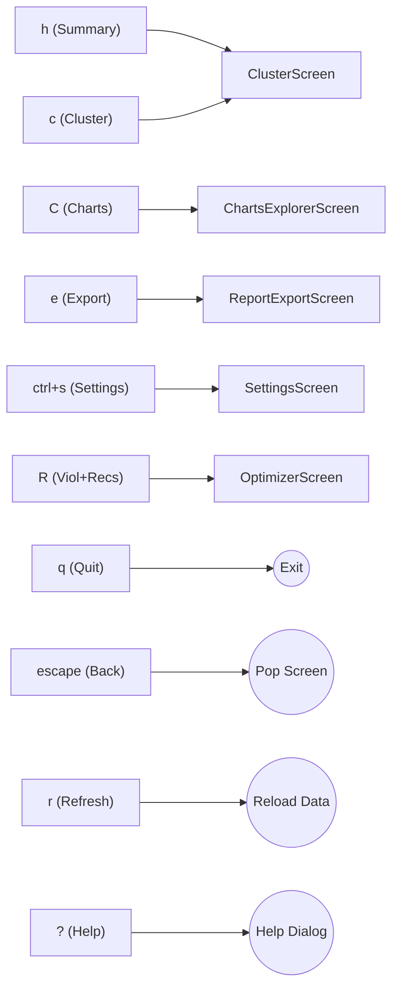

# Screen Composition Best Practices Guide

This guide documents the recommended patterns for creating screens in the KubEagle TUI application.

## Pattern Decision Flow



## Composition Pattern Decision Flowchart

Use this detailed flowchart to determine the exact composition for your screen:



## Actual Screens in the Application



All screens that need navigation inherit from either `BaseScreen` (which includes `ScreenNavigator`) or compose `WorkerMixin + Screen + ScreenNavigator` manually.

**Note:** `OptimizerScreen` is a backward-compatible shim that extends `ChartsExplorerScreen`, opening the violations or recommendations tab.

## Inheritance Patterns Overview

The TUI application supports three primary inheritance patterns for screens:

| Pattern | Use When | Key Benefits | Real Examples |
|---------|----------|--------------|---------------|
| **BaseScreen** | Most screens with async data loading | Built-in loading, error states, search/filter, navigation | `ChartsExplorerScreen`, `SettingsScreen`, `ChartDetailScreen` |
| **WorkerMixin + Screen** | Screens needing custom worker lifecycle | Flexible worker management, loading overlays | `ClusterScreen`, `WorkloadsScreen`, `ReportExportScreen` |
| **Screen** | Static content, no async loading | Minimal overhead | (theoretical; no current examples) |

---

## Pattern 1: BaseScreen (Recommended for Most Screens)

BaseScreen is the **recommended pattern** for screens that load data asynchronously. It provides built-in support for:

- Loading state management with overlays
- Error state handling
- Search and filter functionality
- Common navigation actions
- DataTable population helpers

### BaseScreen Inheritance Chain



### When to Use BaseScreen

Use BaseScreen when your screen:
- Loads data asynchronously (from API, file system, etc.)
- Needs loading overlays or error states
- Contains searchable/filterable data
- Requires standard navigation (refresh, cluster, charts, etc.)
- Does NOT need custom WorkerMixin lifecycle management

### Example: Simple BaseScreen

```python
from kubeagle.screens.base_screen import BaseScreen
from kubeagle.widgets import CustomDataTable, CustomStatic

class MyDataScreen(BaseScreen):
    """Screen that displays data from a controller."""

    BINDINGS = BASE_SCREEN_BINDINGS

    @property
    def screen_title(self) -> str:
        return "My Data"

    async def load_data(self) -> None:
        """Load data using controller."""
        from kubeagle.controllers import MyController

        self.show_loading_overlay("Loading data...")

        controller = MyController()
        data = await controller.fetch_data()

        # Populate table
        self.populate_data_table(
            "#data-table",
            ["Column 1", "Column 2"],
            [[row.col1, row.col2] for row in data],
        )

        self.hide_loading_overlay()
```

### Required compose() Elements for BaseScreen

When using BaseScreen, ensure your `compose()` method includes:

```python
def compose(self) -> ComposeResult:
    yield CustomHeader()
    yield Container(id="base-content")  # Main content area
    yield CustomFooter()
```

### BaseScreen Built-in Methods

| Method | Purpose |
|--------|---------|
| `show_loading_overlay(message, is_error)` | Display loading overlay |
| `hide_loading_overlay()` | Hide loading overlay |
| `show_error_state(message)` | Display error state |
| `update_loading_message(message)` | Update loading message |
| `populate_data_table(table_id, columns, data, sort_column)` | Populate a CustomDataTable |
| `show_empty_state(table_id, columns, message, title)` | Show empty state |
| `clear_table(table_id)` | Clear table data |
| `init_search_filter(filter_stats_id, search_indicator_id)` | Initialize search/filter widgets |
| `apply_search_filter(query, data, columns, accessor_func)` | Filter data |
| `update_filter_stats(message)` | Update filter display |
| `set_search_query(query)` | Set search query |
| `clear_search()` | Clear search |
| `update_summary_bar(title, stats, summary_id)` | Update summary bar |
| `action_refresh()` | Refresh data (shows loading overlay, calls load_data) |

### Built-in Navigation Actions

BaseScreen inherits navigation actions from `ScreenNavigator`. These are bound via `APP_BINDINGS` at the app level and `BASE_SCREEN_BINDINGS` at the screen level:

| Action | Keybinding | Purpose |
|--------|------------|---------|
| `action_nav_home()` | `h` | Navigate to Summary (ClusterScreen) |
| `action_nav_cluster()` | `c` | Navigate to Cluster screen |
| `action_nav_charts()` | `C` | Navigate to ChartsExplorerScreen |
| `action_nav_export()` | `e` | Navigate to Export screen |
| `action_nav_settings()` | `ctrl+s` | Navigate to Settings screen |
| `action_nav_recommendations()` | `R` | Navigate to Violations + Recommendations |
| `action_show_help()` | `?` | Show help dialog |
| `action_refresh()` | `r` | Refresh data |

### Navigation Flow



### Available Mixins

| Mixin | Module | Purpose |
|-------|--------|---------|
| `TabbedViewMixin` | `screens/mixins/tabbed_view_mixin.py` | Tab switching with number keys |
| `FilterableTableMixin` | `screens/mixins/tabbed_view_mixin.py` | Table filtering support within tabbed views |
| `ScreenDataLoader` | `screens/mixins/screen_data_loader.py` | Standardized async data loading lifecycle with auto-refresh |
| `DataLoaderMixin` | `screens/mixins/screen_data_loader.py` | Alias/variant of ScreenDataLoader |
| `WorkerMixin` | `screens/mixins/worker_mixin.py` | Background worker management with reactive state |
| `DataLoadMixin` | `screens/mixins/worker_mixin.py` | Backward-compatible alias for WorkerMixin |
| `MainNavigationTabsMixin` | `screens/mixins/main_navigation_tabs_mixin.py` | Main app navigation tab strip |

---

## Pattern 2: WorkerMixin + Screen (For Custom Worker Lifecycle)

This pattern is used by screens that need **custom worker lifecycle management** beyond what BaseScreen provides. Both `ClusterScreen` and `WorkloadsScreen` use this pattern.

### When WorkerMixin Is Used

Use WorkerMixin when you need:
- Complex multi-worker coordination (e.g., fetching nodes, events, PDBs concurrently)
- Custom worker lifecycle management not covered by BaseScreen
- Fine-grained progress reporting from workers
- Loading duration tracking

### Example: WorkerMixin Pattern (Actual Usage)

```python
from kubeagle.keyboard import CLUSTER_SCREEN_BINDINGS
from kubeagle.keyboard.navigation import ScreenNavigator
from kubeagle.screens.mixins.main_navigation_tabs_mixin import (
    MAIN_NAV_TAB_CLUSTER,
    MainNavigationTabsMixin,
)
from kubeagle.screens.mixins.worker_mixin import WorkerMixin
from kubeagle.widgets import (
    CustomDataTable,
    CustomFooter,
    CustomHeader,
    CustomStatic,
)
from textual.screen import Screen

class ClusterScreen(WorkerMixin, MainNavigationTabsMixin, Screen, ScreenNavigator):
    """Screen using WorkerMixin for custom worker lifecycle."""

    BINDINGS = CLUSTER_SCREEN_BINDINGS

    def compose(self) -> ComposeResult:
        yield CustomHeader()
        yield self.compose_main_navigation_tabs(active_tab_id=MAIN_NAV_TAB_CLUSTER)
        # ... screen content with #loading-overlay ...
        yield CustomFooter()

    def on_mount(self) -> None:
        self.start_worker(self._load_cluster_data, name="cluster-worker")

    async def _load_cluster_data(self) -> None:
        """Worker function for background data loading."""
        self.is_loading = True
        self.error = None

        try:
            self.update_loading_message("Checking connection...")
            # Multi-stage loading with progress updates
            self.update_loading_message("Fetching nodes...")
            nodes = await self._fetch_nodes()
            self.update_loading_message("Fetching events...")
            events = await self._fetch_events()
            # ...
        except Exception as e:
            self.error = str(e)
        finally:
            self.is_loading = False
```

### WorkerMixin Features

| Feature | Description |
|---------|-------------|
| `start_worker(func, exclusive, thread, name)` | Standardized worker creation with automatic cleanup |
| `cancel_workers()` | Cancel all running workers via `self.workers.cancel_all()` |
| `on_worker_state_changed(event)` | Default handler for worker state changes |
| `show_loading_overlay(message, is_error)` | Show loading overlay (expects `#loading-overlay`) |
| `hide_loading_overlay()` | Hide loading overlay |
| `update_loading_message(message)` | Update loading message |
| `show_error_state(message, retry)` | Show error state |
| `compose_loading_overlay()` | Returns standard loading overlay widget list |
| `is_loading` (reactive) | Tracks loading state |
| `data` (reactive) | Holds loaded data |
| `error` (reactive) | Holds error messages |
| `loading_duration_ms` (reactive) | Tracks load time in milliseconds |

---

## Pattern 3: Screen Only (Static Content)

Use this pattern for screens that:

- Display static content only
- No async data loading required
- No loading states needed

### Example: Simple Screen

```python
from kubeagle.widgets import CustomStatic, CustomFooter, CustomHeader
from kubeagle.keyboard import BASE_SCREEN_BINDINGS
from textual.app import ComposeResult
from textual.screen import Screen

class AboutScreen(Screen):
    """Static about screen with no data loading."""

    BINDINGS = BASE_SCREEN_BINDINGS

    def compose(self) -> ComposeResult:
        yield CustomHeader()
        yield CustomStatic(
            """
            # KubEagle

            Version: 1.0.0

            A TUI tool for analyzing Helm charts in EKS clusters.
            """
        )
        yield CustomFooter()
```

---

## Before/After Migration Examples

### Migration: WorkerMixin to BaseScreen

**Before (WorkerMixin pattern):**

```python
class MyScreen(WorkerMixin, Screen, ScreenNavigator):
    BINDINGS = BASE_SCREEN_BINDINGS
    is_loading = reactive(False)
    data = reactive[list[dict]]([])
    error = reactive[str | None](None)

    def compose(self) -> ComposeResult:
        yield CustomHeader()
        yield Container(
            Vertical(
                CustomLoadingIndicator(id="loading-indicator"),
                CustomStatic("Loading...", id="loading-text"),
                id="loading-row",
            ),
            id="loading-overlay",
        )
        yield Container(CustomDataTable(id="data-table"), id="base-content")
        yield CustomFooter()

    def on_mount(self) -> None:
        ScreenNavigator.__init__(self, None)
        self.start_worker(self._load_worker, name="my-worker")

    async def _load_worker(self) -> None:
        self.is_loading = True
        try:
            self.update_loading_message("Loading...")
            data = await fetch_data()
            self.data = data
            self._populate(data)
        except Exception as e:
            self.error = str(e)
        finally:
            self.is_loading = False
```

**After (BaseScreen pattern):**

```python
class MyScreen(BaseScreen):
    BINDINGS = BASE_SCREEN_BINDINGS

    @property
    def screen_title(self) -> str:
        return "My Screen"

    def compose(self) -> ComposeResult:
        yield CustomHeader()
        yield Container(
            Container(
                CustomStatic("Loading...", id="loading-message"),
                id="loading-overlay",
            ),
            CustomDataTable(id="data-table"),
            id="base-content",
        )
        yield CustomFooter()

    async def load_data(self) -> None:
        try:
            self.show_loading_overlay("Loading...")
            data = await fetch_data()
            self.populate_data_table(
                "#data-table", ["Col A", "Col B"],
                [[row.a, row.b] for row in data],
            )
            self.hide_loading_overlay()
        except Exception as e:
            self.show_error_state(str(e))
```

**Key changes:**
1. Removed `WorkerMixin`, `Screen`, `ScreenNavigator` -- replaced with `BaseScreen`
2. Removed manual reactive attributes (`is_loading`, `data`, `error`)
3. Replaced `on_mount()` + `start_worker()` with `load_data()` (called automatically)
4. Replaced manual loading overlay management with `show_loading_overlay()` / `hide_loading_overlay()`
5. Replaced manual table population with `populate_data_table()`

---

## Decision Matrix

Use this matrix to choose the right pattern for your screen:

| Requirement | BaseScreen | WorkerMixin + Screen | Screen Only |
|-------------|------------|---------------------|-------------|
| Async data loading | Built-in | Required | No |
| Loading overlay | Built-in | Built-in | No |
| Error states | Built-in | Built-in | No |
| Search/filter | Built-in | Manual | No |
| Navigation actions | Built-in | Via ScreenNavigator | Manual |
| DataTable helpers | Built-in | Manual | Manual |
| Custom worker lifecycle | No | Full support | N/A |
| Loading duration tracking | No | Built-in | N/A |
| Code overhead | Low | Medium | Minimal |
| **Recommendation** | **First choice** | Complex worker needs | Static screens |

---

## Migration Checklist

When migrating a screen to BaseScreen:

### Pre-Migration
- [ ] Review current screen implementation
- [ ] Identify all worker usage patterns
- [ ] List any custom loading/error handling
- [ ] Note any custom navigation actions

### Migration Steps
- [ ] Remove `WorkerMixin` from inheritance
- [ ] Remove `Screen` and `ScreenNavigator` from inheritance
- [ ] Add `BaseScreen` to inheritance
- [ ] Remove manual `ScreenNavigator.__init__()` calls
- [ ] Remove manual reactive attributes (`is_loading`, `data`, `error`)
- [ ] Replace `on_mount()` data loading with `load_data()` method
- [ ] Remove custom loading overlay methods (use BaseScreen's)
- [ ] Remove custom error handling (use BaseScreen's)
- [ ] Update `compose()` to include `#loading-overlay` and `#loading-message` elements
- [ ] Add `screen_title` property
- [ ] Add `BINDINGS = BASE_SCREEN_BINDINGS` if needed

### Post-Migration
- [ ] Test screen loads without errors
- [ ] Verify loading overlay appears
- [ ] Verify data loads correctly
- [ ] Test search/filter functionality
- [ ] Test navigation actions (h, c, C, e, ctrl+s, R)
- [ ] Test refresh functionality (r key)
- [ ] Verify MainNavigationTabsMixin tab strip renders (if primary screen)
- [ ] Run type checking (`ty check`)
- [ ] Run linting (`ruff check`)
- [ ] Run relevant smoke tests (`pytest kubeagle/tests/tui/smoke/`)

---

## Common Patterns

### Pattern: Loading with Error Handling

```python
class MyScreen(BaseScreen):
    async def load_data(self) -> None:
        try:
            self.show_loading_overlay("Fetching data...")
            data = await self._fetch_data()
            self.hide_loading_overlay()
            self._populate_table(data)
        except ConnectionError as e:
            self.show_error_state(f"Connection failed: {e}")
        except Exception as e:
            self.show_error_state(f"Error: {e}")
```

### Pattern: Search with Filter

```python
class MyScreen(BaseScreen):
    def compose(self) -> ComposeResult:
        yield CustomHorizontal(
            CustomInput(placeholder="Search...", id="search-input"),
            id="filter-bar",
        )
        # ...

    def on_mount(self) -> None:
        self.init_search_filter()

    def on_input_changed(self, event: CustomInput.Changed) -> None:
        if event.input.id == "search-input":
            filtered = self.apply_search_filter(
                event.value,
                self.all_data,
                [0, 1],  # Search columns
            )
            self._populate_table(filtered)
```

### Pattern: DataTable with Empty State

```python
class MyScreen(BaseScreen):
    def _populate_table(self, data: list[MyModel]) -> None:
        if not data:
            self.show_empty_state(
                "#data-table",
                ["Name", "Value"],
                "No data available",
            )
            return

        self.populate_data_table(
            "#data-table",
            ["Name", "Value"],
            [[item.name, item.value] for item in data],
        )
```

### Pattern: Navigation via ScreenNavigator

Navigation between screens uses lazy imports inside `_navigate_*` methods to avoid circular dependencies:

```python
# In keyboard/navigation.py - ScreenNavigator class
def _navigate_charts(self, testing: bool = False) -> None:
    """Navigate to charts explorer screen."""
    from kubeagle.screens.charts_explorer import ChartsExplorerScreen
    self.app.push_screen(ChartsExplorerScreen(testing=testing))

def _navigate_export(self) -> None:
    """Navigate to export screen."""
    from kubeagle.screens.reports import ReportExportScreen
    self.app.push_screen(ReportExportScreen())
```

Standalone navigation functions are also available:

```python
from kubeagle.keyboard.navigation import (
    navigate_to_charts,
    navigate_to_cluster,
    navigate_to_charts_explorer,
    navigate_to_chart_detail,
)

# Use from any context with an app reference
navigate_to_cluster(app)
navigate_to_charts(app, testing=True)
navigate_to_charts_explorer(app, initial_view=ViewFilter.ALL)
navigate_to_chart_detail(app, chart, chart_list=charts, chart_index=0)
```

---

## Related Documentation

- [Widget Usage Best Practices](./widget-usage.md) - Widget patterns and usage
- [Keyboard Bindings](../keyboard/keybindings.md) - Navigation and action keybindings
- [Code Conventions](../conventions/code-conventions.md) - Naming conventions
