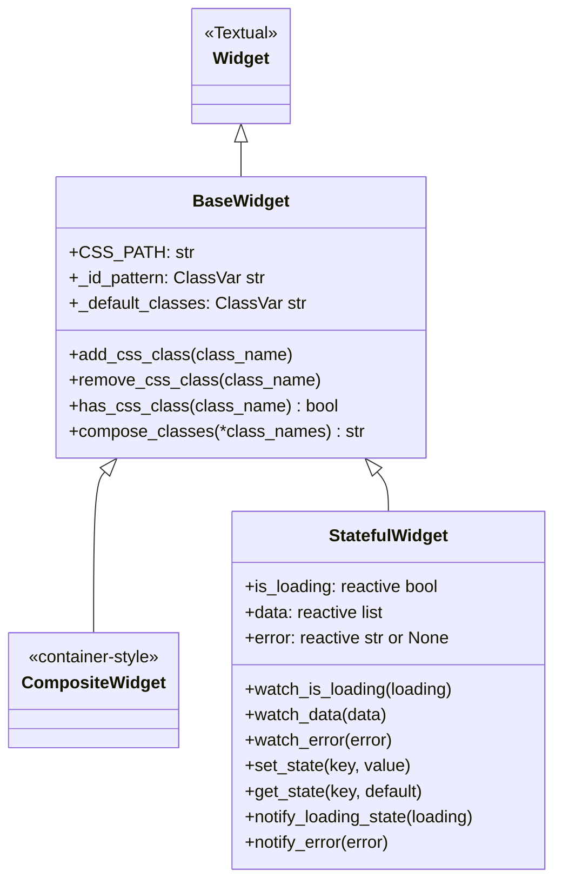
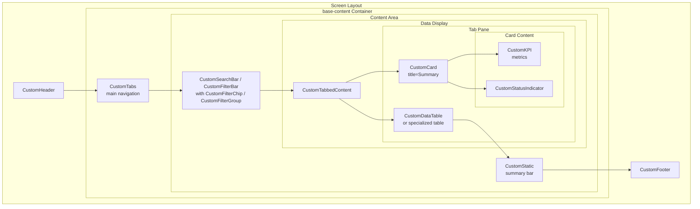
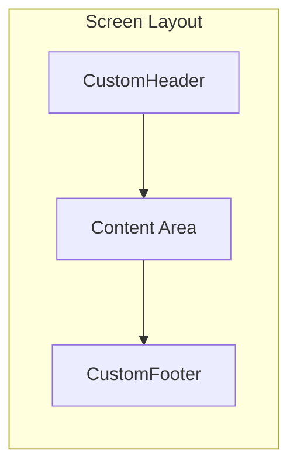
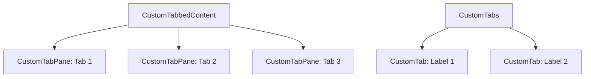
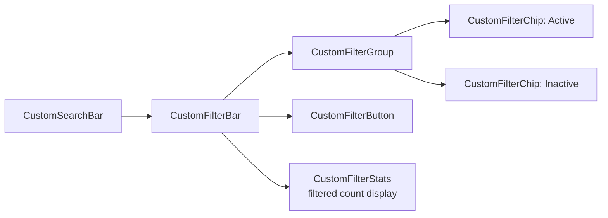
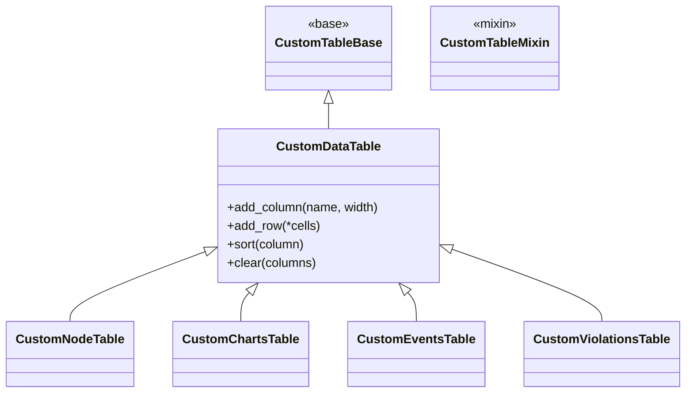

# Widget Usage Best Practices Guide

This guide documents the widgets available in the KubEagle TUI application, organized by category with use cases and examples.

## Widget Selection Decision Tree

Use this tree to determine which widget to use based on the type of content you need to display:

```mermaid
flowchart TD
    A[Need a widget?] --> B{What type of content?}
    B -->|Text / Display| C{Interactive?}
    B -->|User Input| D{Input type?}
    B -->|Data / Tables| E{Table type?}
    B -->|Layout / Structure| F{Grouping type?}
    B -->|Feedback / Actions| G{Feedback type?}
    B -->|Filtering| FILT{Filter type?}

    C -->|No, static text| H[CustomStatic]
    C -->|Markdown content| H2[CustomMarkdown / CustomMarkdownViewer]
    C -->|Numeric display| H3[CustomDigits]
    C -->|Progress bar| H4[CustomProgressBar]
    C -->|Scrollable log| I[CustomRichLog]

    D -->|Single line text| J[CustomInput]
    D -->|Multi-line text| K[CustomTextArea]
    D -->|Boolean toggle| L{Visual style?}
    D -->|Selection from options| M{How many options?}
    L -->|Checkbox| L1[CustomCheckbox]
    L -->|Switch| L2[CustomSwitch]
    M -->|Dropdown| M0[CustomSelect]
    M -->|Few, exclusive| M1[CustomRadioSet / CustomRadioButton]
    M -->|Many, multi-select| M2[CustomSelectionList]
    M -->|Simple list| M3[CustomOptionList]

    E -->|Generic data| E1[CustomDataTable]
    E -->|Node data| E2[CustomNodeTable]
    E -->|Chart data| E3[CustomChartsTable]
    E -->|Event data| E4[CustomEventsTable]
    E -->|Violation data| E5[CustomViolationsTable]

    F -->|Card| N[CustomCard]
    F -->|Collapsible section| N2[CustomCollapsible]
    F -->|Horizontal row| O[CustomHorizontal]
    F -->|Vertical stack| P[CustomVertical]
    F -->|Generic container| P2[CustomContainer]
    F -->|Tabs| Q[CustomTabbedContent]
    F -->|Content panels| Q2[CustomContentSwitcher]
    F -->|Hierarchical tree| Q3[CustomTree / CustomDirectoryTree]

    G -->|Button| R[CustomButton]
    G -->|Loading spinner| S[CustomLoadingIndicator]
    G -->|Confirmation| T[CustomConfirmDialog]
    G -->|Text input dialog| T2[CustomInputDialog]
    G -->|Action choice| T3[CustomActionDialog]
    G -->|Help text| T4[CustomHelpDialog]
    G -->|Status display| T5[CustomStatusIndicator]
    G -->|KPI metric| T6[CustomKPI]

    FILT -->|Search bar| FILT1[CustomSearchBar]
    FILT -->|Filter bar| FILT2[CustomFilterBar]
    FILT -->|Filter chips| FILT3[CustomFilterChip / CustomFilterGroup]
    FILT -->|Filter button with count| FILT4[CustomFilterButton]
    FILT -->|Filtered result stats| FILT5[CustomFilterStats]
```



## Widget Inheritance Hierarchy



## Widget Composition Diagram

This diagram shows how widgets are typically nested inside screens:



## Widget Categories

| Category | Count | Description |
|----------|-------|-------------|
| Base Classes | 3 | Widget foundation classes |
| Structure | 3 | Layout structure widgets (header, footer, rule) |
| Containers | 5 | Content grouping containers |
| Display | 6 | Text and content display |
| Input | 3 | User input widgets |
| Selection | 6 | Selection widgets |
| Special | 4 | Specialized functionality |
| Tabs | 4 | Tab-based navigation |
| Feedback | 7 | User feedback widgets (buttons, dialogs, loading) |
| Filter | 6 | Search, filter, and stats widgets |
| Data Tables | 8 | Data table widgets and helpers |
| KPI / Indicators | 4 | Status indicators and metrics |
| **Total** | **60+** | All widgets |

---

## Base Classes

### BaseWidget

Foundation class for all widgets. Provides configurable ID patterns with UUID generation, CSS class composition utilities, and common lifecycle hooks.

```python
from kubeagle.widgets import BaseWidget

class CustomWidget(BaseWidget):
    """Custom widget inheriting from BaseWidget."""

    _id_pattern: ClassVar[str | None] = "my-widget-{uuid}"
    _default_classes: ClassVar[str] = "custom-widget"
```

Key features:
- `id_pattern` parameter for auto-generating widget IDs with UUID placeholders
- `_default_classes` for applying default CSS classes on initialization
- CSS helper methods: `add_css_class()`, `remove_css_class()`, `has_css_class()`, `compose_classes()`

### CompositeWidget

Widget composed of multiple child widgets. Use for container-style widgets that manage child widget lifecycle and state.

```python
from kubeagle.widgets import CompositeWidget

class DashboardPanel(CompositeWidget):
    """Panel containing multiple widgets."""
    pass
```

### StatefulWidget

Widget with standardized reactive state management. Provides `is_loading`, `data`, and `error` reactive attributes with corresponding watch methods.

```python
from kubeagle.widgets import StatefulWidget

class CounterWidget(StatefulWidget):
    """Widget with reactive state."""

    def watch_is_loading(self, loading: bool) -> None:
        self.notify_loading_state(loading)

    def watch_data(self, data: list[dict]) -> None:
        self._render(data)

    def watch_error(self, error: str | None) -> None:
        if error:
            self.notify_error(error)
```

StatefulWidget also provides internal state via `set_state(key, value)` and `get_state(key, default)`.

---

## Structure Widgets

Structure widgets provide the application frame with header, footer, and separators.



### CustomHeader

Application header with title and optional clock.

```python
from kubeagle.widgets import CustomHeader

def compose(self) -> ComposeResult:
    yield CustomHeader()  # Includes title and clock
```

**CSS Classes:** `header`, `header-title`, `header-clock`

### CustomFooter

Application footer with keybinding hints.

```python
from kubeagle.widgets import CustomFooter

def compose(self) -> ComposeResult:
    yield CustomFooter()  # Auto-populates with keybindings
```

**CSS Classes:** `footer`, `footer-key`, `footer-hint`

### CustomRule

Horizontal or vertical rule/separator line.

```python
from kubeagle.widgets import CustomRule

# Vertical separator
CustomRule(orientation="vertical", classes="separator-rule")

# Horizontal separator
CustomRule(orientation="horizontal")
```

**CSS Classes:** `rule`, `vertical`, `horizontal`

---

## Container Widgets

Container widgets group and structure content.

### CustomContainer

Generic container for grouping widgets.

```python
from kubeagle.widgets import CustomContainer

with CustomContainer(id="main-content"):
    yield CustomStatic("Content goes here")
```

**CSS Classes:** `container`, `content-area`

### CustomCard

Titled card container for grouped content.

```python
from kubeagle.widgets import CustomCard

with CustomCard(title="Statistics"):
    yield CustomStatic("Card content here")
```

**CSS Classes:** `card`, `card-title`, `card-content`

### CustomCollapsible

Collapsible section that can be expanded/collapsed.

```python
from kubeagle.widgets import CustomCollapsible

with CustomCollapsible(title="Advanced Options"):
    yield CustomStatic("Hidden content here")
```

**Use For:** Optional settings, advanced configurations, expandable sections

### CustomHorizontal

Horizontal layout container.

```python
from kubeagle.widgets import CustomHorizontal

with CustomHorizontal():
    yield CustomStatic("Left")
    yield CustomStatic("Right")
```

**CSS Classes:** `horizontal`, `h-container`

### CustomVertical

Vertical layout container.

```python
from kubeagle.widgets import CustomVertical

with CustomVertical():
    yield CustomStatic("Top")
    yield CustomStatic("Bottom")
```

**CSS Classes:** `vertical`, `v-container`

---

## Display Widgets

Display widgets show text and content to users.

### CustomStatic

Simple text display with Rich markup support.

```python
from kubeagle.widgets import CustomStatic

# Plain text
CustomStatic("Hello World")

# With Rich markup
CustomStatic("[b]Bold[/] and [i]italic[/]")

# With CSS class
CustomStatic("Styled text", classes="highlight")
```

**CSS Classes:** `static`, `text`, `highlight`

### CustomDigits

Numeric display with digit-style formatting.

```python
from kubeagle.widgets import CustomDigits

CustomDigits("1234.56")  # Monospace digit display
```

**Use For:** Counters, statistics, numerical data

### CustomMarkdown

Markdown rendering support.

```python
from kubeagle.widgets import CustomMarkdown

CustomMarkdown("# Heading\n\nContent with **bold**")
```

**Use For:** Documentation display, help content, reports

### CustomMarkdownViewer

Scrollable markdown viewer with navigation support.

```python
from kubeagle.widgets import CustomMarkdownViewer

CustomMarkdownViewer("# Large Document\n\n...", id="doc-viewer")
```

**Use For:** Large markdown documents, scrollable help, report previews

### CustomProgressBar

Progress indicator bar.

```python
from kubeagle.widgets import CustomProgressBar

progress = CustomProgressBar(total=100, id="load-progress")
progress.advance(25)  # 25% complete
```

**Use For:** Loading progress, operation progress, task completion

### CustomRichLog

Rich text log viewer with styling.

```python
from kubeagle.widgets import CustomRichLog

log = CustomRichLog()
log.write_line("[green]Success:[/] Operation completed")
log.write_line("[red]Error:[/] Failed to connect")
```

**Use For:** Log output, error messages, status updates

---

## Input Widgets

Input widgets allow user text input.

### CustomInput

Text input with validation support.

```python
from kubeagle.widgets import CustomInput

# Basic input
CustomInput(placeholder="Enter value...")

# With validation
CustomInput(
    placeholder="Email...",
    validate=lambda x: "@" in x
)

# With type
CustomInput(type="number")
```

**CSS Classes:** `input`, `text-input`

**Events:** `Changed`, `Submitted`

### CustomCheckbox

Checkbox for boolean values.

```python
from kubeagle.widgets import CustomCheckbox

CustomCheckbox("Enable feature", id="feature-toggle")
```

**CSS Classes:** `checkbox`, `toggle`

**Events:** `Changed`

### CustomTextArea

Multi-line text area.

```python
from kubeagle.widgets import CustomTextArea

CustomTextArea(
    placeholder="Enter multiple lines...",
    height=5
)
```

**Use For:** Long text input, notes, descriptions, system prompt editing

---

## Selection Widgets

Selection widgets allow users to choose from options.

### CustomSelect

Dropdown select widget for single selection from a list.

```python
from kubeagle.widgets import CustomSelect

# Used in actual screens via alias:
# from kubeagle.widgets import CustomSelect as Select
CustomSelect(
    options=[("Option A", "a"), ("Option B", "b")],
    id="my-select",
)
```

**Use For:** Dropdown selections, event window select, sort options

### CustomRadioSet

Group of radio buttons.

```python
from kubeagle.widgets import CustomRadioSet

CustomRadioSet(
    ("Option A", "a"),
    ("Option B", "b"),
    ("Option C", "c"),
    id="selection"
)
```

### CustomRadioButton

Individual radio button.

```python
from kubeagle.widgets import CustomRadioButton

CustomRadioButton("Select me", id="radio-btn")
```

### CustomSelectionList

List with single or multiple selection.

```python
from kubeagle.widgets import CustomSelectionList

CustomSelectionList(
    ("Option 1", "opt1"),
    ("Option 2", "opt2"),
    ("Option 3", "opt3"),
    id="selection-list"
)
```

**CSS Classes:** `selection-list`, `option`

### CustomOptionList

Simple option list.

```python
from kubeagle.widgets import CustomOptionList

CustomOptionList(
    ["Option A", "Option B", "Option C"],
    id="options"
)
```

### CustomSwitch

Toggle switch for on/off values.

```python
from kubeagle.widgets import CustomSwitch

CustomSwitch(id="dark-mode", value=False)
```

**CSS Classes:** `switch`, `toggle`

---

## Special Widgets

Specialized widgets with specific functionality.

### CustomContentSwitcher

Switch between different content panels.

```python
from kubeagle.widgets import CustomContentSwitcher

with CustomContentSwitcher():
    yield CustomStatic("Panel 1", id="panel-1")
    yield CustomStatic("Panel 2", id="panel-2")
```

### CustomDirectoryTree

File system directory tree.

```python
from kubeagle.widgets import CustomDirectoryTree

CustomDirectoryTree("/path/to/directory")
```

**Use For:** File browser, chart path selection

### CustomLink

Clickable hyperlink.

```python
from kubeagle.widgets import CustomLink

CustomLink("Click here", target="https://example.com")
```

### CustomTree

Hierarchical tree structure.

```python
from kubeagle.widgets import CustomTree

tree = CustomTree()
tree.root.add("Parent")
tree.root.children[0].add("Child")
```

**Use For:** Hierarchical data display, organizational charts

---

## Tab Widgets

Tab-based navigation widgets.



### CustomTabbedContent

Container with tab navigation.

```python
from kubeagle.widgets import CustomTabbedContent, CustomTabPane

with CustomTabbedContent(id="tabs"):
    with CustomTabPane("Tab 1", id="tab-1"):
        yield CustomStatic("Content 1")
    with CustomTabPane("Tab 2", id="tab-2"):
        yield CustomStatic("Content 2")
```

**CSS Classes:** `tabbed-content`, `tabs`, `tab-pane`

### CustomTabPane

Individual tab content pane.

```python
with CustomTabPane("Settings", id="tab-settings"):
    yield CustomStatic("Settings content")
```

### CustomTabs

Standalone tab strip.

```python
from kubeagle.widgets import CustomTabs

CustomTabs(
    CustomTab("Tab 1", id="tab-1"),
    CustomTab("Tab 2", id="tab-2"),
)
```

### CustomTab

Individual tab button.

```python
from kubeagle.widgets import CustomTab

CustomTab("Label", id="tab-id")
```

---

## Feedback Widgets

User feedback and interaction widgets.

### CustomButton

Interactive button with variants.

```python
from kubeagle.widgets import CustomButton

# Primary button
CustomButton("Submit", variant="primary")

# Warning button
CustomButton("Delete", variant="warning")

# Success button
CustomButton("Approve", variant="success")

# With icon
CustomButton("Save", icon="floppy-disc")
```

**CSS Classes:** `button`, `btn-primary`, `btn-warning`, `btn-success`, `btn-error`

**Events:** `Clicked`, `Pressed`

### CustomLoadingIndicator

Animated loading spinner.

```python
from kubeagle.widgets import CustomLoadingIndicator

CustomLoadingIndicator()
```

**CSS Classes:** `loading`, `spinner`, `loader`

### CustomConfirmDialog

Confirmation dialog.

```python
from kubeagle.widgets import CustomConfirmDialog

dialog = CustomConfirmDialog(
    title="Confirm Delete",
    message="Are you sure you want to delete?",
    confirm_label="Delete",
    cancel_label="Cancel"
)
```

### CustomInputDialog

Dialog with text input.

```python
from kubeagle.widgets import CustomInputDialog

dialog = CustomInputDialog(
    title="Enter Name",
    prompt="What is your name?",
    placeholder="Name..."
)
```

### CustomActionDialog

Action selection dialog.

```python
from kubeagle.widgets import CustomActionDialog

dialog = CustomActionDialog(
    title="Choose Action",
    actions=[
        ("Open", "open"),
        ("Edit", "edit"),
        ("Delete", "delete"),
    ]
)
```

### CustomHelpDialog

Help information dialog.

```python
from kubeagle.widgets import CustomHelpDialog

dialog = CustomHelpDialog(
    title="Keyboard Shortcuts",
    content="Keybindings help text..."
)
```

### CustomDialogFactory

Factory for creating dialogs programmatically.

```python
from kubeagle.widgets import CustomDialogFactory

# Create dialogs via factory pattern
dialog = CustomDialogFactory.create_confirm(
    title="Confirm",
    message="Proceed?",
)
```

**Use For:** Dynamic dialog creation, reusable dialog patterns

---

## Filter Widgets

Search and filter widgets.



### CustomSearchBar

Search input with filters.

```python
from kubeagle.widgets import CustomSearchBar

search_bar = CustomSearchBar(
    placeholder="Search...",
    filters=["All", "Name", "Type"]
)
```

**CSS Classes:** `search-bar`, `search-input`, `filter-dropdown`

### CustomFilterBar

Bar containing multiple filters.

```python
from kubeagle.widgets import CustomFilterBar

with CustomFilterBar():
    yield CustomButton("Filter A")
    yield CustomButton("Filter B")
```

### CustomFilterChip

Individual filter chip/tag.

```python
from kubeagle.widgets import CustomFilterChip

CustomFilterChip("Active", selected=True)
```

**CSS Classes:** `chip`, `filter-chip`, `selected`

### CustomFilterGroup

Group of related filters.

```python
from kubeagle.widgets import CustomFilterGroup

with CustomFilterGroup(id="status-filters"):
    yield CustomFilterChip("All", selected=True)
    yield CustomFilterChip("Active")
    yield CustomFilterChip("Inactive")
```

### CustomFilterButton

Filter button with badge count.

```python
from kubeagle.widgets import CustomFilterButton

CustomFilterButton("Messages", count=5)
```

### CustomFilterStats

Displays filtered result counts. This is a `StatefulWidget` that shows how many items
match the current filter criteria out of the total.

```python
from kubeagle.widgets.filter import CustomFilterStats

stats = CustomFilterStats(id="filter-stats")
# Update after filtering:
stats.update("Showing 42 of 150 charts")
```

**CSS Classes:** `widget-custom-filter-stats`

**Use For:** Showing filtered vs total counts in search/filter bars

---

## Data Table Widgets

Data display and manipulation widgets.



### CustomTableBase

Base class for all table widgets.

```python
from kubeagle.widgets import CustomTableBase
```

**Use For:** Creating new specialized table types

### CustomDataTable

Main data table with sorting and selection.

```python
from kubeagle.widgets import CustomDataTable

table = CustomDataTable(
    id="main-table",
    zebra_stripes=True,
    show_header=True
)

# Configure columns
table.add_column("Name", width=30)
table.add_column("Status", width=15)

# Add data
table.add_row("Item 1", "Active")
table.add_row("Item 2", "Inactive")

# Sort
table.sort("Name")
```

**CSS Classes:** `data-table`, `zebra-stripes`, `selected-row`

**Events:** `RowSelected`, `CellSelected`

### CustomNodeTable

Specialized table for Kubernetes node data.

```python
from kubeagle.widgets import CustomNodeTable

CustomNodeTable(id="nodes-table")
```

**Use For:** Cluster node information

### CustomChartsTable

Specialized table for Helm chart data.

```python
from kubeagle.widgets import CustomChartsTable

CustomChartsTable(id="charts-table")
```

**Use For:** Helm chart listings

### CustomEventsTable

Table for Kubernetes events.

```python
from kubeagle.widgets import CustomEventsTable

CustomEventsTable(id="events-table")
```

**Use For:** Cluster event logs

### CustomViolationsTable

Table for optimization violations.

```python
from kubeagle.widgets import CustomViolationsTable

CustomViolationsTable(id="violations-table")
```

**Use For:** Resource optimization results

### CustomColumnDef

Column definition helper.

```python
from kubeagle.widgets import CustomColumnDef

column = CustomColumnDef(
    "Name",
    width=30,
    sortable=True,
    key="name"
)
```

### CustomTableBuilder

Builder for creating tables programmatically.

```python
from kubeagle.widgets import CustomTableBuilder

builder = CustomTableBuilder()
table = builder.create_table(
    columns=["Name", "Status"],
    data=data_list,
    table_id="my-table"
)
```

### CustomTableMixin

Mixin for table functionality.

```python
from kubeagle.widgets import CustomTableMixin

class MyTable(CustomTableMixin, CustomDataTable):
    """Custom table with mixin features."""
    pass
```

---

## KPI and Indicator Widgets

Status and metric display widgets.

### CustomKPI

Key performance indicator display.

```python
from kubeagle.widgets import CustomKPI

kpi = CustomKPI(
    label="CPU Usage",
    value="75%",
    trend="up",
    color="warning"
)
```

**Use For:** Dashboard metrics, statistics

### CustomStatusIndicator

Status indicator with visual feedback.

```python
from kubeagle.widgets import CustomStatusIndicator

status = CustomStatusIndicator(
    "Connected",
    status="success"
)
```

**Use For:** Connection status, health checks

### CustomErrorRetryWidget

Error display with retry button.

```python
from kubeagle.widgets.data.indicators import CustomErrorRetryWidget

error_widget = CustomErrorRetryWidget(
    message="Failed to load data",
    on_retry=self._retry_load
)
```

**Use For:** Error states with actionable retry

### CustomLastUpdatedWidget

Displays the last data update timestamp.

```python
from kubeagle.widgets.data.indicators import CustomLastUpdatedWidget

updated_widget = CustomLastUpdatedWidget(id="last-updated")
```

**Use For:** Showing data freshness, last refresh time

---

## CSS Class Patterns

### Common CSS Classes by Widget Type

| Widget Type | CSS Classes |
|-------------|-------------|
| Buttons | `button`, `btn-primary`, `btn-warning`, `btn-success`, `btn-error`, `btn-icon` |
| Tables | `data-table`, `zebra-stripes`, `selected-row`, `header-row` |
| Containers | `container`, `card`, `panel`, `content-area` |
| Text | `static`, `text`, `highlight`, `dim`, `bold`, `italic` |
| Status | `success`, `warning`, `error`, `info`, `critical`, `safe` |
| Loading | `loading`, `spinner`, `loader`, `overlay` |
| Tabs | `tab`, `tab-active`, `tab-pane`, `tabbed-content` |
| Filters | `filter`, `chip`, `active-filter`, `search-bar` |

### Dynamic Classes

Add/remove classes dynamically:

```python
# Add class
widget.add_class("highlight")

# Remove class
widget.remove_class("disabled")

# Toggle class
widget.toggle_class("expanded")

# Check for class
if widget.has_class("selected"):
    # Do something
```

---

## Widget Configuration

The `_config.py` module provides `WidgetConfig` and `WidgetRegistry` utilities:

```python
from kubeagle.widgets._config import WIDGET_CONFIG

# Generate widget ID from pattern
card_id = WIDGET_CONFIG.generate_id("card", name="stats")  # "card-stats-abc12345"

# Compose CSS classes
classes = WIDGET_CONFIG.compose_classes("card", "highlighted", prefix="kh")  # "kh-card kh-highlighted"

# Get status/severity classes
WIDGET_CONFIG.status_class("success")    # "status-success"
WIDGET_CONFIG.severity_class("critical") # "severity-critical"
```

Available ID pattern templates:

| Pattern Name | Template |
|-------------|----------|
| `kpi` | `kpi-{title}-{uuid}` |
| `card` | `card-{name}-{uuid}` |
| `button` | `btn-{name}-{uuid}` |
| `input` | `input-{name}-{uuid}` |
| `dialog` | `dialog-{name}-{uuid}` |
| `table` | `table-{name}-{uuid}` |
| `filter` | `filter-{name}-{uuid}` |
| `toast` | `toast-{name}-{uuid}` |
| `spinner` | `spinner-{name}-{uuid}` |
| `progress` | `progress-{name}-{uuid}` |

---

## Related Documentation

- [Screen Composition Best Practices](./screen-composition.md) - Screen patterns and inheritance
- [CSS Styling Guide](../styling/css-guide.md) - Styling patterns
