# Controller Reference

Complete documentation for the data layer controllers.

## Controller Architecture

Controllers handle data fetching, parsing, and business logic. Each controller follows the fetcher/parser/mapper pattern with dedicated sub-modules. The optimizer is a separate module at `kubeagle/optimizer/`, not a controller.

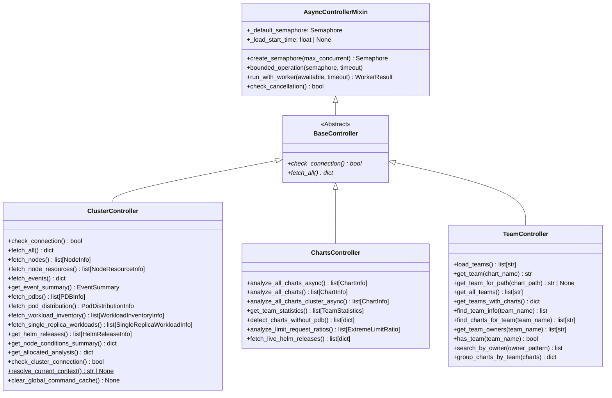

## Fetcher / Parser / Mapper Pipeline per Controller

Each controller delegates to specialized fetchers, parsers, and (where applicable) mappers. The following diagram shows the complete pipeline for all three controllers.

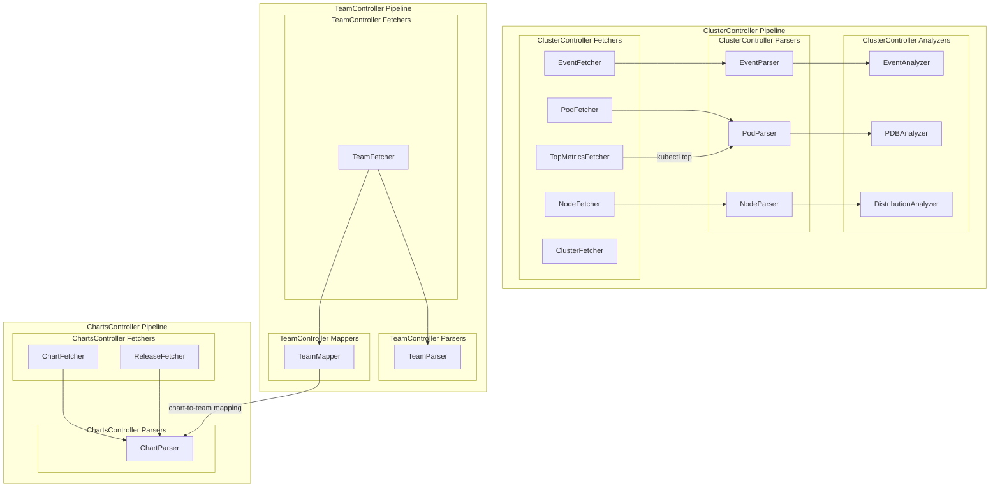

## Controller-to-Screen Mapping

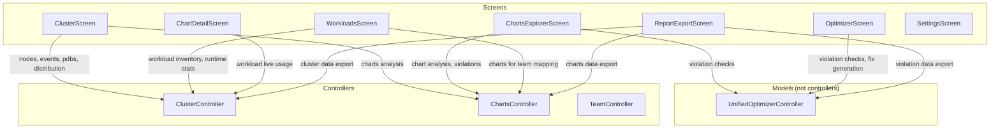

## Data Transformation Flow

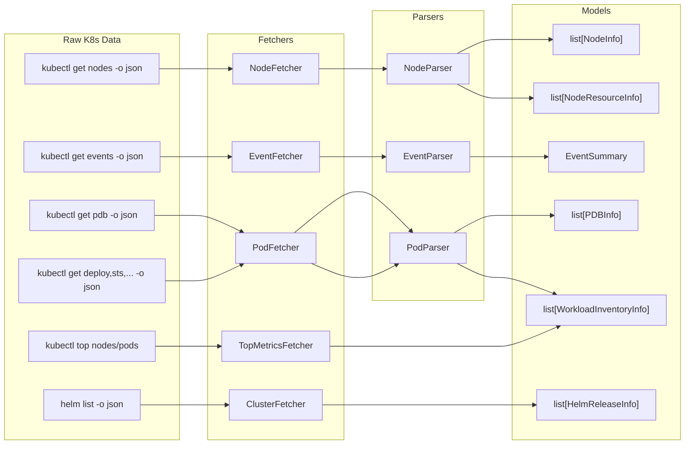

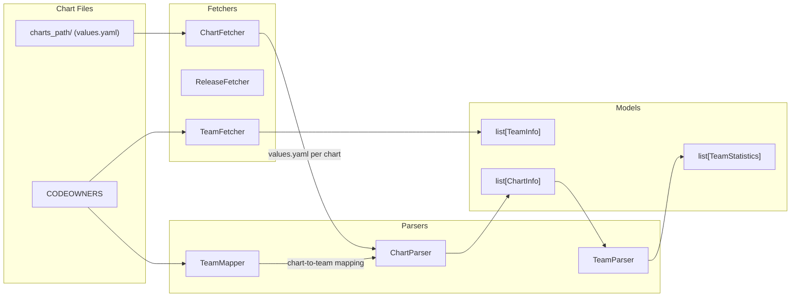

## Controller Directory Structure

```
controllers/
├── __init__.py                    # Re-exports: ClusterController, ChartsController,
│                                  #   TeamController, BaseController, AsyncControllerMixin,
│                                  #   WorkerResult, LoadingProgress, FetchStatus,
│                                  #   EventAnalyzer, PDBAnalyzer, DistributionAnalyzer,
│                                  #   TeamMapper, TeamInfo, OptimizerController, etc.
├── base/
│   ├── __init__.py                # AsyncControllerMixin, BaseController, WorkerResult, LoadingProgress
│   └── base_controller.py         # AsyncControllerMixin, BaseController, WorkerResult
├── cluster/
│   ├── __init__.py
│   ├── controller.py              # ClusterController, FetchStatus
│   ├── fetchers/
│   │   ├── __init__.py
│   │   ├── cluster_fetcher.py     # ClusterFetcher
│   │   ├── node_fetcher.py        # NodeFetcher
│   │   ├── event_fetcher.py       # EventFetcher
│   │   ├── pod_fetcher.py         # PodFetcher
│   │   └── top_metrics_fetcher.py # TopMetricsFetcher
│   └── parsers/
│       ├── __init__.py
│       ├── node_parser.py         # NodeParser
│       ├── event_parser.py        # EventParser
│       └── pod_parser.py          # PodParser
├── charts/
│   ├── __init__.py
│   ├── controller.py              # ChartsController
│   ├── fetchers/
│   │   ├── __init__.py
│   │   ├── chart_fetcher.py       # ChartFetcher
│   │   └── release_fetcher.py     # ReleaseFetcher
│   └── parsers/
│       ├── __init__.py
│       └── chart_parser.py        # ChartParser
├── team/
│   ├── __init__.py
│   ├── controller.py              # TeamController
│   ├── fetchers/
│   │   ├── __init__.py
│   │   └── team_fetcher.py        # TeamFetcher
│   ├── parsers/
│   │   ├── __init__.py
│   │   └── team_parser.py         # TeamParser
│   └── mappers/
│       ├── __init__.py
│       └── team_mapper.py         # TeamMapper, TeamInfo (re-export)
└── analyzers/
    ├── __init__.py                # EventAnalyzer, PDBAnalyzer, DistributionAnalyzer,
    │                              #   count_events_by_category, analyze_blocking_pdbs, _get_label_value
    ├── event_analyzer.py          # EventAnalyzer, count_events_by_category
    ├── pdb_analyzer.py            # PDBAnalyzer, analyze_blocking_pdbs
    └── distribution_analyzer.py   # DistributionAnalyzer, _get_label_value,
                                   #   fetch_and_analyze_distributions
```

## Data Flow

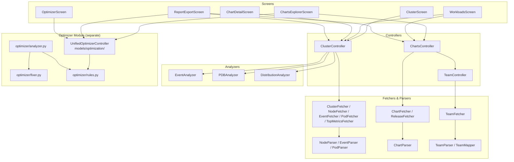

## Base Classes

### WorkerResult

Result wrapper for async operations:

```python
@dataclass
class WorkerResult:
    """Result wrapper for worker operations."""

    success: bool
    data: Any | None = None
    error: str | None = None
    duration_ms: float = 0.0
```

### LoadingProgress

Progress update for async loading operations (defined in `models/types/loading.py`, re-exported from `controllers/base`):

```python
@dataclass
class LoadingProgress:
    """Progress update for async loading operations."""

    phase: str
    progress: float  # 0.0 to 1.0
    message: str = ""
    details: dict[str, Any] = field(default_factory=dict)
```

### AsyncControllerMixin

Provides async utilities for controllers:

```python
class AsyncControllerMixin:
    """Mixin providing worker-friendly async patterns."""

    def __init__(self) -> None:
        self._load_start_time: float | None = None
        self._default_semaphore = asyncio.Semaphore(8)

    @property
    def default_semaphore(self) -> asyncio.Semaphore:
        """Get default semaphore (8 concurrent ops)."""
        return self._default_semaphore

    def create_semaphore(self, max_concurrent: int) -> asyncio.Semaphore:
        """Create custom semaphore."""
        return asyncio.Semaphore(max_concurrent)

    @asynccontextmanager
    async def bounded_operation(
        self,
        semaphore: asyncio.Semaphore | None = None,
        *,
        timeout: float | None = None,
    ):
        """Limit concurrent operations with semaphore and optional timeout."""
        sem = semaphore or self._default_semaphore
        acquired = False
        try:
            if timeout:
                acquired = await asyncio.wait_for(sem.acquire(), timeout=timeout)
            else:
                await sem.acquire()
                acquired = True
            yield
        finally:
            if acquired:
                sem.release()

    async def run_with_worker(
        self,
        awaitable: Awaitable[T],
        timeout: float | None = None,
    ) -> WorkerResult:
        """Run awaitable with timeout, cancellation, and error handling."""
        start_time = datetime.now().timestamp()
        try:
            if timeout:
                data = await asyncio.wait_for(awaitable, timeout=timeout)
            else:
                data = await awaitable
            duration_ms = (datetime.now().timestamp() - start_time) * 1000
            return WorkerResult(success=True, data=data, duration_ms=duration_ms)
        except asyncio.TimeoutError:
            ...
        except asyncio.CancelledError:
            ...
        except Exception as e:
            ...

    def check_cancellation(self) -> bool:
        """Check if current worker is cancelled."""
        worker = get_current_worker()
        return worker.is_cancelled if worker else False
```

### BaseController

Abstract base for all controllers:

```python
class BaseController(AsyncControllerMixin, ABC):
    """Abstract base controller."""

    @abstractmethod
    async def check_connection(self) -> bool:
        """Check if data source is available."""
        ...

    @abstractmethod
    async def fetch_all(self) -> dict[str, Any]:
        """Fetch all data from source."""
        ...
```

---

## ClusterController

**Location**: `controllers/cluster/controller.py`

Fetches and analyzes EKS cluster data using kubectl. This class serves as an orchestrator that delegates to specialized fetchers (NodeFetcher, PodFetcher, EventFetcher, ClusterFetcher, TopMetricsFetcher) and parsers (NodeParser, EventParser, PodParser).

### FetchStatus

Tracks the state of individual data source fetch operations:

```python
@dataclass
class FetchStatus:
    """Status tracking for a single data source fetch operation."""

    source_name: str
    state: FetchState = FetchState.SUCCESS
    error_message: str | None = None
    last_updated: datetime | None = None

    def to_dict(self) -> dict[str, Any]: ...
```

### Sub-modules

| Sub-module | Files | Purpose |
|------------|-------|---------|
| `fetchers/` | `cluster_fetcher.py`, `node_fetcher.py`, `event_fetcher.py`, `pod_fetcher.py`, `top_metrics_fetcher.py` | Raw data fetching via kubectl/helm |
| `parsers/` | `node_parser.py`, `event_parser.py`, `pod_parser.py` | Parse kubectl JSON into models |

### Constructor

```python
def __init__(self, context: str | None = None) -> None:
    """Initialize cluster controller.

    Args:
        context: Kubernetes context name (optional)
    """
```

### Class Constants

| Constant | Value | Description |
|----------|-------|-------------|
| `SOURCE_NODES` | `"nodes"` | Fetch state key for nodes |
| `SOURCE_EVENTS` | `"events"` | Fetch state key for events |
| `SOURCE_PDBS` | `"pod_disruption_budgets"` | Fetch state key for PDBs |
| `SOURCE_HELM_RELEASES` | `"helm_releases"` | Fetch state key for releases |
| `SOURCE_NODE_RESOURCES` | `"node_resources"` | Fetch state key for node resources |
| `SOURCE_POD_DISTRIBUTION` | `"pod_distribution"` | Fetch state key for pod distribution |
| `SOURCE_CLUSTER_CONNECTION` | `"cluster_connection"` | Fetch state key for connection |

### Class Methods

| Method | Returns | Description |
|--------|---------|-------------|
| `resolve_current_context(timeout_seconds)` | `str \| None` | Resolve the current kubectl context (static) |
| `clear_global_command_cache(context)` | `None` | Clear shared kubectl/helm command caches |
| `get_semaphore(max_concurrent)` | `Semaphore` | Get or create shared semaphore |
| `set_max_concurrent(max_concurrent)` | `None` | Set maximum concurrent fetches |
| `acquire_slot(operation_name)` | `bool` | Acquire a concurrency slot |
| `release_slot()` | `None` | Release a concurrency slot |
| `reset_semaphore()` | `None` | Reset the semaphore |

### Instance Methods

| Method | Returns | Description |
|--------|---------|-------------|
| `check_connection()` | `bool` | Check cluster connectivity |
| `fetch_all()` | `dict` | Fetch all cluster data |
| `check_cluster_connection()` | `bool` | Check cluster connection via kubectl |
| `fetch_nodes()` | `list[NodeInfo]` | Fetch node list with streaming support |
| `fetch_node_resources()` | `list[NodeResourceInfo]` | Fetch detailed node resource info |
| `fetch_events()` | `dict` | Fetch recent events with streaming |
| `get_event_summary()` | `EventSummary` | Get event summary with streaming |
| `get_critical_events()` | `list[dict]` | Get critical events with streaming |
| `fetch_pdbs()` | `list[PDBInfo]` | Fetch PDB list with streaming |
| `fetch_single_replica_workloads()` | `list[SingleReplicaWorkloadInfo]` | Find single replica workloads |
| `fetch_pod_distribution()` | `PodDistributionInfo` | Get pod distribution with streaming |
| `fetch_workload_inventory()` | `list[WorkloadInventoryInfo]` | Fetch workload inventory with streaming |
| `enrich_workload_runtime_stats()` | `None` | Enrich workloads with live usage data |
| `fetch_workload_live_usage_sample()` | `WorkloadLiveUsageSampleInfo` | Fetch point-in-time usage sample |
| `get_helm_releases()` | `list[HelmReleaseInfo]` | List Helm releases with streaming |
| `get_node_conditions_summary()` | `dict[str, dict[str, int]]` | Summarize node conditions |
| `get_node_taints_analysis()` | `dict[str, Any]` | Analyze node taints |
| `get_kubelet_version_distribution()` | `dict[str, int]` | Count nodes by kubelet version |
| `get_instance_type_distribution()` | `dict[str, int]` | Count nodes by instance type |
| `get_az_distribution()` | `dict[str, int]` | Count nodes by availability zone |
| `get_node_groups_az_matrix()` | `dict[str, dict[str, int]]` | Node groups by AZ cross-tab |
| `get_allocated_analysis()` | `dict` | Analyze resource allocation |
| `get_high_pod_count_nodes()` | `list[dict]` | Identify nodes near pod capacity |
| `get_pod_request_stats()` | `dict` | Get pod resource request stats |
| `get_fetch_state(source)` | `FetchStatus \| None` | Get fetch state for a source |
| `get_all_fetch_states()` | `dict[str, FetchStatus]` | Get all fetch states |
| `get_loading_sources()` | `list[str]` | Get sources currently loading |
| `get_error_sources()` | `list[str]` | Get sources with errors |
| `get_last_nonfatal_warnings()` | `dict[str, str]` | Get non-fatal warning messages |
| `is_any_loading()` | `bool` | Check if any source is loading |
| `is_all_success()` | `bool` | Check if all sources succeeded |
| `reset_fetch_state(source)` | `bool` | Reset fetch state for a source |

### Method Call Sequence: `fetch_nodes()`

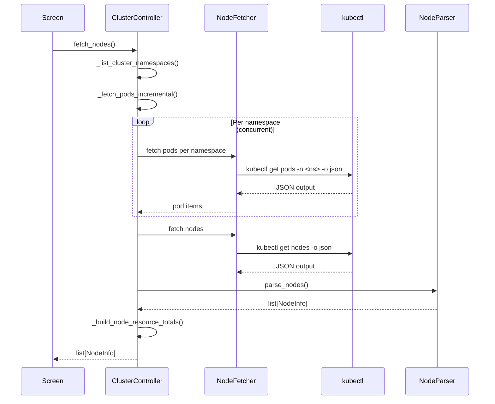

### Method Call Sequence: `fetch_workload_inventory()`

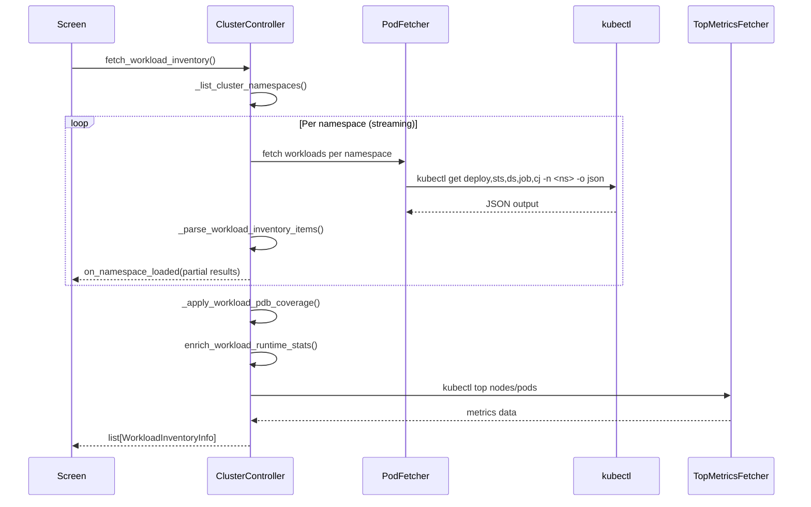

### Usage

```python
from kubeagle.controllers import ClusterController

controller = ClusterController(context="production")

if await controller.check_connection():
    data = await controller.fetch_all()

    nodes = await controller.fetch_nodes()
    events = await controller.get_event_summary()
    pdbs = await controller.fetch_pdbs()

    # Static method for context resolution
    context = ClusterController.resolve_current_context()
```

### Data Flow

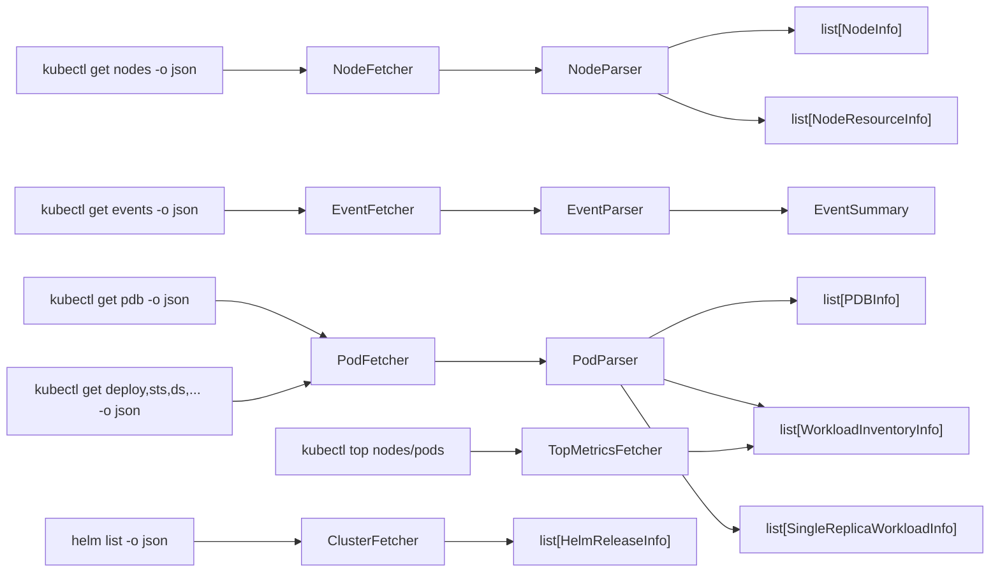

---

## ChartsController

**Location**: `controllers/charts/controller.py`

Analyzes Helm chart configurations from the local chart repository or from live cluster releases.

### Sub-modules

| Sub-module | Files | Purpose |
|------------|-------|---------|
| `fetchers/` | `chart_fetcher.py`, `release_fetcher.py` | Fetch chart files and cluster releases |
| `parsers/` | `chart_parser.py` | Parse chart values.yaml into ChartInfo |

### Constructor

```python
def __init__(
    self,
    repo_path: Path,
    max_workers: int = 8,
    context: str | None = None,
    codeowners_path: Path | None = None,
    active_charts_path: Path | None = None,
    cache: DataCache | None = None,
) -> None:
    """Initialize the charts controller.

    Args:
        repo_path: Path to Helm charts repository
        max_workers: Maximum number of parallel workers (default: 8)
        context: Optional Kubernetes context name
        codeowners_path: Optional path to CODEOWNERS file
        active_charts_path: Optional path to active charts file
        cache: Optional external cache for coordinated invalidation
    """
```

### Methods

| Method | Returns | Description |
|--------|---------|-------------|
| `check_connection()` | `bool` | Check if charts path exists |
| `fetch_all()` | `dict` | Fetch all chart data |
| `refresh()` | `None` | Clear caches and re-analyze |
| `analyze_all_charts_async()` | `list[ChartInfo]` | Async chart analysis with caching |
| `analyze_all_charts()` | `list[ChartInfo]` | Sync chart analysis |
| `analyze_all_charts_cluster_async()` | `list[ChartInfo]` | Analyze charts from live cluster releases |
| `analyze_limit_request_ratios()` | `list[ExtremeLimitRatio]` | Find extreme limit/request ratios |
| `get_team_statistics()` | `list[TeamStatistics]` | Calculate team-level stats |
| `detect_charts_without_pdb()` | `list[dict]` | Find charts without PDB |
| `get_charts_without_pdb_by_team()` | `dict[str, list]` | Group no-PDB charts by team |
| `fetch_live_helm_releases()` | `list[dict[str, str]]` | Fetch cluster releases |
| `fetch_live_helm_releases_streaming()` | `list[dict[str, str]]` | Fetch releases with streaming callbacks |
| `get_live_chart_values()` | `str` | Get live values for a specific release |
| `analyze_live_chart()` | `ChartInfo \| None` | Analyze a single live chart |

### Properties

| Property | Type | Description |
|----------|------|-------------|
| `repo_path` | `Path` | Lazily resolved repository path |
| `active_charts` | `frozenset[str] \| None` | Active charts filter set |
| `team_mapper` | `TeamMapper \| None` | Team mapper instance |

### Usage

```python
from kubeagle.controllers import ChartsController
from pathlib import Path

controller = ChartsController(
    repo_path=Path("/path/to/charts"),
    codeowners_path=Path("/path/to/CODEOWNERS"),
    context="production",
)

charts = await controller.analyze_all_charts_async()
stats = controller.get_team_statistics()
ratios = controller.analyze_limit_request_ratios()
no_pdb = controller.detect_charts_without_pdb()

# Cluster mode analysis
cluster_charts = await controller.analyze_all_charts_cluster_async()
```

### Chart Analysis Flow

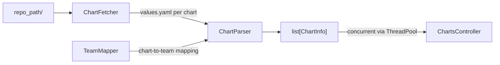

### ChartInfo Fields Extracted

```python
ChartInfo(
    name="frontend-api",
    team="Frontend",              # From CODEOWNERS / values.yaml
    namespace="default",          # From live release or None
    values_file="values.yaml",
    cpu_request=100,              # From resources.requests.cpu
    cpu_limit=500,                # From resources.limits.cpu
    memory_request=128,           # From resources.requests.memory
    memory_limit=512,             # From resources.limits.memory
    qos_class=QoSClass.BURSTABLE, # Computed from resources
    has_liveness=True,            # From livenessProbe
    has_readiness=True,           # From readinessProbe
    has_startup=False,            # From startupProbe
    has_anti_affinity=True,       # From affinity.podAntiAffinity
    has_topology_spread=True,     # From topologySpreadConstraints
    has_topology=True,            # Alias for has_topology_spread
    pdb_enabled=True,             # From pdb.enabled
    pdb_template_exists=True,     # From PDB template in chart
    pdb_min_available=1,          # From pdb.minAvailable
    pdb_max_unavailable=None,     # From pdb.maxUnavailable
    replicas=3,                   # From replicaCount
    priority_class=None,          # From priorityClassName
    deployed_values_content=None, # Raw deployed values (cluster mode)
)
```

---

## TeamController

**Location**: `controllers/team/controller.py`

Manages team data from CODEOWNERS file.

### Sub-modules

| Sub-module | Files | Purpose |
|------------|-------|---------|
| `fetchers/` | `team_fetcher.py` | Fetch and parse CODEOWNERS data |
| `parsers/` | `team_parser.py` | Parse team statistics, group charts by team |
| `mappers/` | `team_mapper.py` | Map charts to teams, resolve team names |

### Constructor

```python
def __init__(self, codeowners_path: Path | None = None) -> None:
    """Initialize the team controller.

    Args:
        codeowners_path: Optional path to CODEOWNERS file.
    """
```

### Methods

| Method | Returns | Description |
|--------|---------|-------------|
| `check_connection()` | `bool` | Check if CODEOWNERS file exists |
| `fetch_all()` | `dict` | Fetch all team data |
| `load_teams()` | `list[str]` | Load team names from CODEOWNERS |
| `get_team(chart_name)` | `str` | Get team name for a chart by name |
| `get_team_for_path(chart_path)` | `str \| None` | Get team for a chart path |
| `get_all_teams()` | `list[str]` | List all unique team names (sorted) |
| `get_teams_with_charts()` | `dict[str, list[str]]` | Map teams to their charts |
| `find_team_info(team_name)` | `list[TeamInfo]` | Find TeamInfo entries for a team |
| `find_charts_for_team(team_name)` | `list[str]` | Get chart patterns owned by a team |
| `get_team_owners(team_name)` | `list[str]` | Get owner references for a team |
| `has_team(team_name)` | `bool` | Check if a team exists |
| `search_by_owner(owner_pattern)` | `list[TeamInfo]` | Find teams by owner pattern |
| `group_charts_by_team(charts)` | `dict[str, list[dict]]` | Group chart dicts by team |
| `to_dict()` | `dict[str, Any]` | Export team mapping as dict |

### TeamMapper

Utility class for chart-to-team mapping with lazy loading and thread-safe access:

```python
class TeamMapper:
    """Map chart directories to teams using CODEOWNERS file."""

    def __init__(self, codeowners_path: Path | None = None) -> None:
        self.teams: list[TeamInfo] = []
        self.team_mapping: dict[str, str] = {}
        self._loaded = False
        self._load_lock = threading.Lock()

    def get_team(self, chart_name: str) -> str:
        """Get team for chart name."""
        ...

    def get_team_for_path(self, chart_path: Path) -> str | None:
        """Get team for a chart path."""
        ...

    def resolve_chart_team(
        self, chart_name: str, chart_path: Path | None, values: dict | None
    ) -> str:
        """Resolve team using CODEOWNERS, values.yaml, or sibling inference."""
        ...

    def register_chart_team(self, chart_name: str, team_name: str) -> str:
        """Register a chart-team mapping."""
        ...

    def get_all_teams(self) -> list[str]:
        """Get sorted list of unique team names."""
        ...

    def get_teams_with_charts(self) -> dict[str, list[str]]:
        """Get mapping of teams to their chart names."""
        ...

    def find_team_info(self, team_name: str) -> list[TeamInfo]:
        """Find all TeamInfo entries for a team."""
        ...

    def find_charts_for_team(self, team_name: str) -> list[str]:
        """Get chart patterns owned by a team."""
        ...

    def get_team_owners(self, team_name: str) -> list[str]:
        """Get unique owner references for a team."""
        ...

    def has_team(self, team_name: str) -> bool:
        """Check if a team exists."""
        ...

    def search_by_owner(self, owner_pattern: str) -> list[TeamInfo]:
        """Find teams with matching owner pattern."""
        ...

    def to_dict(self) -> dict[str, Any]:
        """Export team mapping as a dictionary."""
        ...
```

### TeamParser

Parses team-related data into structured formats:

```python
class TeamParser:
    """Parses team-related data."""

    def parse_team_statistics(
        self, team_name: str, charts: list[dict], violation_count: int = 0
    ) -> TeamStatistics:
        """Parse team statistics from chart dicts."""
        ...

    def group_charts_by_team(
        self, charts: list[dict[str, Any]]
    ) -> dict[str, list[dict[str, Any]]]:
        """Group charts by team name."""
        ...
```

---

## Analyzers

**Location**: `controllers/analyzers/`

Specialized analysis classes used by ClusterController for interpreting cluster data. Analyzers operate on parsed model objects (not raw JSON) and produce summary/insight objects consumed by presenters.

| Analyzer | File | Exported Functions | Purpose |
|----------|------|--------------------|---------|
| `EventAnalyzer` | `event_analyzer.py` | `count_events_by_category` | Categorizes events (OOM, scheduling failures, backoff, unhealthy, mount failures, evictions) |
| `PDBAnalyzer` | `pdb_analyzer.py` | `analyze_blocking_pdbs` | Detects blocking PDBs, classifies risk levels (critical/high/medium/low) |
| `DistributionAnalyzer` | `distribution_analyzer.py` | `_get_label_value`, `fetch_and_analyze_distributions` | Analyzes distribution across nodes, AZs, instance types, and node groups |

### Analyzer Integration

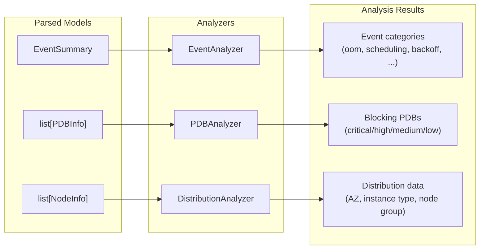

### EventAnalyzer

```python
class EventAnalyzer:
    """Analyzes Kubernetes cluster events for various issue categories."""

    @classmethod
    def is_oom_event(cls, reason: str, message: str) -> bool: ...
    @classmethod
    def is_node_not_ready_event(cls, reason: str, involved_object_kind: str) -> bool: ...
    @classmethod
    def is_scheduling_failure(cls, reason: str) -> bool: ...
    @classmethod
    def is_backoff_event(cls, reason: str, message: str) -> bool: ...
    @classmethod
    def is_unhealthy_event(cls, reason: str) -> bool: ...
    @classmethod
    def is_failed_mount_event(cls, reason: str) -> bool: ...
    @classmethod
    def is_eviction_event(cls, reason: str, message: str) -> bool: ...
    @classmethod
    def parse_event_timestamp(cls, event: dict) -> tuple[str | None, datetime | None]: ...
    @classmethod
    def is_event_recent(cls, event_datetime: datetime | None, max_age_seconds: float) -> bool: ...
    @classmethod
    def classify_event(cls, event: dict, max_age_seconds: float) -> dict | None: ...
    @classmethod
    def parse_events_json(cls, output: str) -> dict[str, Any]: ...


def count_events_by_category(
    events: list[dict], max_age_hours: float = 1.0
) -> dict[str, int]:
    """Count events by category (oom, node_not_ready, failed_scheduling, etc.)."""
```

### PDBAnalyzer

```python
class PDBAnalyzer:
    """Analyzes PodDisruptionBudgets for blocking issues and conflicts."""

    def analyze(self, pdb: PDBInfo) -> PDBInfo:
        """Analyze a PDB for blocking issues. Mutates and returns the PDBInfo."""
        ...

    @staticmethod
    def classify_blocking_risk(pdb: PDBInfo) -> str:
        """Classify risk level: critical, high, medium, or low."""
        ...


def analyze_blocking_pdbs(pdbs: list[PDBInfo]) -> dict[str, Any]:
    """Analyze PDBs and return blocking PDB summary.

    Returns:
        {"total_pdbs": int, "blocking_pdbs": list[BlockingPDBInfo], "blocking_count": int}
    """
```

### DistributionAnalyzer

```python
class DistributionAnalyzer:
    """Analyzes distribution of cluster resources."""

    def __init__(self, nodes_output: str, pods_output: str | None = None) -> None: ...

    def get_node_conditions_summary(self) -> dict[str, dict[str, int]]: ...
    def get_node_taints_analysis(self) -> dict[str, Any]: ...
    def get_kubelet_version_distribution(self) -> dict[str, int]: ...
    def get_instance_type_distribution(self) -> dict[str, int]: ...
    def get_az_distribution(self) -> dict[str, int]: ...
    def get_node_groups_az_matrix(self) -> dict[str, dict[str, int]]: ...
    def get_high_pod_count_nodes(self, threshold_pct: float = 80.0) -> list[dict]: ...
    def get_all_distributions(self) -> dict[str, Any]: ...
```

---

## Optimizer Module (Separate Subsystem)

The optimizer lives at `kubeagle/optimizer/` as an independent module. It is consumed by the `UnifiedOptimizerController` model (at `kubeagle/models/optimization/optimizer_controller.py`) and by screens (such as OptimizerScreen and ChartsExplorerScreen) directly. The `UnifiedOptimizerController` is a Pydantic model that bridges between ChartInfo models and the optimizer rules engine, not a controller in the controller layer.

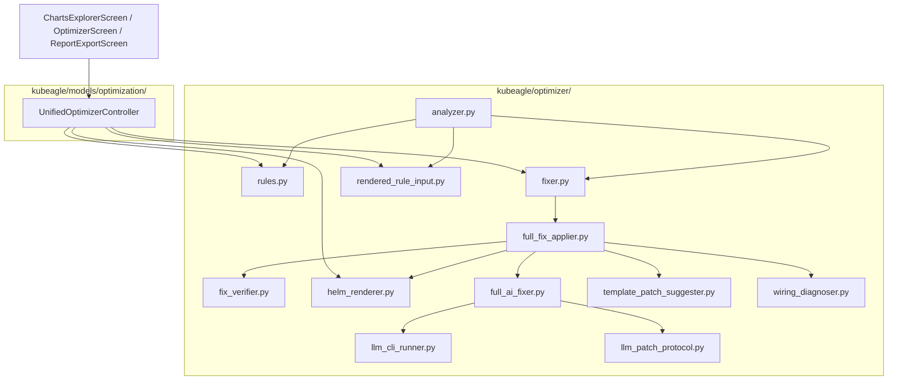

### Optimizer Files

| File | Purpose |
|------|---------|
| `analyzer.py` | Runs optimization rules against charts |
| `rules.py` | Defines optimization rules (resources, probes, availability, security) |
| `fixer.py` | Generates fix suggestions for violations via `FixGenerator` |
| `full_fix_applier.py` | Orchestrates full fix workflow |
| `fix_verifier.py` | Verifies fixes are correctly applied |
| `helm_renderer.py` | Renders Helm templates for validation via `render_chart()` |
| `full_ai_fixer.py` | AI-powered fix generation |
| `llm_cli_runner.py` | LLM CLI integration for AI fixes |
| `llm_patch_protocol.py` | Protocol for LLM patch communication |
| `rendered_rule_input.py` | Builds rule inputs from rendered manifests via `build_rule_inputs_from_rendered()` |
| `template_patch_suggester.py` | Template-based patch suggestions |
| `wiring_diagnoser.py` | Diagnoses wiring issues in chart templates |

### UnifiedOptimizerController (Model)

**Location**: `models/optimization/optimizer_controller.py`

Despite its name, this is a Pydantic BaseModel that bridges ChartInfo models with optimizer rules:

```python
class UnifiedOptimizerController(BaseModel):
    """Unified optimization rules engine."""

    rules: list = RULES
    analysis_source: str = "auto"       # auto|rendered|values
    render_timeout_seconds: int = 30
    max_workers: int = 0

    def check_chart(self, chart: ChartInfo) -> list[ViolationResult]: ...
    def check_all_charts(self, charts: list[ChartInfo]) -> list[ViolationResult]: ...
    def check_all_charts_with_progress(
        self, charts, *, on_chart_done=None
    ) -> list[ViolationResult]: ...
    def generate_fix(
        self, chart, violation, ratio_strategy=None,
        ratio_target=None, probe_settings=None
    ) -> dict[str, Any] | None: ...

# Backward compatibility alias
OptimizerController = UnifiedOptimizerController
```

### Violation Categories

| Category | Rule IDs | Description |
|----------|----------|-------------|
| `resources` | RES002-RES009 | CPU/memory limits, requests, ratios |
| `probes` | PRB001-PRB003 | Liveness, readiness, startup probes |
| `availability` | AVL001-AVL005 | PDB, anti-affinity, topology, single replica |
| `security` | SEC001 | Security context (runAsUser) |

### Usage

```python
from kubeagle.models.optimization import UnifiedOptimizerController

optimizer = UnifiedOptimizerController(
    analysis_source="auto",
    render_timeout_seconds=30,
)
violations = optimizer.check_all_charts(charts)

errors = [v for v in violations if v.severity == Severity.ERROR]
```

---

## Controller Usage in Screens

### Pattern: Worker with Controller

```python
class ClusterScreen(BaseScreen):
    """Screen using ClusterController."""

    @work(exclusive=True)
    async def _load_data(self) -> None:
        context = await asyncio.to_thread(
            ClusterController.resolve_current_context
        )
        ClusterController.clear_global_command_cache(context=context)
        ctrl = ClusterController(context=context)

        if not await ctrl.check_connection():
            self.error = "Cannot connect to cluster"
            return

        self.data = await ctrl.fetch_all()
```

### Pattern: Concurrent Fetching

```python
@work(exclusive=True)
async def _load_data(self) -> None:
    controller = ClusterController(context=context)

    nodes, events, pdbs = await asyncio.gather(
        controller.fetch_nodes(),
        controller.get_event_summary(),
        controller.fetch_pdbs(),
        return_exceptions=True,
    )

    self.data = {
        "nodes": nodes if not isinstance(nodes, Exception) else [],
        "events": events if not isinstance(events, Exception) else None,
        "pdbs": pdbs if not isinstance(pdbs, Exception) else [],
    }
```

### Pattern: Streaming Namespace Updates

Many ClusterController methods support streaming via `on_namespace_loaded` callbacks:

```python
@work(exclusive=True)
async def _load_workloads(self) -> None:
    ctrl = ClusterController(context=context)

    def on_namespace_loaded(workloads, completed, total):
        """Called after each namespace completes."""
        self.post_message(PartialUpdate(workloads, completed, total))

    all_workloads = await ctrl.fetch_workload_inventory(
        on_namespace_loaded=on_namespace_loaded,
    )
```

---

## Fetchers and Parsers

Controllers use separate classes for fetching and parsing. Fetchers accept a callable for running kubectl/helm commands (injected by the controller), rather than subclassing a base class.

### ClusterController Fetchers

Each fetcher receives `run_kubectl` (and optionally `run_helm`) callables in its constructor:

```python
class NodeFetcher:
    """Fetches node data from cluster."""

    def __init__(self, run_kubectl: Callable) -> None:
        self._run_kubectl = run_kubectl

    async def fetch_nodes(self) -> str:
        """Fetch raw node JSON."""
        return await self._run_kubectl(("get", "nodes", "-o", "json"))


class ClusterFetcher:
    """Fetches cluster-level data."""

    def __init__(self, run_kubectl: Callable, run_helm: Callable) -> None:
        self._run_kubectl = run_kubectl
        self._run_helm = run_helm


class TopMetricsFetcher:
    """Fetches live resource usage metrics via kubectl top."""

    def __init__(self, run_kubectl: Callable) -> None:
        self._run_kubectl = run_kubectl

    async def fetch_node_metrics(self) -> str:
        """Fetch raw node metrics JSON (kubectl top nodes)."""
        ...

    async def fetch_pod_metrics(self, namespace: str | None = None) -> str:
        """Fetch raw pod metrics JSON (kubectl top pods)."""
        ...
```

### ChartsController Fetchers

```python
class ChartFetcher:
    """Discovers and reads chart directories."""

    def __init__(self, repo_path: Path, max_workers: int = 8) -> None: ...

class ReleaseFetcher:
    """Fetches live Helm releases from cluster."""
    ...
```

### Parsers

```python
class NodeParser:
    """Parses raw node JSON into NodeInfo models."""
    ...

class EventParser:
    """Parses raw event JSON into event summaries."""
    ...

class PodParser:
    """Parses raw pod JSON into PDB, workload, and distribution models."""
    ...

class ChartParser:
    """Parses chart values.yaml into ChartInfo models."""

    def __init__(self, team_mapper: TeamMapper | None = None) -> None: ...
```

## Cross-References

- [Model Reference](../models/model-reference.md) - Data models
- [Widgets Overview](../widgets/overview.md) - Widget architecture
- [CSS Guide](../styling/css-guide.md) - Screen styling
