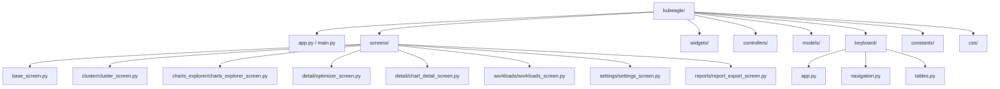
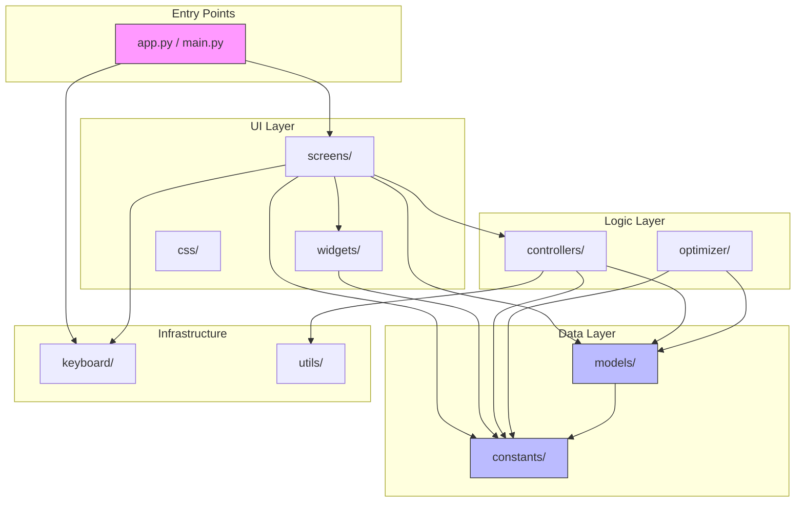
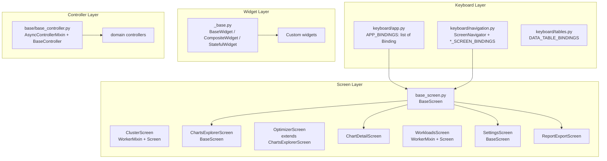
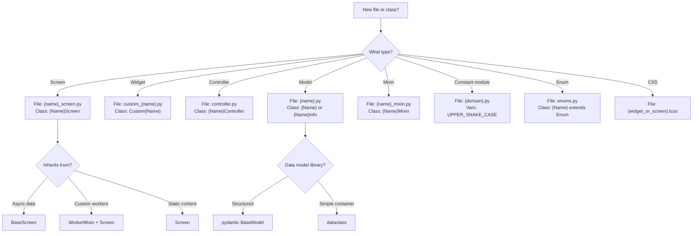
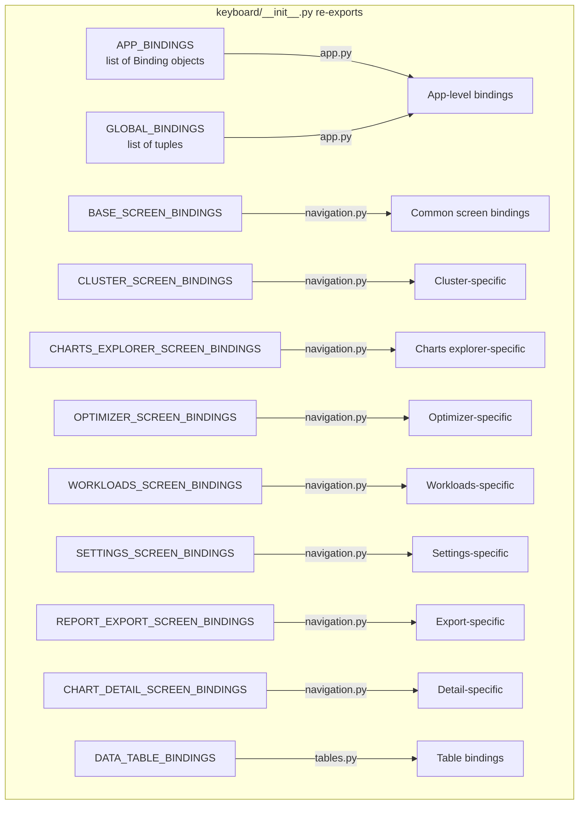

# Code Conventions

Documentation for coding standards and naming conventions used in the KubEagle TUI application.

## Module Organization



## Module Dependency Graph

Import rules flow **downward** only; circular imports are avoided via lazy imports and `TYPE_CHECKING` blocks.



**Import rules:**
- `constants/` and `models/` may NOT import from `screens/`, `widgets/`, or `controllers/`
- `widgets/` may NOT import from `screens/` or `controllers/`
- `controllers/` may NOT import from `screens/` or `widgets/`
- `screens/` may import from any layer (but use lazy imports for cross-screen references)
- `keyboard/navigation.py` uses lazy imports inside methods for screen classes

## Code Organization Flow



## File Organization

### Module Structure

```
kubeagle/
├── app.py                # Main App class (EKSHelmReporterApp)
├── main.py               # CLI entry point
├── __init__.py           # Package exports
│
├── screens/              # Screen modules
│   ├── __init__.py       # Re-exports screens
│   ├── base_screen.py    # Base class (Screen + ScreenNavigator)
│   ├── mixins/           # Screen mixins
│   │   ├── __init__.py
│   │   ├── worker_mixin.py             # WorkerMixin, DataLoadMixin, LoadingOverlay
│   │   ├── tabbed_view_mixin.py        # TabbedViewMixin, FilterableTableMixin
│   │   ├── screen_data_loader.py       # ScreenDataLoader, DataLoaderMixin
│   │   └── main_navigation_tabs_mixin.py  # MainNavigationTabsMixin
│   └── {module}/         # Feature modules
│       ├── __init__.py
│       ├── {name}_screen.py
│       ├── config.py
│       ├── presenter.py
│       └── components/   # Optional
│
├── widgets/              # Widget modules
│   ├── __init__.py       # Re-exports all widgets
│   ├── _base.py          # Base classes (BaseWidget, CompositeWidget, StatefulWidget)
│   ├── _config.py        # WidgetConfig, WidgetRegistry
│   └── {category}/       # Widget categories
│       ├── __init__.py
│       └── custom_{name}.py
│
├── controllers/          # Controllers
│   ├── __init__.py
│   ├── base/
│   │   └── base_controller.py  # AsyncControllerMixin, BaseController, WorkerResult
│   └── {domain}/
│       ├── fetchers/
│       ├── parsers/
│       └── mappers/
│
├── models/               # Data models (Pydantic BaseModel)
│   ├── __init__.py
│   ├── analysis/         # ViolationResult, Recommendation
│   ├── cache/            # DataCache
│   ├── charts/           # ChartInfo, HelmReleaseInfo, ActiveCharts
│   ├── core/             # NodeInfo, NodeResourceInfo, WorkloadInfo
│   ├── events/           # EventInfo, EventSummary
│   ├── optimization/     # OptimizationViolation, OptimizationRule
│   ├── pdb/              # PdbInfo, BlockingPdb
│   ├── reports/          # ReportData
│   ├── state/            # AppSettings, AppState, ConfigManager
│   ├── teams/            # TeamInfo, TeamStatistics, Distribution
│   └── types/            # LoadingProgress, LoadResult, ColumnDef
│
├── keyboard/             # Keybindings
│   ├── __init__.py       # Re-exports all bindings
│   ├── app.py            # APP_BINDINGS (Binding objects), GLOBAL_BINDINGS, etc.
│   ├── navigation.py     # ScreenNavigator + *_SCREEN_BINDINGS + navigate_* funcs
│   └── tables.py         # DATA_TABLE_BINDINGS
│
├── constants/            # Constants
│   ├── __init__.py       # Re-exports from all sub-modules
│   ├── enums.py          # All Enum classes
│   ├── values.py         # Scalar constants (strings, numbers)
│   ├── timeouts.py       # Timeout values
│   ├── limits.py         # Limit and threshold values
│   ├── defaults.py       # Default values for settings
│   ├── tables.py         # Table column configurations, ColumnWidth
│   ├── ui.py             # UI-specific constants
│   ├── optimizer.py      # Optimizer constants
│   ├── patterns.py       # Regex patterns
│   └── screens/          # Screen-specific constants
│       ├── __init__.py
│       ├── cluster.py
│       ├── charts_explorer.py
│       ├── detail.py
│       ├── settings.py
│       ├── common.py
│       └── teams.py
│
├── optimizer/            # Optimizer module (12 modules)
│   ├── __init__.py
│   ├── analyzer.py           # ChartAnalyzer
│   ├── fixer.py              # FixGenerator
│   ├── rules.py              # Optimization rules
│   ├── fix_verifier.py       # FixVerificationResult, FullFixBundleVerificationResult
│   ├── full_ai_fixer.py      # AIFullFixStagedArtifact, AIFullFixResult
│   ├── llm_cli_runner.py     # LLMProvider, LLMCLIResult, LLMStructuredPatchResult, LLMDirectEditResult
│   ├── llm_patch_protocol.py # StructuredPatchFile, StructuredPatchResponse, FullFixTemplatePatch, etc.
│   ├── helm_renderer.py      # HelmRenderResult
│   ├── template_patch_suggester.py
│   ├── rendered_rule_input.py
│   ├── full_fix_applier.py   # FullFixApplyResult, _Hunk
│   └── wiring_diagnoser.py
│
├── utils/                # Utilities
│   ├── resource_parser.py    # Resource string parsing
│   ├── concurrent.py         # BatchResult, RateLimiter
│   ├── cache_manager.py      # CacheEntry, CacheStats, CacheManager
│   ├── report_generator.py   # TUIReportGenerator
│   └── cluster_summary.py    # Cluster summary helpers
│
└── css/                  # Stylesheets
    ├── app.tcss
    ├── screens/
    └── widgets/
```

## Naming Conventions

### Naming Convention Decision Tree



### Files

| Type | Pattern | Example |
|------|---------|---------|
| Screen | `{name}_screen.py` | `cluster_screen.py`, `charts_explorer_screen.py` |
| Widget | `custom_{name}.py` | `custom_data_table.py`, `custom_static.py` |
| Controller | `controller.py` or `{name}_controller.py` | `controller.py` |
| Model | `{name}.py` | `chart_info.py`, `node_info.py` |
| CSS | `{widget/screen_name}.tcss` | `custom_footer.tcss` |
| Mixin | `{name}_mixin.py` | `worker_mixin.py`, `tabbed_view_mixin.py` |
| Presenter | `presenter.py` | Per screen module |
| Config | `config.py` | Per screen module |

### Classes

| Type | Pattern | Example |
|------|---------|---------|
| Screen | `{Name}Screen` | `ClusterScreen`, `ChartsExplorerScreen`, `OptimizerScreen` |
| Widget | `Custom{Name}` | `CustomDataTable`, `CustomStatic`, `CustomSelect` |
| Base Widget | `{Name}Widget` | `BaseWidget`, `CompositeWidget`, `StatefulWidget` |
| Controller | `{Name}Controller` | `ChartsController` |
| Model (Pydantic) | `{Name}` or `{Name}Info` | `ChartInfo`, `NodeInfo`, `NodeResourceInfo` |
| Mixin | `{Name}Mixin` | `WorkerMixin`, `TabbedViewMixin`, `FilterableTableMixin` |
| Message | `{Action}` (inside class) | `RowSelected`, `DataLoaded`, `DataLoadFailed` |

### Variables and Functions

```python
# Variables: snake_case
chart_info = ChartInfo(...)
is_loading = True
search_query = ""

# Functions: snake_case
def load_data() -> None:
    pass

def get_chart_by_name(name: str) -> ChartInfo:
    pass

# Private: prefix with underscore
def _parse_yaml(path: Path) -> dict:
    pass

_internal_state = {}

# Constants: UPPER_SNAKE_CASE
MAX_RETRIES = 3
DEFAULT_TIMEOUT = 30
```

### Constants

Constants use `Final` type annotations without explicit type parameters:

```python
# In constants/values.py
from typing import Final

APP_TITLE: Final = "KubEagle"
TABLE_PAGE_SIZE: Final = 50
COLOR_PRIMARY: Final = "#007ACC"

# In constants/timeouts.py
DEFAULT_TIMEOUT: Final = 30.0
CLUSTER_REQUEST_TIMEOUT: Final = "30s"  # String for kubectl flag
CLUSTER_CHECK_TIMEOUT: Final = 12.0

# In constants/limits.py
MAX_ROWS_DISPLAY: Final = 1000
MIN_PAGE_SIZE: Final = 10
MAX_WORKERS: Final = 8

# In constants/defaults.py - naming pattern: {SETTING}_DEFAULT
CHARTS_PATH_DEFAULT: Final = ""
THEME_DEFAULT: Final = "dark"
REFRESH_INTERVAL_DEFAULT: Final = 30
EVENT_AGE_HOURS_DEFAULT: Final = 1.0
HIGH_CPU_THRESHOLD_DEFAULT: Final = 80
```

### Enums

All enums are defined in `constants/enums.py` using `Enum` or `auto()`.

**Complete enum class inventory (18 classes):**

| Enum Class | Category | Values |
|-----------|----------|--------|
| `NodeStatus` | Status | READY, NOT_READY, UNKNOWN |
| `QoSClass` | Status | GUARANTEED, BURSTABLE, BEST_EFFORT |
| `Severity` | Status | ERROR, WARNING, INFO |
| `AppState` | App State | IDLE, LOADING, ERROR, STALE |
| `LoadingState` | App State | IDLE, LOADING, ERROR, STALE |
| `FetchState` | Fetch | LOADING, SUCCESS, ERROR |
| `FetchSources` | Fetch | NODES, EVENTS, POD_DISRUPTION_BUDGETS, ... |
| `TabState` | UI State | IDLE, LOADING, LOADED, ERROR |
| `ThemeMode` | Theme | DARK, LIGHT |
| `SortDirection` | Sort/Filter | ASC, DESC |
| `FilterOperator` | Sort/Filter | EQUALS, NOT_EQUALS, CONTAINS, STARTS_WITH, ENDS_WITH |
| `DataRefreshMode` | Sort/Filter | MANUAL, AUTO, INTERVAL |
| `NavigationMode` | Sort/Filter | TREE, LIST, GRID |
| `SortField` | Sort/Filter | NAME, VERSION, TEAM, STATUS, CREATED |
| `ViewFilter` | Charts | ALL, EXTREME_RATIOS, SINGLE_REPLICA, NO_PDB, WITH_VIOLATIONS |
| `GroupBy` | Charts | NONE, BY_TEAM, BY_QOS, BY_VALUES_FILE |
| `SortBy` | Charts | CHART, TEAM, QOS, CPU_REQUEST, CPU_LIMIT, CPU_RATIO, ... |
| `WidgetCategory` | Widgets | DATA_DISPLAY, FEEDBACK, FILTER, DIALOG, NAVIGATION, LAYOUT |

```python
from enum import Enum, auto

class NodeStatus(Enum):
    """Node status values from Kubernetes API."""
    READY = "Ready"
    NOT_READY = "NotReady"
    UNKNOWN = "Unknown"

class TabState(Enum):
    """Tab state values for lazy loading tabs."""
    IDLE = auto()
    LOADING = auto()
    LOADED = auto()
    ERROR = auto()

class SortBy(Enum):
    """Sort modes for Charts Explorer table."""
    CHART = "chart"
    TEAM = "team"
    QOS = "qos"
    CPU_REQUEST = "cpu_request"
    # ...

# Lowercase aliases for backward compatibility
node_status = NodeStatus
```

### Keybindings



**Two binding formats coexist:**

1. **`APP_BINDINGS`** (in `keyboard/app.py`) uses Textual `Binding` objects:

```python
from textual.binding import Binding

APP_BINDINGS: list[Binding] = [
    Binding("escape", "back", "Back", priority=True),
    Binding("h", "nav_home", "Summary"),
    Binding("q", "app.quit", "Quit", priority=True),
]

# Tuple-based groups derived from APP_BINDINGS for compatibility:
GLOBAL_BINDINGS: list[tuple[str, str, str]] = [
    (binding.key, binding.action, binding.description) for binding in APP_BINDINGS
]
```

2. **Screen-specific bindings** (in `keyboard/navigation.py`) use annotated tuples:

```python
from typing import Annotated

# Type: list[Annotated[tuple[str, str, str], "key, action, description"]]
BASE_SCREEN_BINDINGS = [
    ("escape", "pop_screen", "Back"),
    ("r", "refresh", "Refresh"),
    ("h", "nav_home", "Summary"),
    ("c", "nav_cluster", "Cluster"),
    ("C", "nav_charts", "Charts"),
    ("e", "nav_export", "Export"),
    ("ctrl+s", "nav_settings", "Settings"),
    ("?", "show_help", "Help"),
]

# Naming pattern: {SCREEN_NAME}_SCREEN_BINDINGS
CLUSTER_SCREEN_BINDINGS = [...]
CHARTS_EXPLORER_SCREEN_BINDINGS = [...]
WORKLOADS_SCREEN_BINDINGS = [...]
OPTIMIZER_SCREEN_BINDINGS = [...]
SETTINGS_SCREEN_BINDINGS = [...]
REPORT_EXPORT_SCREEN_BINDINGS = [...]
CHART_DETAIL_SCREEN_BINDINGS = [...]
```

All screen binding lists are available from the `keyboard` package:

```python
from kubeagle.keyboard import CLUSTER_SCREEN_BINDINGS
from kubeagle.keyboard import CHARTS_EXPLORER_SCREEN_BINDINGS
```

## Type Annotations

### Basic Types

```python
# Use built-in types (Python 3.10+)
def process_charts(charts: list[ChartInfo]) -> dict[str, int]:
    pass

# Optional with union syntax
def get_chart(name: str) -> ChartInfo | None:
    pass

# Callable types
from collections.abc import Callable, Awaitable

def run_with_callback(callback: Callable[[str], None]) -> None:
    pass

async def fetch_async() -> Awaitable[list[dict]]:
    pass
```

### Reactive Attributes

```python
from textual.reactive import reactive

class MyWidget(Widget):
    # Type hint inside reactive[]
    is_loading = reactive(False)
    data = reactive[list[dict]]([])
    error = reactive[str | None](None)
    count = reactive[int](0)
```

### Generic Types

```python
from typing import TypeVar, Generic

T = TypeVar("T")

class Container(Generic[T]):
    def __init__(self, item: T) -> None:
        self.item = item

    def get(self) -> T:
        return self.item
```

## Import Conventions

### Import Order

```python
# 1. Standard library
from __future__ import annotations

import asyncio
import json
from abc import ABC, abstractmethod
from collections.abc import Callable
from dataclasses import dataclass
from pathlib import Path
from typing import TYPE_CHECKING, Any, ClassVar

# 2. Third-party libraries
import yaml
from pydantic import BaseModel
from textual.app import App, ComposeResult
from textual.reactive import reactive
from textual.screen import Screen
from textual.widgets import DataTable, Static

# 3. Local imports
from kubeagle.constants import APP_TITLE
from kubeagle.controllers import ChartsController
from kubeagle.models.charts.chart_info import ChartInfo
from kubeagle.widgets import CustomDataTable
```

### TYPE_CHECKING Imports

```python
from typing import TYPE_CHECKING

if TYPE_CHECKING:
    from textual.app import App
    from kubeagle.models.charts.chart_info import ChartInfo

class MyWidget(Widget):
    def __init__(self, app: "App") -> None:
        self.app = app
```

### Lazy Imports (Anti-Circular)

Screen navigation uses lazy imports inside methods to avoid circular dependencies:

```python
# Lazy import inside method to avoid circular dependencies
class ScreenNavigator:
    def _navigate_charts(self, testing: bool = False) -> None:
        # Import here, not at module level
        from kubeagle.screens.charts_explorer import ChartsExplorerScreen
        self.app.push_screen(ChartsExplorerScreen(testing=testing))

    def _navigate_export(self) -> None:
        from kubeagle.screens.reports import ReportExportScreen
        self.app.push_screen(ReportExportScreen())
```

## Docstrings

### Module Docstrings

```python
"""Screen module for cluster health monitoring.

This module provides the ClusterScreen class for displaying
cluster health information including nodes, events, and PDBs.
"""
```

### Class Docstrings

```python
class ClusterController(BaseController):
    """Controller for EKS cluster data.

    Provides methods for fetching and analyzing cluster data
    including nodes, events, PDBs, and workloads.

    Attributes:
        context: Kubernetes context name
        app: Textual app reference

    Example:
        >>> controller = ClusterController(context="production")
        >>> nodes = await controller.fetch_nodes()
        >>> print(f"Found {len(nodes)} nodes")
    """
```

### Method Docstrings

```python
async def fetch_nodes(self) -> list[NodeInfo]:
    """Fetch node information from the cluster.

    Retrieves all nodes from the cluster and parses their
    status, resources, and conditions.

    Returns:
        List of NodeInfo objects representing cluster nodes.

    Raises:
        ClusterError: If kubectl command fails.
        TimeoutError: If request times out.

    Example:
        >>> nodes = await controller.fetch_nodes()
        >>> ready_nodes = [n for n in nodes if n.is_ready]
    """
```

## Error Handling

### Exception Types

```python
# Custom exceptions in exceptions.py
class TUIError(Exception):
    """Base exception for TUI errors."""
    pass

class ClusterError(TUIError):
    """Error communicating with cluster."""
    pass

class ChartParseError(TUIError):
    """Error parsing chart configuration."""
    pass
```

### Error Handling Pattern

```python
@work(exclusive=True)
async def _load_data(self) -> None:
    """Load data with proper error handling."""
    self.is_loading = True
    self.error = None

    try:
        data = await self._fetch()
        self.data = data

    except ClusterError as e:
        self.error = f"Cluster error: {e}"
        self.app.notify(str(e), severity="error")

    except TimeoutError:
        self.error = "Request timed out"
        self.app.notify("Request timed out", severity="warning")

    except Exception as e:
        self.error = f"Unexpected error: {e}"
        logger.exception(f"Unexpected error: {e}")

    finally:
        self.is_loading = False
```

## Logging

```python
import logging

logger = logging.getLogger(__name__)

class ChartsController:
    async def analyze_chart(self, path: Path) -> ChartInfo | None:
        logger.debug(f"Analyzing chart at {path}")

        try:
            chart = self._parse_chart(path)
            logger.info(f"Successfully analyzed chart: {chart.name}")
            return chart

        except Exception as e:
            logger.error(f"Failed to analyze chart at {path}: {e}")
            return None
```

## Class Patterns

### Model Pattern (Pydantic)

All data models use Pydantic `BaseModel` for automatic validation, serialization, and type safety:

```python
from pydantic import BaseModel
from kubeagle.constants.enums import NodeStatus

class NodeInfo(BaseModel):
    """Basic node information."""
    name: str
    status: NodeStatus
    node_group: str
    instance_type: str
    availability_zone: str
    cpu_allocatable: float
    memory_allocatable: float
    cpu_requests: float
    memory_requests: float
    pod_count: int
    pod_capacity: int
    # Optional fields with defaults
    kubelet_version: str = ""
    conditions: dict[str, str] = {}
    taints: list[dict[str, str]] = []
```

### Screen Pattern

```python
class ChartsExplorerScreen(BaseScreen):
    """Screen with standard patterns."""

    BINDINGS = CHARTS_EXPLORER_SCREEN_BINDINGS

    @property
    def screen_title(self) -> str:
        return "Charts Explorer"

    def compose(self) -> ComposeResult:
        """Compose screen layout."""
        yield CustomHeader()
        yield Container(id="base-content")
        yield CustomFooter()

    async def load_data(self) -> None:
        """Load data (called by BaseScreen.on_mount via call_later)."""
        try:
            self.show_loading_overlay("Loading charts data...")
            data = await self._fetch()
            self.hide_loading_overlay()
            self._populate_table(data)
        except Exception as e:
            self.show_error_state(str(e))
```

### Widget Pattern

```python
class CustomWidget(StatefulWidget):
    """Widget with standard patterns."""

    # Reactive state (inherited from StatefulWidget)
    is_loading = reactive(False)
    data = reactive[list[dict]]([])
    error = reactive[str | None](None)

    def __init__(self, *, id: str | None = None, **kwargs) -> None:
        super().__init__(id=id, **kwargs)

    def compose(self) -> ComposeResult:
        """Compose widget layout."""
        yield Static(id="content")

    def watch_data(self, data: list[dict]) -> None:
        """Update on data change."""
        self._render(data)

    def update_data(self, data: list[dict]) -> None:
        """Public method to update data."""
        self.data = data
```

### Controller Pattern

Controllers use `AsyncControllerMixin` for semaphore-based concurrency control (default: 8 concurrent operations).
`BaseController` extends `AsyncControllerMixin` and `ABC` to enforce `check_connection()` and `fetch_all()`:

```python
class MyController(AsyncControllerMixin):
    """Controller with standard patterns."""

    def __init__(self, config: Config, app: Any | None = None) -> None:
        super().__init__()
        self.config = config
        self.app = app

    async def check_connection(self) -> bool:
        """Check data source availability."""
        return self.config.path.exists()

    async def fetch_all(self) -> dict[str, Any]:
        """Fetch all data."""
        items = await self._fetch_items()
        stats = self._calculate_stats(items)
        return {"items": items, "stats": stats}

    async def _fetch_items(self) -> list[Item]:
        """Fetch items from source."""
        async with self.bounded_operation():
            return await self._do_fetch()
```

### Presenter Pattern

Each screen module includes a `presenter.py` that transforms raw controller data into
view-ready structures for the screen. Presenters are pure data transformers with no
Textual or widget dependencies.

```python
# screens/{module}/presenter.py
class ChartsExplorerPresenter:
    """Transforms chart data for the ChartsExplorerScreen."""

    @staticmethod
    def format_chart_rows(charts: list[ChartInfo]) -> list[list[str]]:
        """Convert ChartInfo list into table row data."""
        return [
            [chart.name, chart.team, chart.qos_class.value, ...]
            for chart in charts
        ]

    @staticmethod
    def compute_summary_kpis(charts: list[ChartInfo]) -> dict[str, str]:
        """Compute KPI values from chart data."""
        return {
            "total": str(len(charts)),
            "violations": str(sum(1 for c in charts if c.violations)),
            ...
        }
```

**Current presenters:**

| Module | Presenter | Screen |
|--------|-----------|--------|
| `charts_explorer/` | `ChartsExplorerPresenter` | ChartsExplorerScreen |
| `cluster/` | `ClusterPresenter` | ClusterScreen |
| `detail/` | `DetailPresenter` | ChartDetailScreen |
| `reports/` | `ReportExportPresenter` | ReportExportScreen |
| `settings/` | `SettingsPresenter` | SettingsScreen |
| `workloads/` | `WorkloadsPresenter` | WorkloadsScreen |

**Presenter conventions:**
- File is always named `presenter.py` inside the screen module directory
- Class is named `{ScreenName}Presenter` (without the "Screen" suffix)
- Methods are `@staticmethod` when they don't need instance state
- Input types are model classes; output types are primitives (strings, lists, dicts)
- No widget or Textual imports allowed

The `run_with_worker()` method wraps awaitables with timeout and returns `WorkerResult`:

```python
result = await controller.run_with_worker(
    controller.fetch_all(), timeout=30.0
)
if result.success:
    data = result.data
else:
    error = result.error
```

## CSS Conventions

### Variable Naming

```css
/* Colors: $color-{purpose} */
$color-primary: #4a9eff;
$color-success: #28a745;

/* Spacing: $spacing-{size} */
$spacing-sm: 8px;
$spacing-md: 16px;

/* Typography: $font-{property} */
$font-size-md: 14px;
$font-family: "JetBrains Mono";
```

### Selector Naming

```css
/* Screen-scoped styles */
ClusterScreen #nodes-table {
    height: 1fr;
}

ChartsExplorerScreen #charts-table {
    height: 1fr;
}

/* Widget-scoped styles */
CustomCard .card-title {
    text-style: bold;
}

/* State classes */
.is-loading {
    opacity: 0.5;
}

.is-error {
    color: $error;
}

/* BEM-like for complex widgets */
.data-table__header {
    text-style: bold;
}

.data-table__row--selected {
    background: $accent;
}
```

## Cross-References

- [CSS Guide](../styling/css-guide.md) - Styling conventions
- [Keyboard Bindings](../keyboard/keybindings.md) - Keybinding naming
- [Testing Guide](../testing/testing-guide.md) - Test conventions
