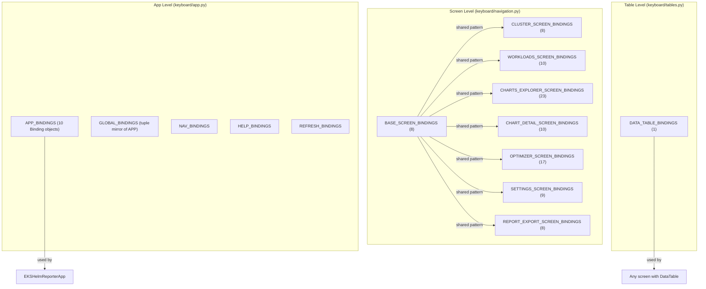
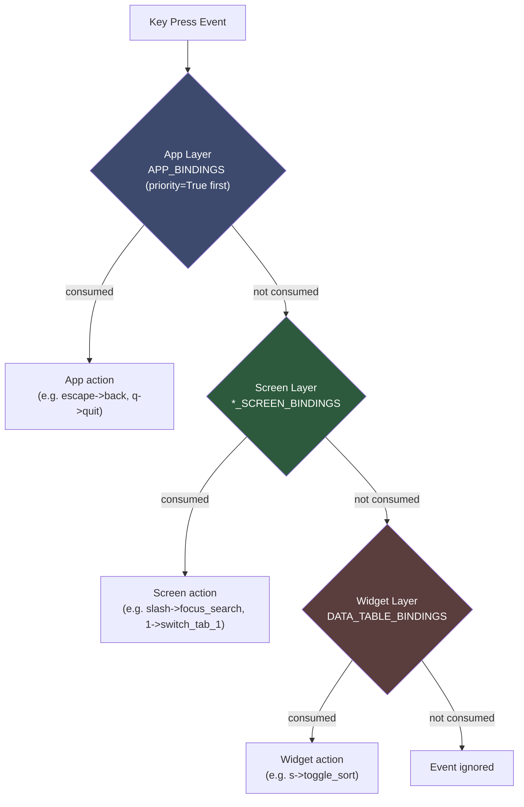
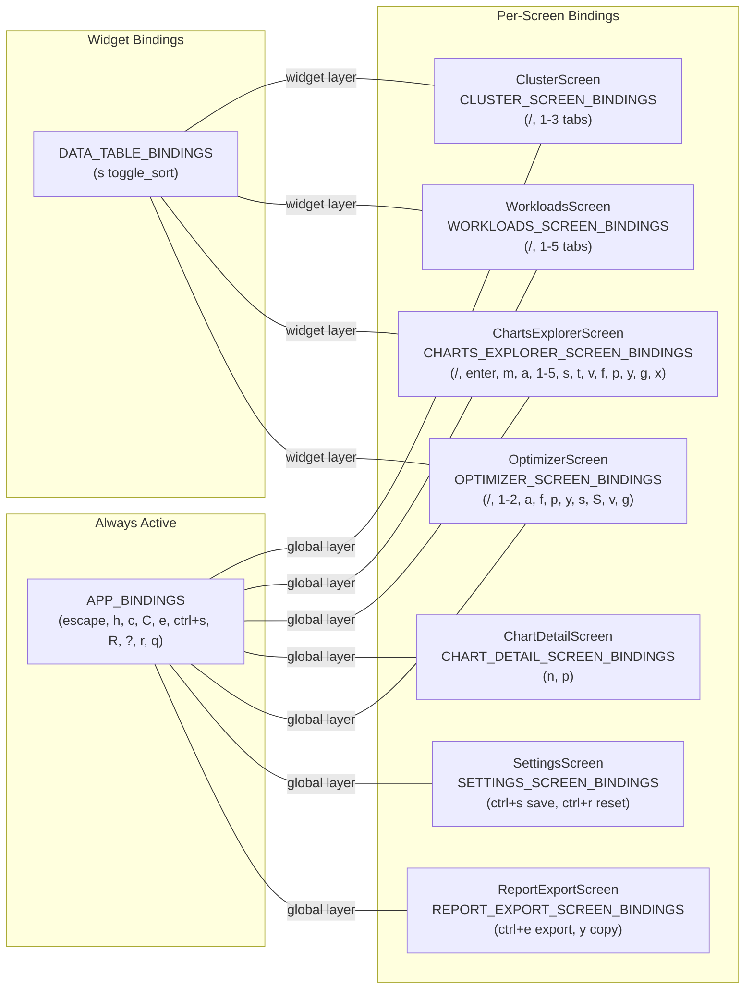

# Keyboard Bindings

Complete documentation for the keyboard binding system.

## Binding Scope Hierarchy



## Keybinding Resolution Chain

The following diagram shows how key events are resolved at runtime. Textual dispatches
key events top-down through the focus chain. Higher-priority layers consume events before
lower layers see them.



**Resolution rules:**
1. `priority=True` bindings (escape, q) in `APP_BINDINGS` are checked first regardless of focus.
2. The focused screen's `BINDINGS` list is checked next.
3. The focused widget's `BINDINGS` list (e.g. `DATA_TABLE_BINDINGS`) is checked last.
4. If no binding matches, the event is ignored.

## Binding Activation Map

The following diagram shows which binding sets are active on each screen. Every screen
receives its own dedicated `*_SCREEN_BINDINGS` list while the app-level `APP_BINDINGS`
are always active globally.



## Keyboard Architecture

Keybindings are organized in the `keyboard/` package:

```
keyboard/
├── __init__.py       # Re-exports all bindings (14 symbols)
├── app.py            # App-level bindings (GLOBAL, NAV, HELP, REFRESH, APP)
├── navigation.py     # Screen-specific bindings (8 *_SCREEN_BINDINGS lists)
│                     # Also contains ScreenNavigator class and navigate_* functions
└── tables.py         # DataTable bindings (DATA_TABLE_BINDINGS)
```

## Binding Categories

### App-Level Bindings (`keyboard/app.py`)

#### APP_BINDINGS

Textual `Binding` objects used directly by `EKSHelmReporterApp.BINDINGS`:

```python
APP_BINDINGS: list[Binding] = [
    Binding("escape", "back", "Back", priority=True),
    Binding("h", "nav_home", "Summary"),
    Binding("c", "nav_cluster", "Cluster"),
    Binding("C", "nav_charts", "Charts"),
    Binding("e", "nav_export", "Export"),
    Binding("ctrl+s", "nav_settings", "Settings"),
    Binding("R", "nav_recommendations", "Viol+Recs"),
    Binding("?", "show_help", "Help"),
    Binding("r", "refresh", "Refresh"),
    Binding("q", "app.quit", "Quit", priority=True),
]
```

#### GLOBAL_BINDINGS

Tuple mirror of `APP_BINDINGS`, auto-derived for tooling and docs compatibility:

```python
GLOBAL_BINDINGS: list[tuple[str, str, str]] = [
    (binding.key, binding.action, binding.description) for binding in APP_BINDINGS
]
```

#### NAV_BINDINGS

Single-entry list for back navigation:

```python
NAV_BINDINGS: list[tuple[str, str, str]] = [("escape", "back", "Back")]
```

#### HELP_BINDINGS

Help dialog trigger:

```python
HELP_BINDINGS: list[tuple[str, str, str]] = [("?", "show_help", "Help")]
```

#### REFRESH_BINDINGS

Data refresh trigger:

```python
REFRESH_BINDINGS: list[tuple[str, str, str]] = [("r", "refresh", "Refresh")]
```

### Screen-Specific Bindings (`keyboard/navigation.py`)

Each screen has its own binding set. All use the tuple format `(key, action, description)`.

#### BASE_SCREEN_BINDINGS (8 entries)

Shared pattern inherited by all screens:

```python
BASE_SCREEN_BINDINGS = [
    ("escape", "pop_screen", "Back"),
    ("r", "refresh", "Refresh"),
    ("h", "nav_home", "Summary"),
    ("c", "nav_cluster", "Cluster"),
    ("C", "nav_charts", "Charts"),
    ("e", "nav_export", "Export"),
    ("ctrl+s", "nav_settings", "Settings"),
    ("?", "show_help", "Help"),
]
```

#### CLUSTER_SCREEN_BINDINGS (8 entries)

Cluster overview with tab switching (1-3 for Nodes, Workloads, Events):

```python
CLUSTER_SCREEN_BINDINGS = [
    ("escape", "pop_screen", "Back"),
    ("r", "refresh", "Refresh"),
    ("slash", "focus_search", "Search"),
    ("1", "switch_tab_1", "Nodes"),
    ("2", "switch_tab_2", "Workloads"),
    ("3", "switch_tab_3", "Events"),
    ("?", "show_help", "Help"),
    ("h", "nav_home", "Summary"),
]
```

#### WORKLOADS_SCREEN_BINDINGS (10 entries)

Workloads screen with tab switching (1-5):

```python
WORKLOADS_SCREEN_BINDINGS = [
    ("escape", "pop_screen", "Back"),
    ("r", "refresh", "Refresh"),
    ("slash", "focus_search", "Search"),
    ("1", "switch_tab_1", "All"),
    ("2", "switch_tab_2", "Extreme"),
    ("3", "switch_tab_3", "Single Replica"),
    ("4", "switch_tab_4", "Missing PDB"),
    ("5", "switch_tab_5", "Node Analysis"),
    ("?", "show_help", "Help"),
    ("h", "nav_home", "Summary"),
]
```

#### CHARTS_EXPLORER_SCREEN_BINDINGS (23 entries)

The most comprehensive binding set -- covers view switching, sorting, team cycling, fix operations, and cross-navigation:

```python
CHARTS_EXPLORER_SCREEN_BINDINGS = [
    ("escape", "pop_screen", "Back"),
    ("r", "refresh", "Refresh"),
    ("slash", "focus_search", "Search"),
    ("enter", "select_chart", "Preview Chart"),
    ("m", "toggle_mode", "Toggle Mode"),
    ("a", "toggle_active_filter", "Active Only"),
    ("1", "view_all", "All Charts"),
    ("2", "view_extreme", "Extreme Ratios"),
    ("3", "view_single_replica", "Single Replica"),
    ("4", "view_no_pdb", "Missing PDB"),
    ("5", "view_violations", "Violations"),
    ("s", "toggle_sort_direction", "Sort"),
    ("t", "cycle_team", "Team"),
    ("v", "view_team_violations", "Team Violations"),
    ("f", "fix_violation", "Fix Chart"),
    ("p", "preview_fix", "Preview"),
    ("y", "copy_yaml", "Copy YAML"),
    ("g", "go_to_chart", "Go to Chart"),
    ("x", "export_team_report", "Export Report"),
    ("h", "nav_home", "Summary"),
    ("c", "nav_cluster", "Cluster"),
    ("e", "nav_export", "Export"),
    ("ctrl+s", "nav_settings", "Settings"),
    ("?", "show_help", "Help"),
]
```

#### CHART_DETAIL_SCREEN_BINDINGS (10 entries)

Chart detail view with next/prev navigation:

```python
CHART_DETAIL_SCREEN_BINDINGS = [
    ("escape", "pop_screen", "Back"),
    ("r", "refresh", "Refresh"),
    ("n", "next_chart", "Next"),
    ("p", "prev_chart", "Prev"),
    ("h", "nav_home", "Summary"),
    ("c", "nav_cluster", "Cluster"),
    ("C", "nav_charts", "Charts"),
    ("e", "nav_export", "Export"),
    ("ctrl+s", "nav_settings", "Settings"),
    ("?", "show_help", "Help"),
]
```

#### OPTIMIZER_SCREEN_BINDINGS (17 entries)

Optimizer with violations/recommendations views, fix operations, and sorting:

```python
OPTIMIZER_SCREEN_BINDINGS = [
    ("escape", "pop_screen", "Back"),
    ("r", "refresh", "Refresh"),
    ("h", "nav_home", "Summary"),
    ("?", "show_help", "Help"),
    ("slash", "focus_search", "Search"),
    # View switching
    ("1", "view_violations", "Violations"),
    ("2", "view_recommendations", "Recs"),
    # Violations-specific
    ("a", "apply_all", "Apply All"),
    ("f", "fix_violation", "Fix"),
    ("p", "preview_fix", "Preview"),
    ("y", "copy_yaml", "Copy YAML"),
    # Recommendations-specific
    ("s", "focus_sort", "Sort"),
    ("S", "focus_sort", "Sort"),
    ("v", "cycle_severity", "Severity"),
    ("g", "go_to_chart", "Go to Chart"),
    # Cross-navigation
    ("C", "nav_charts", "Charts"),
    ("e", "nav_export", "Export"),
    ("ctrl+s", "nav_settings", "Settings"),
]
```

#### SETTINGS_SCREEN_BINDINGS (9 entries)

Settings screen with save and reset:

```python
SETTINGS_SCREEN_BINDINGS = [
    ("escape", "pop_screen", "Back"),
    ("ctrl+s", "save_settings", "Save"),
    ("ctrl+r", "reset_defaults", "Reset Defaults"),
    ("?", "show_help", "Help"),
    ("h", "nav_home", "Summary"),
    ("c", "nav_cluster", "Cluster"),
    ("C", "nav_charts", "Charts"),
    ("e", "nav_export", "Export"),
    ("r", "refresh", "Refresh"),
]
```

#### REPORT_EXPORT_SCREEN_BINDINGS (8 entries)

Report export with export and copy:

```python
REPORT_EXPORT_SCREEN_BINDINGS = [
    ("escape", "pop_screen", "Back"),
    ("r", "refresh", "Refresh"),
    ("ctrl+e", "export_report", "Export Report"),
    ("y", "copy_clipboard", "Copy (Yank)"),
    ("?", "show_help", "Help"),
    ("h", "nav_home", "Summary"),
    ("c", "nav_cluster", "Cluster"),
    ("C", "nav_charts", "Charts"),
]
```

### DataTable Bindings (`keyboard/tables.py`)

```python
DATA_TABLE_BINDINGS = [
    ("s", "toggle_sort", "Sort"),
]
```

## Binding Format

All screen bindings follow the annotated tuple format:

```python
Annotated[tuple[str, str, str], "key, action, description"]
```

| Element | Description | Example |
|---------|-------------|---------|
| `key` | Key or key combination | `"r"`, `"ctrl+s"`, `"escape"`, `"slash"` |
| `action` | Action method name | `"refresh"`, `"nav_home"` |
| `description` | Footer display text | `"Refresh"`, `"Summary"` |

App-level bindings (`APP_BINDINGS`) use Textual `Binding` objects with an additional `priority` flag.

## Using Bindings

### In Screens

```python
from kubeagle.keyboard import CLUSTER_SCREEN_BINDINGS

class ClusterScreen(BaseScreen, TabbedViewMixin):
    BINDINGS = CLUSTER_SCREEN_BINDINGS

    def action_refresh(self) -> None:
        """Handle 'r' key press."""
        self.start_worker(self._load_data)

    def action_focus_search(self) -> None:
        """Handle '/' key press."""
        self.query_one("#search-input", Input).focus()

    def action_switch_tab_1(self) -> None:
        """Handle '1' key press."""
        self.switch_tab("tab-overview")
```

### In App

```python
from kubeagle.keyboard import APP_BINDINGS

class EKSHelmReporterApp(App):
    BINDINGS = APP_BINDINGS

    def action_nav_cluster(self) -> None:
        """Navigate to cluster screen."""
        from kubeagle.screens.cluster import ClusterScreen
        self.push_screen(ClusterScreen())

    def action_back(self) -> None:
        """Go back to previous screen."""
        if len(self.screen_stack) > 1:
            self.pop_screen()
```

### Custom Bindings

Adding custom bindings to a screen:

```python
class MyScreen(BaseScreen):
    BINDINGS = [
        *BASE_SCREEN_BINDINGS,  # Include base bindings
        ("x", "custom_action", "Custom"),  # Add custom
    ]

    def action_custom_action(self) -> None:
        """Handle custom key."""
        pass
```

## Key Reference

### Navigation Keys

| Key | Action | Description |
|-----|--------|-------------|
| `h` | nav_home | Go to Summary |
| `c` | nav_cluster | Go to Cluster |
| `C` | nav_charts | Go to Charts Explorer |
| `e` | nav_export | Go to Export |
| `Ctrl+s` | nav_settings | Go to Settings |
| `R` | nav_recommendations | Go to Violations + Recommendations |
| `Escape` | pop_screen / back | Go back |

### Common Actions

| Key | Action | Description |
|-----|--------|-------------|
| `r` | refresh | Refresh data |
| `/` (slash) | focus_search | Focus search input |
| `?` | show_help | Show help |
| `q` | app.quit | Quit application |
| `Enter` | select_chart | Select / preview item |

### Tab / View Navigation

| Key | Action | Context |
|-----|--------|---------|
| `1`-`3` | switch_tab_N | Cluster (Nodes, Workloads, Events) |
| `1`-`5` | switch_tab_N | Workloads (All, Extreme, Single Replica, Missing PDB, Node Analysis) |
| `1`-`5` | view_* | Charts Explorer (All, Extreme, Single Replica, No PDB, Violations) |
| `1`-`2` | view_* | Optimizer (Violations, Recs) |

### DataTable Keys

| Key | Action | Description |
|-----|--------|-------------|
| `s` | toggle_sort | Toggle sort |
| `Up/Down` | cursor movement | Navigate rows |
| `Enter` | select row | Select current row |

### Screen-Specific Keys

#### Charts Explorer Screen

| Key | Action | Description |
|-----|--------|-------------|
| `1`-`5` | view_* | Switch view filter |
| `m` | toggle_mode | Toggle display mode |
| `a` | toggle_active_filter | Active charts only |
| `s` | toggle_sort_direction | Sort direction |
| `t` | cycle_team | Cycle team filter |
| `v` | view_team_violations | Team violations |
| `f` | fix_violation | Fix selected chart |
| `p` | preview_fix | Preview fix |
| `y` | copy_yaml | Copy YAML |
| `g` | go_to_chart | Jump to chart |
| `x` | export_team_report | Export team report |

#### Chart Detail Screen

| Key | Action | Description |
|-----|--------|-------------|
| `n` | next_chart | Next chart |
| `p` | prev_chart | Previous chart |

#### Optimizer Screen

| Key | Action | Description |
|-----|--------|-------------|
| `1` | view_violations | Violations view |
| `2` | view_recommendations | Recommendations view |
| `a` | apply_all | Apply all fixes |
| `f` | fix_violation | Fix selected |
| `p` | preview_fix | Preview fix |
| `y` | copy_yaml | Copy YAML |
| `s` / `S` | focus_sort | Sort |
| `v` | cycle_severity | Cycle severity filter |
| `g` | go_to_chart | Jump to chart |

#### Report Export Screen

| Key | Action | Description |
|-----|--------|-------------|
| `Ctrl+e` | export_report | Export report |
| `y` | copy_clipboard | Copy (Yank) |

#### Settings Screen

| Key | Action | Description |
|-----|--------|-------------|
| `Ctrl+s` | save_settings | Save settings |
| `Ctrl+r` | reset_defaults | Reset to defaults |

## Import Patterns

### Import All (from `keyboard/__init__.py`)

```python
from kubeagle.keyboard import (
    # App-level (5)
    GLOBAL_BINDINGS,
    NAV_BINDINGS,
    HELP_BINDINGS,
    REFRESH_BINDINGS,
    APP_BINDINGS,
    # Screen-specific (8)
    BASE_SCREEN_BINDINGS,
    CLUSTER_SCREEN_BINDINGS,
    WORKLOADS_SCREEN_BINDINGS,
    CHARTS_EXPLORER_SCREEN_BINDINGS,
    CHART_DETAIL_SCREEN_BINDINGS,
    OPTIMIZER_SCREEN_BINDINGS,
    SETTINGS_SCREEN_BINDINGS,
    REPORT_EXPORT_SCREEN_BINDINGS,
    # Table (1)
    DATA_TABLE_BINDINGS,
)
```

### Import Specific Module

```python
from kubeagle.keyboard.app import APP_BINDINGS
from kubeagle.keyboard.navigation import CLUSTER_SCREEN_BINDINGS
from kubeagle.keyboard.tables import DATA_TABLE_BINDINGS
```

## ScreenNavigator

The `keyboard/navigation.py` module also exports `ScreenNavigator`, a helper class and mixin for screen navigation:

```python
from kubeagle.keyboard.navigation import ScreenNavigator

class MyScreen(ScreenNavigator, BaseScreen):
    def action_nav_home(self) -> None:
        self._navigate_home()
```

### Standalone Navigation Functions

Standalone `navigate_to_*` functions are also exported for use from any context with an `App` reference.
They use lazy imports internally to avoid circular dependencies.

```python
from kubeagle.keyboard.navigation import (
    navigate_to_home,
    navigate_to_cluster,
    navigate_to_charts,
    navigate_to_optimizer,
    navigate_to_export,
    navigate_to_settings,
    navigate_to_recommendations,
    navigate_to_charts_explorer,
    navigate_to_chart_detail,
)
```

| Function | Signature | Target Screen |
|----------|-----------|---------------|
| `navigate_to_home` | `(app: App) -> None` | ClusterScreen |
| `navigate_to_cluster` | `(app: App) -> None` | ClusterScreen |
| `navigate_to_charts` | `(app: App, testing: bool = False) -> None` | ChartsExplorerScreen |
| `navigate_to_optimizer` | `(app: App, testing: bool = False) -> None` | OptimizerScreen |
| `navigate_to_export` | `(app: App) -> None` | ReportExportScreen |
| `navigate_to_settings` | `(app: App) -> None` | SettingsScreen |
| `navigate_to_recommendations` | `(app: App) -> None` | OptimizerScreen (recommendations tab) |
| `navigate_to_charts_explorer` | `(app: App, initial_view=...) -> None` | ChartsExplorerScreen (with view filter) |
| `navigate_to_chart_detail` | `(app: App, chart, chart_list=..., chart_index=...) -> None` | ChartDetailScreen |

**Example usage:**

```python
from kubeagle.keyboard.navigation import navigate_to_cluster, navigate_to_chart_detail

# Simple navigation
navigate_to_cluster(app)

# Navigation with parameters
navigate_to_chart_detail(app, chart, chart_list=charts, chart_index=0)
```

## Cross-References

- [Screen Composition](../best-practices/screen-composition.md) - Screen binding usage
- [Code Conventions](../conventions/code-conventions.md) - Naming conventions for bindings
