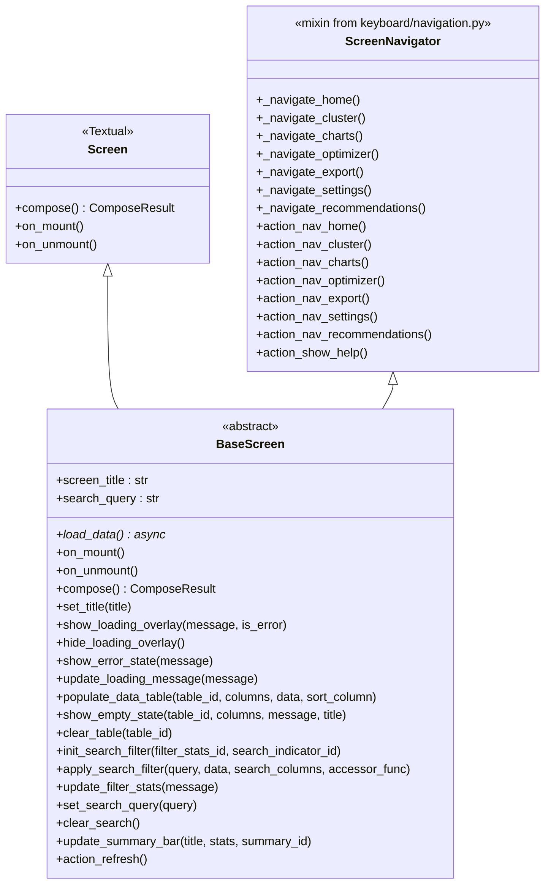
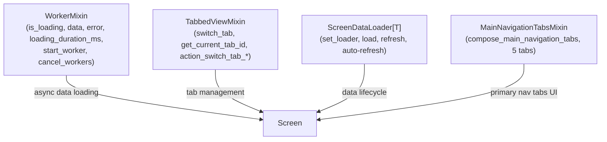
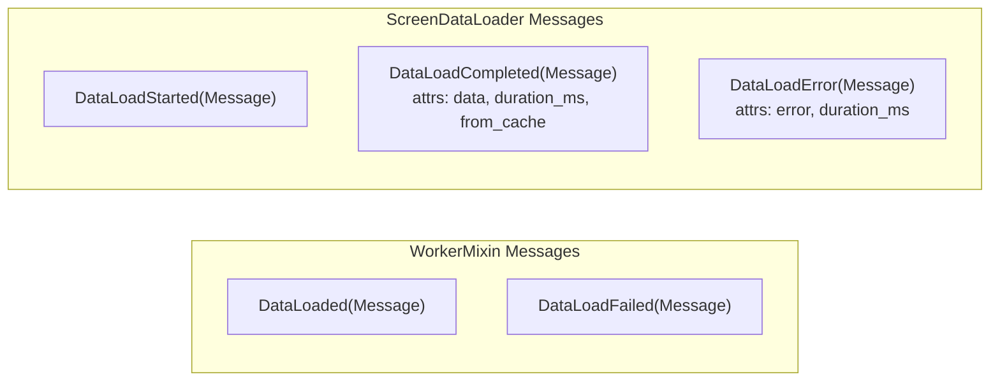
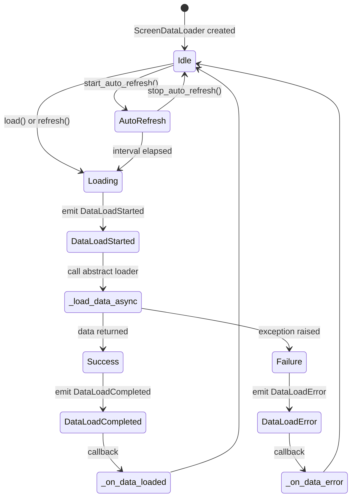
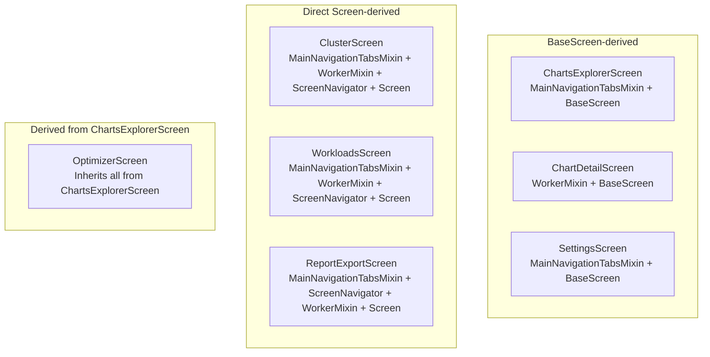

# Screen Base Patterns

This document details the BaseScreen class and screen mixins used throughout the application.

## BaseScreen Class

The `BaseScreen` provides a common foundation for screens that need shared functionality: loading overlays, data table helpers, search/filter support, summary bar updates, and navigation actions.

### Definition

```python
# screens/base_screen.py
from textual.screen import Screen
from kubeagle.keyboard.navigation import ScreenNavigator

class BaseScreen(Screen, ScreenNavigator):
    """Abstract base class for TUI screens with common patterns.

    Provides:
    - Standard title setting for the app window
    - Loading state management (show/hide overlay, error states)
    - DataTable population helpers (populate, empty state, clear)
    - Search/filter pattern helpers
    - Summary bar update helpers
    - Refresh action pattern
    - Navigation actions (inherited from ScreenNavigator)

    Subclasses must implement:
    - screen_title: The title to display in the window
    - load_data: Async method to load screen data
    """

    BINDINGS = BASE_SCREEN_BINDINGS  # 8 entries from keyboard/navigation.py
```

### Inheritance Diagram



### Inherited from ScreenNavigator

BaseScreen inherits navigation methods from `ScreenNavigator` (imported from `kubeagle.keyboard.navigation`):

```python
# Private navigation methods (inherited from ScreenNavigator)
def _navigate_home(self) -> None: ...          # -> ClusterScreen
def _navigate_cluster(self) -> None: ...       # -> ClusterScreen
def _navigate_charts(self) -> None: ...        # -> ChartsExplorerScreen
def _navigate_optimizer(self) -> None: ...     # -> OptimizerScreen
def _navigate_export(self) -> None: ...        # -> ReportExportScreen
def _navigate_settings(self) -> None: ...      # -> SettingsScreen
def _navigate_recommendations(self) -> None: ... # -> OptimizerScreen (recommendations view)

# Action methods for keybindings (overridden in BaseScreen using standalone functions)
def action_nav_home(self) -> None: ...         # calls navigate_to_home(self.app)
def action_nav_cluster(self) -> None: ...      # calls navigate_to_cluster(self.app)
def action_nav_charts(self) -> None: ...       # calls navigate_to_charts(self.app)
def action_nav_optimizer(self) -> None: ...    # calls navigate_to_optimizer(self.app)
def action_nav_export(self) -> None: ...       # calls navigate_to_export(self.app)
def action_nav_settings(self) -> None: ...     # calls navigate_to_settings(self.app)
def action_nav_recommendations(self) -> None: ... # calls navigate_to_recommendations(self.app)
def action_show_help(self) -> None: ...        # shows help notification
```

### Key Methods

| Method | Parameters | Purpose |
|--------|------------|---------|
| `set_title(title)` | `str` | Set the application window title to "KubEagle - {title}" |
| `show_loading_overlay(message, is_error)` | `str`, `bool` | Show loading overlay with message (toggles loading/error CSS class) |
| `hide_loading_overlay()` | -- | Hide loading overlay |
| `show_error_state(message)` | `str` | Show error state in overlay (delegates to `show_loading_overlay`) |
| `update_loading_message(message)` | `str` | Update loading message without showing/hiding overlay |
| `populate_data_table(table_id, columns, data, sort_column)` | `str`, `list[str]`, `list[list]`, `int` | Fill a DataTable with columns and rows, optional sort |
| `show_empty_state(table_id, columns, message, title)` | `str`, `list[str]`, `str`, `str` | Display an empty-state row with custom message |
| `clear_table(table_id)` | `str` | Clear a DataTable's data and columns |
| `init_search_filter(filter_stats_id, search_indicator_id)` | `str`, `str` | Initialize search/filter widget references |
| `apply_search_filter(query, data, search_columns, accessor_func)` | `str`, `list`, `list[int]`, `Callable \| None` | Filter data by search query across specified columns |
| `update_filter_stats(message)` | `str \| None` | Update filter stats display |
| `set_search_query(query)` | `str` | Set current search query and update display |
| `clear_search()` | -- | Clear current search query |
| `update_summary_bar(title, stats, summary_id)` | `str`, `list[tuple[str, str]]`, `str` | Update the summary bar with title and stats |
| `action_refresh()` | -- | Show loading overlay and re-load data |

### Usage

```python
from kubeagle.keyboard import BASE_SCREEN_BINDINGS

class MyScreen(BaseScreen):
    BINDINGS = BASE_SCREEN_BINDINGS

    @property
    def screen_title(self) -> str:
        return "My Screen Title"

    async def load_data(self) -> None:
        self.show_loading_overlay("Loading...")
        try:
            data = await self._fetch()
            self.populate_data_table("#my-table", ["Col1", "Col2"], data)
        except Exception as e:
            self.show_error_state(str(e))
        finally:
            self.hide_loading_overlay()
```

## Screen Mixins

The application provides 4 mixins in `screens/mixins/`:



### Mixin Messages Overview



## WorkerMixin

The `WorkerMixin` provides standardized async data loading with reactive state management.

### Reactive Attributes

| Attribute | Type | Default | Description |
|-----------|------|---------|-------------|
| `is_loading` | `reactive(bool)` | `False` | Whether a worker is currently loading data |
| `data` | `reactive[list[dict]]` | `[]` | Loaded data |
| `error` | `reactive[str \| None]` | `None` | Error message from last load attempt |
| `loading_duration_ms` | `reactive(float)` | `0.0` (init=False) | Duration of the last load operation in milliseconds |

### Messages

| Message | Attributes | Purpose |
|---------|------------|---------|
| `DataLoaded` | (base) | Indicates successful data load completion |
| `DataLoadFailed` | (base) | Indicates data load failure |

### Definition

```python
# screens/mixins/worker_mixin.py

class WorkerMixin:
    """Mixin for standardized Worker lifecycle management.

    Provides:
    - Standard reactive attributes (is_loading, data, error, loading_duration_ms)
    - Message types for communication (DataLoaded, DataLoadFailed)
    - Worker management utilities (start_worker, cancel_workers)
    - Loading overlay integration (show/hide/error)
    - Composable loading overlay via compose_loading_overlay()
    - Worker state change handler (on_worker_state_changed)
    """

    # Reactive attributes
    is_loading = reactive(False)
    data = reactive[list[dict]]([])
    error = reactive[str | None](None)
    loading_duration_ms = reactive(0.0, init=False)

    class DataLoaded(Message): ...
    class DataLoadFailed(Message): ...

    def start_worker(
        self,
        worker_func: Callable[..., Awaitable[Any]],
        *,
        exclusive: bool = True,
        thread: bool = False,
        name: str | None = None,
        exit_on_error: bool = False,
    ) -> Worker[Any]: ...

    def cancel_workers(self) -> None: ...
    def on_worker_state_changed(self, event: Worker.StateChanged) -> None: ...

    # Watch methods
    def watch_is_loading(self, loading: bool) -> None: ...
    def watch_data(self, data: list[dict]) -> None: ...
    def watch_error(self, error: str | None) -> None: ...

    # Loading state management
    def show_loading_overlay(self, message: str = "Loading...", *, is_error: bool = False) -> None: ...
    def hide_loading_overlay(self) -> None: ...
    def update_loading_message(self, message: str) -> None: ...
    def show_error_state(self, message: str, retry: bool = True) -> None: ...

    # Composable UI helper
    def compose_loading_overlay(self) -> list[Any]: ...
```

The module also exports:

- `DataLoaded(Message)` -- base message for successful data load
- `DataLoadFailed(Message)` -- base message for failed data load
- `LoadingOverlay(Container)` -- standalone loading overlay widget with `show()`, `hide()`, `update_message()`, `show_error()` methods
- `DataLoadMixin` -- backward-compatible alias for `WorkerMixin`

### Usage Pattern

```python
class DataScreen(BaseScreen, WorkerMixin):
    def on_mount(self) -> None:
        self.start_worker(self._load_data_worker, name="my-loader")

    async def _load_data_worker(self) -> None:
        self.is_loading = True
        self.error = None
        try:
            self.update_loading_message("Fetching data...")
            data = await self._fetch_from_source()
            self.data = data
        except Exception as e:
            self.error = str(e)
        finally:
            self.is_loading = False
```

## TabbedViewMixin

The `TabbedViewMixin` provides tab management functionality for screens using `CustomTabbedContent`.

### Definition

```python
# screens/mixins/tabbed_view_mixin.py

class TabbedViewMixin:
    """Mixin providing tab management patterns for screens.

    Provides:
    - Tab switching via keyboard (1-5 keys)
    - Tab switching by ID
    - Active tab tracking via _current_tab
    - Current tab ID retrieval
    """

    _current_tab: str = "all"

    def switch_tab(self, tab_id: str) -> None: ...
    def get_current_tab_id(self) -> str | None: ...

    def action_switch_tab_1(self) -> None: ...  # switches to "tab-1"
    def action_switch_tab_2(self) -> None: ...  # switches to "tab-2"
    def action_switch_tab_3(self) -> None: ...  # switches to "tab-3"
    def action_switch_tab_4(self) -> None: ...  # switches to "tab-4"
    def action_switch_tab_5(self) -> None: ...  # switches to "tab-5"
```

The module also exports `FilterableTableMixin` as a backward-compatible alias for `TabbedViewMixin`.

### Usage Pattern

```python
class TabbedScreen(BaseScreen, TabbedViewMixin):
    BINDINGS = [
        ("1", "switch_tab_1", "Tab 1"),
        ("2", "switch_tab_2", "Tab 2"),
    ]

    def compose(self) -> ComposeResult:
        with CustomTabbedContent(id="tabbed-content"):
            with CustomTabPane("Tab 1", id="tab-1"):
                yield Content1()
            with CustomTabPane("Tab 2", id="tab-2"):
                yield Content2()
```

## ScreenDataLoader

The `ScreenDataLoader` provides data loading lifecycle management with progress reporting, auto-refresh coordination, and duration tracking. It is a generic class parameterized on the data type `T`.

### Messages

| Message | Attributes | Purpose |
|---------|------------|---------|
| `DataLoadStarted` | -- | Emitted when a data load begins |
| `DataLoadCompleted` | `data: T`, `duration_ms: float`, `from_cache: bool` | Emitted when a data load completes successfully |
| `DataLoadError` | `error: str`, `duration_ms: float` | Emitted when a data load fails |

### Lifecycle Flow



### Definition

```python
# screens/mixins/screen_data_loader.py

class ScreenDataLoader(Generic[T]):
    """Base class for screen data loading lifecycle.

    Provides:
    - Automatic data loading via load() / refresh()
    - Data loader injection via set_loader()
    - Progress reporting via messages (DataLoadStarted, DataLoadCompleted, DataLoadError)
    - Auto-refresh coordination (start/stop/toggle)
    - Loading duration tracking
    - Cache coordination via CacheManager
    """

    # Auto-refresh configuration (override in subclass)
    auto_refresh_interval: float | None = None

    # Properties
    is_loading: bool      # Whether data is currently loading
    data: list[dict]      # Loaded data
    error: str | None     # Error message
    loading_duration_ms: float  # Last load duration in ms

    # Data loading API
    def set_loader(self, loader: Callable[..., Awaitable[T]], cache_key: str | None = None) -> None: ...
    def load(self, force_refresh: bool = False) -> None: ...
    def refresh(self) -> None: ...

    # Auto-refresh API
    def start_auto_refresh(self, interval: float | None = None) -> None: ...
    def stop_auto_refresh(self) -> None: ...
    def toggle_auto_refresh(self, interval: float | None = None) -> None: ...

    # Abstract methods (override in subclasses)
    async def _load_data_async(self) -> T: ...
    def _on_data_loaded(self, data: T) -> None: ...
    def _on_data_error(self, error: str, duration_ms: float) -> None: ...
    def _on_progress_update(self, progress: LoadingProgress) -> None: ...

    # Message handlers
    def on_data_load_started(self, event: DataLoadStarted) -> None: ...
    def on_data_load_completed(self, event: DataLoadCompleted) -> None: ...
    def on_data_load_error(self, event: DataLoadError) -> None: ...
```

The module also exports:

- `DataLoadStarted(Message)` -- indicates data load has started
- `DataLoadCompleted(Message)` -- indicates data load completed (with `data`, `duration_ms`, `from_cache` attrs)
- `DataLoadError(Message)` -- indicates data load failed (with `error`, `duration_ms` attrs)
- `DataLoaderMixin` -- backward-compatible alias for `ScreenDataLoader`

### Usage Pattern

```python
class AutoLoadScreen(ScreenDataLoader[MyDataType], Screen):
    auto_refresh_interval = 60.0  # Refresh every minute

    async def _load_data_async(self) -> MyDataType:
        return await self._fetch()

    def _on_data_loaded(self, data: MyDataType) -> None:
        self._render(data)

    def _on_data_error(self, error: str, duration_ms: float) -> None:
        self.notify(f"Error: {error}", severity="error")
```

## MainNavigationTabsMixin

The `MainNavigationTabsMixin` provides a shared top-level navigation tab bar displayed at the top of primary screens.

### Definition

```python
# screens/mixins/main_navigation_tabs_mixin.py

MAIN_NAV_TAB_CLUSTER = "main-tab-cluster"
MAIN_NAV_TAB_CHARTS = "main-tab-charts"
MAIN_NAV_TAB_WORKLOADS = "main-tab-workloads"
MAIN_NAV_TAB_EXPORT = "main-tab-export"
MAIN_NAV_TAB_SETTINGS = "main-tab-settings"

class MainNavigationTabsMixin:
    """Mixin to compose and handle top-level app navigation tabs."""

    _syncing_primary_navigation_tab: bool = False
    _primary_navigation_ready: bool = False

    def compose_main_navigation_tabs(self, *, active_tab_id: str) -> CustomHorizontal: ...
    def _set_primary_navigation_tab(self, tab_id: str) -> None: ...
    def _enable_primary_navigation_tabs(self) -> None: ...
    def _on_primary_navigation_tab_changed(self, tab_id: str) -> None: ...
```

### Tab Navigation Routing

When a user clicks a primary navigation tab, `_on_primary_navigation_tab_changed` dispatches the navigation via `self.app.action_nav_*()`:

| Tab ID | Label | App Action | Target Screen |
|--------|-------|------------|---------------|
| `main-tab-cluster` | Cluster | `action_nav_cluster()` | ClusterScreen |
| `main-tab-charts` | Charts | `action_nav_charts()` | ChartsExplorerScreen |
| `main-tab-workloads` | Workloads | `action_nav_workloads()` | WorkloadsScreen |
| `main-tab-export` | Export | `action_nav_export()` | ReportExportScreen |
| `main-tab-settings` | Settings | `action_nav_settings()` | SettingsScreen |

### Usage Pattern

```python
class ClusterScreen(MainNavigationTabsMixin, WorkerMixin, ScreenNavigator, Screen):
    def compose(self) -> ComposeResult:
        yield CustomHeader()
        yield self.compose_main_navigation_tabs(active_tab_id=MAIN_NAV_TAB_CLUSTER)
        # ... screen content ...
        yield CustomFooter()

    def on_mount(self) -> None:
        self._enable_primary_navigation_tabs()
```

## Combining Mixins

Screens commonly combine multiple mixins. The MRO (Method Resolution Order) resolves left-to-right, depth-first.

### Mixin Combinations by Screen



### Mixin Composition Summary

| Screen | MNT | Worker | ScreenNav | BaseScreen | Screen |
|--------|:---:|:------:|:---------:|:----------:|:------:|
| ClusterScreen | x | x | x | -- | x |
| ChartsExplorerScreen | x | -- | (via BS) | x | (via BS) |
| ChartDetailScreen | -- | x | (via BS) | x | (via BS) |
| SettingsScreen | x | -- | (via BS) | x | (via BS) |
| WorkloadsScreen | x | x | x | -- | x |
| ReportExportScreen | x | x | x | -- | x |
| OptimizerScreen | (via CE) | (via CE) | (via CE) | (via CE) | (via CE) |

MNT = MainNavigationTabsMixin, BS = BaseScreen, CE = ChartsExplorerScreen

### Best Practice

Override methods explicitly when combining mixins:

```python
class MyScreen(MainNavigationTabsMixin, WorkerMixin, ScreenNavigator, Screen):
    def on_mount(self) -> None:
        """Explicitly handle initialization."""
        super().on_mount()
        self._enable_primary_navigation_tabs()
        self.start_worker(self._load_data)
```

## Backward Compatibility Aliases

| Alias | Points to | Module |
|-------|-----------|--------|
| `DataLoadMixin` | `WorkerMixin` | `screens/mixins/worker_mixin.py` |
| `FilterableTableMixin` | `TabbedViewMixin` | `screens/mixins/tabbed_view_mixin.py` |
| `DataLoaderMixin` | `ScreenDataLoader` | `screens/mixins/screen_data_loader.py` |

## Cross-References

- [Screens Overview](overview.md) -- Screen system architecture
- [Screen Reference](screen-reference.md) -- Individual screen documentation
- [Keybindings](../keyboard/keybindings.md) -- Screen-specific bindings
