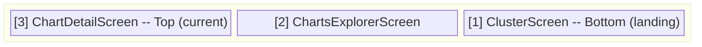
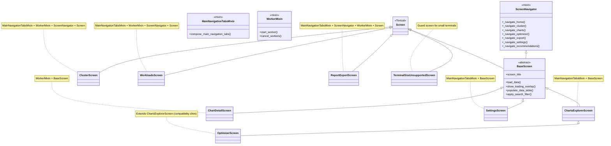
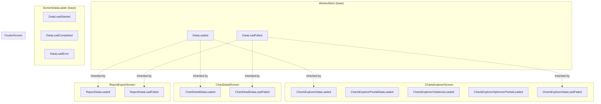
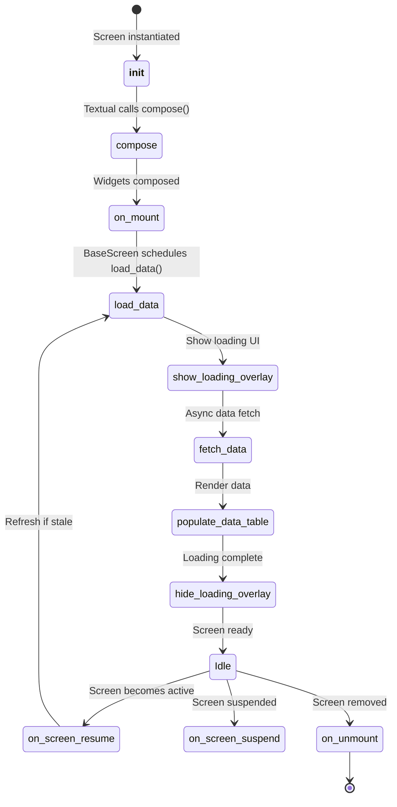
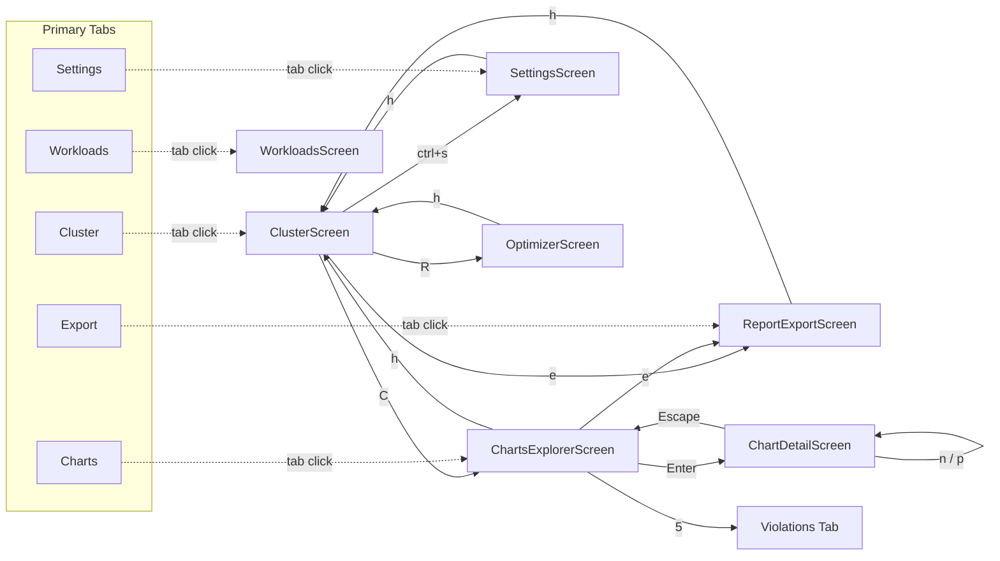
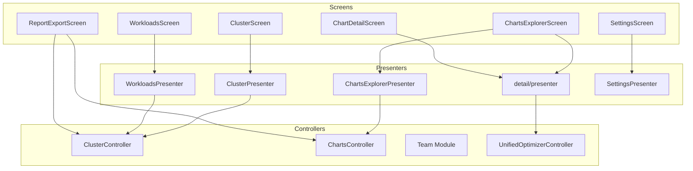
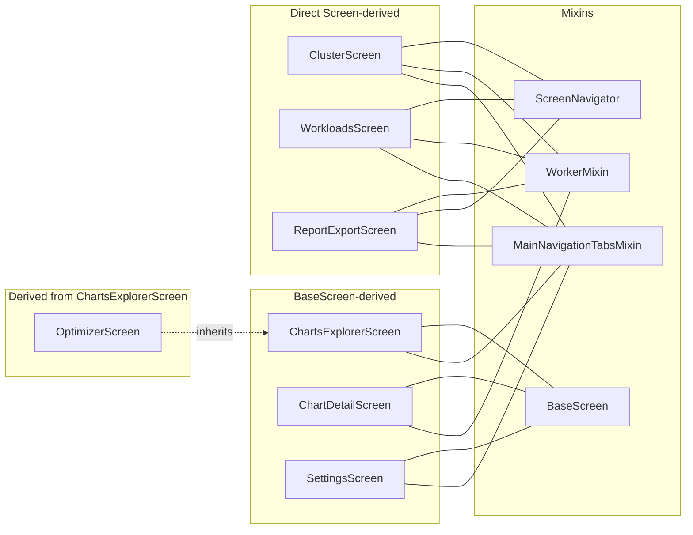
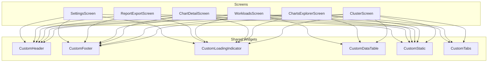

# Screens Overview

This document provides an overview of the screen system in the KubEagle TUI.

## Screen Architecture

Screens are full-page views that represent different functional areas of the application. The Textual framework manages a screen stack, allowing users to navigate between screens via keybindings or the primary navigation tabs.



## Screen Hierarchy

The application contains 8 screens. Each inherits (directly or indirectly) from Textual's `Screen` class and integrates the `ScreenNavigator` mixin for cross-screen navigation.



### Screen Summary

| Screen | Module | Inherits | Mixins | Presenter | Purpose |
|--------|--------|----------|--------|-----------|---------|
| ClusterScreen | `screens/cluster/` | Screen | MainNavigationTabsMixin, WorkerMixin, ScreenNavigator | ClusterPresenter | Cluster health: nodes, workloads, events |
| ChartsExplorerScreen | `screens/charts_explorer/` | BaseScreen | MainNavigationTabsMixin | ChartsExplorerPresenter | Unified chart browser with views and violations |
| OptimizerScreen | `screens/detail/` | ChartsExplorerScreen | (inherited) | (inherited) | Compatibility shim opening violations/recommendations tabs |
| ChartDetailScreen | `screens/detail/` | BaseScreen | WorkerMixin | -- | Detailed single-chart analysis |
| WorkloadsScreen | `screens/workloads/` | Screen | MainNavigationTabsMixin, WorkerMixin, ScreenNavigator | WorkloadsPresenter | Runtime workload resource requests/limits |
| SettingsScreen | `screens/settings/` | BaseScreen | MainNavigationTabsMixin | SettingsPresenter | Application configuration |
| ReportExportScreen | `screens/reports/` | Screen | MainNavigationTabsMixin, ScreenNavigator, WorkerMixin | -- | Report generation and export |
| TerminalSizeUnsupportedScreen | `app.py` | Screen[None] | -- | -- | Guard screen for undersized terminals |

## Screen Modules

Screens are organized in subfolders. Each module typically contains a screen file, a `config.py` for constants, and a `presenter.py` for data orchestration.

```
screens/
├── __init__.py               # Re-exports all screens
├── base_screen.py            # Abstract base class (Screen + ScreenNavigator)
│
├── cluster/                  # Cluster module
│   ├── __init__.py
│   ├── cluster_screen.py
│   ├── config.py
│   ├── presenter.py
│   └── components/
│       ├── __init__.py
│       └── pod_list.py
│
├── charts_explorer/          # Charts explorer module
│   ├── __init__.py
│   ├── charts_explorer_screen.py
│   ├── config.py
│   └── presenter.py
│
├── detail/                   # Detail screens (chart detail + optimizer shim)
│   ├── __init__.py
│   ├── chart_detail_screen.py
│   ├── optimizer_screen.py   # Compatibility shim for ChartsExplorerScreen
│   ├── config.py
│   ├── presenter.py
│   └── components/
│       ├── __init__.py
│       ├── violations_view.py
│       ├── recommendations_view.py
│       ├── chart_detail_view.py
│       ├── fix_details_modal.py
│       ├── ai_full_fix_modal.py
│       └── ai_full_fix_bulk_modal.py
│
├── workloads/                # Workloads module
│   ├── __init__.py
│   ├── workloads_screen.py
│   ├── config.py
│   └── presenter.py
│
├── settings/                 # Settings module
│   ├── __init__.py
│   ├── settings_screen.py
│   ├── config.py
│   └── presenter.py
│
├── reports/                  # Reports module
│   ├── __init__.py
│   ├── report_export_screen.py
│   └── config.py
│
└── mixins/                   # Reusable mixins
    ├── __init__.py
    ├── worker_mixin.py
    ├── tabbed_view_mixin.py
    ├── screen_data_loader.py
    └── main_navigation_tabs_mixin.py
```

## Screen Presenters

Presenters act as the data orchestration layer between screens and controllers. Each presenter is co-located with its screen module.

| Presenter | Module | Screen | Controller(s) Used |
|-----------|--------|--------|-------------------|
| ClusterPresenter | `screens/cluster/presenter.py` | ClusterScreen | ClusterController |
| ChartsExplorerPresenter | `screens/charts_explorer/presenter.py` | ChartsExplorerScreen | ChartsController, Team Module |
| WorkloadsPresenter | `screens/workloads/presenter.py` | WorkloadsScreen | ClusterController, ChartsController |
| SettingsPresenter | `screens/settings/presenter.py` | SettingsScreen | -- (reads/writes AppSettings) |

Note: ChartDetailScreen and ReportExportScreen do not have dedicated presenters. ChartDetailScreen uses `screens/detail/presenter.py` (shared with the optimizer pipeline) and ReportExportScreen orchestrates data inline.

## Screen Messages Overview

Screens and mixins communicate via Textual `Message` subclasses. The diagram below shows every custom message class organized by origin.



## Screen Lifecycle



### Mount Phase

```python
class MyScreen(BaseScreen):
    def on_mount(self) -> None:
        """Called when screen is mounted to the app."""
        # BaseScreen sets window title and calls load_data()
        # Additional initialization:
        self.init_search_filter()
```

### Unmount Phase

```python
class MyScreen(BaseScreen):
    def on_unmount(self) -> None:
        """Called when screen is removed from app."""
        # Clean up resources
        pass
```

### Show/Hide Phase

```python
class MyScreen(BaseScreen):
    def on_screen_resume(self) -> None:
        """Called when screen becomes active again."""
        if self._should_refresh():
            self.call_later(self.load_data)

    def on_screen_suspend(self) -> None:
        """Called when screen is being suspended."""
        pass
```

## Navigation

### Navigation Flow



### Screen-to-Controller Mapping



### ScreenNavigator Class

The `ScreenNavigator` (defined in `kubeagle/keyboard/navigation.py`) provides consistent navigation methods. It is used as a mixin by `BaseScreen` and standalone screens.

```python
from kubeagle.keyboard.navigation import ScreenNavigator

class ScreenNavigator:
    def _navigate_home(self) -> None: ...       # -> ClusterScreen
    def _navigate_cluster(self) -> None: ...    # -> ClusterScreen
    def _navigate_charts(self) -> None: ...     # -> ChartsExplorerScreen
    def _navigate_optimizer(self) -> None: ...  # -> OptimizerScreen
    def _navigate_export(self) -> None: ...     # -> ReportExportScreen
    def _navigate_settings(self) -> None: ...   # -> SettingsScreen
    def _navigate_recommendations(self) -> None: ... # -> OptimizerScreen (recommendations view)
```

Standalone navigation functions are also available:

```python
from kubeagle.keyboard.navigation import (
    navigate_to_home,
    navigate_to_cluster,
    navigate_to_charts,
    navigate_to_optimizer,
    navigate_to_export,
    navigate_to_settings,
    navigate_to_recommendations,
    navigate_to_charts_explorer,
    navigate_to_chart_detail,
)
```

### APP_BINDINGS (Global, 10 entries)

Defined in `kubeagle/keyboard/app.py`, these bindings work from any screen:

| Key | Action | Description | Target |
|-----|--------|-------------|--------|
| `Escape` | back | Back | Previous screen |
| `h` | nav_home | Summary | ClusterScreen |
| `c` | nav_cluster | Cluster | ClusterScreen |
| `C` | nav_charts | Charts | ChartsExplorerScreen |
| `e` | nav_export | Export | ReportExportScreen |
| `Ctrl+s` | nav_settings | Settings | SettingsScreen |
| `R` | nav_recommendations | Viol+Recs | OptimizerScreen (recommendations) |
| `?` | show_help | Help | Help notification |
| `r` | refresh | Refresh | Refresh current screen |
| `q` | app.quit | Quit | Exit application |

### Primary Navigation Tabs

Screens that use `MainNavigationTabsMixin` display a shared top-level tab bar with 5 tabs: **Cluster**, **Charts**, **Workloads**, **Export**, **Settings**. Clicking a tab navigates to the corresponding screen. The Workloads screen is accessible via these tabs (and via `action_nav_workloads` on the app) but does not have a dedicated global keybinding.

## Screen Composition

### Mixin Composition per Screen



### Widget Usage by Screen



### Typical Screen Structure

```python
class ChartsExplorerScreen(MainNavigationTabsMixin, BaseScreen):
    """Unified charts browser with view tabs, sort controls, and team filters."""

    BINDINGS = CHARTS_EXPLORER_SCREEN_BINDINGS
    CSS_PATH = [
        "../../css/screens/charts_explorer.tcss",
        "../../css/screens/optimizer_screen.tcss",
    ]

    # Reactive state
    use_cluster_mode: bool = reactive(False)
    show_active_only: bool = reactive(False)
    current_view: ViewFilter = reactive(ViewFilter.ALL)
    current_sort: SortBy = reactive(SortBy.CHART)
    sort_desc: bool = reactive(False)
    current_team: str | None = reactive(None)

    def compose(self) -> ComposeResult:
        yield CustomHeader()
        yield self.compose_main_navigation_tabs(active_tab_id=MAIN_NAV_TAB_CHARTS)
        # ... view tabs, search bar, data table, violations view ...
        yield CustomFooter()
```

## Common Screen Patterns

### Data Loading Pattern

```python
class DataScreen(BaseScreen):
    async def load_data(self) -> None:
        """BaseScreen calls this on mount."""
        self.show_loading_overlay("Loading...")
        try:
            data = await self._fetch_data()
            self._render(data)
        except Exception as e:
            self.show_error_state(str(e))
        finally:
            self.hide_loading_overlay()
```

### Search/Filter Pattern

```python
class FilterableScreen(BaseScreen):
    def on_mount(self) -> None:
        super().on_mount()
        self.init_search_filter()

    def _on_search_changed(self, query: str) -> None:
        self.set_search_query(query)
        filtered = self.apply_search_filter(query, self.data, [0, 1, 2])
        self._render(filtered)
```

### Testing Mode

Screens support a `testing` parameter for automated tests:

```python
class ChartsExplorerScreen(MainNavigationTabsMixin, BaseScreen):
    def __init__(self, testing: bool = False):
        super().__init__()
        self._testing = testing
```

## Constants Structure

Screen-related constants are organized across two locations:

| Location | Purpose |
|----------|---------|
| `screens/<module>/config.py` | Screen-local config (tab IDs, columns, options) |
| `constants/screens/<module>.py` | Shared screen constants (titles, loading messages, validation) |

Files in `constants/screens/`:

| File | Contents |
|------|----------|
| `charts_explorer.py` | Title, button labels, mode indicators, thresholds |
| `cluster.py` | Tab IDs, loading messages, status labels, event window config |
| `common.py` | Theme constants (DARK_THEME, LIGHT_THEME) |
| `detail.py` | Optimizer categories and severities |
| `settings.py` | Section headers, validation messages, save/cancel buttons |

## Cross-References

- [Base Patterns](base-patterns.md) -- BaseScreen and mixin details
- [Screen Reference](screen-reference.md) -- Complete screen documentation
- [Keybindings](../keyboard/keybindings.md) -- Keyboard shortcuts
