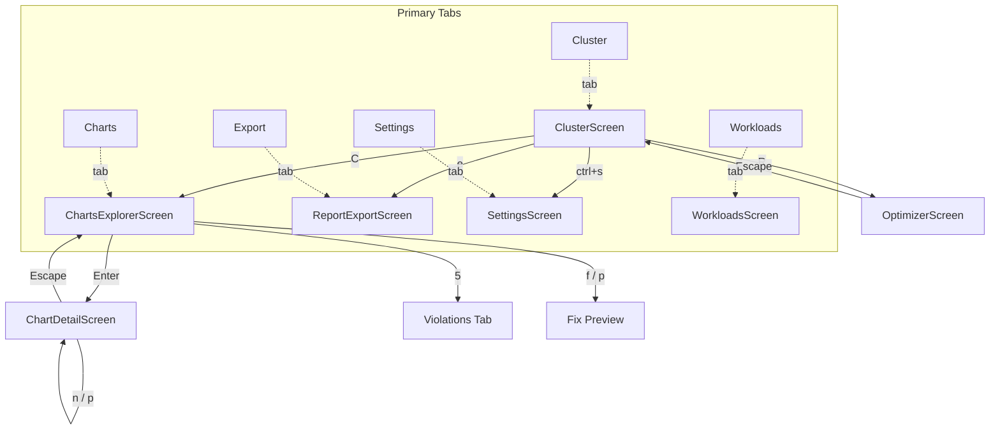
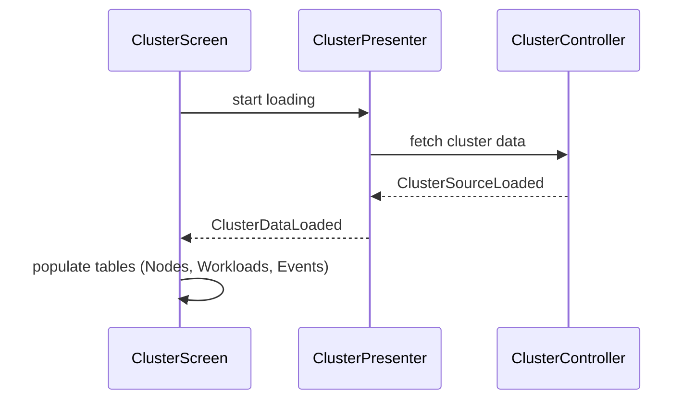
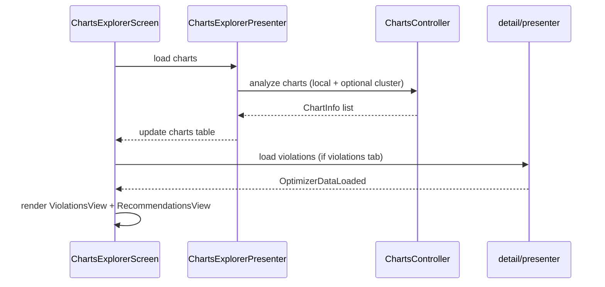
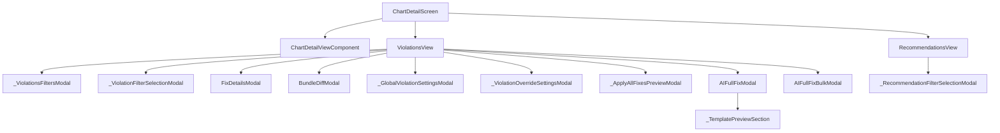
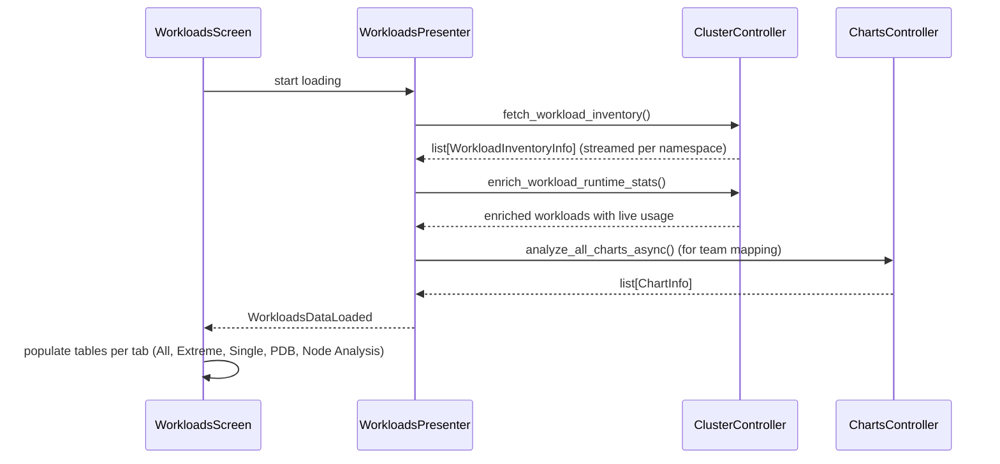
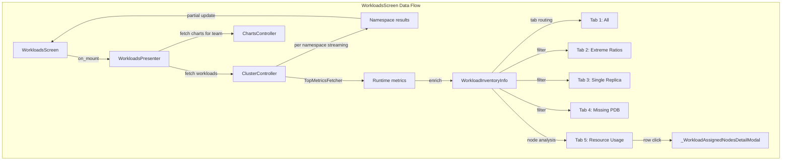

# Screen Reference

Complete reference documentation for all 8 screens in the KubEagle TUI.



---

## ClusterScreen

**Location**: `kubeagle/screens/cluster/cluster_screen.py`

**Class**: `ClusterScreen(MainNavigationTabsMixin, WorkerMixin, ScreenNavigator, Screen)`

**Purpose**: Cluster health monitoring with node, workload, and event views.

### Internal Components

| Class | Type | Description |
|-------|------|-------------|
| `_ForwardGradientBarRenderable` | Renderable | Custom Rich renderable for forward-gradient progress bars |
| `_ForwardGradientProgressBar` | Widget | Progress bar using forward-gradient coloring for resource allocation |
| `_ColumnFilterSelectionModal` | Modal | Column visibility filter modal for data tables |
| `_ClusterFiltersModal` | Modal | Cluster-level filter modal (namespace, node group, etc.) |

### Module Structure

```
screens/cluster/
├── __init__.py
├── cluster_screen.py    # Screen implementation + internal components above
├── config.py            # Tab IDs, column definitions, tooltips, widget IDs
├── presenter.py         # ClusterPresenter (data orchestration)
└── components/
    ├── __init__.py
    └── pod_list.py      # Pod list component
```

### Tabs (3)

| # | Tab ID | Label | Content |
|---|--------|-------|---------|
| 1 | `tab-nodes` | Nodes | Node list with CPU/memory allocation bars |
| 2 | `tab-pods` | Workloads | Workload pod distribution |
| 3 | `tab-events` | Events | Recent cluster events with detail table |

### Table Columns

**Nodes table** (`NODE_TABLE_COLUMNS`):

| Column | Width | Description |
|--------|-------|-------------|
| Name | 35 | Kubernetes node name |
| Node Group | 28 | Owning node group |
| Pod Usage | 20 | Pod pressure as pod-count/capacity |
| CPU Req/Alloc (m) | 24 | CPU requests vs allocatable in millicores |
| Mem Req/Alloc (GiB) | 26 | Memory requests vs allocatable in GiB |
| CPU Lim/Alloc (m) | 24 | CPU limits vs allocatable in millicores |
| Mem Lim/Alloc (GiB) | 26 | Memory limits vs allocatable in GiB |

**Events detail table** (`EVENTS_DETAIL_TABLE_COLUMNS`):

| Column | Width | Description |
|--------|-------|-------------|
| Type | 10 | Event type (Normal/Warning) |
| Reason | 20 | Machine-readable event reason |
| Object | 30 | Kubernetes object involved |
| Count | 8 | Occurrence count |
| Message | 80 | Full event message |

### Keybindings (CLUSTER_SCREEN_BINDINGS -- 8 entries)

| Key | Action | Description |
|-----|--------|-------------|
| `Escape` | pop_screen | Back |
| `r` | refresh | Refresh |
| `/` | focus_search | Search |
| `1` | switch_tab_1 | Nodes |
| `2` | switch_tab_2 | Workloads |
| `3` | switch_tab_3 | Events |
| `?` | show_help | Help |
| `h` | nav_home | Summary |

### Data Flow



---

## ChartsExplorerScreen

**Location**: `kubeagle/screens/charts_explorer/charts_explorer_screen.py`

**Class**: `ChartsExplorerScreen(MainNavigationTabsMixin, BaseScreen)`

**Purpose**: Unified Helm chart browser with view-filter tabs, sorting, team filtering, and integrated violations/recommendations.

### Messages

| Message | Purpose |
|---------|---------|
| `ChartsExplorerDataLoaded` | Chart data fully loaded |
| `ChartsExplorerPartialDataLoaded` | Partial chart data available (streaming) |
| `ChartsExplorerViolationsLoaded` | Violation analysis completed |
| `ChartsExplorerOptimizerPartialLoaded` | Optimizer partial results available |
| `ChartsExplorerDataLoadFailed` | Chart data loading failed |

### Modals

| Class | Type | Description |
|-------|------|-------------|
| `_ChartsFilterState` | Dataclass | Holds current filter state for the charts filter modal |
| `_ChartsFiltersModal` | Modal | Multi-criteria filter modal (team, namespace, view filter, etc.) |
| `_ChartDetailsModal` | Modal | Quick-view detail modal for a selected chart row |

### Module Structure

```
screens/charts_explorer/
├── __init__.py
├── charts_explorer_screen.py  # Screen implementation
├── config.py                  # ViewFilter, SortBy, GroupBy enums, columns
└── presenter.py               # ChartsExplorerPresenter
```

### Content Areas

The screen uses a `ContentSwitcher` with two main content areas:

| Tab ID | Label | Content |
|--------|-------|---------|
| `tab-charts` | Charts | Chart data table with 5 sub-view filters |
| `tab-violations` | Violations | ViolationsView + RecommendationsView |

Note: `TAB_RECOMMENDATIONS` is aliased to `TAB_VIOLATIONS` in config.py since recommendations are now embedded in the violations view.

### Chart View Filters (within tab-charts)

| # | Key | View Filter | Tab ID |
|---|-----|-------------|--------|
| 1 | `1` | All Charts | `charts-view-tab-all` |
| 2 | `2` | Extreme Ratios (>=2.0x) | `charts-view-tab-extreme` |
| 3 | `3` | Single Replica | `charts-view-tab-single` |
| 4 | `4` | Missing PDB | `charts-view-tab-no-pdb` |
| 5 | `5` | Optimizer (with violations) | `charts-view-tab-violations` |

### Table Columns (`EXPLORER_TABLE_COLUMNS`)

| Column | Width | Description |
|--------|-------|-------------|
| Chart | 25 | Helm chart name |
| Namespace | 16 | Kubernetes namespace |
| Team | 15 | Owning team from CODEOWNERS |
| Values File Type | 12 | Source kind (service/default/shared/other) |
| QoS | 12 | Kubernetes pod QoS class |
| CPU R/L | 30 | CPU request/limit with ratio |
| Mem R/L | 32 | Memory request/limit with ratio |
| Replicas | 9 | Configured replica count |
| Probes | 16 | Health probe summary (L/R/S) |
| Affinity | 14 | Anti-affinity/topology spread |
| PDB | 6 | PodDisruptionBudget status |
| Chart Path | 44 | Filesystem path |

### Keybindings (CHARTS_EXPLORER_SCREEN_BINDINGS -- 24 entries)

| Key | Action | Description |
|-----|--------|-------------|
| `Escape` | pop_screen | Back |
| `r` | refresh | Refresh |
| `/` | focus_search | Search |
| `Enter` | select_chart | Preview Chart |
| `m` | toggle_mode | Toggle Mode (local/cluster) |
| `a` | toggle_active_filter | Active Only |
| `1` | view_all | All Charts |
| `2` | view_extreme | Extreme Ratios |
| `3` | view_single_replica | Single Replica |
| `4` | view_no_pdb | Missing PDB |
| `5` | view_violations | Violations |
| `s` | toggle_sort_direction | Sort |
| `t` | cycle_team | Team |
| `v` | view_team_violations | Team Violations |
| `f` | fix_violation | Fix Chart |
| `p` | preview_fix | Preview |
| `y` | copy_yaml | Copy YAML |
| `g` | go_to_chart | Go to Chart |
| `x` | export_team_report | Export Report |
| `h` | nav_home | Summary |
| `c` | nav_cluster | Cluster |
| `e` | nav_export | Export |
| `Ctrl+s` | nav_settings | Settings |
| `?` | show_help | Help |

### Reactive State

| Attribute | Type | Description |
|-----------|------|-------------|
| `use_cluster_mode` | `bool` | Whether cluster mode is active |
| `show_active_only` | `bool` | Show only active charts |
| `current_view` | `ViewFilter` | Current view filter |
| `current_sort` | `SortBy` | Current sort column |
| `sort_desc` | `bool` | Sort direction |
| `current_team` | `str \| None` | Current team filter |

### Data Flow



---

## OptimizerScreen

**Location**: `kubeagle/screens/detail/optimizer_screen.py`

**Class**: `OptimizerScreen(ChartsExplorerScreen)` -- backward-compatible compatibility shim

**Purpose**: Opens the ChartsExplorerScreen directly to the violations or recommendations tab. Inherits all behavior from `ChartsExplorerScreen`.

### Constructor

```python
def __init__(
    self,
    team_filter: str | None = None,
    testing: bool = False,
    initial_view: str = "violations",   # "violations" or "recommendations"
    include_cluster: bool = True,
) -> None: ...
```

### Key Behavior

- `initial_view="violations"` opens on `TAB_VIOLATIONS`
- `initial_view="recommendations"` opens on `TAB_RECOMMENDATIONS` (which is aliased to `TAB_VIOLATIONS` since recommendations are embedded in the violations view)
- Adds `action_view_violations()` and `action_view_recommendations()` convenience methods
- Does **not** override `BINDINGS`; inherits `CHARTS_EXPLORER_SCREEN_BINDINGS` (24 entries) from `ChartsExplorerScreen`

Note: `OPTIMIZER_SCREEN_BINDINGS` (18 entries) is defined in `kubeagle/keyboard/navigation.py` but is **not** currently used by the `OptimizerScreen` class. It exists for potential future use or external reference.

### OPTIMIZER_SCREEN_BINDINGS (18 entries, not currently assigned)

| Key | Action | Description |
|-----|--------|-------------|
| `Escape` | pop_screen | Back |
| `r` | refresh | Refresh |
| `h` | nav_home | Summary |
| `?` | show_help | Help |
| `/` | focus_search | Search |
| `1` | view_violations | Violations |
| `2` | view_recommendations | Recs |
| `a` | apply_all | Apply All |
| `f` | fix_violation | Fix |
| `p` | preview_fix | Preview |
| `y` | copy_yaml | Copy YAML |
| `s` | focus_sort | Sort |
| `S` | focus_sort | Sort |
| `v` | cycle_severity | Severity |
| `g` | go_to_chart | Go to Chart |
| `C` | nav_charts | Charts |
| `e` | nav_export | Export |
| `Ctrl+s` | nav_settings | Settings |

---

## ChartDetailScreen

**Location**: `kubeagle/screens/detail/chart_detail_screen.py`

**Class**: `ChartDetailScreen(WorkerMixin, BaseScreen)`

**Purpose**: Detailed analysis view for a single Helm chart, showing resources, probes, availability, and configuration sections.

### Messages

| Message | Purpose |
|---------|---------|
| `ChartDetailDataLoaded` | Chart detail data fully loaded |
| `ChartDetailDataLoadFailed` | Chart detail data loading failed |

### View Components

| Component | File | Description |
|-----------|------|-------------|
| `ChartDetailViewComponent` | `components/chart_detail_view.py` | Main detail view (resources, probes, availability, config) |
| `RecommendationsView` | `components/recommendations_view.py` | Displays optimization recommendations for a chart |
| `ViolationsView` | `components/violations_view.py` | Displays rule violations for a chart |
| `FixDetailsModal` | `components/fix_details_modal.py` | Shows fix details and YAML diff for a single violation |
| `BundleDiffModal` | `components/fix_details_modal.py` | Displays a bundle-level diff across multiple fix changes |
| `AIFullFixModal` | `components/ai_full_fix_modal.py` | AI-powered fix generation for a single chart |
| `AIFullFixBulkModal` | `components/ai_full_fix_bulk_modal.py` | AI-powered bulk fix generation across multiple charts |

### Modals (in violations_view / recommendations_view)

| Class | Type | Description |
|-------|------|-------------|
| `_RecommendationFilterSelectionModal` | Modal | Filter selection for recommendations table |
| `_ViolationFilterSelectionModal` | Modal | Filter selection for violations table |
| `_ViolationsFiltersState` | Dataclass | Current state of violations filter criteria |
| `_ViolationsFiltersModal` | Modal | Multi-criteria filter modal for violations |
| `_ApplyAllFixesModalResult` | Dataclass | Result of the "Apply All Fixes" confirmation |
| `_ApplyAllFixesPreviewModal` | Modal | Preview modal before applying all fixes |
| `_GlobalViolationSettingsModalResult` | Dataclass | Result of global violation settings modal |
| `_GlobalViolationSettingsModal` | Modal | Configure global violation settings (severity, categories) |
| `_ViolationOverrideSettingsModalResult` | Dataclass | Result of per-violation override settings |
| `_ViolationOverrideSettingsModal` | Modal | Override settings for a specific violation |

### AI Fix Classes (in ai_full_fix_modal / ai_full_fix_bulk_modal)

| Class | Type | Description |
|-------|------|-------------|
| `AIFullFixModalResult` | Dataclass | Result from AI full fix modal (single chart) |
| `ChartBundleEditorState` | Dataclass | Editor state for a chart bundle during AI fix |
| `_TemplatePreviewSection` | Widget | Preview section for template changes |
| `AIFullFixBulkModalResult` | Dataclass | Result from AI bulk fix modal |

### Component Tree



### Module Structure

```
screens/detail/
├── __init__.py
├── chart_detail_screen.py  # This screen
├── optimizer_screen.py     # OptimizerScreen shim
├── config.py               # Labels, section names, ratio thresholds
├── presenter.py            # Shared presenter (optimizer data loading)
└── components/
    ├── __init__.py
    ├── chart_detail_view.py
    ├── violations_view.py
    ├── recommendations_view.py
    ├── fix_details_modal.py
    ├── ai_full_fix_modal.py
    └── ai_full_fix_bulk_modal.py
```

### Constructor

```python
def __init__(
    self,
    chart: ChartInfo,
    chart_list: list[ChartInfo] | None = None,
    chart_index: int = 0,
) -> None: ...
```

### Sections Displayed

| Section | Fields |
|---------|--------|
| Resources | CPU Request/Limit/Ratio, Memory Request/Limit/Ratio, QoS |
| Health Probes | Liveness, Readiness, Startup |
| Availability | PDB (status/min/max/template), Anti-Affinity, Topology Spread |
| Configuration | Team, Values File, Replicas, Priority Class, HPA |

### Section Constants (from `detail/config.py`)

| Constant | Value |
|----------|-------|
| `SECTION_RESOURCES` | `"[bold]Resources[/bold]"` |
| `SECTION_PROBES` | `"[bold]Health Probes[/bold]"` |
| `SECTION_AVAILABILITY` | `"[bold]Availability[/bold]"` |
| `SECTION_CONFIGURATION` | `"[bold]Configuration[/bold]"` |

### Keybindings (CHART_DETAIL_SCREEN_BINDINGS -- 10 entries)

| Key | Action | Description |
|-----|--------|-------------|
| `Escape` | pop_screen | Back |
| `r` | refresh | Refresh |
| `n` | next_chart | Next |
| `p` | prev_chart | Prev |
| `h` | nav_home | Summary |
| `c` | nav_cluster | Cluster |
| `C` | nav_charts | Charts |
| `e` | nav_export | Export |
| `Ctrl+s` | nav_settings | Settings |
| `?` | show_help | Help |

---

## WorkloadsScreen

**Location**: `kubeagle/screens/workloads/workloads_screen.py`

**Class**: `WorkloadsScreen(MainNavigationTabsMixin, WorkerMixin, ScreenNavigator, Screen)`

**Purpose**: Runtime workload resource requests/limits, ratios, and node-level analysis for live Kubernetes workloads.

### Modals

| Class | Type | Description |
|-------|------|-------------|
| `_WorkloadsFilterState` | Dataclass | Holds current filter state for the workloads filter modal |
| `_WorkloadsQueryFilters` | Dataclass | Query filter parameters (namespace, kind, name pattern) |
| `_WorkloadsFiltersModal` | Modal | Multi-criteria filter modal for workloads |
| `_WorkloadAssignedNodesDetailModal` | Modal | Detail modal showing the nodes a workload is assigned to |

### Module Structure

```
screens/workloads/
├── __init__.py
├── workloads_screen.py  # Screen implementation
├── config.py            # Tab IDs, column definitions, view filters, sort options
└── presenter.py         # WorkloadsPresenter
```

### Tabs (5)

| # | Tab ID | Label | Content |
|---|--------|-------|---------|
| 1 | `tab-workloads-all` | All | All workloads |
| 2 | `tab-workloads-extreme-ratios` | Extreme Ratios | High limit/request ratio workloads |
| 3 | `tab-workloads-single-replica` | Single Replica | Single replica workloads |
| 4 | `tab-workloads-missing-pdb` | Missing PDB | Workloads without PDB |
| 5 | `tab-workloads-node-analysis` | Resource Usage | Node-level CPU/memory usage analysis |

### Table Columns

**Base columns** (tabs 1-4, `WORKLOADS_RESOURCE_BASE_COLUMNS`):

| Column | Width | Description |
|--------|-------|-------------|
| Namespace | 20 | Kubernetes namespace |
| Kind | 12 | Workload kind (Deployment, StatefulSet, etc.) |
| Name | 76 | Workload name (colorized by status, with Helm indicator) |
| Restarts | 42 | Restart count with reason aggregation |
| CPU R/L | 21 | CPU request/limit with inline ratio |
| Mem R/L | 23 | Memory request/limit with inline ratio |
| PDB | 10 | PodDisruptionBudget status |

**Node analysis columns** (tab 5, `WORKLOADS_RESOURCE_NODE_ANALYSIS_COLUMNS`):

Extends base columns (reordered: Restarts after Mem R/L) plus:

| Column | Width | Description |
|--------|-------|-------------|
| Nodes | 8 | Assigned node count |
| Node CPU Usage/Req/Lim Avg | 34 | Avg CPU usage/request/limit |
| Node CPU Usage/Req/Lim Max | 34 | Max CPU usage/request/limit |
| Node CPU Usage/Req/Lim P95 | 34 | P95 CPU usage/request/limit |
| Node Mem Usage/Req/Lim Avg | 34 | Avg memory usage/request/limit |
| Node Mem Usage/Req/Lim Max | 34 | Max memory usage/request/limit |
| Node Mem Usage/Req/Lim P95 | 34 | P95 memory usage/request/limit |
| Workload CPU Usage Avg/Max/P95 | 32 | Pod-level CPU usage aggregation |
| Workload Mem Usage Avg/Max/P95 | 32 | Pod-level memory usage aggregation |

### Keybindings (WORKLOADS_SCREEN_BINDINGS -- 10 entries)

| Key | Action | Description |
|-----|--------|-------------|
| `Escape` | pop_screen | Back |
| `r` | refresh | Refresh |
| `/` | focus_search | Search |
| `1` | switch_tab_1 | All |
| `2` | switch_tab_2 | Extreme |
| `3` | switch_tab_3 | Single Replica |
| `4` | switch_tab_4 | Missing PDB |
| `5` | switch_tab_5 | Node Analysis |
| `?` | show_help | Help |
| `h` | nav_home | Summary |

### Data Flow





---

## SettingsScreen

**Location**: `kubeagle/screens/settings/settings_screen.py`

**Class**: `SettingsScreen(MainNavigationTabsMixin, BaseScreen)`

**Purpose**: Application settings configuration including paths, thresholds, AI fix provider settings, and cluster settings.

### Module Structure

```
screens/settings/
├── __init__.py
├── settings_screen.py  # Screen implementation
├── config.py           # Section headers, placeholders, setting IDs, validation
└── presenter.py        # SettingsPresenter
```

### Settings Sections

| Section | Constant | Settings |
|---------|----------|----------|
| General Settings | `SETTINGS_SECTION_GENERAL` | charts_path, active_charts, codeowners, refresh_interval, auto_refresh, export_path |
| Threshold Settings | `SETTINGS_SECTION_THRESHOLDS` | limit_request_ratio |
| AI Fix Settings | `SETTINGS_SECTION_AI_FIX` | LLM provider (Codex/Claude), model selection, system prompt template, bulk parallelism |
| Cluster Settings | `SETTINGS_SECTION_CLUSTER` | use_cluster_values, use_cluster_mode, event_age, CPU/memory/pod thresholds |

### AI Fix Provider Options

| Provider | Models |
|----------|--------|
| Codex | Auto, GPT-5.3 Codex, GPT-5.3 Codex Spark, GPT-5.2 Codex, GPT-5.2, GPT-5.1 Codex Max, GPT-5 Codex, GPT-5, o3 |
| Claude | Auto, Default, Sonnet, Opus, Haiku |

### Optimizer Analysis Source Options

| Option | Description |
|--------|-------------|
| Auto (rendered fallback) | Renders with fallback to values |
| Rendered | Uses rendered templates only |
| Values | Uses raw values files only |

### Keybindings (SETTINGS_SCREEN_BINDINGS -- 9 entries)

| Key | Action | Description |
|-----|--------|-------------|
| `Escape` | pop_screen | Back |
| `Ctrl+s` | save_settings | Save |
| `Ctrl+r` | reset_defaults | Reset Defaults |
| `?` | show_help | Help |
| `h` | nav_home | Summary |
| `c` | nav_cluster | Cluster |
| `C` | nav_charts | Charts |
| `e` | nav_export | Export |
| `r` | refresh | Refresh |

---

## ReportExportScreen

**Location**: `kubeagle/screens/reports/report_export_screen.py`

**Class**: `ReportExportScreen(MainNavigationTabsMixin, ScreenNavigator, WorkerMixin, Screen)`

**Purpose**: Configure and export reports in various formats with live preview.

### Messages

| Message | Purpose |
|---------|---------|
| `ReportDataLoaded` | Report data fully loaded and ready for export |
| `ReportDataLoadFailed` | Report data loading failed |

### Module Structure

```
screens/reports/
├── __init__.py
├── report_export_screen.py  # Screen implementation
└── config.py                # Defaults, format options, preview limits
```

### Report Configuration

| Setting | Options | Default |
|---------|---------|---------|
| Format | full, brief, summary | full |
| Type | eks, charts, combined | combined |
| Filename | User-configurable | eks-helm-report.md |

### Config Constants

| Constant | Value | Description |
|----------|-------|-------------|
| `REPORT_EXPORT_WIDE_MIN_WIDTH` | 140 | Wide layout breakpoint |
| `REPORT_EXPORT_MEDIUM_MIN_WIDTH` | 100 | Medium layout breakpoint |
| `REPORT_EXPORT_SHORT_MIN_HEIGHT` | 34 | Short height breakpoint |
| `PREVIEW_CHAR_LIMIT` | 5000 | Preview text character limit |
| `STATUS_CLEAR_DELAY` | 5.0 | Status message auto-clear delay (seconds) |

### Keybindings (REPORT_EXPORT_SCREEN_BINDINGS -- 8 entries)

| Key | Action | Description |
|-----|--------|-------------|
| `Escape` | pop_screen | Back |
| `r` | refresh | Refresh |
| `Ctrl+e` | export_report | Export Report |
| `y` | copy_clipboard | Copy (Yank) |
| `?` | show_help | Help |
| `h` | nav_home | Summary |
| `c` | nav_cluster | Cluster |
| `C` | nav_charts | Charts |

---

## TerminalSizeUnsupportedScreen

**Location**: `kubeagle/app.py`

**Class**: `TerminalSizeUnsupportedScreen(Screen[None])`

**Purpose**: Guard screen displayed when the terminal window is too small to render the TUI correctly. Prompts the user to resize their terminal.

### Key Behavior

- Automatically installed by the app when the terminal size falls below the minimum supported dimensions.
- Returns `None` as its screen result; the app checks terminal size on resize and removes this screen once the terminal is large enough.
- Contains no keybindings, no data loading, and no presenter.

---

## Screen Quick Reference

| Screen | Path | Inherits | Mixins | Bindings | Primary Data |
|--------|------|----------|--------|----------|--------------|
| ClusterScreen | `cluster/` | Screen | MainNavTabs, Worker, ScreenNav | 8 | Nodes, Events |
| ChartsExplorerScreen | `charts_explorer/` | BaseScreen | MainNavTabs | 24 | ChartInfo list |
| OptimizerScreen | `detail/` | ChartsExplorerScreen | (inherited from CE) | 24 (inherited) | Violations, Recommendations |
| ChartDetailScreen | `detail/` | BaseScreen | Worker | 10 | Single ChartInfo |
| WorkloadsScreen | `workloads/` | Screen | MainNavTabs, Worker, ScreenNav | 10 | Live workloads |
| SettingsScreen | `settings/` | BaseScreen | MainNavTabs | 9 | AppSettings |
| ReportExportScreen | `reports/` | Screen | MainNavTabs, ScreenNav, Worker | 8 | ReportData |
| TerminalSizeUnsupportedScreen | `app.py` | Screen[None] | -- | -- | -- |

## Cross-References

- [Screens Overview](overview.md) -- Screen architecture
- [Base Patterns](base-patterns.md) -- Mixins and base classes
- [Keybindings](../keyboard/keybindings.md) -- All keyboard shortcuts
