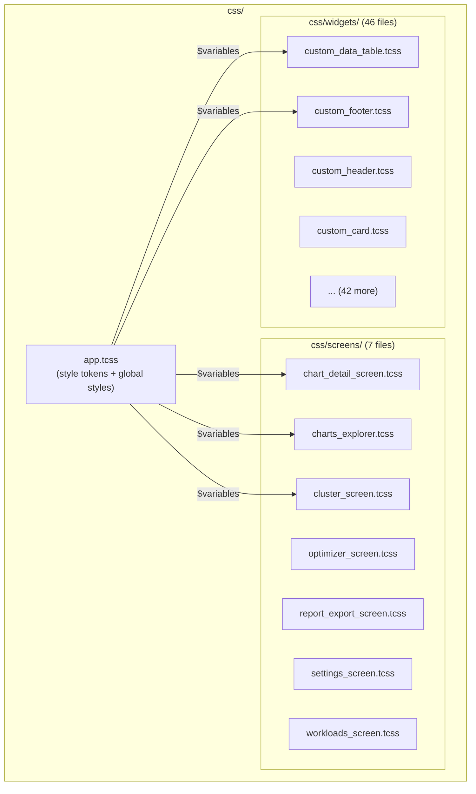
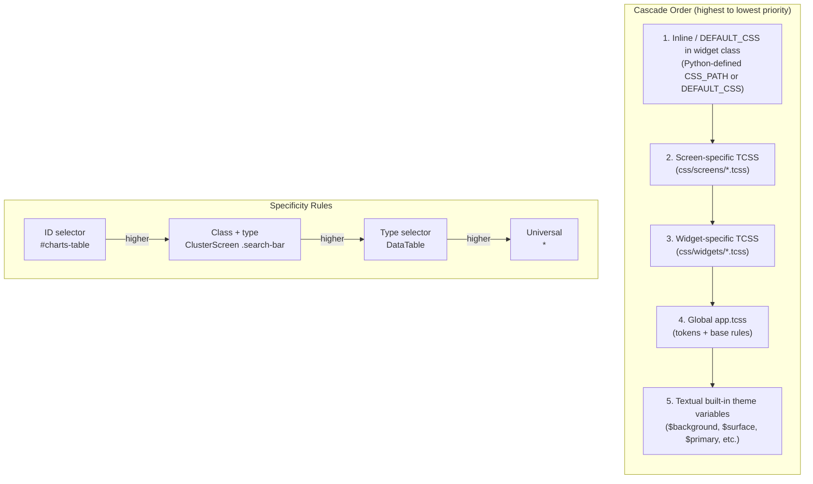
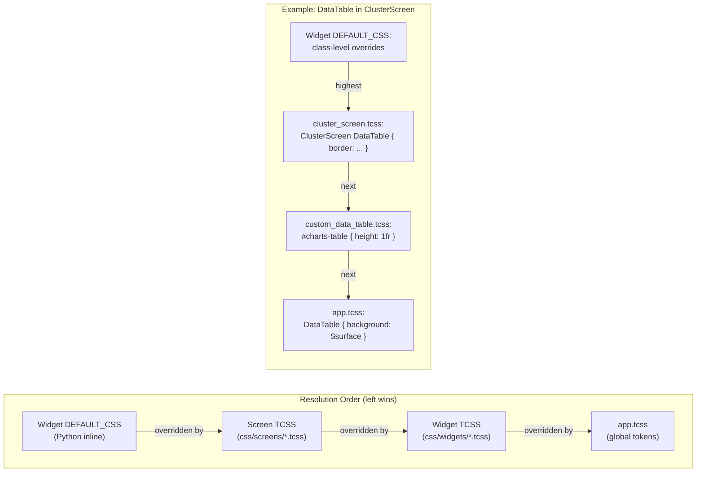

# CSS Styling Guide

Documentation for Textual CSS (TCSS) styling conventions.

## CSS Architecture



## CSS File Organization

```mermaid
graph TB
    subgraph "css/ (54 files total)"
        direction TB
        ROOT["app.tcss<br/>--- tokens + global rules ---"]

        subgraph "screens/ (7 files)"
            direction LR
            SC1["chart_detail_screen"]
            SC2["charts_explorer"]
            SC3["cluster_screen"]
            SC4["optimizer_screen"]
            SC5["report_export_screen"]
            SC6["settings_screen"]
            SC7["workloads_screen"]
        end

        subgraph "widgets/ (46 files)"
            direction TB
            subgraph "Containers (4)"
                WC1["custom_card"]
                WC2["custom_collapsible"]
                WC3["custom_containers"]
                WC4["custom_content_switcher"]
            end
            subgraph "Data (10)"
                WD1["custom_charts_table"]
                WD2["custom_data_table"]
                WD3["custom_events_table"]
                WD4["custom_kpi"]
                WD5["custom_node_table"]
                WD6["custom_table"]
                WD7["custom_table_builder"]
                WD8["custom_violations_table"]
                WD9["custom_status"]
                WD10["custom_digits"]
            end
            subgraph "Display (3)"
                WDP1["custom_markdown"]
                WDP2["custom_markdown_viewer"]
                WDP3["custom_rich_log"]
            end
            subgraph "Feedback (4)"
                WF1["custom_button"]
                WF2["custom_dialog"]
                WF3["custom_loading_indicator"]
                WF4["custom_progress_bar"]
            end
            subgraph "Filter (4)"
                WFI1["custom_filter_bar"]
                WFI2["custom_filter_chip"]
                WFI3["custom_filter_group"]
                WFI4["custom_search_bar"]
            end
            subgraph "Input (3)"
                WI1["custom_checkbox"]
                WI2["custom_input"]
                WI3["custom_text_area"]
            end
            subgraph "Selection (5)"
                WS1["custom_option_list"]
                WS2["custom_radio_button"]
                WS3["custom_radio_set"]
                WS4["custom_select"]
                WS5["custom_selection_list"]
            end
            subgraph "Special (5)"
                WSP1["custom_directory_tree"]
                WSP2["custom_link"]
                WSP3["custom_tree"]
                WSP4["loading"]
                WSP5["worker_mixin"]
            end
            subgraph "Structure (3)"
                WST1["custom_footer"]
                WST2["custom_header"]
                WST3["custom_rule"]
            end
            subgraph "Tabs (3)"
                WT1["custom_tab_pane"]
                WT2["custom_tabbed_content"]
                WT3["custom_tabs"]
            end
            subgraph "Other (2)"
                WO1["custom_static"]
                WO2["custom_switch"]
            end
        end
    end

    ROOT -->|"$tokens"| screens/
    ROOT -->|"$tokens"| widgets/
```



## CSS Cascade and Specificity



### Screen vs Widget CSS Override Flow

When a screen and widget both define styles for the same element, the following resolution
order determines which style wins:



**Key points:**
- Screen CSS can scope styles to specific screens using the screen class name: `ClusterScreen #nodes-table { ... }`
- Widget CSS applies globally to all instances of that widget
- `loading.tcss` and `worker_mixin.tcss` are special CSS files that style cross-cutting concerns (loading overlays, worker states) shared across multiple screens and widgets

### Directory Structure

```
css/
├── app.tcss              # Main stylesheet with tokens and global styles
├── screens/              # 7 screen-specific stylesheets
│   ├── chart_detail_screen.tcss
│   ├── charts_explorer.tcss
│   ├── cluster_screen.tcss
│   ├── optimizer_screen.tcss
│   ├── report_export_screen.tcss
│   ├── settings_screen.tcss
│   └── workloads_screen.tcss
└── widgets/              # 46 widget-specific stylesheets
    ├── custom_button.tcss
    ├── custom_card.tcss
    ├── custom_charts_table.tcss
    ├── custom_checkbox.tcss
    ├── custom_collapsible.tcss
    ├── custom_containers.tcss
    ├── custom_content_switcher.tcss
    ├── custom_data_table.tcss
    ├── custom_dialog.tcss
    ├── custom_digits.tcss
    ├── custom_directory_tree.tcss
    ├── custom_events_table.tcss
    ├── custom_filter_bar.tcss
    ├── custom_filter_chip.tcss
    ├── custom_filter_group.tcss
    ├── custom_footer.tcss
    ├── custom_header.tcss
    ├── custom_input.tcss
    ├── custom_kpi.tcss
    ├── custom_link.tcss
    ├── custom_loading_indicator.tcss
    ├── custom_markdown.tcss
    ├── custom_markdown_viewer.tcss
    ├── custom_node_table.tcss
    ├── custom_option_list.tcss
    ├── custom_progress_bar.tcss
    ├── custom_radio_button.tcss
    ├── custom_radio_set.tcss
    ├── custom_rich_log.tcss
    ├── custom_rule.tcss
    ├── custom_search_bar.tcss
    ├── custom_select.tcss
    ├── custom_selection_list.tcss
    ├── custom_static.tcss
    ├── custom_status.tcss
    ├── custom_switch.tcss
    ├── custom_tab_pane.tcss
    ├── custom_tabbed_content.tcss
    ├── custom_table.tcss
    ├── custom_table_builder.tcss
    ├── custom_tabs.tcss
    ├── custom_text_area.tcss
    ├── custom_tree.tcss
    ├── custom_violations_table.tcss
    ├── loading.tcss
    └── worker_mixin.tcss
```

## Screen TCSS File Reference

| File | Screen Class |
|------|--------------|
| `chart_detail_screen.tcss` | ChartDetailScreen |
| `charts_explorer.tcss` | ChartsExplorerScreen |
| `cluster_screen.tcss` | ClusterScreen |
| `optimizer_screen.tcss` | OptimizerScreen |
| `report_export_screen.tcss` | ReportExportScreen |
| `settings_screen.tcss` | SettingsScreen |
| `workloads_screen.tcss` | WorkloadsScreen |

## Style Tokens (`app.tcss`)

The main stylesheet defines shared design tokens consumed by all screen and widget stylesheets. Textual's built-in theme variables (`$background`, `$surface`, `$primary`, `$accent`, `$text`, `$text-muted`, `$success`, `$warning`, `$error`, etc.) are provided by the active theme and should not be redefined.

### Spacing Scale

```css
$spacing-xs: 4px;
$spacing-sm: 8px;
$spacing-md: 16px;
$spacing-lg: 24px;
$spacing-xl: 32px;
```

### Typography

```css
$font-family: "JetBrains Mono";
$font-size-xs: 10px;
$font-size-sm: 12px;
$font-size-md: 14px;
$font-size-lg: 16px;
$font-size-xl: 20px;
```

### Border Radius

```css
$border-radius-sm: 4px;
$border-radius-md: 8px;
$border-radius-lg: 12px;
```

### Border Strength Tokens

```css
$border-subtle: $surface-lighten-1 38%;
$border-default: $surface-lighten-1 55%;
$border-strong: $surface-lighten-1 72%;
```

### Z-Index Layers

```css
$layer-base: 0;
$layer-overlay: 10;
$layer-loading: 20;
$layer-modal: 30;
```

### Footer Tokens

```css
/* $footer-background, $footer-foreground, $footer-key-foreground are
   auto-generated by Textual from the active theme -- do NOT redefine them. */
$footer-border-color: $primary 55%;
$footer-separator-color: $footer-border-color;
$footer-status-color: $success;
```

### Form Control Tokens

```css
$control-border: $surface-lighten-1 45%;
$control-background: $surface-darken-2;
$control-foreground: $text;
$control-hover-background: $surface-darken-1;
$control-focus-border: $accent;
$control-focus-background: $accent 12%;
$control-focus-foreground: $text;
$control-disabled-border: $surface-darken-2;
$control-disabled-background: $surface-darken-3;
$control-disabled-foreground: $text-muted;
$control-selected-foreground: $primary;
$control-selected-background: $primary 20%;
$control-highlight-background: $accent 40%;
$control-separator-foreground: $surface-lighten-2;
```

### Toggle Tokens

```css
$toggle-track-on-border: $control-border;
$toggle-track-on-background: $control-background;
$toggle-slider-off-background: $control-hover-background;
$toggle-slider-off-foreground: $control-disabled-foreground;
$toggle-slider-on-background: $primary;
$toggle-indicator-on-foreground: $primary;
$toggle-indicator-off-foreground: $text-muted;
```

## Global Styles

### App Base

```css
App {
    background: $background;
    color: $text;
    overflow-x: hidden;
}
```

### Tooltip

```css
Tooltip {
    border: solid $primary 70%;
}
```

### Screen Base

```css
Screen {
    layers: base overlay;
    min-width: 80;
    background: $background;
    color: $text;
    overflow-x: hidden;
    overflow-y: hidden;
}

Screen > #base-content,
Screen > .main-content,
Screen > #main-content,
#base-content {
    height: 1fr;
    width: 100%;
}
```

### Primary Navigation Tabs

```css
#primary-nav-tabs-row {
    layout: horizontal;
    height: 3;
    min-height: 3;
    max-height: 3;
    width: 1fr;
    padding: 0;
    background: transparent;
    border-bottom: solid $border-subtle;
    content-align: left middle;
}

#primary-nav-tabs-row #primary-nav-tabs {
    width: 1fr;
    min-width: 0;
    max-width: 100%;
    height: 3;
    min-height: 3;
}
```

### DataTable

```css
DataTable {
    background: $surface;
    color: $text;
    overflow-x: auto;
    overflow-y: auto;
    scrollbar-size-horizontal: 1;
    scrollbar-size-vertical: 2;
}

DataTable > .datatable--header {
    background: $surface-darken-1;
    color: $text-muted;
    text-style: bold;
}

DataTable > .datatable--cursor,
DataTable:focus > .datatable--cursor {
    background: $primary 40%;
    color: $text;
    text-style: bold;
}

DataTable > .datatable--hover {
    background: $surface-lighten-1;
}

DataTable > .datatable--header-hover {
    background: $primary 20%;
}

DataTable > .datatable--header-cursor {
    background: $primary 35%;
    color: $text;
}

DataTable > .datatable--fixed {
    background: $surface-darken-1 60%;
}

DataTable > .datatable--fixed-cursor {
    background: $primary 25%;
    color: $text;
}

DataTable > .datatable--even-row {
    background: $surface-darken-1 35%;
}

DataTable > .datatable--odd-row {
    background: transparent;
}

CustomViolationsTable,
CustomEventsTable,
CustomChartsTable,
CustomNodeTable,
CustomDataTable > DataTable {
    scrollbar-size-horizontal: 1;
    scrollbar-size-vertical: 2;
}
```

### Container Inheritance

```css
Container,
Horizontal,
Vertical,
ScrollableContainer,
CustomContainer,
CustomHorizontal,
CustomVertical {
    color: $text;
}
```

### Global Switch Override

```css
Switch {
    & .switch--slider {
        color: $toggle-slider-off-foreground;
        background: $toggle-slider-off-background;
    }

    &.-on .switch--slider {
        color: $toggle-slider-on-background;
        background: $toggle-slider-off-background;
    }
}
```

### Global Scrollbar Standards

```css
* {
    scrollbar-size-horizontal: 1;
    scrollbar-size-vertical: 2;
    scrollbar-background: $surface-darken-2;
    scrollbar-background-hover: $surface-darken-1;
    scrollbar-background-active: $surface;
    scrollbar-color: $surface-lighten-1;
    scrollbar-color-hover: $accent;
    scrollbar-color-active: $accent;
    scrollbar-corner-color: $surface-darken-2;
}
```

### Status Classes

```css
.loading {
    color: $accent;
    text-style: italic;
}

.error {
    color: $error;
}

.success {
    color: $success;
}

.warning {
    color: $warning;
}
```

### Empty State Classes

```css
.empty-state {
    color: $text-muted;
    text-style: italic;
}

.empty-state-title {
    width: 1fr;
    min-width: 0;
    color: $text;
    text-style: bold;
    padding: 0 1;
    background: $surface-darken-2;
    border-left: heavy $primary;
    text-align: center;
    content-align: center middle;
    margin-bottom: 1;
}
```

### Stats Classes

```css
.stat-blocking {
    color: $error;
    text-style: bold;
}

.stat-critical {
    color: $error;
    text-style: bold;
}

.stat-high {
    color: $warning;
    text-style: bold;
}

.stat-medium {
    color: $warning;
}

.stat-safe {
    color: $success;
    text-style: bold;
}

.stat-total {
    color: $text;
}
```

### Risk Classes

```css
.risk-critical {
    color: $error;
    text-style: bold;
}

.risk-high {
    color: $warning;
    text-style: bold;
}

.risk-medium {
    color: $warning;
}

.risk-safe {
    color: $success;
}
```

### UI Panel / Section Classes

```css
.ui-panel-wrapper {
    border: round $border-subtle;
    background: $surface-darken-1 35%;
}

.ui-section-title {
    width: 1fr;
    min-width: 0;
    text-style: bold;
    color: $text;
    padding: 0 1;
    background: $surface-darken-2;
    border-left: heavy $primary;
    text-align: center;
    content-align: center middle;
    margin-bottom: 1;
}

.ui-actions-bar {
    border-top: solid $border-subtle;
    background: $surface;
}

.ui-loading-overlay {
    background: $surface-darken-1 75%;
}
```

### Loading Row / Indicator Styles

```css
#loading-row,
#viol-loading-row,
#rec-loading-row,
#alert-loading-row,
#activity-loading-row {
    width: 1fr;
    height: auto;
    layout: vertical;
    align: center middle;
    content-align: center middle;
    background: transparent;
}

#loading-indicator,
#viol-loading-indicator,
#rec-loading-indicator,
#alert-loading-indicator,
#activity-loading-indicator {
    dock: none;
    width: 1fr;
    height: 3;
    content-align: center middle;
    color: $accent;
}

#loading-message,
#viol-loading-message,
#rec-loading-message,
#alert-loading-message,
#activity-loading-message {
    width: 1fr;
    color: $accent;
    text-style: italic;
    text-align: center;
    content-align: center middle;
}
```

### Toast / Notification Styling

```css
ToastRack {
    align: right top;
}

Toast {
    border: none;
    background: $surface;
    color: $text;
}

Toast.-information {
    border-left: heavy $accent;
}

Toast.-warning {
    border-left: heavy $warning;
}

Toast.-error {
    border-left: heavy $primary;
}
```

### Error States

```css
.error-state {
    color: $error;
    text-style: italic;
}
```

## Screen-Specific Styles

### ClusterScreen (`cluster_screen.tcss`)

```css
ClusterScreen {
    background: $background;
    color: $text;
}

#cluster-search-bar {
    height: 5;
    min-height: 5;
    max-height: 5;
    padding: 0 1;
    background: $surface;
    border-bottom: solid $surface-lighten-2;
    align: left middle;
}
```

### ChartsExplorerScreen (`charts_explorer.tcss`)

```css
ChartsExplorerScreen {
    layout: vertical;
    background: $background;
    color: $text;
    padding: 0;
}

#charts-inner-switcher {
    height: 1fr;
    min-height: 0;
    padding: 0;
    margin: 0;
    border: none;
    background: transparent;
    overflow-y: hidden;
    overflow-x: hidden;
}
```

## Widget-Specific Styles

### CustomHeader

```css
Header {
    height: auto;
    min-height: 2;
    background: $surface-darken-1;
    color: $text;
}

Header > HeaderTitle {
    height: auto;
    padding: 0 1;
}
```

### CustomFooter

```css
CustomFooter {
    dock: bottom;
    height: auto;
    min-height: 2;
    background: $surface-darken-1;
    color: $text-muted;
    border-top: solid $accent;
    padding: 0 1;
}

CustomFooterHints {
    height: auto;
    color: $footer-foreground;
    padding: 0 2;
    text-align: left;
    background: $footer-background;
}

.widget-custom-footer-separator {
    color: $footer-separator-color;
    padding: 0 1;
}

.widget-custom-footer-status {
    color: $footer-status-color;
}
```

### CustomCard

```css
CustomCard {
    border: solid $border;
    padding: 1;
    background: $surface;
}

CustomCard .card-title {
    text-style: bold;
    color: $primary;
    margin-bottom: 1;
}
```

### CustomInput

```css
Input {
    margin-bottom: 1;
    border: solid $surface;
}

Input:focus {
    border: solid $primary;
}

.search-input {
    width: 30;
}

.search-input:focus {
    border: solid $accent;
    background: $surface-lighten-1;
}
```

### ContentSwitcher

```css
ContentSwitcher {
    height: 1fr;
    width: 100%;
}
```

### Spinner

```css
.spinner {
    color: $accent;
    width: auto;
    height: auto;
    min-width: 3;
    min-height: 1;
}
```

## Styling Patterns

### Container Layout

```css
/* Horizontal layout */
.row {
    layout: horizontal;
    height: auto;
}

/* Vertical layout */
.column {
    layout: vertical;
    width: 100%;
}

/* Grid layout */
.grid-2x2 {
    grid-size: 2 2;
    grid-gutter: 1;
}
```

### Docking

```css
.dock-top { dock: top; }
.dock-bottom { dock: bottom; }
.dock-left { dock: left; }
.dock-right { dock: right; }
```

### Visibility

```css
.hidden { display: none; }
.invisible { visibility: hidden; }
```

### Loading States

```css
.loading-indicator {
    color: $accent;
    text-style: italic;
}

.loading-indicator.hidden {
    display: none;
}

#loading-row {
    height: auto;
    align: center middle;
    display: none;
}

#loading-row.active {
    display: block;
}
```

### Error States

```css
.error-message {
    color: $error;
    padding: 2;
    align: center middle;
}

.error-state {
    color: $error;
    text-style: italic;
}
```

### Selection Modal Dialog Pattern

The `app.tcss` defines a comprehensive selection modal pattern used across screens:

```css
.selection-modal-screen {
    align: center middle;
    background: $background 40%;
}

.selection-modal-shell {
    layout: vertical;
    width: 1fr;
    max-width: 100%;
    max-height: 90%;
    padding: 1;
    border: round $border-default;
    background: $surface;
}

.selection-modal-actions {
    dock: bottom;
    layout: horizontal;
    align: center middle;
    content-align: center middle;
}
```

## CSS Best Practices

### 1. Use Token Variables

```css
/* Good: Use theme tokens */
.my-widget {
    background: $surface;
    color: $text;
    border: solid $primary;
}

/* Avoid: Hard-coded colors */
.my-widget {
    background: #16213e;  /* Don't do this */
    color: #eaeaea;       /* Don't do this */
}
```

### 2. Scoped Selectors

```css
/* Good: Scoped to screen */
ClusterScreen #cluster-search-bar {
    padding: 1;
}

/* Good: Scoped to widget */
CustomCard .card-title {
    color: $primary;
}

/* Avoid: Global unscoped selectors */
.title {  /* Too generic */
    color: $primary;
}
```

### 3. Widget ID Patterns

```css
/* Specific IDs scoped to their screen */
#charts-table {
    height: 1fr;
}

#cluster-status-bar {
    dock: bottom;
}

/* Combine screen and widget */
ClusterScreen #nodes-table {
    overflow-y: auto;
}
```

### 4. Responsive Heights

```css
/* Fill available space */
.content { height: 1fr; }

/* Auto height for content */
.header { height: auto; }

/* Fixed max height */
.summary {
    height: auto;
    max-height: 10;
}
```

### 5. Consistent Spacing

```css
/* Use spacing variables */
.section {
    margin-bottom: 1;  /* Uses default spacing */
    padding: 1 2;      /* vertical horizontal */
}
```

### 6. Use Shared UI Panel Classes

The `app.tcss` provides reusable panel and section classes:

```css
/* Use .ui-panel-wrapper for bordered sections */
.ui-panel-wrapper {
    border: round $border-subtle;
    background: $surface-darken-1 35%;
}

/* Use .ui-section-title for section headers */
.ui-section-title {
    text-style: bold;
    color: $text;
    background: $surface-darken-2;
    border-left: heavy $primary;
}
```

## Loading CSS in Code

### Widget CSS Path

```python
class CustomCard(CompositeWidget):
    """Card widget with CSS."""
    CSS_PATH = "css/widgets/custom_card.tcss"
```

### Screen CSS Path

```python
class ClusterScreen(BaseScreen):
    """Screen with CSS."""
    CSS_PATH = "css/screens/cluster_screen.tcss"
```

### App CSS

```python
class EKSHelmReporterApp(App):
    """App with main CSS."""
    CSS_PATH = "css/app.tcss"
```

## Cross-References

- [Widget Usage](../best-practices/widget-usage.md) - Widget styling patterns
- [Code Conventions](../conventions/code-conventions.md) - CSS naming conventions
