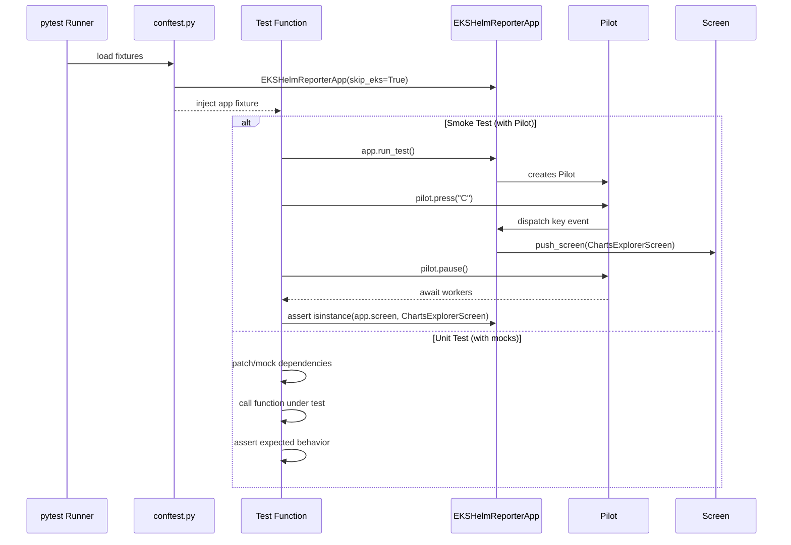
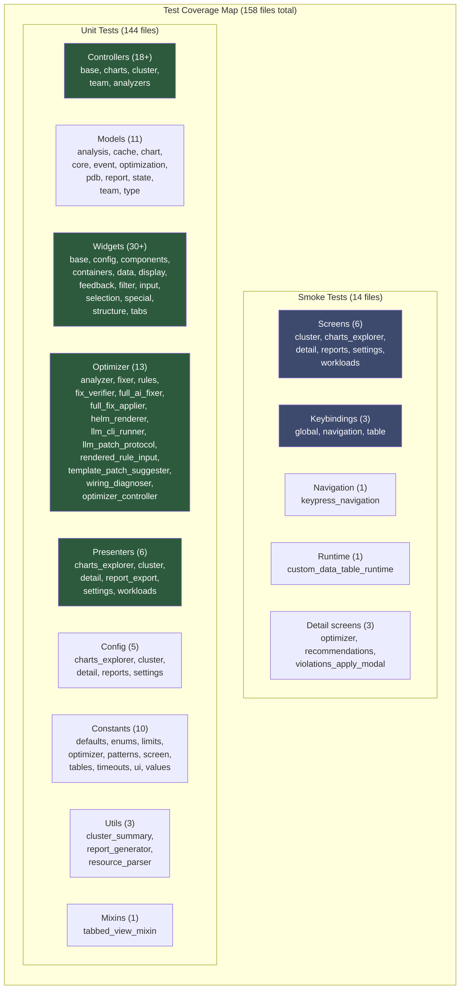
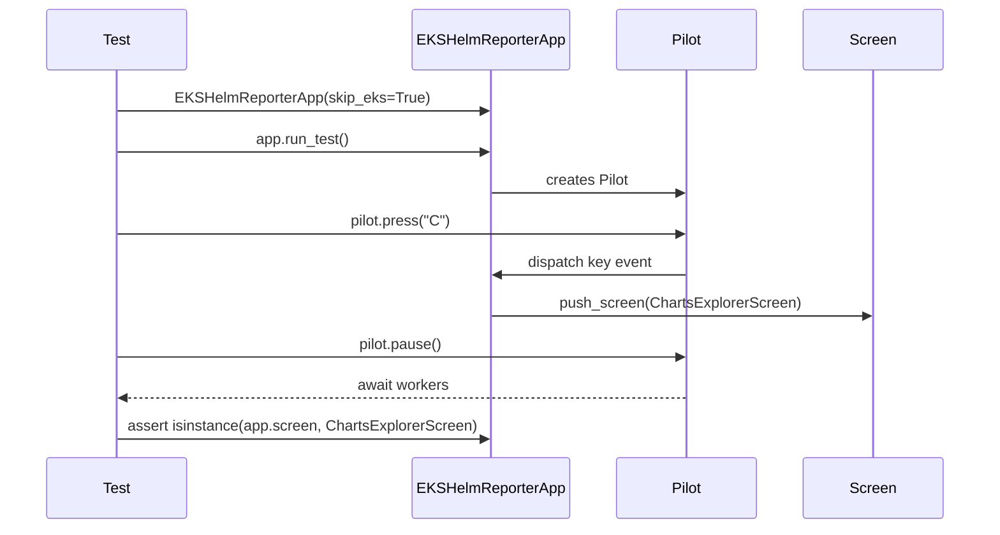

# Testing Guide

Documentation for the TUI testing infrastructure and patterns.

## Test Architecture

```mermaid
graph TD
    subgraph "tests/"
        CONFTEST["conftest.py<br/>(shared app fixture)"]

        subgraph "tui/smoke/ (14 test files)"
            S1["test_keypress_navigation.py"]
            S2["test_custom_data_table_runtime.py"]
            S3["keybindings/"]
            S4["screens/"]
        end

        subgraph "tui/unit/ (144 test files)"
            U1["test_app.py"]
            U2["test_base_screen.py"]
            U3["test_footer_widget.py"]
            U4["test_screen_data_loader.py"]
            U5["controllers/ models/ config/<br/>mixins/ presenters/ optimizer/<br/>constants/ utils/ widgets/"]
        end
    end

    CONFTEST -->|"app fixture"| S1
    CONFTEST -->|"app fixture"| U1
    PILOT["Textual Pilot"] -->|"drives"| S1
    PYTEST["pytest + AsyncMock"] -->|"drives"| U1

    style CONFTEST fill:#2d5a3d
    style PILOT fill:#3d4a6d
    style PYTEST fill:#3d4a6d
```



## Test Pyramid

```mermaid
graph TB
    subgraph "Test Pyramid (158 test files total)"
        direction TB
        SMOKE["Smoke Tests (14 files)<br/>Runtime behavior with Textual Pilot<br/>Full navigation + data loading flows"]
        UNIT["Unit Tests (144 files)<br/>Isolated component verification<br/>pytest + AsyncMock"]
    end

    SMOKE --- UNIT

    style SMOKE fill:#3d4a6d
    style UNIT fill:#2d5a3d
```



## Test Execution Flow



## Test Coverage by Component



## Test Organization

```
tests/
├── conftest.py               # Shared app fixture (EKSHelmReporterApp)
├── fixtures/                 # Shared test fixtures
└── tui/
    ├── smoke/                # Smoke tests (14 test files)
    │   ├── test_keypress_navigation.py
    │   ├── test_custom_data_table_runtime.py
    │   ├── keybindings/      # Keybinding-specific smoke tests
    │   │   ├── test_global_bindings.py
    │   │   ├── test_navigation_bindings.py
    │   │   └── test_table_bindings.py
    │   └── screens/          # Screen-specific smoke tests
    │       ├── charts_explorer/
    │       │   └── test_charts_explorer_screen.py
    │       ├── cluster/
    │       │   └── test_cluster_screen.py
    │       ├── detail/
    │       │   ├── test_chart_detail_screen.py
    │       │   ├── test_optimizer_screen.py
    │       │   ├── test_recommendations_view.py
    │       │   └── test_violations_apply_modal.py
    │       ├── home/
    │       ├── reports/
    │       │   └── test_report_export_screen.py
    │       ├── settings/
    │       │   └── test_settings_screen.py
    │       └── workloads/
    │           └── test_workloads_screen.py
    └── unit/                 # Unit tests (144 test files)
        ├── test_app.py
        ├── test_app_startup_screen.py
        ├── test_base_screen.py
        ├── test_cache_manager.py
        ├── test_charts_explorer_refresh.py
        ├── test_charts_explorer_summary_kpis.py
        ├── test_cluster_refresh_overlays.py
        ├── test_cluster_screen_fix_regression.py
        ├── test_cluster_screen_loading_watchdog.py
        ├── test_cluster_screen_phase3.py
        ├── test_concurrent.py
        ├── test_custom_data_table.py
        ├── test_fix_details_modal.py
        ├── test_footer_widget.py
        ├── test_modularization.py
        ├── test_optimizer_unit.py
        ├── test_screen_data_loader.py
        ├── test_settings_screen_actions.py
        ├── test_settings_screen_layout.py
        ├── test_theme_css_assignment.py
        ├── test_ai_full_fix_bulk_modal.py
        ├── test_violations_view_ai_full_fix_entry.py
        ├── test_worker_mixin.py
        ├── test_workloads_node_analysis_drilldown.py
        ├── test_workloads_streaming.py
        ├── config/           # Screen config tests
        │   ├── test_charts_explorer_config.py
        │   ├── test_cluster_config.py
        │   ├── test_detail_config.py
        │   ├── test_reports_config.py
        │   └── test_settings_config.py
        ├── constants/        # Constants tests
        │   ├── test_defaults.py
        │   ├── test_enums.py
        │   ├── test_limits.py
        │   ├── test_optimizer_constants.py
        │   ├── test_patterns.py
        │   ├── test_screen_constants.py
        │   ├── test_tables.py
        │   ├── test_timeouts.py
        │   ├── test_ui.py
        │   └── test_values.py
        ├── controllers/      # Controller tests
        │   ├── analyzers/    # (distribution, event, pdb analyzers)
        │   ├── base/         # (base controller)
        │   ├── charts/       # (chart fetcher, parser, controller, release fetcher)
        │   ├── cluster/      # (cluster controller, fetcher, event/node/pod fetcher+parser, top metrics)
        │   └── team/         # (team controller, fetcher, mapper, parser)
        ├── mixins/           # Mixin tests
        │   └── test_tabbed_view_mixin.py
        ├── models/           # Model tests
        │   ├── state/        # (config manager)
        │   ├── test_analysis_models.py
        │   ├── test_cache_models.py
        │   ├── test_chart_models.py
        │   ├── test_core_models.py
        │   ├── test_event_models.py
        │   ├── test_optimization_models.py
        │   ├── test_pdb_models.py
        │   ├── test_report_models.py
        │   ├── test_state_models.py
        │   ├── test_team_models.py
        │   └── test_type_models.py
        ├── optimizer/        # Optimizer tests
        │   ├── test_analyzer.py
        │   ├── test_fix_verifier.py
        │   ├── test_fixer.py
        │   ├── test_full_ai_fixer.py
        │   ├── test_full_fix_applier.py
        │   ├── test_helm_renderer.py
        │   ├── test_llm_cli_runner.py
        │   ├── test_llm_patch_protocol.py
        │   ├── test_optimizer_controller.py
        │   ├── test_rendered_rule_input.py
        │   ├── test_rules.py
        │   ├── test_template_patch_suggester.py
        │   └── test_wiring_diagnoser.py
        ├── presenters/       # Presenter tests
        │   ├── test_charts_explorer_presenter.py
        │   ├── test_cluster_presenter.py
        │   ├── test_detail_presenter.py
        │   ├── test_report_export_presenter.py
        │   ├── test_settings_presenter.py
        │   └── test_workloads_presenter.py
        ├── utils/            # Utility tests
        │   ├── test_cluster_summary.py
        │   ├── test_report_generator.py
        │   └── test_resource_parser.py
        └── widgets/          # Widget tests
            ├── test_base_widget.py
            ├── test_widget_config.py
            ├── components/   # (chart_detail_view, pod_list)
            ├── containers/   # (custom_card, custom_containers)
            ├── data/
            │   ├── indicators/   # (custom_status)
            │   ├── kpi/          # (custom_kpi)
            │   └── tables/       # (custom_charts_table, custom_data_table,
            │                     #  custom_events_table, custom_node_table,
            │                     #  custom_table, custom_table_builder,
            │                     #  custom_violations_table, interfaces,
            │                     #  table_builder, table_component)
            ├── display/      # (custom_digits, custom_markdown, custom_rich_log, custom_static)
            ├── feedback/     # (custom_button, custom_dialog, custom_loading_indicator)
            ├── filter/       # (custom_filter_bar, custom_filter_chip, custom_filter_group, custom_search_bar)
            ├── input/        # (custom_checkbox, custom_input, custom_text_area)
            ├── selection/    # (custom_option_list, custom_radio_button, custom_radio_set,
            │                 #  custom_selection_list, custom_switch)
            ├── special/      # (custom_content_switcher, custom_directory_tree, custom_link, custom_tree)
            ├── structure/    # (custom_footer, custom_header, custom_rule)
            └── tabs/         # (custom_tab_pane, custom_tabbed_content, custom_tabs)
```

## Fixtures (`conftest.py`)

The root `conftest.py` provides the core app fixture:

```python
# tests/conftest.py
import pytest
from kubeagle.app import EKSHelmReporterApp


@pytest.fixture
def app() -> EKSHelmReporterApp:
    """Create an EKSHelmReporterApp instance for testing.

    This fixture provides a fresh app instance for each test.
    The app is configured with minimal settings to avoid external dependencies.
    """
    return EKSHelmReporterApp(skip_eks=True)
```

### Key Patterns for Fixtures

#### Basic Data Fixtures

```python
@pytest.fixture
def sample_chart_info() -> ChartInfo:
    """Sample ChartInfo for basic unit testing."""
    return ChartInfo(
        name="test-chart",
        team="team-alpha",
        values_file="values.yaml",
        cpu_request=100,
        cpu_limit=200,
        memory_request=128,
        memory_limit=256,
        qos_class=QoSClass.BURSTABLE,
        has_liveness=True,
        has_readiness=True,
        has_startup=False,
        has_anti_affinity=True,
        has_topology_spread=False,
        has_topology=False,
        pdb_enabled=True,
        pdb_template_exists=True,
        pdb_min_available=1,
        pdb_max_unavailable=None,
        replicas=2,
        priority_class=None,
    )
```

#### Session-Scoped Controller Mocks

```python
@pytest.fixture(scope="session")
def mock_cluster_controller(
    mock_node_info_list,
    mock_event_summary,
    mock_pdb_list,
) -> Generator[MagicMock, None, None]:
    """Mock ClusterController with all async methods."""
    with patch(
        "kubeagle.controllers.cluster_controller.ClusterController"
    ) as mock_cls:
        instance = MagicMock()
        instance.check_cluster_connection = AsyncMock(return_value=True)
        instance.fetch_nodes = AsyncMock(return_value=mock_node_info_list)
        instance.get_event_summary = AsyncMock(return_value=mock_event_summary)
        instance.fetch_pdbs = AsyncMock(return_value=mock_pdb_list)

        mock_cls.return_value = instance
        yield instance
```

#### App State Fixtures

```python
@pytest.fixture
def mock_app_state() -> AppState:
    """Mock AppState with realistic state data."""
    state = AppState()
    state.cluster_connected = True
    state.loading_state = AppStateEnum.IDLE
    state.nodes = [...]
    state.charts = [...]
    return state
```

## Smoke Tests

Smoke tests verify runtime behavior using Textual's Pilot. They exercise the full navigation and data loading flow with real workers (not `testing=True` mode).

### Test Flow



### Navigation Tests

```python
# tests/tui/smoke/test_keypress_navigation.py
import pytest
from pathlib import Path

from kubeagle.app import EKSHelmReporterApp
from kubeagle.screens import (
    ChartsExplorerScreen,
    OptimizerScreen,
)
from kubeagle.widgets import CustomDataTable


class TestChartsExplorerScreenWithDataNavigation:
    """Test ChartsExplorerScreen navigation via keypress with real data loading."""

    @pytest.mark.asyncio
    async def test_navigate_to_charts_explorer(self):
        """Test navigation to charts explorer screen."""
        app = EKSHelmReporterApp(skip_eks=True)
        async with app.run_test() as pilot:
            await pilot.press("C")
            assert isinstance(app.screen, ChartsExplorerScreen)

    @pytest.mark.asyncio
    async def test_navigate_to_cluster(self):
        """Test navigation to cluster screen."""
        app = EKSHelmReporterApp(skip_eks=True)
        async with app.run_test() as pilot:
            await pilot.press("c")
            assert "Cluster" in app.screen.__class__.__name__
```

### Keybinding Tests

```python
@pytest.mark.asyncio
async def test_global_keybindings():
    """Test global keybindings work."""
    app = EKSHelmReporterApp(skip_eks=True)
    async with app.run_test() as pilot:
        await pilot.press("c")  # Cluster
        assert "Cluster" in app.screen.__class__.__name__

        await pilot.press("escape")  # Back

        await pilot.press("C")  # Charts Explorer
        assert "ChartsExplorer" in app.screen.__class__.__name__


@pytest.mark.asyncio
async def test_tab_switching():
    """Test tab switching in ClusterScreen."""
    app = EKSHelmReporterApp(skip_eks=True)
    async with app.run_test() as pilot:
        await pilot.press("c")  # Go to cluster

        # Switch tabs (1=Nodes, 2=Workloads, 3=Events)
        await pilot.press("1")
        await pilot.press("2")
        await pilot.press("3")
```

## Unit Tests

Detailed verification of individual components using pytest and AsyncMock.

### Controller Tests

```python
# tests/tui/unit/test_controllers_unit.py
@pytest.mark.asyncio
async def test_cluster_controller_fetch_nodes(mock_cluster_controller):
    """Test ClusterController.fetch_nodes."""
    controller = mock_cluster_controller
    nodes = await controller.fetch_nodes()

    assert len(nodes) == 3
    assert nodes[0].name.startswith("ip-10")
    assert nodes[0].status == NodeStatus.READY
```

### Widget Tests

```python
# tests/tui/unit/test_footer_widget.py
from textual.app import App
from kubeagle.widgets import CustomFooter


class FooterTestApp(App):
    """Test app for footer widget."""
    BINDINGS = [
        ("r", "refresh", "Refresh"),
        ("q", "quit", "Quit"),
    ]

    def compose(self):
        yield CustomFooter()


@pytest.mark.asyncio
async def test_footer_displays_bindings():
    """Test footer shows keybinding hints."""
    app = FooterTestApp()
    async with app.run_test() as pilot:
        footer = app.query_one(CustomFooter)
        assert footer is not None
```

### Screen Data Loader Tests

```python
# tests/tui/unit/test_screen_data_loader.py
@pytest.mark.asyncio
async def test_screen_data_loader_on_mount():
    """Test ScreenDataLoader calls load_data on mount."""
    # ... test implementation
```

## Testing Patterns

### Testing Screens with Pilot

```python
@pytest.mark.asyncio
async def test_screen_composition():
    """Test screen composes correctly."""
    app = EKSHelmReporterApp(skip_eks=True)
    async with app.run_test() as pilot:
        header = app.query_one("CustomHeader")
        footer = app.query_one("CustomFooter")

        assert header is not None
        assert footer is not None


@pytest.mark.asyncio
async def test_screen_with_data(mock_charts_controller):
    """Test screen with mocked data."""
    app = EKSHelmReporterApp(skip_eks=True)
    async with app.run_test() as pilot:
        await pilot.press("C")  # Navigate to ChartsExplorerScreen
        await pilot.pause()     # Wait for data

        table = app.query_one("#charts-table")
        assert table.row_count > 0
```

### Testing with Mocked Controllers

```python
@pytest.fixture
def app_with_mocked_controller(mock_cluster_controller):
    """App with mocked controller."""
    app = EKSHelmReporterApp(skip_eks=True)
    app._cluster_controller = mock_cluster_controller
    return app


@pytest.mark.asyncio
async def test_with_mocked_data(app_with_mocked_controller):
    """Test with mocked controller data."""
    app = app_with_mocked_controller
    async with app.run_test() as pilot:
        await pilot.press("c")  # Cluster screen
        nodes = await app._cluster_controller.fetch_nodes()
        assert len(nodes) == 3
```

### Testing Async Workers

```python
@pytest.mark.asyncio
async def test_worker_loading():
    """Test worker loading state."""
    app = EKSHelmReporterApp(skip_eks=True)
    async with app.run_test() as pilot:
        await pilot.press("c")

        screen = app.screen
        # Worker starts loading
        assert screen.is_loading or not screen.is_loading  # May complete fast

        await pilot.pause()
        assert not screen.is_loading
```

## Test Configuration

### pyproject.toml (pytest section)

```ini
[tool.pytest.ini_options]
asyncio_mode = "auto"
testpaths = ["kubeagle/tests"]
python_files = "test_*.py"
python_functions = "test_*"
filterwarnings = ["ignore::DeprecationWarning"]
markers = [
    "slow: marks tests as slow (deselect with '-m \"not slow\"')",
    "smoke: fast runtime checks for CI smoke budget",
    "integration: marks tests as integration tests",
]
```

### Running Tests

```bash
# Run all tests
pytest

# Run smoke tests only
pytest kubeagle/tests/tui/smoke/

# Run unit tests only
pytest kubeagle/tests/tui/unit/

# Run with coverage
pytest --cov=kubeagle

# Run specific test file
pytest kubeagle/tests/tui/smoke/test_keypress_navigation.py -v

# Run specific test class
pytest kubeagle/tests/tui/smoke/test_keypress_navigation.py::TestChartsExplorerScreenWithDataNavigation -v

# Run with verbose output
pytest -v

# Run only smoke-marked tests
pytest -m smoke
```

## Best Practices

### 1. Use Fixtures for Data

```python
# Good: Use fixtures
def test_with_chart(sample_chart_info):
    assert sample_chart_info.name == "test-chart"

# Avoid: Creating data inline
def test_without_fixture():
    chart = ChartInfo(...)  # Don't repeat this everywhere
```

### 2. Session-Scoped for Expensive Setup

```python
# Good: Session scope for expensive mocks
@pytest.fixture(scope="session")
def mock_cluster_controller():
    ...

# Use function scope for mutable state
@pytest.fixture
def mock_app_state():
    ...
```

### 3. Use Pilot for UI Tests

```python
# Good: Use Pilot for screen tests
@pytest.mark.asyncio
async def test_screen():
    app = EKSHelmReporterApp(skip_eks=True)
    async with app.run_test() as pilot:
        await pilot.press("key")
        await pilot.pause()  # Wait for updates
```

### 4. Test Loading States

```python
@pytest.mark.asyncio
async def test_loading_states():
    """Test loading, success, and error states."""
    app = EKSHelmReporterApp(skip_eks=True)
    async with app.run_test() as pilot:
        await pilot.press("c")

        screen = app.screen

        # May catch loading state
        if screen.is_loading:
            loading = app.query_one("#loading-indicator")
            assert loading.display == True

        await pilot.pause()
        assert not screen.is_loading
```

### 5. Clean Up Resources

```python
@pytest.fixture
def app_with_cleanup():
    """App fixture with cleanup."""
    app = EKSHelmReporterApp(skip_eks=True)
    yield app
    app._cleanup()
```

### 6. Actual Screens Used in Tests

When writing tests, use only screens that exist in the codebase:

| Screen | Import | Nav Key |
|--------|--------|---------|
| ClusterScreen | `from kubeagle.screens.cluster import ClusterScreen` | `c` |
| ChartsExplorerScreen | `from kubeagle.screens.charts_explorer import ChartsExplorerScreen` | `C` |
| OptimizerScreen | `from kubeagle.screens.detail import OptimizerScreen` | `R` |
| ReportExportScreen | `from kubeagle.screens.reports import ReportExportScreen` | `e` |
| SettingsScreen | `from kubeagle.screens.settings import SettingsScreen` | `Ctrl+s` |
| ChartDetailScreen | `from kubeagle.screens.detail import ChartDetailScreen` | (via chart select) |
| WorkloadsScreen | `from kubeagle.screens.cluster import WorkloadsScreen` | (via cluster tab) |

## Cross-References

- [Screen Composition](../best-practices/screen-composition.md) - Screen patterns for testing
- [Keyboard Bindings](../keyboard/keybindings.md) - Navigation keys used in tests
