# Widget Categories

This document describes the widget categories and their purposes.

## Category Overview

```mermaid
graph TD
    subgraph "widgets/"
        A[containers/] --> A1[CustomCard]
        A --> A2[CustomCollapsible]
        A --> A3["CustomContainer / CustomHorizontal / CustomVertical"]

        B[data/] --> B1[indicators/]
        B --> B2[kpi/]
        B --> B3[tables/]
        B1 --> B1a[CustomStatusIndicator]
        B1 --> B1b[CustomErrorRetryWidget]
        B1 --> B1c[CustomLastUpdatedWidget]
        B2 --> B2a[CustomKPI]
        B3 --> B3a[CustomDataTable]
        B3 --> B3b[CustomChartsTable]
        B3 --> B3c[CustomNodeTable]
        B3 --> B3d[CustomEventsTable]
        B3 --> B3e[CustomViolationsTable]
        B3 --> B3f["CustomTableBase / CustomTableMixin"]
        B3 --> B3g["CustomTableBuilder / CustomColumnDef"]
        B3 --> B3h["DataTableBuilder"]
        B3 --> B3i["GenericTableComponent"]
        B3 --> B3j["IDataProvider (protocol)"]

        C[display/] --> C1[CustomStatic]
        C --> C2[CustomMarkdown]
        C --> C3[CustomMarkdownViewer]
        C --> C4[CustomDigits]
        C --> C5[CustomProgressBar]
        C --> C6[CustomRichLog]

        D[feedback/] --> D1[CustomButton]
        D --> D2[CustomConfirmDialog]
        D --> D3[CustomInputDialog]
        D --> D4[CustomActionDialog]
        D --> D5[CustomHelpDialog]
        D --> D6[CustomDialogFactory]
        D --> D7[CustomLoadingIndicator]

        E[filter/] --> E1[CustomSearchBar]
        E --> E2[CustomFilterButton]
        E --> E3[CustomFilterBar]
        E --> E4[CustomFilterStats]
        E --> E5[CustomFilterChip]
        E --> E6[CustomFilterGroup]

        F[input/] --> F1[CustomInput]
        F --> F2[CustomCheckbox]
        F --> F3[CustomTextArea]

        G[selection/] --> G1[CustomRadioSet]
        G --> G2[CustomRadioButton]
        G --> G3[CustomOptionList]
        G --> G4[CustomSelect]
        G --> G5[CustomSelectionList]
        G --> G6[CustomSwitch]

        H[special/] --> H1[CustomTree]
        H --> H2[CustomDirectoryTree]
        H --> H3[CustomContentSwitcher]
        H --> H4[CustomLink]

        I[structure/] --> I1[CustomHeader]
        I --> I2[CustomFooter]
        I --> I3[CustomRule]

        J[tabs/] --> J1[CustomTab]
        J --> J2[CustomTabs]
        J --> J3[CustomTabbedContent]
        J --> J4[CustomTabPane]
    end
```



| Category | Purpose | Widget Count |
|----------|---------|--------------|
| `containers/` | Layout and grouping | 5 |
| `data/` | Data display (tables, KPIs, indicators) | 16 |
| `display/` | Text and visual rendering | 6 |
| `feedback/` | User feedback (buttons, dialogs, loading) | 7 |
| `filter/` | Search and filtering | 6 |
| `input/` | User input fields | 3 |
| `selection/` | Selection controls | 6 |
| `special/` | Special-purpose widgets | 4 |
| `structure/` | Page structure (header, footer) | 3 |
| `tabs/` | Tab navigation | 4 |
| **Total** | | **60+** |

## Containers (`containers/`)

Layout and grouping widgets for organizing content.

### CustomCard

Card container with title. Inherits from `Container`.

```python
from kubeagle.widgets import CustomCard

# Usage
CustomCard(
    title="Resource Usage",
    id="resource-card",
)
```

**Constructor:**

```python
def __init__(self, title: str = "", id: str | None = None, classes: str = ""):
```

**Features:**
- Title support via `set_title()` method
- `card_title` property to read the title
- CSS class: `widget-custom-card`

### CustomCollapsible

Collapsible container that can expand/collapse its content.

```python
from kubeagle.widgets.containers import CustomCollapsible

CustomCollapsible(
    title="Advanced Options",
    collapsed=True,
    id="advanced",
)
```

### CustomContainer, CustomHorizontal, CustomVertical

Extended container types wrapping Textual's `Container` with standardized CSS.

```python
from kubeagle.widgets import (
    CustomContainer,
    CustomHorizontal,
    CustomVertical,
)

# Generic container
with CustomContainer(classes="wrapper"):
    yield Widget1()
    yield Widget2()

# Horizontal layout
with CustomHorizontal(classes="row"):
    yield Widget1()
    yield Widget2()

# Vertical layout
with CustomVertical(classes="column"):
    yield Widget1()
    yield Widget2()
```

**CSS Classes:** `widget-custom-container`, `widget-custom-horizontal`, `widget-custom-vertical`

## Data (`data/`)

Widgets for displaying data in various formats.

### Tables (`data/tables/`)

| File | Exports | Purpose |
|------|---------|---------|
| `custom_data_table.py` | `CustomDataTable` | Base table wrapping Textual DataTable |
| `custom_charts_table.py` | `CustomChartsTable` | Charts display with column configuration |
| `custom_node_table.py` | `CustomNodeTable` | Node status table |
| `custom_events_table.py` | `CustomEventsTable` | Cluster events table |
| `custom_violations_table.py` | `CustomViolationsTable` | Optimization violations |
| `custom_table.py` | `CustomTableBase`, `CustomTableMixin` | Generic table base and mixin |
| `custom_table_builder.py` | `CustomTableBuilder`, `CustomColumnDef` | Programmatic table construction |
| `interfaces.py` | `IDataProvider` | Table data provider protocol (ABC) |
| `table_builder.py` | `DataTableBuilder` | Builder pattern for Textual DataTable |
| `table_component.py` | `GenericTableComponent` | Generic wrapper for DataTable operations |

```python
from kubeagle.widgets import CustomDataTable

# Basic table -- inherits from Container, wraps Textual DataTable
table = CustomDataTable(
    columns=[("Chart Name", "name"), ("Team", "team"), ("CPU", "cpu")],
    id="my-table",
    zebra_stripes=True,
)

# Add columns dynamically
table.add_column("Memory", key="memory")

# Add rows
table.add_row("service-1", "Frontend", "50%", "256Mi")
table.add_row("service-2", "Backend", "100%", "512Mi")

# Sort
table.sort("name", reverse=False)

# Clear
table.clear()
```

### Indicators (`data/indicators/`)

| File | Exports | Purpose |
|------|---------|---------|
| `custom_status.py` | `CustomStatusIndicator` | Status badge with color-coded dot |
| `custom_status.py` | `CustomErrorRetryWidget` | Error message with retry button |
| `custom_status.py` | `CustomLastUpdatedWidget` | Last-updated timestamp display |

```python
from kubeagle.widgets import CustomStatusIndicator

# Status indicator -- inherits from Container
CustomStatusIndicator(
    status="success",  # success, warning, error, info
    label="Cluster Status",
)
```

```python
from kubeagle.widgets.data.indicators import CustomErrorRetryWidget, CustomLastUpdatedWidget

# Error with retry
CustomErrorRetryWidget(error_message="Connection failed")

# Last updated
CustomLastUpdatedWidget(timestamp="2024-01-15 10:30")
```

### KPIs (`data/kpi/`)

| File | Exports | Purpose |
|------|---------|---------|
| `custom_kpi.py` | `CustomKPI` | Key Performance Indicator display |

```python
from kubeagle.widgets import CustomKPI

# KPI widget -- inherits from StatefulWidget
CustomKPI(
    title="CPU Usage",
    value="75%",
    status="warning",  # success, warning, error, info
)
```

## Display (`display/`)

Widgets for text and visual rendering.

| File | Purpose |
|------|---------|
| `custom_static.py` | Static text display |
| `custom_markdown.py` | Markdown rendering |
| `custom_markdown_viewer.py` | Extended markdown viewer with scrolling |
| `custom_digits.py` | Large numeric display |
| `custom_progress_bar.py` | Progress bar indicator |
| `custom_rich_log.py` | Rich text logging |

```python
from kubeagle.widgets import (
    CustomStatic,
    CustomMarkdown,
    CustomDigits,
)
from kubeagle.widgets.display import (
    CustomMarkdownViewer,
    CustomProgressBar,
)

# Static text
CustomStatic("Status: Connected", classes="success")

# Markdown content
CustomMarkdown("""
# Chart Summary
- Total: 50 charts
- With PDB: 45 charts
- Without PDB: 5 charts
""")

# Markdown viewer (scrollable, extended)
CustomMarkdownViewer(content="# Report\n...", id="report-viewer")

# Large digits
CustomDigits("42", id="chart-count")

# Progress bar
CustomProgressBar(total=100, progress=75, id="scan-progress")
```

## Feedback (`feedback/`)

Widgets for user feedback and actions.

| File | Exports | Purpose |
|------|---------|---------|
| `custom_button.py` | `CustomButton` | Clickable button (wraps TextualButton) |
| `custom_dialog.py` | `CustomConfirmDialog` | OK/Cancel confirmation modal |
| `custom_dialog.py` | `CustomInputDialog` | Text input modal |
| `custom_dialog.py` | `CustomActionDialog` | Custom action selection modal |
| `custom_dialog.py` | `CustomHelpDialog` | Keyboard shortcuts help modal |
| `custom_dialog.py` | `CustomDialogFactory` | Factory for creating dialogs |
| `custom_loading_indicator.py` | `CustomLoadingIndicator` | Loading spinner (wraps Textual LoadingIndicator) |

```python
from kubeagle.widgets import (
    CustomButton,
    CustomConfirmDialog,
    CustomInputDialog,
    CustomActionDialog,
    CustomHelpDialog,
    CustomDialogFactory,
    CustomLoadingIndicator,
)

# Button -- inherits from TextualButton
CustomButton(
    label="Refresh",
    id="refresh-btn",
    variant="primary",  # default, primary, success, warning, error
    compact=False,
)

# Confirm dialog -- inherits from ModalScreen[bool]
dialog = CustomConfirmDialog(
    message="Are you sure?",
    title="Confirm",
    on_confirm=lambda: ...,
    on_cancel=lambda: ...,
)

# Input dialog -- inherits from ModalScreen[str]
dialog = CustomInputDialog(
    prompt="Enter chart path:",
    title="Path Input",
    placeholder="/path/to/charts",
    on_submit=lambda val: ...,
)

# Action dialog -- inherits from ModalScreen[str]
dialog = CustomActionDialog(
    title="Export Format",
    actions=["json", "csv", "markdown"],
    on_action=lambda action: ...,
)

# Loading indicator -- inherits from Container
CustomLoadingIndicator(id="loading")
```

## Filter (`filter/`)

Widgets for search and filtering functionality.

| File | Exports | Purpose |
|------|---------|---------|
| `custom_search_bar.py` | `CustomSearchBar` | Search input with clear button |
| `custom_search_bar.py` | `CustomFilterButton` | Simple button for filter actions |
| `custom_filter_bar.py` | `CustomFilterBar` | Complete filter bar combining search + filters + stats |
| `custom_filter_bar.py` | `CustomFilterStats` | Display for filtered result count |
| `custom_filter_chip.py` | `CustomFilterChip` | Single filter toggle |
| `custom_filter_group.py` | `CustomFilterGroup` | Group of related filters |

```python
from kubeagle.widgets import (
    CustomSearchBar,
    CustomFilterBar,
    CustomFilterChip,
    CustomFilterButton,
)

# Search bar -- inherits from BaseWidget
CustomSearchBar(
    placeholder="Search charts...",
    on_change=lambda value: print(value),
    id="search",
)

# Filter chip
CustomFilterChip(
    label="Active Only",
    active=False,
    id="active-filter",
)

# Filter bar -- inherits from StatefulWidget
CustomFilterBar(
    placeholder="Search...",
    filter_options=["team", "qos", "pdb"],
    on_filter=lambda search, filters: ...,
    show_stats=True,
    id="filter-bar",
)

# Filter button -- inherits from BaseWidget
CustomFilterButton(
    label="Clear",
    on_click=lambda: ...,
    id="clear-btn",
)
```

## Input (`input/`)

Widgets for user text input.

| File | Purpose |
|------|---------|
| `custom_input.py` | Single-line text input |
| `custom_checkbox.py` | Checkbox toggle |
| `custom_text_area.py` | Multi-line text input |

```python
from kubeagle.widgets import (
    CustomInput,
    CustomCheckbox,
    CustomTextArea,
)

# Text input
CustomInput(
    placeholder="Enter path...",
    value="/path/to/charts",
    id="charts-path",
)

# Checkbox
CustomCheckbox(
    label="Enable auto-refresh",
    value=True,
    id="auto-refresh",
)

# Text area
CustomTextArea(
    placeholder="Enter description...",
    id="description",
)
```

## Selection (`selection/`)

Widgets for selecting from options.

| File | Purpose |
|------|---------|
| `custom_radio_set.py` | Radio button group |
| `custom_radio_button.py` | Single radio button |
| `custom_option_list.py` | Scrollable option list |
| `custom_select.py` | Dropdown select widget |
| `custom_selection_list.py` | Multi-select list |
| `custom_switch.py` | On/off toggle |

```python
from kubeagle.widgets import (
    CustomRadioSet,
    CustomOptionList,
    CustomSwitch,
)
from kubeagle.widgets.selection import CustomSelect

# Radio set
CustomRadioSet(
    options=[
        ("json", "JSON"),
        ("markdown", "Markdown"),
        ("csv", "CSV"),
    ],
    id="format-select",
)

# Dropdown select
CustomSelect(
    options=["Frontend", "Backend", "Platform"],
    id="team-dropdown",
)

# Option list
CustomOptionList(
    options=["Frontend", "Backend", "Platform"],
    id="team-select",
)

# Switch
CustomSwitch(
    label="Dark Mode",
    value=True,
    id="theme-switch",
)
```

## Special (`special/`)

Special-purpose widgets for specific use cases.

| File | Purpose |
|------|---------|
| `custom_tree.py` | Hierarchical tree view |
| `custom_directory_tree.py` | File system browser |
| `custom_content_switcher.py` | Switch between content panels |
| `custom_link.py` | Clickable link |

```python
from kubeagle.widgets import (
    CustomTree,
    CustomContentSwitcher,
    CustomLink,
)

# Tree view
tree = CustomTree(id="recommendations-tree")
root = tree.root.add("Resources")
root.add("High CPU Ratio")
root.add("High Memory Ratio")

# Content switcher
CustomContentSwitcher(
    panels={
        "overview": OverviewPanel(),
        "details": DetailsPanel(),
    },
    initial="overview",
    id="content",
)

# Link
CustomLink(
    text="View Documentation",
    url="https://example.com/docs",
)
```

## Structure (`structure/`)

Page structure and layout widgets.

| File | Inherits From | Purpose |
|------|---------------|---------|
| `custom_header.py` | `Container` | Page header wrapping Textual Header |
| `custom_footer.py` | `TextualFooter` | Page footer with keybindings |
| `custom_rule.py` | -- | Horizontal divider |

```python
from kubeagle.widgets import (
    CustomHeader,
    CustomFooter,
    CustomRule,
)

# In screen compose():
def compose(self) -> ComposeResult:
    yield CustomHeader()  # Wraps Textual Header; uses app.title / app.sub_title

    yield SomeContent()

    yield CustomRule()  # Divider

    yield MoreContent()

    yield CustomFooter()  # Shows keybindings; compact=True by default
```

### CustomHeader Details

The header wraps Textual's built-in `Header` and adds a terminal-size badge:

```python
class CustomHeader(Container):
    """Standardized header wrapper around Textual's Header.

    Title is controlled via app.title / app.sub_title.
    Adds a dynamic terminal-size badge (WIDTHxHEIGHT) to the right.
    """

    CSS_PATH = "../../css/widgets/custom_header.tcss"

    def compose(self) -> ComposeResult:
        yield TextualHeader()

    async def on_mount(self) -> None:
        await self._ensure_terminal_size_badge()
```

### CustomFooter Details

The footer wraps Textual's built-in `Footer` with compact display:

```python
class CustomFooter(TextualFooter):
    """Footer with keybinding hints. Compact by default."""

    def __init__(
        self,
        *children,
        name: str | None = None,
        id: str | None = None,
        classes: str | None = None,
        disabled: bool = False,
        show_command_palette: bool = False,
        compact: bool = True,
    ) -> None: ...
```

**CSS class:** `widget-custom-footer`

## Tabs (`tabs/`)

Tab navigation widgets.

| File | Exports | Purpose |
|------|---------|---------|
| `custom_tabs.py` | `CustomTab`, `CustomTabs` | Individual tab and tab strip |
| `custom_tabbed_content.py` | `CustomTabbedContent` | Tabbed container |
| `custom_tab_pane.py` | `CustomTabPane` | Individual tab panel |

```python
from kubeagle.widgets import (
    CustomTabbedContent,
    CustomTabPane,
)

# Tabbed content
with CustomTabbedContent(id="tabs"):
    with CustomTabPane("Overview", id="tab-overview"):
        yield OverviewContent()

    with CustomTabPane("Details", id="tab-details"):
        yield DetailsContent()

    with CustomTabPane("Stats", id="tab-stats"):
        yield StatsContent()

# Switch tabs programmatically
tabbed = self.query_one("#tabs", CustomTabbedContent)
tabbed.active = "tab-details"
```

## Import Patterns

### Full Import

```python
from kubeagle.widgets import (
    # Base classes
    BaseWidget,
    CompositeWidget,
    StatefulWidget,
    # Containers
    CustomCard,
    CustomCollapsible,
    CustomContainer,
    CustomHorizontal,
    CustomVertical,
    # Data
    CustomDataTable,
    CustomChartsTable,
    CustomNodeTable,
    CustomEventsTable,
    CustomViolationsTable,
    CustomTableBase,
    CustomTableMixin,
    CustomTableBuilder,
    CustomColumnDef,
    CustomKPI,
    CustomStatusIndicator,
    # Display
    CustomStatic,
    CustomDigits,
    CustomMarkdown,
    CustomMarkdownViewer,
    CustomProgressBar,
    CustomRichLog,
    # Feedback
    CustomButton,
    CustomConfirmDialog,
    CustomInputDialog,
    CustomActionDialog,
    CustomHelpDialog,
    CustomDialogFactory,
    CustomLoadingIndicator,
    # Filter
    CustomSearchBar,
    CustomFilterButton,
    CustomFilterBar,
    CustomFilterChip,
    CustomFilterGroup,
    # Input
    CustomInput,
    CustomCheckbox,
    CustomTextArea,
    # Selection
    CustomRadioButton,
    CustomRadioSet,
    CustomSelect,
    CustomSelectionList,
    CustomOptionList,
    CustomSwitch,
    # Special
    CustomContentSwitcher,
    CustomLink,
    CustomTree,
    CustomDirectoryTree,
    # Structure
    CustomHeader,
    CustomFooter,
    CustomRule,
    # Tabs
    CustomTab,
    CustomTabs,
    CustomTabbedContent,
    CustomTabPane,
)
```

### Category Import

```python
from kubeagle.widgets.containers import CustomCard, CustomCollapsible, CustomContainer
from kubeagle.widgets.data.tables import CustomDataTable, CustomTableBuilder
from kubeagle.widgets.data.indicators import CustomStatusIndicator, CustomErrorRetryWidget
from kubeagle.widgets.display import CustomMarkdownViewer, CustomProgressBar
from kubeagle.widgets.feedback import CustomButton, CustomConfirmDialog, CustomDialogFactory
from kubeagle.widgets.filter import CustomSearchBar, CustomFilterBar, CustomFilterStats
from kubeagle.widgets.selection import CustomSelect
from kubeagle.widgets.tabs import CustomTab, CustomTabs
```

## Cross-References

- [Widgets Overview](overview.md) - Widget architecture
- [Widget Reference](widget-reference.md) - Complete documentation
- [CSS Guide](../styling/css-guide.md) - Widget styling
