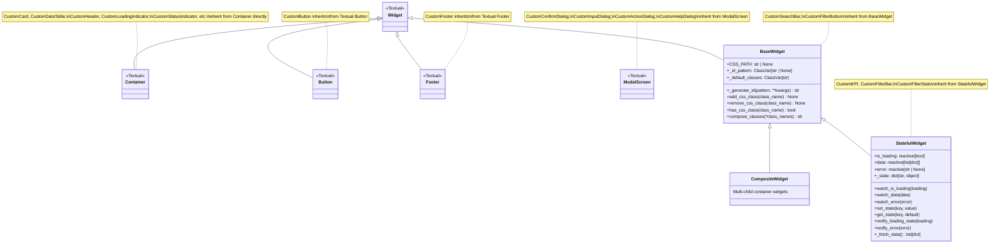
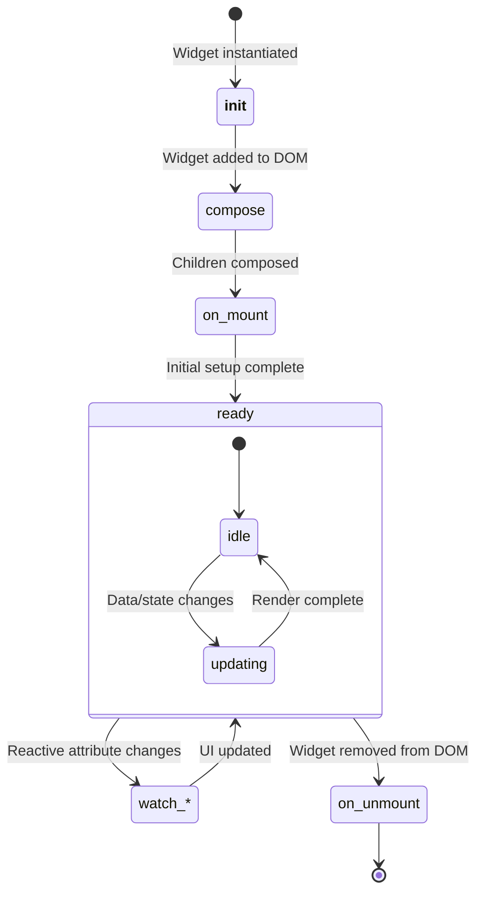
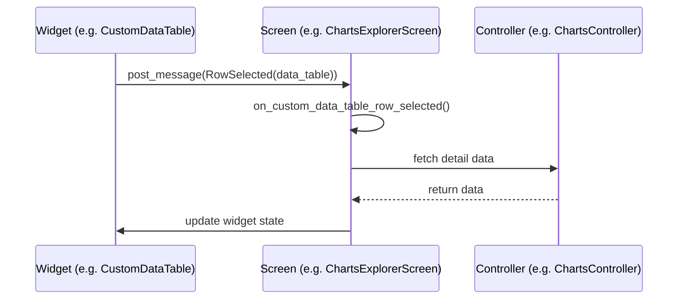
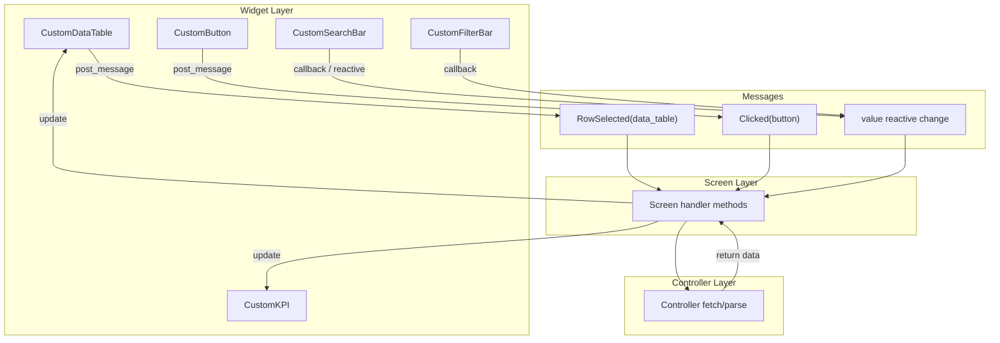
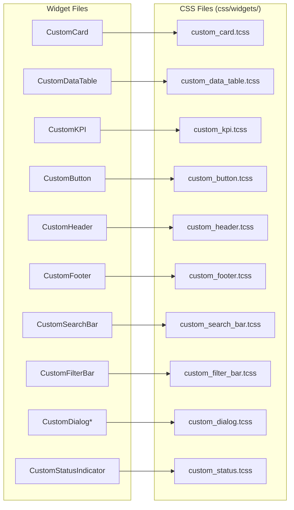

# Widgets Overview

This document provides an overview of the widget system in the KubEagle TUI.

## Widget Architecture

Custom widgets follow two main patterns:

1. **Base Widget Pattern** -- Widgets that inherit from `BaseWidget` or `StatefulWidget` (defined in `widgets/_base.py`), gaining ID pattern generation, CSS class utilities, and reactive state management.
2. **Standard Wrapper Pattern** -- Widgets that directly wrap Textual built-in widgets (e.g., `Container`, `TextualButton`, `TextualFooter`) to provide consistent styling and CSS class conventions. These do NOT inherit from `BaseWidget`.



## Widget Lifecycle



## Widget Organization

The widget system contains **60+ widgets** across **11 categories**, organized in categorical subfolders:

```
widgets/
├── __init__.py           # Re-exports all widgets
├── _base.py              # Base widget classes (BaseWidget, CompositeWidget, StatefulWidget)
├── _config.py            # WidgetConfig, WidgetRegistry
│
├── containers/           # Layout containers (5 widgets)
│   ├── custom_card.py          # CustomCard
│   ├── custom_collapsible.py   # CustomCollapsible
│   └── custom_containers.py    # CustomContainer, CustomHorizontal, CustomVertical
│
├── data/                 # Data display (16 widgets)
│   ├── indicators/
│   │   └── custom_status.py    # CustomStatusIndicator, CustomErrorRetryWidget, CustomLastUpdatedWidget
│   ├── kpi/
│   │   └── custom_kpi.py       # CustomKPI
│   └── tables/
│       ├── custom_data_table.py       # CustomDataTable
│       ├── custom_charts_table.py     # CustomChartsTable
│       ├── custom_node_table.py       # CustomNodeTable
│       ├── custom_events_table.py     # CustomEventsTable
│       ├── custom_violations_table.py # CustomViolationsTable
│       ├── custom_table.py            # CustomTableBase, CustomTableMixin
│       ├── custom_table_builder.py    # CustomTableBuilder, CustomColumnDef
│       ├── interfaces.py              # IDataProvider (protocol)
│       ├── table_builder.py           # DataTableBuilder (core builder)
│       └── table_component.py         # GenericTableComponent (reusable component)
│
├── display/              # Text/visual rendering (6 widgets)
│   ├── custom_digits.py
│   ├── custom_markdown.py
│   ├── custom_markdown_viewer.py
│   ├── custom_progress_bar.py
│   ├── custom_rich_log.py
│   └── custom_static.py
│
├── feedback/             # User feedback (7 widgets)
│   ├── custom_button.py             # CustomButton
│   ├── custom_dialog.py             # CustomConfirmDialog, CustomInputDialog,
│   │                                # CustomActionDialog, CustomHelpDialog,
│   │                                # CustomDialogFactory
│   └── custom_loading_indicator.py  # CustomLoadingIndicator
│
├── filter/               # Search and filter (6 widgets)
│   ├── custom_search_bar.py    # CustomSearchBar, CustomFilterButton
│   ├── custom_filter_bar.py    # CustomFilterBar, CustomFilterStats
│   ├── custom_filter_chip.py   # CustomFilterChip
│   └── custom_filter_group.py  # CustomFilterGroup
│
├── input/                # User input (3 widgets)
│   ├── custom_input.py
│   ├── custom_checkbox.py
│   └── custom_text_area.py
│
├── selection/            # Selection widgets (6 widgets)
│   ├── custom_option_list.py
│   ├── custom_radio_button.py
│   ├── custom_radio_set.py
│   ├── custom_select.py
│   ├── custom_selection_list.py
│   └── custom_switch.py
│
├── special/              # Special purpose (4 widgets)
│   ├── custom_content_switcher.py
│   ├── custom_directory_tree.py
│   ├── custom_link.py
│   └── custom_tree.py
│
├── structure/            # Page structure (3 widgets)
│   ├── custom_header.py
│   ├── custom_footer.py
│   └── custom_rule.py
│
└── tabs/                 # Tab navigation (4 widgets)
    ├── custom_tabs.py          # CustomTab, CustomTabs
    ├── custom_tabbed_content.py
    └── custom_tab_pane.py
```

## Widget-to-Screen Mapping

The following diagram shows which major widget categories are used by each screen:

```mermaid
flowchart TB
    subgraph Screens
        BS[BaseScreen]
        CS[ClusterScreen]
        CE[ChartsExplorerScreen]
        CD[ChartDetailScreen]
        OS[OptimizerScreen]
        WS[WorkloadsScreen]
        SS[SettingsScreen]
        RE[ReportExportScreen]
    end

    subgraph "Structure Widgets"
        SH[CustomHeader]
        SF[CustomFooter]
    end

    subgraph "Data Widgets"
        DT[CustomDataTable]
        NT[CustomNodeTable]
        CT[CustomChartsTable]
        ET[CustomEventsTable]
        VT[CustomViolationsTable]
        KPI[CustomKPI]
        SI[CustomStatusIndicator]
    end

    subgraph "Filter Widgets"
        SB[CustomSearchBar]
        FB[CustomFilterBar]
    end

    subgraph "Feedback Widgets"
        BTN[CustomButton]
        DLG["CustomConfirmDialog / CustomActionDialog"]
        LI[CustomLoadingIndicator]
    end

    subgraph "Layout Widgets"
        CC[CustomCard]
        CH[CustomHorizontal]
        CV[CustomVertical]
        TC[CustomTabbedContent]
    end

    subgraph "Input / Selection"
        CI[CustomInput]
        CB[CustomCheckbox]
        SW[CustomSwitch]
        RS[CustomRadioSet]
        SL[CustomSelect]
    end

    BS --> SH & SF & LI
    CS --> NT & ET & KPI & SI & FB & CC & TC
    CE --> CT & KPI & SB & FB & CC & TC
    CD --> DT & VT & KPI & BTN & DLG & CC & TC
    OS --> VT & DT & BTN & DLG
    WS --> DT & KPI & SB & FB & CC & TC
    SS --> CI & CB & SW & RS & SL & BTN & CC
    RE --> DT & BTN & CC
```



## Base Widget Classes

### BaseWidget

Foundation for widgets that need ID pattern generation and CSS class utilities:

```python
class BaseWidget(Widget):
    """Base widget with configuration support.

    Features:
    - ID pattern generation with UUID
    - CSS class composition utilities
    - Default classes support
    """

    CSS_PATH: str | None = None
    _id_pattern: ClassVar[str | None] = None
    _default_classes: ClassVar[str] = ""

    def __init__(
        self,
        *,
        id: str | None = None,
        id_pattern: str | None = None,
        classes: str = "",
        **kwargs,
    ) -> None:
        if id_pattern and not id:
            id = self._generate_id(id_pattern, **kwargs)
        super().__init__(id=id, classes=classes, **kwargs)
        # Apply default classes after super().__init__
        if self._default_classes:
            self.add_class(*self._default_classes.split())

    def _generate_id(self, pattern: str, **kwargs: str) -> str:
        """Generate widget ID from pattern.

        Example: "kpi-{title}-{uuid}" -> "kpi-cpu-usage-abc123"
        """
        ...

    def add_css_class(self, class_name: str) -> None:
        """Add CSS class dynamically."""
        self.add_class(class_name)

    def remove_css_class(self, class_name: str) -> None:
        """Remove CSS class dynamically."""
        self.remove_class(class_name)

    def has_css_class(self, class_name: str) -> bool:
        """Check if widget has a CSS class."""
        return self.has_class(class_name)

    def compose_classes(self, *class_names: str) -> str:
        """Compose multiple CSS class names."""
        return " ".join(c for c in class_names if c)
```

### StatefulWidget

For widgets with reactive state (inherits from BaseWidget):

```python
class StatefulWidget(BaseWidget):
    """Base class for widgets with reactive state.

    Standard reactive attributes:
    - is_loading: Tracks loading state
    - data: Holds loaded data
    - error: Holds error messages

    Subclasses should override watch methods.

    Worker Pattern for Async Data Loading:
        @worker
        async def _load_data(self) -> None:
            self.is_loading = True
            self.error = None
            try:
                result = await self._fetch_data()
                self.data = result
            except Exception as e:
                self.error = str(e)
            finally:
                self.is_loading = False
    """

    is_loading = reactive(False)
    data = reactive[list[dict]]([])
    error = reactive[str | None](None)

    def __init__(self, **kwargs) -> None:
        self._state: dict[str, object] = {}
        super().__init__(**kwargs)

    def watch_is_loading(self, loading: bool) -> None:
        """Override to update loading UI."""
        pass

    def watch_data(self, data: list[dict]) -> None:
        """Override to update data display."""
        pass

    def watch_error(self, error: str | None) -> None:
        """Override to handle errors."""
        pass

    def set_state(self, key: str, value: object) -> None:
        """Set internal state value."""
        self._state[key] = value

    def get_state(self, key: str, default: object = None) -> object:
        """Get internal state value."""
        return self._state.get(key, default)

    def notify_loading_state(self, loading: bool) -> None:
        """Notify loading state to parent or update UI."""
        pass

    def notify_error(self, error: str) -> None:
        """Notify error state to parent or update UI."""
        pass

    def _fetch_data(self) -> list[dict]:
        """Override to provide data fetching logic."""
        return []

    def compose(self) -> ComposeResult:
        """Override to define widget composition."""
        yield from ()
```

### CompositeWidget

For widgets containing multiple children (inherits from BaseWidget):

```python
class CompositeWidget(BaseWidget):
    """Base class for widgets composed of multiple children.

    Use for container-style widgets that manage child lifecycle.
    """
    pass
```

**Note:** In practice, most container-style widgets in KubEagle use Textual's `Container` directly (Standard Wrapper Pattern) rather than `CompositeWidget`.

## Widget Inheritance Patterns

The codebase uses two distinct patterns for widget inheritance:

### Pattern 1: BaseWidget Hierarchy

Used by widgets needing ID patterns and CSS class utilities:

| Widget | Inherits From |
|--------|--------------|
| `CustomKPI` | `StatefulWidget` |
| `CustomFilterBar` | `StatefulWidget` |
| `CustomFilterStats` | `StatefulWidget` |
| `CustomSearchBar` | `BaseWidget` |
| `CustomFilterButton` | `BaseWidget` |

### Pattern 2: Standard Wrapper (Textual Built-ins)

Used by widgets wrapping Textual's built-in widgets:

| Widget | Inherits From |
|--------|--------------|
| `CustomCard` | `Container` |
| `CustomDataTable` | `Container` |
| `CustomHeader` | `Container` |
| `CustomLoadingIndicator` | `Container` |
| `CustomStatusIndicator` | `Container` |
| `CustomErrorRetryWidget` | `Container` |
| `CustomLastUpdatedWidget` | `Container` |
| `CustomContainer` | `Container` |
| `CustomHorizontal` | `Container` |
| `CustomVertical` | `Container` |
| `CustomButton` | `TextualButton` |
| `CustomFooter` | `TextualFooter` |
| `CustomConfirmDialog` | `ModalScreen[bool]` |
| `CustomInputDialog` | `ModalScreen[str]` |
| `CustomActionDialog` | `ModalScreen[str]` |
| `CustomHelpDialog` | `ModalScreen` |

## Widget Lifecycle

### Creation

```python
# In screen's compose() method
def compose(self) -> ComposeResult:
    yield CustomHeader()
    yield CustomDataTable(
        columns=[("Name", "name"), ("Version", "version")],
        id="data-table",
    )
    yield CustomFooter()
```

### Mounting

```python
class MyWidget(BaseWidget):
    def on_mount(self) -> None:
        """Called when widget is mounted to DOM."""
        self._setup_initial_state()

    def compose(self) -> ComposeResult:
        """Define child widgets."""
        yield Static("Content")
```

### Updates

```python
class CustomKPI(StatefulWidget):
    value = reactive("", init=False)

    def watch_value(self, value: str) -> None:
        """Called automatically when value changes."""
        self.query_one(".kpi-value", Static).update(value)

    def set_value(self, value: str) -> None:
        """Public method to update value."""
        self._value = value
        self.is_loading = False
        self.value = value  # Triggers watch_value
```

### Unmounting

```python
class MyWidget(BaseWidget):
    def on_unmount(self) -> None:
        """Called when widget is removed from DOM."""
        self._cleanup_resources()
```

## Widget Communication

Widgets communicate via Textual messages:



### Message Flow Diagram



### Messages

```python
# CustomDataTable.RowSelected -- event-based
class CustomDataTable(Container):
    class RowSelected(Event):
        """Event emitted when a row is selected."""
        def __init__(self, data_table: CustomDataTable) -> None:
            super().__init__()
            self.data_table = data_table

# CustomButton.Clicked -- message-based
class CustomButton(TextualButton):
    class Clicked(Message):
        """Message emitted when the button is clicked."""
        def __init__(self, button: CustomButton) -> None:
            self.button = button
            super().__init__()

# CustomSearchBar -- callback-based
class CustomSearchBar(BaseWidget):
    value = reactive("", init=False)

    def __init__(
        self,
        placeholder: str = "Search...",
        on_change: Callable[[str], None] | None = None,
        ...
    ):
        self._on_change = on_change

    def watch_value(self, new_value: str) -> None:
        if self._on_change:
            self._on_change(new_value)
```

### Handling Messages

```python
class ChartsExplorerScreen(Screen):
    def on_custom_data_table_row_selected(
        self,
        message: CustomDataTable.RowSelected,
    ) -> None:
        """Handle row selection event."""
        table = message.data_table
        # Access selected row via table methods
        row_data = table.get_row_data(table.cursor_row)

    def on_custom_button_clicked(
        self,
        message: CustomButton.Clicked,
    ) -> None:
        """Handle button click."""
        if message.button.id == "refresh-btn":
            self.refresh_data()
```

## Widget Configuration

The `_config.py` module provides `WidgetConfig` for consistent ID generation and CSS class management, and `WidgetRegistry` for tracking widget instances.

```python
from kubeagle.widgets._config import WIDGET_CONFIG

# Generate consistent IDs
card_id = WIDGET_CONFIG.generate_id("kpi", title="cpu-usage")

# Compose CSS classes
classes = WIDGET_CONFIG.compose_classes("card", "highlighted", prefix="widget")

# Status/severity helpers
status_cls = WIDGET_CONFIG.status_class("healthy")      # "status-healthy"
severity_cls = WIDGET_CONFIG.severity_class("critical")  # "severity-critical"
```

### Available ID Patterns

| Pattern Name | Template |
|-------------|----------|
| `kpi` | `kpi-{title}-{uuid}` |
| `card` | `card-{name}-{uuid}` |
| `button` | `btn-{name}-{uuid}` |
| `input` | `input-{name}-{uuid}` |
| `dialog` | `dialog-{name}-{uuid}` |
| `table` | `table-{name}-{uuid}` |
| `filter` | `filter-{name}-{uuid}` |
| `toast` | `toast-{name}-{uuid}` |
| `spinner` | `spinner-{name}-{uuid}` |
| `progress` | `progress-{name}-{uuid}` |

## Widget Styling

### CSS Files

Each widget can have associated CSS. There are **46 TCSS files** in `css/widgets/`:

```
css/widgets/
├── custom_button.tcss
├── custom_card.tcss
├── custom_charts_table.tcss
├── custom_checkbox.tcss
├── custom_collapsible.tcss
├── custom_containers.tcss
├── custom_content_switcher.tcss
├── custom_data_table.tcss
├── custom_dialog.tcss
├── custom_digits.tcss
├── custom_directory_tree.tcss
├── custom_events_table.tcss
├── custom_filter_bar.tcss
├── custom_filter_chip.tcss
├── custom_filter_group.tcss
├── custom_footer.tcss
├── custom_header.tcss
├── custom_input.tcss
├── custom_kpi.tcss
├── custom_link.tcss
├── custom_loading_indicator.tcss
├── custom_markdown.tcss
├── custom_markdown_viewer.tcss
├── custom_node_table.tcss
├── custom_option_list.tcss
├── custom_progress_bar.tcss
├── custom_radio_button.tcss
├── custom_radio_set.tcss
├── custom_rich_log.tcss
├── custom_rule.tcss
├── custom_search_bar.tcss
├── custom_select.tcss
├── custom_selection_list.tcss
├── custom_static.tcss
├── custom_status.tcss
├── custom_switch.tcss
├── custom_tab_pane.tcss
├── custom_tabbed_content.tcss
├── custom_table.tcss
├── custom_table_builder.tcss
├── custom_tabs.tcss
├── custom_text_area.tcss
├── custom_tree.tcss
├── custom_violations_table.tcss
├── loading.tcss
└── worker_mixin.tcss
```

### Widget-to-CSS Mapping



**Note:** Many widgets also define `DEFAULT_CSS` inline in addition to (or instead of) `CSS_PATH`. For example, `CustomButton`, `CustomKPI`, `CustomHeader`, and `CustomFooter` all embed significant CSS in their `DEFAULT_CSS` class variable. `DEFAULT_CSS` is used for self-targeting rules because Textual's `SCOPED_CSS` (True by default) prevents `CSS_PATH` rules from applying to the widget itself -- they only apply to descendants.

### Dynamic Styling

```python
class CustomStatusIndicator(Container):
    """Status indicator with dynamic colors."""

    def set_status(self, status: str) -> None:
        """Update status and style."""
        self._status = status
        dot = self.query_one(".status-dot", Static)
        dot.remove_class("success", "warning", "error", "info")
        dot.add_class(status)
```

## Common Widget Patterns

### Data Display Pattern (StatefulWidget)

```python
class CustomKPI(StatefulWidget):
    """Widget displaying a KPI with loading/error states."""

    is_loading = reactive(False)
    data = reactive[list[dict]]([])
    error = reactive[str | None](None)
    value = reactive("", init=False)

    def compose(self) -> ComposeResult:
        yield Static(self._title, classes="kpi-title")
        yield Static(self._value, classes="kpi-value")
        yield Static("...", classes="kpi-spinner")

    def watch_is_loading(self, loading: bool) -> None:
        value_widget = self.query_one(".kpi-value", Static)
        spinner_widget = self.query_one(".kpi-spinner", Static)
        if loading:
            value_widget.display = False
            spinner_widget.display = True
        else:
            value_widget.display = True
            spinner_widget.display = False

    def set_value(self, value: str) -> None:
        """Set the KPI value and stop any loading spinner."""
        self._value = value
        self.is_loading = False
        self.value = value
```

### Wrapper Widget Pattern (Container-based)

```python
class CustomDataTable(Container):
    """Table wrapping Textual's DataTable with standardized styling."""

    def __init__(
        self,
        columns: list[tuple[str, str]] | None = None,
        *,
        id: str | None = None,
        classes: str = "",
        disabled: bool = False,
        zebra_stripes: bool = False,
    ) -> None:
        super().__init__(id=id, classes=f"widget-custom-data-table {classes}".strip())
        self._columns = columns or []

    def compose(self) -> ComposeResult:
        table = TextualDataTable(disabled=self._disabled, cursor_type="row")
        self._inner_widget = table
        yield table
```

### Dialog Pattern (ModalScreen-based)

```python
class CustomConfirmDialog(ModalScreen[bool]):
    """Confirmation dialog with OK/Cancel buttons."""

    def __init__(
        self,
        message: str,
        title: str = "Confirm",
        on_confirm: Callable[[], None] | None = None,
        on_cancel: Callable[[], None] | None = None,
    ) -> None: ...

    def compose(self):
        with Vertical(classes="dialog-container"):
            yield Static(self._title, classes="dialog-title")
            yield Static(self._message, classes="dialog-message")
            with Horizontal(classes="dialog-buttons"):
                yield CustomButton("OK", id="confirm-btn")
                yield CustomButton("Cancel", id="cancel-btn")
```

## Cross-References

- [Widget Categories](categories.md) - Detailed category breakdown
- [Widget Reference](widget-reference.md) - Complete widget documentation
- [CSS Guide](../styling/css-guide.md) - Widget styling
