# Widget Reference

Complete reference documentation for all widgets.

## Widget Inheritance

```mermaid
classDiagram
    direction TB

    class Widget {
        <<Textual>>
    }
    class Container {
        <<Textual>>
    }
    class TextualButton {
        <<Textual>>
    }
    class TextualFooter {
        <<Textual>>
    }
    class ModalScreen {
        <<Textual>>
    }

    class BaseWidget {
        <<widgets/_base.py>>
    }
    class CompositeWidget {
        <<widgets/_base.py>>
    }
    class StatefulWidget {
        <<widgets/_base.py>>
    }

    Widget <|-- BaseWidget
    Widget <|-- Container
    Widget <|-- TextualButton
    Widget <|-- TextualFooter
    Widget <|-- ModalScreen

    BaseWidget <|-- CompositeWidget
    BaseWidget <|-- StatefulWidget

    %% StatefulWidget children
    StatefulWidget <|-- CustomKPI
    StatefulWidget <|-- CustomFilterBar
    StatefulWidget <|-- CustomFilterStats

    %% BaseWidget children
    BaseWidget <|-- CustomSearchBar
    BaseWidget <|-- CustomFilterButton

    %% Container children (Standard Wrapper Pattern)
    Container <|-- CustomCard
    Container <|-- CustomDataTable
    Container <|-- CustomChartsTable
    Container <|-- CustomNodeTable
    Container <|-- CustomEventsTable
    Container <|-- CustomViolationsTable
    Container <|-- CustomHeader
    Container <|-- CustomLoadingIndicator
    Container <|-- CustomStatusIndicator
    Container <|-- CustomErrorRetryWidget
    Container <|-- CustomLastUpdatedWidget
    Container <|-- CustomContainer
    Container <|-- CustomHorizontal
    Container <|-- CustomVertical

    %% TextualButton children
    TextualButton <|-- CustomButton

    %% TextualFooter children
    TextualFooter <|-- CustomFooter

    %% ModalScreen children
    ModalScreen <|-- CustomConfirmDialog
    ModalScreen <|-- CustomInputDialog
    ModalScreen <|-- CustomActionDialog
    ModalScreen <|-- CustomHelpDialog
```



## Widget Communication (Messages)

Widgets communicate with screens via Textual's message system. Each widget defines its own `Message` or `Event` subclasses that screens handle.


### Message Bubble Flow


---

## CustomDataTable

**Location**: `widgets/data/tables/custom_data_table.py`
**Inherits**: `Container`
**CSS Class**: `widget-custom-data-table`

The primary table widget. Wraps Textual's `DataTable` inside a `Container` with standardized styling.

### Constructor

```python
def __init__(
    self,
    columns: list[tuple[str, str]] | None = None,
    *,
    id: str | None = None,
    classes: str = "",
    disabled: bool = False,
    zebra_stripes: bool = False,
) -> None:
```

| Parameter | Type | Default | Description |
|-----------|------|---------|-------------|
| `columns` | `list[tuple[str, str]] \| None` | None | Column definitions (label, key) |
| `id` | `str \| None` | None | Widget ID |
| `classes` | `str` | `""` | Additional CSS classes |
| `disabled` | `bool` | False | Whether the table is disabled |
| `zebra_stripes` | `bool` | False | Alternating row colors |

### Messages / Events

```python
class RowSelected(Event):
    """Event emitted when a row is selected."""
    def __init__(self, data_table: CustomDataTable) -> None:
        super().__init__()
        self.data_table = data_table
```

### Properties

| Property | Type | Description |
|----------|------|-------------|
| `data_table` | `TextualDataTable \| None` | The underlying Textual DataTable |
| `row_count` | `int` | Number of rows |
| `rows` | `dict` | Rows dictionary |
| `columns` | `dict` | Columns dictionary |
| `cursor_row` | `int \| None` | Current cursor row (get/set) |
| `disabled` | `bool` | Disabled state (get/set) |
| `zebra_stripes` | `bool` | Zebra stripes state (get/set) |

### Methods

| Method | Parameters | Returns | Description |
|--------|------------|---------|-------------|
| `add_column` | `label, *, width=None, key=None` | `Any` | Add a column |
| `add_row` | `*args, **kwargs` | `Any` | Add a row, returns key |
| `add_rows` | `rows: Iterable[Iterable]` | `list[Any]` | Add multiple rows |
| `clear` | `columns: bool = False` | `None` | Remove all rows (optionally columns) |
| `clear_safe` | `columns: bool = False` | `None` | Safely clear, resetting cursor |
| `sort` | `column_key, *, reverse=False` | `None` | Sort by column |
| `sort_by_column` | `column_key, reverse=False` | `None` | Sort and track sort state |
| `action_toggle_sort` | -- | `None` | Toggle sort on current column |
| `get_row_data` | `index: int` | `tuple \| None` | Get row data at index |
| `get_row_key_at` | `index: int` | `Any` | Get row key at index |
| `set_loading` | `loading: bool` | `None` | Set loading state on inner table |
| `set_header_tooltips` | `tooltips: Mapping[str, str]` | `None` | Set per-column header tooltips |
| `set_default_tooltip` | `tooltip: str \| None` | `None` | Set default body hover tooltip |
| `batch` | -- | async context | Async batch update context manager |
| `batch_update` | -- | sync context | Sync batch update context manager |

### Example

```python
# Create table
table = CustomDataTable(
    columns=[
        ("Chart Name", "name"),
        ("Team", "team"),
        ("CPU", "cpu"),
        ("Memory", "memory"),
    ],
    id="charts-table",
    zebra_stripes=True,
)

# Add data
table.add_row("frontend-api", "Frontend", "100m", "256Mi", key="r1")
table.add_row("backend-service", "Backend", "200m", "512Mi", key="r2")

# Handle selection in screen
def on_custom_data_table_row_selected(self, event: CustomDataTable.RowSelected):
    table = event.data_table
    row_data = table.get_row_data(table.cursor_row)
```

---

## Specialized Tables

### CustomChartsTable

**Location**: `widgets/data/tables/custom_charts_table.py`
**Inherits**: `Container`

Pre-configured table for displaying Helm chart data. Used in ChartsExplorerScreen.

### CustomNodeTable

**Location**: `widgets/data/tables/custom_node_table.py`
**Inherits**: `Container`

Pre-configured table for node status display. Used in ClusterScreen.

### CustomEventsTable

**Location**: `widgets/data/tables/custom_events_table.py`
**Inherits**: `Container`

Pre-configured table for cluster events. Used in ClusterScreen.

### CustomViolationsTable

**Location**: `widgets/data/tables/custom_violations_table.py`
**Inherits**: `Container`

Pre-configured table for optimization violations. Used in OptimizerScreen.

### Table Infrastructure

| File | Exports | Purpose |
|------|---------|---------|
| `custom_table.py` | `CustomTableBase`, `CustomTableMixin` | Generic table base class and mixin |
| `custom_table_builder.py` | `CustomTableBuilder`, `CustomColumnDef` | Programmatic table construction |
| `interfaces.py` | `IDataProvider` | Table data provider protocol (ABC) |
| `table_builder.py` | `DataTableBuilder` | Builder pattern for Textual DataTable |
| `table_component.py` | `GenericTableComponent` | Generic wrapper for DataTable operations |

### DataTableBuilder

**Location**: `widgets/data/tables/table_builder.py`

Builder pattern for creating Textual `DataTable` instances with `ColumnDef` definitions.

```python
class DataTableBuilder:
    """Builder for creating DataTable instances with columns."""

    def __init__(self, id: str | None = None):
        self._id = id
        self._columns: list[ColumnDef] = []
        self._rows: list[tuple[Any, ...]] = []

    def add_column(self, column: ColumnDef) -> "DataTableBuilder": ...
    def add_row(self, *values: Any) -> "DataTableBuilder": ...
    def build(self) -> DataTable: ...
```

#### Example

```python
from kubeagle.widgets.data.tables.table_builder import DataTableBuilder
from kubeagle.models.types.columns import ColumnDef

builder = DataTableBuilder(id="my-table")
builder.add_column(ColumnDef(label="Name", key="name"))
builder.add_column(ColumnDef(label="Version", key="version"))
builder.add_row("nginx", "1.21.0")
builder.add_row("redis", "6.2.0")
table = builder.build()
```

### GenericTableComponent

**Location**: `widgets/data/tables/table_component.py`

Generic wrapper for DataTable operations. Replaces duplicated table component classes (NodeTableComponent, TeamTableComponent, ChartsTableComponent).

```python
class GenericTableComponent:
    """Generic wrapper for DataTable operations."""

    def __init__(self, table_id: str = "data-table") -> None: ...
    def get_table(self, parent: DOMNode) -> DataTable | None: ...
    def update_table(self, parent: DOMNode, data: list, columns: list) -> None: ...
    def clear_table(self, parent: DOMNode) -> None: ...
```

#### Example

```python
from kubeagle.widgets.data.tables.table_component import GenericTableComponent

component = GenericTableComponent(table_id="nodes-table")

# Get the underlying DataTable from a parent widget/screen
table = component.get_table(self)

# Update with new data
component.update_table(self, data=rows, columns=["Name", "Status", "CPU"])

# Clear all rows
component.clear_table(self)
```

### IDataProvider

**Location**: `widgets/data/tables/interfaces.py`

Protocol (ABC) defining the contract for data providers that feed data to `CustomDataTable`. Implementations handle data fetching, filtering, and transformation.

```python
class IDataProvider(ABC):
    """Protocol for data providers that feed data to CustomDataTable."""

    @abstractmethod
    def get_columns(self) -> list[tuple[str, str]]: ...

    @abstractmethod
    def get_rows(self) -> list[tuple[Any, ...]]: ...

    def filter_rows(self, column_key: str, value: str) -> list[tuple[Any, ...]]: ...
    def sort_rows(self, rows, column_key: str, reverse: bool = False) -> list[tuple[Any, ...]]: ...
```

#### Example

```python
from kubeagle.widgets.data.tables.interfaces import IDataProvider

class ChartDataProvider(IDataProvider):
    def get_columns(self) -> list[tuple[str, str]]:
        return [("Name", "name"), ("Version", "version")]

    def get_rows(self) -> list[tuple[Any, ...]]:
        return [("nginx", "1.21.0"), ("redis", "6.2.0")]

    def filter_rows(self, column_key: str, value: str) -> list[tuple[Any, ...]]:
        rows = self.get_rows()
        col_idx = next(
            (i for i, (_, k) in enumerate(self.get_columns()) if k == column_key), None
        )
        if col_idx is None:
            return rows
        return [r for r in rows if value.lower() in str(r[col_idx]).lower()]
```

---

## CustomCard

**Location**: `widgets/containers/custom_card.py`
**Inherits**: `Container`
**CSS Class**: `widget-custom-card`

Card container with title.

### Constructor

```python
def __init__(self, title: str = "", id: str | None = None, classes: str = ""):
```

| Parameter | Type | Default | Description |
|-----------|------|---------|-------------|
| `title` | `str` | `""` | Card title text |
| `id` | `str \| None` | None | Widget ID |
| `classes` | `str` | `""` | Additional CSS classes |

### Methods

| Method | Parameters | Returns | Description |
|--------|------------|---------|-------------|
| `set_title` | `title: str` | `None` | Update the card title |

### Properties

| Property | Type | Description |
|----------|------|-------------|
| `card_title` | `str` | The title text |

### Example

```python
with CustomCard(title="Resource Summary", id="resource-card"):
    yield CustomKPI(title="CPU", value="75%")
    yield CustomKPI(title="Memory", value="60%")
```

---

## CustomCollapsible

**Location**: `widgets/containers/custom_collapsible.py`

A collapsible container widget that can expand and collapse its content.

### Example

```python
from kubeagle.widgets.containers import CustomCollapsible

with CustomCollapsible(title="Advanced Settings", collapsed=True):
    yield CustomInput(placeholder="Custom path...")
    yield CustomCheckbox("Enable feature X")
```

---

## CustomKPI

**Location**: `widgets/data/kpi/custom_kpi.py`
**Inherits**: `StatefulWidget`
**CSS Class**: `widget-custom-kpi`

Key Performance Indicator display widget with inline loading spinner.

### Constructor

```python
def __init__(
    self,
    title: str,
    value: str,
    status: str = "success",
    *,
    id: str | None = None,
    classes: str = "",
):
```

| Parameter | Type | Default | Description |
|-----------|------|---------|-------------|
| `title` | `str` | (required) | KPI title |
| `value` | `str` | (required) | Display value |
| `status` | `str` | `"success"` | Status: `success`, `warning`, `error`, `info` |
| `id` | `str \| None` | None | Widget ID |
| `classes` | `str` | `""` | Additional CSS classes |

### Reactive Attributes

| Attribute | Type | Description |
|-----------|------|-------------|
| `is_loading` | `reactive(False)` | Loading state (shows/hides spinner) |
| `data` | `reactive[list[dict]]([])` | Standard reactive data |
| `error` | `reactive[str \| None](None)` | Standard reactive error |
| `value` | `reactive("", init=False)` | Display value (triggers watch_value) |

### Methods

| Method | Parameters | Returns | Description |
|--------|------------|---------|-------------|
| `set_value` | `value: str` | `None` | Set value and stop loading spinner |
| `set_subtitle` | `subtitle: str` | `None` | Set optional subtitle text |
| `set_status` | `status: str` | `None` | Update status class |
| `start_loading` | -- | `None` | Start the inline loading spinner |

### Properties

| Property | Type | Description |
|----------|------|-------------|
| `title` | `str` | The KPI title |
| `status` | `str` | The current status |

### Example

```python
kpi = CustomKPI(
    title="CPU Usage",
    value="75%",
    status="warning",
)

# Update value
kpi.set_value("82%")
kpi.set_status("error")

# Show loading
kpi.start_loading()

# Set subtitle
kpi.set_subtitle("avg over 5m")
```

---

## CustomSearchBar

**Location**: `widgets/filter/custom_search_bar.py`
**Inherits**: `BaseWidget`
**CSS Class**: `widget-custom-search-bar`

Search input with clear button. Uses callback pattern (not Textual Messages).

### Constructor

```python
def __init__(
    self,
    placeholder: str = "Search...",
    on_change: Callable[[str], None] | None = None,
    id: str | None = None,
    classes: str = "",
) -> None:
```

### Reactive Attributes

| Attribute | Type | Description |
|-----------|------|-------------|
| `value` | `reactive("", init=False)` | Current search value |

### Methods

| Method | Parameters | Returns | Description |
|--------|------------|---------|-------------|
| `clear` | -- | `None` | Clear the search input |

### Example

```python
# In compose()
yield CustomSearchBar(
    placeholder="Search charts...",
    on_change=lambda value: self.filter_data(value),
    id="search",
)
```

---

## CustomFilterButton

**Location**: `widgets/filter/custom_search_bar.py`
**Inherits**: `BaseWidget`
**CSS Class**: `widget-custom-filter-button`

Simple button widget for filter actions. Uses callback pattern.

### Constructor

```python
def __init__(
    self,
    label: str,
    on_click: Callable[[], None] | None = None,
    id: str | None = None,
    classes: str = "",
) -> None:
```

---

## CustomFilterBar

**Location**: `widgets/filter/custom_filter_bar.py`
**Inherits**: `StatefulWidget`
**CSS Class**: `widget-custom-filter-bar`

Complete filter bar combining search, filters, and stats.

### Constructor

```python
def __init__(
    self,
    placeholder: str = "Search...",
    filter_options: list[str] | None = None,
    on_filter: Callable[[str, list[str]], None] | None = None,
    show_stats: bool = True,
    id: str | None = None,
    classes: str = "",
) -> None:
```

### Example

```python
CustomFilterBar(
    placeholder="Search charts...",
    filter_options=["team", "qos", "pdb"],
    on_filter=lambda search, active_filters: self._apply_filters(search, active_filters),
    show_stats=True,
    id="filter-bar",
)
```

---

## CustomFilterStats

**Location**: `widgets/filter/custom_filter_bar.py`
**Inherits**: `StatefulWidget`
**CSS Class**: `widget-custom-filter-stats`

Display for filtered result count (e.g., "Showing 25 of 50").

### Constructor

```python
def __init__(
    self,
    total: int = 0,
    filtered: int | None = None,
    id: str | None = None,
    classes: str = "",
) -> None:
```

### Reactive Attributes

| Attribute | Type | Description |
|-----------|------|-------------|
| `total` | `reactive(0, init=False)` | Total item count |
| `filtered` | `reactive[int \| None](None, init=False)` | Filtered item count |

### Methods

| Method | Parameters | Returns | Description |
|--------|------------|---------|-------------|
| `update` | `total: int, filtered: int \| None = None` | `None` | Update the stats display |

---

## CustomButton

**Location**: `widgets/feedback/custom_button.py`
**Inherits**: `TextualButton` (Textual's `Button`)
**CSS Class**: `widget-custom-button` (via variant classes)

Styled button with semantic variants.

### Constructor

```python
def __init__(
    self,
    label: str,
    variant: str = "default",
    compact: bool = False,
    id: str | None = None,
    classes: str = "",
    disabled: bool = False,
):
```

| Parameter | Type | Default | Description |
|-----------|------|---------|-------------|
| `label` | `str` | (required) | Button text |
| `variant` | `str` | `"default"` | `default`, `primary`, `success`, `warning`, `error` |
| `compact` | `bool` | False | Reduced height for dense layouts |
| `id` | `str \| None` | None | Widget ID |
| `classes` | `str` | `""` | Additional CSS classes |
| `disabled` | `bool` | False | Whether button is disabled |

### Messages

```python
class Clicked(Message):
    """Message emitted when the button is clicked."""
    def __init__(self, button: CustomButton) -> None:
        self.button = button
        super().__init__()
```

### Example

```python
CustomButton("Refresh", id="refresh-btn", variant="primary")
CustomButton("Delete", id="delete-btn", variant="error")
CustomButton("Cancel", id="cancel-btn", variant="default", compact=True)

# Handle in screen
def on_custom_button_clicked(self, message: CustomButton.Clicked):
    if message.button.id == "refresh-btn":
        self.refresh_data()
```

---

## CustomHeader

**Location**: `widgets/structure/custom_header.py`
**Inherits**: `Container`
**CSS Class**: `widget-custom-header`

Page header wrapping Textual's `Header` widget. Title is controlled via `app.title` / `app.sub_title`. Adds a dynamic terminal-size badge showing `WIDTHxHEIGHT`.

### Constructor

```python
def __init__(self, *args, **kwargs) -> None:
```

Accepts the same arguments as `Container`.

### Behavior

- Wraps Textual's `Header` widget internally
- Dynamically mounts a terminal-size badge showing the current terminal dimensions
- Badge updates on resize with debouncing (50ms)

### Example

```python
yield CustomHeader()  # Uses app.title and app.sub_title
```

---

## CustomFooter

**Location**: `widgets/structure/custom_footer.py`
**Inherits**: `TextualFooter` (Textual's `Footer`)
**CSS Class**: `widget-custom-footer`

Footer showing active keybindings. Compact by default.

### Constructor

```python
def __init__(
    self,
    *children,
    name: str | None = None,
    id: str | None = None,
    classes: str | None = None,
    disabled: bool = False,
    show_command_palette: bool = False,
    compact: bool = True,
) -> None:
```

| Parameter | Type | Default | Description |
|-----------|------|---------|-------------|
| `show_command_palette` | `bool` | False | Show command palette hint |
| `compact` | `bool` | True | Use compact display mode |

### Behavior

The footer automatically displays keybindings from the current screen's `BINDINGS` class variable.

```python
class ClusterScreen(Screen):
    BINDINGS = [
        ("r", "refresh", "Refresh"),
        ("q", "quit", "Quit"),
    ]

    def compose(self) -> ComposeResult:
        yield CustomHeader()
        yield Content()
        yield CustomFooter()
        # Footer shows: r Refresh | q Quit
```

---

## CustomStatusIndicator

**Location**: `widgets/data/indicators/custom_status.py`
**Inherits**: `Container`
**CSS Class**: `widget-custom-status-indicator`

Status indicator with color-coded dot display.

### Constructor

```python
def __init__(
    self,
    status: str = "success",
    label: str = "",
    *,
    id: str | None = None,
    classes: str = "",
):
```

| Parameter | Type | Default | Description |
|-----------|------|---------|-------------|
| `status` | `str` | `"success"` | Status: `success`, `warning`, `error`, `info` |
| `label` | `str` | `""` | Optional label text |

### Methods

| Method | Parameters | Returns | Description |
|--------|------------|---------|-------------|
| `set_status` | `status: str` | `None` | Update the status level |

### Properties

| Property | Type | Description |
|----------|------|-------------|
| `status` | `str` | The current status |

### Example

```python
CustomStatusIndicator("success", label="Cluster")
CustomStatusIndicator("warning", label="Node ip-10-0-1-10")
CustomStatusIndicator("error", label="PDB blocking-pdb")
```

---

## CustomErrorRetryWidget

**Location**: `widgets/data/indicators/custom_status.py`
**Inherits**: `Container`
**CSS Class**: `widget-custom-error-retry`

Error message widget with a retry button for recovery actions.

### Constructor

```python
def __init__(
    self,
    error_message: str = "An error occurred",
    id: str | None = None,
    classes: str = "",
):
```

### Methods

| Method | Parameters | Returns | Description |
|--------|------------|---------|-------------|
| `set_error` | `message: str` | `None` | Update error message |
| `action_retry` | -- | `None` | Trigger retry action |

### Bindings

| Key | Action | Description |
|-----|--------|-------------|
| `enter` | retry | Retry the operation |
| `r` | retry | Retry the operation |

---

## CustomLastUpdatedWidget

**Location**: `widgets/data/indicators/custom_status.py`
**Inherits**: `Container`
**CSS Class**: `widget-custom-last-updated`

Widget displaying last updated timestamp.

### Constructor

```python
def __init__(
    self,
    timestamp: str | None = None,
    *,
    id: str | None = None,
    classes: str = "",
):
```

### Methods

| Method | Parameters | Returns | Description |
|--------|------------|---------|-------------|
| `update` | `timestamp: str` | `None` | Update the timestamp display |

---

## Dialog Widgets

All dialog widgets inherit from `ModalScreen` and are defined in `widgets/feedback/custom_dialog.py`.

### CustomConfirmDialog

**Inherits**: `ModalScreen[bool]`

Confirmation dialog with OK/Cancel buttons. Dismisses with `True` (confirm) or `False` (cancel).

```python
CustomConfirmDialog(
    message="Delete this chart?",
    title="Confirm Delete",
    on_confirm=lambda: self.delete_chart(),
    on_cancel=lambda: self.notify("Cancelled"),
)
```

### CustomInputDialog

**Inherits**: `ModalScreen[str]`

Dialog with text input. Dismisses with the input value or empty string on cancel.

```python
CustomInputDialog(
    prompt="Enter chart path:",
    title="Path Input",
    placeholder="/path/to/charts",
    default="/default/path",
    on_submit=lambda val: self.set_path(val),
    validate=lambda val: len(val) > 0,
)
```

### CustomActionDialog

**Inherits**: `ModalScreen[str]`

Dialog with custom action buttons. Dismisses with the selected action name or empty string on cancel.

```python
CustomActionDialog(
    title="Export Format",
    message="Choose an export format:",
    actions=["json", "csv", "markdown"],
    on_action=lambda action: self.export(action),
)
```

### CustomHelpDialog

**Inherits**: `ModalScreen`

Built-in keyboard shortcuts help dialog.

### CustomDialogFactory

Factory class for creating dialog instances consistently:

```python
factory = CustomDialogFactory()
confirm = factory.create_confirm("Are you sure?", on_confirm=callback)
input_dialog = factory.create_input("Enter value:", placeholder="...")
action_dialog = factory.create_action("Select", actions=["a", "b"])
help_dialog = factory.create_help({"r": "Refresh", "q": "Quit"})
```

---

## CustomLoadingIndicator

**Location**: `widgets/feedback/custom_loading_indicator.py`
**Inherits**: `Container`
**CSS Class**: `widget-custom-loading-indicator`

Loading spinner wrapping Textual's `LoadingIndicator`.

### Constructor

```python
def __init__(
    self,
    id: str | None = None,
    classes: str = "",
    disabled: bool = False,
) -> None:
```

### Properties

| Property | Type | Description |
|----------|------|-------------|
| `loading_indicator` | `TextualLoadingIndicator \| None` | The underlying indicator |
| `disabled` | `bool` | Disabled state (get/set) |

### Example

```python
yield CustomLoadingIndicator(id="loading")
```

---

## Display Widgets

### CustomMarkdownViewer

**Location**: `widgets/display/custom_markdown_viewer.py`

Extended markdown viewer with scrolling and navigation support.

```python
from kubeagle.widgets.display import CustomMarkdownViewer

CustomMarkdownViewer(content="# Report\nDetails...", id="report")
```

### CustomProgressBar

**Location**: `widgets/display/custom_progress_bar.py`

Progress bar for showing operation progress.

```python
from kubeagle.widgets.display import CustomProgressBar

bar = CustomProgressBar(total=100, id="progress")
bar.advance(25)  # 25% complete
```

---

## CustomInput

**Location**: `widgets/input/custom_input.py`

Enhanced text input field.

### Example

```python
CustomInput(
    placeholder="Enter charts path...",
    value="/path/to/charts",
    id="charts-path",
)
```

---

## CustomCheckbox

**Location**: `widgets/input/custom_checkbox.py`

Checkbox toggle control.

### Example

```python
CustomCheckbox("Enable auto-refresh", value=True, id="auto-refresh")
CustomCheckbox("Include recommendations", value=False, id="include-rec")
```

---

## Selection Widgets

### CustomSwitch

**Location**: `widgets/selection/custom_switch.py`

On/off toggle switch.

```python
CustomSwitch("Dark Mode", value=True, id="theme-switch")
```

### CustomRadioSet

**Location**: `widgets/selection/custom_radio_set.py`

Group of mutually exclusive radio buttons.

```python
CustomRadioSet(
    options=[
        ("json", "JSON Format"),
        ("markdown", "Markdown"),
        ("csv", "CSV"),
    ],
    selected="json",
    id="format-select",
)
```

### CustomSelect

**Location**: `widgets/selection/custom_select.py`

Dropdown select widget for choosing a single value from a list.

```python
from kubeagle.widgets.selection import CustomSelect

CustomSelect(
    options=["Frontend", "Backend", "Platform"],
    id="team-select",
)
```

### CustomOptionList

**Location**: `widgets/selection/custom_option_list.py`

Scrollable option list for browsing and selecting items.

### CustomSelectionList

**Location**: `widgets/selection/custom_selection_list.py`

Multi-select list allowing multiple items to be selected simultaneously.

---

## CustomTabbedContent

**Location**: `widgets/tabs/custom_tabbed_content.py`

Container with tabbed navigation.

### Properties

| Property | Type | Description |
|----------|------|-------------|
| `active` | `str` | ID of active tab (get/set) |

### Example

```python
with CustomTabbedContent(id="tabs", initial="overview"):
    with CustomTabPane("Overview", id="overview"):
        yield OverviewContent()

    with CustomTabPane("Details", id="details"):
        yield DetailsContent()

# Switch tabs
tabbed = self.query_one("#tabs", CustomTabbedContent)
tabbed.active = "details"
```

---

## CustomTree

**Location**: `widgets/special/custom_tree.py`

Hierarchical tree view.

### Methods

| Method | Parameters | Returns | Description |
|--------|------------|---------|-------------|
| `add` | `label: str, data: Any = None` | `TreeNode` | Add child node |
| `clear` | -- | `None` | Remove all nodes |
| `expand_all` | -- | `None` | Expand all nodes |
| `collapse_all` | -- | `None` | Collapse all nodes |

### Example

```python
tree = CustomTree("Recommendations", id="rec-tree")

resources = tree.root.add("Resources")
resources.add("High CPU Ratio")
resources.add("High Memory Ratio")

availability = tree.root.add("Availability")
availability.add("Missing PDB")
availability.add("Single Replica")

tree.expand_all()
```

---

## Widget Quick Reference

| Widget | Category | Inherits From | Primary Use |
|--------|----------|---------------|-------------|
| `CustomDataTable` | data/tables | Container | Data display |
| `CustomChartsTable` | data/tables | Container | Charts display |
| `CustomNodeTable` | data/tables | Container | Node status |
| `CustomEventsTable` | data/tables | Container | Cluster events |
| `CustomViolationsTable` | data/tables | Container | Violations display |
| `CustomTableBase` | data/tables | -- | Generic table base |
| `CustomTableMixin` | data/tables | -- | Table mixin |
| `CustomTableBuilder` | data/tables | -- | Programmatic table |
| `CustomColumnDef` | data/tables | -- | Column definition |
| `DataTableBuilder` | data/tables | -- | Builder for Textual DataTable |
| `GenericTableComponent` | data/tables | -- | Generic DataTable operations wrapper |
| `IDataProvider` | data/tables | ABC | Data provider protocol |
| `CustomCard` | containers | Container | Content grouping |
| `CustomCollapsible` | containers | -- | Collapsible sections |
| `CustomContainer` | containers | Container | Generic container |
| `CustomHorizontal` | containers | Container | Horizontal layout |
| `CustomVertical` | containers | Container | Vertical layout |
| `CustomKPI` | data/kpi | StatefulWidget | Metric display |
| `CustomStatusIndicator` | data/indicators | Container | Status display |
| `CustomErrorRetryWidget` | data/indicators | Container | Error with retry |
| `CustomLastUpdatedWidget` | data/indicators | Container | Timestamp display |
| `CustomStatic` | display | -- | Static text |
| `CustomMarkdown` | display | -- | Markdown rendering |
| `CustomMarkdownViewer` | display | -- | Extended markdown |
| `CustomDigits` | display | -- | Large numbers |
| `CustomProgressBar` | display | -- | Progress indicator |
| `CustomRichLog` | display | -- | Rich text log |
| `CustomSearchBar` | filter | BaseWidget | Search input |
| `CustomFilterButton` | filter | BaseWidget | Filter action button |
| `CustomFilterBar` | filter | StatefulWidget | Multi-filter bar |
| `CustomFilterStats` | filter | StatefulWidget | Filter result count |
| `CustomFilterChip` | filter | -- | Single filter toggle |
| `CustomFilterGroup` | filter | -- | Filter group |
| `CustomButton` | feedback | TextualButton | Actions |
| `CustomConfirmDialog` | feedback | ModalScreen[bool] | Confirmation modal |
| `CustomInputDialog` | feedback | ModalScreen[str] | Input modal |
| `CustomActionDialog` | feedback | ModalScreen[str] | Action selection modal |
| `CustomHelpDialog` | feedback | ModalScreen | Help shortcuts modal |
| `CustomDialogFactory` | feedback | -- | Dialog factory |
| `CustomLoadingIndicator` | feedback | Container | Loading state |
| `CustomInput` | input | -- | Text input |
| `CustomCheckbox` | input | -- | Toggle |
| `CustomTextArea` | input | -- | Multi-line input |
| `CustomRadioSet` | selection | -- | Single choice |
| `CustomRadioButton` | selection | -- | Radio button |
| `CustomSelect` | selection | -- | Dropdown select |
| `CustomOptionList` | selection | -- | Option list |
| `CustomSelectionList` | selection | -- | Multi-select |
| `CustomSwitch` | selection | -- | On/off toggle |
| `CustomTree` | special | -- | Hierarchy view |
| `CustomDirectoryTree` | special | -- | File browser |
| `CustomContentSwitcher` | special | -- | Panel switching |
| `CustomLink` | special | -- | Clickable link |
| `CustomHeader` | structure | Container | Page header |
| `CustomFooter` | structure | TextualFooter | Page footer |
| `CustomRule` | structure | -- | Divider |
| `CustomTab` | tabs | -- | Individual tab |
| `CustomTabs` | tabs | -- | Tab strip |
| `CustomTabbedContent` | tabs | -- | Tab container |
| `CustomTabPane` | tabs | -- | Tab panel |

## Cross-References

- [Widgets Overview](overview.md) - Widget architecture
- [Widget Categories](categories.md) - Category breakdown
- [CSS Guide](../styling/css-guide.md) - Widget styling
